<!-- 
    CARÁTULA
-->

<p align="center"> </p>
<div align="center"><strong><span>Universidad Peruana de Ciencias Aplicadas</span></strong></div>
<div align="center"> <strong>Ingeniería de Software</strong> </div>
<div align="center"> <strong>Periodo: 202610</strong> </div>

<br>

<div align="center">1ASI0572 | Desarrollo de Soluciones IoT</div>
<div align="center"><strong>NRC:</strong> 6779</div>

<br>

<div align="center"> <strong>Docente:</strong> Velasquez Nuñez, Angel Augusto </div>

<br>

<div align="center"> <strong>Informe del Trabajo Final</strong> </div>

<br>

<div align="center"><strong>StartUp:</strong> NexIoT </div><div align="center"></div>
<div align="center"><strong>Producto:</strong> Nexora</div><div align="center"></div>

<br>

<div align="center">Argomedo Camacho, Jhosep Jamil (U20231D978);</div>
<div align="center">Castañeda Llanos, Kevin Alexander (u202318814);</div>
<div align="center">Linares Arroyo, Jorge Alexandro (U202318624);</div>
<div align="center">Muñoz Vilcapoma, Mauricio Rigoberto (u202217212);</div>
<div align="center">O'higgins Rosales, Andrea Namie (u20221b178);</div>
<div align="center">Peña Riofrio, Maria Fernanda (u202113279);</div>
<div align="center">Ramirez Tello, Sebastian (U202316122).</div>

<br>

<div align="center">Abril, 2026</div>

---

# Registro de versiones del Informe

| **Versión** | **Fecha**   | **Autor**  | **Descripción de modificación** |
|-------------|-------------|---------------------------------------------------------------------------|--------------------------------------------------------------------------------------------------|
| TB1         | 20/04/26     | NexIoT Team | Adición de secciones: <br> **Capítulo I:** Introducción  <br> **Capítulo II:** Requirements Elicitation & Analysis  <br> **Capítulo III:** Requirements Specification <br> **Capítulo IV:** Solution Software Design |

---

## Repositorio de Informe del Proyecto:

El informe del proyecto se ha desarrollado de manera colaborativa en el repositorio de GitHub. A diferencia de una división tradicional por secciones, todos los miembros del equipo participaron activamente en la elaboración completa del documento, aportando ideas, redacción y revisiones en cada parte.

* ***Participación Conjunta:***
  El equipo trabajó de forma integral en todas las secciones del informe, permitiendo que cada integrante contribuyera en la construcción y mejora de cada apartado. Esto fomentó una comprensión global del proyecto y aseguró coherencia en la redacción.

* ***Colaboración Continua:***
  El trabajo se realizó tanto de manera remota como presencial. Durante las sesiones presenciales, se designaba a un miembro como líder de la actividad, quien se encargaba de registrar los avances mediante commits en el repositorio. Este rol fue rotativo, garantizando que todos los integrantes participaran activamente también en la gestión del control de versiones.

* ***Finalización del Informe:***
  Una vez completado el contenido, el equipo realizó una revisión conjunta para asegurar la calidad, consistencia y correcta integración de todas las contribuciones antes de efectuar el commit final correspondiente a la versión de entrega.

## Evidencias de la Colaboración

A continuación, se muestran evidencias gráficas que ilustran la participación activa y equitativa de todos los miembros del equipo:

### Captura de Commits:

[]

---

### [Registro de Versiones del Informe](#registro-de-versiones-del-informe)

### [Project Report Collaboration Insights](#project-report-collaboration-insights)

### [Contenido](#contenido)

### [Tabla de contenidos](#tabla-de-contenidos)

### [Student Outcome](#student-outcome)

### [Capítulo I: Introducción](#capítulo-i-introducción)
- [1.1. Startup Profile](#11-startup-profile)
  - [1.1.1. Descripción de la Startup](#111-descripción-de-la-startup)
  - [1.1.2. Perfiles de integrantes del equipo](#112-perfiles-de-integrantes-del-equipo)
- [1.2. Solution Profile](#12-solution-profile)
  - [1.2.1 Antecedentes y problemática](#121-antecedentes-y-problemática)
  - [1.2.2 Lean UX Process](#122-lean-ux-process)
    - [1.2.2.1. Lean UX Problem Statements](#1221-lean-ux-problem-statements)
    - [1.2.2.2. Lean UX Assumptions](#1222-lean-ux-assumptions)
    - [1.2.2.3. Lean UX Hypothesis Statements](#1223-lean-ux-hypothesis-statements)
    - [1.2.2.4. Lean UX Canvas](#1224-lean-ux-canvas)
- [1.3. Segmentos objetivo](#13-segmentos-objetivo)

### [Capítulo II: Requirements Elicitation & Analysis](#capítulo-ii-requirements-elicitation--analysis)
- [2.1. Competidores](#21-competidores)
  - [2.1.1. Análisis competitivo](#211-análisis-competitivo)
  - [2.1.2. Estrategias y tácticas frente a competidores](#212-estrategias-y-tácticas-frente-a-competidores)
- [2.2. Entrevistas](#22-entrevistas)
  - [2.2.1. Diseño de entrevistas](#221-diseño-de-entrevistas)
  - [2.2.2. Registro de entrevistas](#222-registro-de-entrevistas)
  - [2.2.3. Análisis de entrevistas](#223-análisis-de-entrevistas)
- [2.3. Needfinding](#23-needfinding)
  - [2.3.1. User Personas](#231-user-personas)
  - [2.3.2. User Task Matrix](#232-user-task-matrix)
  - [2.3.3. User Journey Mapping](#233-user-journey-mapping)
  - [2.3.4. Empathy Mapping](#234-empathy-mapping)
- [2.4. Big Picture EventStorming](#24-big-picture-eventstorming)
- [2.5. Ubiquitous Language](#25-ubiquitous-language)

### [Capítulo III: Requirements Specification](#capítulo-iii-requirements-specification)
- [3.1. User Stories](#31-user-stories)
- [3.2. Impact Mapping](#32-impact-mapping)
- [3.3. Product Backlog](#33-product-backlog)

### [Capítulo IV: Solution Software Design](#capítulo-iv-solution-software-design)
- [4.1. Strategic-Level Domain-Driven Design](#41-strategic-level-domain-driven-design)
  - [4.1.1. Design-Level EventStorming](#411-design-level-eventstorming)
    - [4.1.1.1 Candidate Context Discovery](#4111-candidate-context-discovery)
    - [4.1.1.2 Domain Message Flows Modeling](#4112-domain-message-flows-modeling)
    - [4.1.1.3 Bounded Context Canvases](#4113-bounded-context-canvases)
  - [4.1.2. Context Mapping](#412-context-mapping)
  - [4.1.3. Software Architecture](#413-software-architecture)
    - [4.1.3.1. Software Architecture System Landscape Diagram](#4131-software-architecture-system-landscape-diagram)
    - [4.1.3.2. Software Architecture Context Level Diagrams](#4132-software-architecture-context-level-diagrams)
    - [4.1.3.2. Software Architecture Container Level Diagrams](#4132-software-architecture-container-level-diagrams)
    - [4.1.3.3. Software Architecture Deployment Diagrams](#4133-software-architecture-deployment-diagrams)
- [4.2. Tactical-Level Domain-Driven Design](#42-tactical-level-domain-driven-design)
  - [4.2.1. Bounded Context: Resource & Asset Management](#421-bounded-context)
    - [4.2.1.1. Domain Layer](#4211-domain-layer)
    - [4.2.1.2. Interface Layer](#4212-interface-layer)
    - [4.2.1.3. Application Layer](#4213-application-layer)
    - [4.2.1.4. Infrastructure Layer](#4214-infrastructure-layer)
    - [4.2.1.5. Bounded Context Software Architecture Component Level Diagrams](#4215-bounded-context-software-architecture-component-level-diagrams)
    - [4.2.1.6. Bounded Context Software Architecture Code Level Diagrams](#4216-bounded-context-software-architecture-code-level-diagrams)
      - [4.2.1.6.1. Bounded Context Domain Layer Class Diagrams](#42161-bounded-context-domain-layer-class-diagrams)
      - [4.2.1.6.2. Bounded Context Database Design Diagram](#42162-bounded-context-database-design-diagram)
  - [4.2.2. Bounded Context: Service Monitoring & Intelligence](#422-bounded-context)
    - [4.2.2.1. Domain Layer](#4221-domain-layer)
    - [4.2.2.2. Interface Layer](#4222-interface-layer)
    - [4.2.2.3. Application Layer](#4223-application-layer)
    - [4.2.2.4. Infrastructure Layer](#4224-infrastructure-layer)
    - [4.2.2.5. Bounded Context Software Architecture Component Level Diagrams](#4225-bounded-context-software-architecture-component-level-diagrams)
    - [4.2.2.6. Bounded Context Software Architecture Code Level Diagrams](#4226-bounded-context-software-architecture-code-level-diagrams)
      - [4.2.2.6.1. Bounded Context Domain Layer Class Diagrams](#42261-bounded-context-domain-layer-class-diagrams)
      - [4.2.2.6.2. Bounded Context Database Design Diagram](#42262-bounded-context-database-design-diagram)
  - [4.2.3. Bounded Context: Service Execution & Maintenance](#423-bounded-context)
    - [4.2.3.1. Domain Layer](#4231-domain-layer)
    - [4.2.3.2. Interface Layer](#4232-interface-layer)
    - [4.2.3.3. Application Layer](#4233-application-layer)
    - [4.2.3.4. Infrastructure Layer](#4234-infrastructure-layer)
    - [4.2.3.5. Bounded Context Software Architecture Component Level Diagrams](#4235-bounded-context-software-architecture-component-level-diagrams)
    - [4.2.3.6. Bounded Context Software Architecture Code Level Diagrams](#4236-bounded-context-software-architecture-code-level-diagrams)
      - [4.2.3.6.1. Bounded Context Domain Layer Class Diagrams](#42361-bounded-context-domain-layer-class-diagrams)
      - [4.2.3.6.2. Bounded Context Database Design Diagram](#42362-bounded-context-database-design-diagram)
  - [4.2.4. Bounded Context: Identity & Access Management](#424-bounded-context)
    - [4.2.4.1. Domain Layer](#4241-domain-layer)
    - [4.2.4.2. Interface Layer](#4242-interface-layer)
    - [4.2.4.3. Application Layer](#4243-application-layer)
    - [4.2.4.4. Infrastructure Layer](#4244-infrastructure-layer)
    - [4.2.4.5. Bounded Context Software Architecture Component Level Diagrams](#4245-bounded-context-software-architecture-component-level-diagrams)
    - [4.2.4.6. Bounded Context Software Architecture Code Level Diagrams](#4246-bounded-context-software-architecture-code-level-diagrams)
      - [4.2.4.6.1. Bounded Context Domain Layer Class Diagrams](#42461-bounded-context-domain-layer-class-diagrams)
      - [4.2.4.6.2. Bounded Context Database Design Diagram](#42462-bounded-context-database-design-diagram)
  - [4.2.5. Bounded Context: Subscriptions & Payment Management](#425-bounded-context)
    - [4.2.5.1. Domain Layer](#4251-domain-layer)
    - [4.2.5.2. Interface Layer](#4252-interface-layer)
    - [4.2.5.3. Application Layer](#4253-application-layer)
    - [4.2.5.4. Infrastructure Layer](#4254-infrastructure-layer)
    - [4.2.5.5. Bounded Context Software Architecture Component Level Diagrams](#4255-bounded-context-software-architecture-component-level-diagrams)
    - [4.2.5.6. Bounded Context Software Architecture Code Level Diagrams](#4256-bounded-context-software-architecture-code-level-diagrams)
      - [4.2.5.6.1. Bounded Context Domain Layer Class Diagrams](#42561-bounded-context-domain-layer-class-diagrams)
      - [4.2.5.6.2. Bounded Context Database Design Diagram](#42562-bounded-context-database-design-diagram)


---

## ABET – EAC - Student Outcome 5

**Criterio:**  
La capacidad de funcionar efectivamente en un equipo cuyos miembros juntos proporcionan liderazgo, crean un entorno de colaboración e inclusivo, establecen objetivos, planifican tareas y cumplen objetivos.

En el siguiente cuadro se describen las acciones realizadas y conclusiones del grupo que sustentan el logro del criterio.

| Criterio específico | Acciones realizadas | Conclusiones |
|--------------------|--------------------|--------------|
| Trabaja en equipo para proporcionar liderazgo en forma conjunta | **Argomedo Camacho, Jhosep Jamil (TB1)** <br> En esta entrega, participé activamente en la definición del perfil de nuestra startup, incluyendo la descripción de la empresa y los perfiles de los integrantes del equipo. También contribuí en el desarrollo del Solution Profile, trabajando en los antecedentes, la problemática y la estructuración del Lean UX Process, así como en la identificación de problem statements, assumptions, hypothesis statements, el Lean UX Canvas y los segmentos objetivo. Además, trabajé en el diseño y desarrollo del bounded context de Resource Asset Management, elaborando sus diagramas y coordinando con el equipo para asegurar la coherencia y la integración de nuestras aportaciones. <br><br> **Peña Riofrio, Maria Fernanda (TB1)** <br> En esta entrega, se conversó en equipo sobre el análisis competitivo directo para nuestro proyecto. Participé activamente en la elaboración de entrevistas para arrendadores y en el desarrollo de un bounded context con sus respectivos diagramas. <br><br> **Castañeda Llanos, Kevin Alexander (TB1)** <br> En esta entrega, se conversó en equipo sobre el análisis competitivo directo para nuestro proyecto. Participé activamente en la elaboración de entrevistas para arrendadores y en el desarrollo de un bounded context con sus respectivos diagramas. <br><br> **O'Higgins Rosales, Andrea Namie (TB1)** <br> En esta entrega, se conversó en equipo sobre el análisis competitivo directo para nuestro proyecto. Participé activamente en la elaboración de entrevistas para arrendadores y en el desarrollo de un bounded context con sus respectivos diagramas. <br><br> **Muñoz Vilcapoma, Mauricio (TB1)** <br> Participé en la creación del User Task Matrix, el desarrollo del Journey Mapping, apoyo en actividades de Needfinding y en la redacción del Bounded Context, contribuyendo con la organización y documentación de artefactos clave del proyecto.<br><br> **Linares Arroyo, Jorge Alexandro (TB1)** <br> En esta entrega, lideré la definición técnica y estratégica del proyecto mediante la elaboración del Impact Mapping, alineando los objetivos de negocio con las capacidades de la plataforma. Fui responsable del diseño de la arquitectura del sistema, desarrollando los diagramas de Containers y Deployment, asegurando una infraestructura distribuida capaz de soportar la comunicación entre el hardware ESP32 y la nube. Asimismo, redacté y estructuré el Bounded Context de Service Monitoring & Intelligence, definiendo la lógica de dominio para la detección de anomalías y telemetría, y lideré la creación del Product Backlog en Jira, priorizando las historias de usuario y técnicas según su valor crítico para el MVP.<br><br>  | **Conclusión general:**<br> El equipo logró un liderazgo compartido donde cada integrante asumió la responsabilidad de un área crítica, logrando integrar con éxito el análisis de usuarios, la arquitectura de software distribuida y el diseño de componentes IoT en una solución cohesiva denominada Nexora.|
| Crea un entorno colaborativo e inclusivo, establece metas, planifica tareas y cumple objetivos | **Argomedo Camacho, Jhosep Jamil (TB1)** <br> En esta entrega, promoví un entorno colaborativo e inclusivo mediante el seguimiento constante de las tareas del equipo, asegurando la participación activa de todos los integrantes. Me encargué de organizar y planificar el trabajo creando tableros en Jira y Trello para gestionar y monitorear el avance de las actividades, además de definir lapsos de tiempo para el cumplimiento de cada tarea. Esto permitió establecer metas claras, mejorar la coordinación del equipo y asegurar el logro de los objetivos planteados en el desarrollo del proyecto. <br><br> **Peña Riofrio, Maria Fernanda (TB1)** <br> En esta entrega, se fomentó un entorno colaborativo, participando activamente con el equipo para tener una idea concreta tanto en la elección de competidores adecuados para la startup como en las estrategias elegidas para superarlas. Además, se promovió la participación constante del equipo para coordinar ideas en nuestros Bounded Context. <br><br> **Castañeda Llanos, Kevin Alexander (TB1)** <br> En esta entrega, se fomentó un entorno colaborativo, participando activamente con el equipo para tener una idea concreta tanto en la elección de competidores adecuados para la startup como en las estrategias elegidas para superarlas. Además, se promovió la participación constante del equipo para coordinar ideas en nuestros Bounded Context. <br><br> **O'Higgins Rosales, Andrea Namie (TB1)** <br> En esta entrega, se fomentó un entorno colaborativo, participando activamente con el equipo para tener una idea concreta tanto en la elección de competidores adecuados para la startup como en las estrategias elegidas para superarlas. Además, se promovió la participación constante del equipo para coordinar ideas en nuestros Bounded Context. <br><br> **Muñoz Vilcapoma, Mauricio (TB1)** <br> Colaboré en la estructuración de entregables vinculados al análisis de usuarios y arquitectura funcional, manteniendo coordinación constante con el equipo para alinear contenidos, reorganizar información y cumplir los plazos establecidos para cada avance del proyecto.<br><br> **Linares Arroyo, Jorge Alexandro (TB1)** <br> Contribuí a la creación de un entorno colaborativo mediante la facilitación de sesiones de diseño para el Product Backlog, donde establecimos los Story Points y criterios de aceptación de forma consensuada. Planifiqué las tareas técnicas relacionadas con la arquitectura IoT, estableciendo hitos claros para la integración de los componentes de hardware con el backend. Además, coordiné con los responsables de otros Bounded Contexts para garantizar la interoperabilidad de la plataforma, asegurando que el flujo de datos desde los sensores hasta la aplicación móvil se cumpliera dentro de los plazos establecidos y bajo los estándares de calidad definidos por el equipo.<br><br> | **Conclusión general:**<br> A través del uso de herramientas de gestión como Jira y sesiones constantes de sincronización, el equipo estableció metas realistas y cumplió con el 100% de los entregables planeados, fomentando un ambiente inclusivo donde las decisiones técnicas fueron validadas colectivamente. |

---

# Capítulo I: Introduction
## 1.1. Startup Profile 
### 1.1.1. Descripción de la Startup 

NexIoT surge como una propuesta innovadora en el sector inmobiliario, orientada a transformar la gestión y experiencia de viviendas en alquiler mediante la integración de tecnologías inteligentes. En un contexto donde la digitalización y la eficiencia energética son cada vez más relevantes, NexIoT busca convertir los inmuebles tradicionales en espacios conectados, seguros y altamente eficientes, tanto para propietarios como para inquilinos.

Nuestra plataforma tecnológica permite la integración de dispositivos IoT, como sensores de movimiento, medidores de consumo y sistemas de automatización, conectados a un sistema central que recopila y analiza datos en tiempo real. Esto posibilita la generación de alertas, automatizaciones inteligentes y reportes detallados que optimizan la administración de los inmuebles y mejoran la experiencia de quienes los habitan.

NexIoT está diseñada para atender a tres actores principales dentro del ecosistema inmobiliario: los inquilinos, quienes se benefician de una mayor eficiencia en el consumo de servicios básicos y una experiencia de vivienda más cómoda; los administradores de propiedades, que requieren herramientas para la gestión operativa, mantenimiento y control de incidencias en tiempo real; y las empresas inmobiliarias, interesadas en ofrecer y comercializar propiedades inteligentes como un valor diferencial en el mercado.

Nuestra propuesta de valor se fundamenta en la integración de hardware inteligente con una plataforma de software basada en suscripción, lo que permite escalar el servicio de manera flexible según las necesidades del cliente. Este enfoque no solo mejora la eficiencia operativa, sino que también genera nuevas oportunidades de negocio en el sector de alquileres inteligentes.

<br>

**Misión:** <br>
Proporcionar soluciones tecnológicas inteligentes que permitan a propietarios y empresas inmobiliarias gestionar sus inmuebles de manera eficiente, segura y sostenible, mejorando al mismo tiempo la calidad de vida de los inquilinos.

**Visión:** <br>
Ser líderes en la transformación digital del sector inmobiliario en Latinoamérica, impulsando la adopción de hogares inteligentes como estándar en propiedades en alquiler.

**Valores:** <br>
- **Innovación:** Apostamos por el uso continuo de tecnologías emergentes para mejorar nuestros servicios.
- **Eficiencia:** Optimizamos recursos y procesos para generar valor tangible a nuestros clientes.
- **Seguridad:** Garantizamos la protección de los datos y la confiabilidad de nuestros sistemas.
Sostenibilidad: Promovemos el uso responsable de los recursos energéticos mediante soluciones inteligentes.
- **Orientación al cliente:** Diseñamos experiencias centradas en las necesidades reales de usuarios y organizaciones.
- **Escalabilidad:** Construimos soluciones adaptables al crecimiento y evolución del mercado inmobiliario.

<br>

Más que una plataforma tecnológica, NexIoT representa una evolución en la forma de gestionar propiedades en alquiler, donde la inteligencia de los datos y la automatización se convierten en aliados estratégicos para un futuro más conectado, eficiente y sostenible.

---

### 1.1.2. Perfiles de integrantes del equipo

| **Integrante** | **Perfil** | **Foto** |
|----------------|------------|----------|
| **Jhosep Jamil Argomedo Camacho** <br><br> **Código:** U20231D978 <br><br> **Carrera:** Ingeniería de Software <br><br> **Rol:** Miembro de equipo | Soy estudiante de Ingeniería de Software con experiencia en desarrollo de aplicaciones web y móviles utilizando React. Manejo bases de datos SQL y NoSQL, así como el desarrollo de APIs RESTful para la integración de sistemas. Utilizo herramientas como Git, GitHub y Figma, y aplico metodologías ágiles como SCRUM. Me caracterizo por mi responsabilidad, trabajo en equipo y enfoque en el desarrollo de soluciones eficientes y escalables. |  |
| **Sebastian Ramirez Tello** <br><br> **Código:** U202316122 <br><br> **Carrera:** Ingeniería de Software <br><br> **Rol:** Miembro de equipo | Soy estudiante de Ingeniería de Software en la UPC. Manejo herramientas como Git, GitHub y Figma, así como lenguajes de programación como HTML, CSS, Python, JavaScript, y bases de datos SQL y NoSQL.  me destaco por mi responsabilidad y habilidad para coordinar equipos, enfocándome en el logro de objetivos comunes. |  |
| **Jorge Alexandro Linares Arroyo** <br><br> **Código:** U202318624 <br><br> **Carrera:** Ingeniería de Software <br><br> **Rol:** Miembro de equipo | Estudiante de la carrera de Ingeniería de Software, interesado por el mundo tecnológico y cuento con habilidades para formar parte de ello con conocimiento en desarrollo web. Me considero una persona muy perseverante que le gusta hacer las cosas detalladamente y con criterio. |  |
| **Andrea Namie O'Higgins Rosales** <br><br> **Código:** U20221B178 <br><br> **Carrera:** Ingeniería de Software <br><br> **Rol:** Miembro de equipo | Soy estudiante de Ingeniería de Software en la Universidad Peruana de Ciencias Aplicadas. Me considero una persona organizada, responsable y comprometida con cada proyecto en el que participo. Tengo disposición para colaborar en equipo, aportar soluciones técnicas e investigar de manera proactiva con el fin de contribuir activamente al cumplimiento de los objetivos planteados. |  |
|**Maria Fernada Peña Riofrio** <br><br> **Código:** U202113279 <br><br> **Carrera:** Ingeniería de Software <br><br> **Rol:** Miembro de equipo | Soy estudiante de Ingeniería de Software con interés en el desarrollo móvil y frontend, así como en el diseño de experiencias de usuario. Tengo conocimientos en desarrollo web con Vue y Vite, también en el diseño UX/UI y el desarrollo de interfaces funcionales y atractivas en Figma. Aplico metodologías ágiles como SCRUM y me caracterizo por mi aprendizaje autónomo y enfoque en crear soluciones eficientes y centradas en el usuario. |  |
|**Castañeda Llanos, Kevin Alexander** <br><br> **Código:** U202317110 <br><br> **Carrera:** Ingeniería de Software <br><br> **Rol:** Miembro de equipo | Soy estudiante de Ingeniería de Software con interés en el desarrollo web y la creación de aplicaciones web impulsadas con IA como sistemas RAG, IA generativa y agentes inteligentes. Tengo experiencia en lenguajes como Next, Typescript, Python, FastAPI, Django y Bases de Datos vectoriales. |  |
| **Mauricio Muñoz Vilcapoma** <br><br> **Código:** U202217212 <br><br> **Carrera:** Ingeniería de Software <br><br> **Rol:** Miembro de equipo | Soy estudiante de Ingeniería de Software en la UPC con interés en desarrollo web, backend y soluciones empresariales. Manejo tecnologías como Java, Python, JavaScript y Angular, además de bases de datos SQL y APIs REST. Cuento con conocimientos en arquitecturas de software, metodologías ágiles, Git, GitHub, Excel e IA aplicada a productividad. Me caracterizo por mi responsabilidad, aprendizaje continuo y enfoque en desarrollar soluciones funcionales y escalables. |  |

---

## 1.2. Solution Profile 
En esta sección, se presenta en detalle el perfil de la solución, respaldado por un sólido fundamento de antecedentes y desarrollado de manera metódica, siguiendo el proceso de Lean UX.

### 1.2.1. Antecedentes y Problemática
En los últimos años, la adopción de tecnologías basadas en el Internet de las Cosas (IoT) ha crecido significativamente, especialmente en el ámbito de los hogares inteligentes. Según el informe de McKinsey & Company, el IoT tiene el potencial de generar entre 5.5 y 12.6 billones de dólares anuales a nivel global para el año 2030, siendo los hogares inteligentes uno de los sectores con mayor impacto económico y social (McKinsey Global Institute, 2021). Esta expansión responde a la creciente demanda por eficiencia energética, seguridad y automatización en entornos residenciales.

En paralelo, el consumo energético en edificios residenciales representa una proporción considerable del gasto energético global. La International Energy Agency (IEA) señala que los edificios son responsables de aproximadamente el 30% del consumo final de energía y cerca del 27% de las emisiones globales de CO₂ (IEA, 2022). En este contexto, la implementación de tecnologías inteligentes, como sensores y sistemas automatizados, se ha identificado como una solución clave para optimizar el uso de recursos y reducir el impacto ambiental.

Sin embargo, a pesar del avance tecnológico, el sector de propiedades en alquiler presenta una adopción limitada de soluciones IoT. Un estudio de Deloitte indica que, aunque más del 60% de los consumidores muestra interés en dispositivos inteligentes para el hogar, la penetración real sigue siendo baja en viviendas alquiladas debido a barreras como costos iniciales, falta de incentivos para propietarios y problemas de interoperabilidad entre dispositivos (Deloitte, 2020). Esta brecha evidencia una oportunidad de innovación en modelos de negocio que integren hardware y software de manera accesible y escalable.

Desde la perspectiva de la gestión inmobiliaria, los administradores enfrentan desafíos significativos en el monitoreo y mantenimiento de propiedades. Según un reporte de PwC, la falta de visibilidad en tiempo real sobre el estado de los inmuebles incrementa los costos operativos y reduce la eficiencia en la atención de incidencias (PwC, 2019). Problemas como fugas de agua, fallas eléctricas o consumos excesivos suelen detectarse tardíamente, generando gastos innecesarios y afectando la experiencia del inquilino.

Por otro lado, los inquilinos demandan cada vez más experiencias digitales integradas en su vida cotidiana. De acuerdo con Statista, el mercado global de smart homes superó los 120 mil millones de dólares en 2023, impulsado principalmente por usuarios jóvenes que priorizan la comodidad, el control remoto y la eficiencia energética (Statista, 2023). No obstante, estas soluciones suelen estar orientadas a propietarios individuales y no a ecosistemas de alquiler, lo que limita su adopción en este segmento.

Adicionalmente, en América Latina, la digitalización del sector inmobiliario aún se encuentra en etapas iniciales. El Banco Interamericano de Desarrollo (BID) destaca que la región presenta rezagos en la adopción de tecnologías digitales para la gestión urbana y residencial, lo que impacta directamente en la eficiencia operativa y la calidad de vida de los usuarios (BID, 2021). Esta situación se agrava en mercados de alquiler, donde existe menor inversión en innovación tecnológica.

En síntesis, la problemática central radica en la falta de integración de soluciones tecnológicas inteligentes en propiedades en alquiler, lo que genera ineficiencias en el consumo de recursos, limitaciones en la gestión operativa y una experiencia subóptima para los inquilinos. A pesar del potencial demostrado del IoT, persisten barreras estructurales, económicas y tecnológicas que dificultan su adopción en este segmento específico del mercado inmobiliario.

Frente a este escenario, surge la necesidad de desarrollar plataformas como NextIoT, que permitan cerrar esta brecha mediante un modelo integral que combine dispositivos inteligentes con software de gestión, adaptado a las dinámicas del alquiler y orientado a generar valor tanto para propietarios como para inquilinos.

--- 

## The 5W's

### 1. What? (¿Qué?)  
**¿Cuál es el problema?** <br>
En el sector de propiedades en alquiler existe una limitada integración de tecnologías inteligentes que permitan monitorear, automatizar y optimizar la gestión de los inmuebles. Esto genera ineficiencias en el consumo de recursos (agua, electricidad), falta de control en tiempo real sobre incidencias (fallas, fugas, accesos) y una experiencia poco digitalizada para los inquilinos. Además, los propietarios carecen de herramientas centralizadas que les permitan tomar decisiones basadas en datos.

**¿Cuál es la relación con la persona en cuestión?** <br>
Los propietarios, administradores e inquilinos dependen de una gestión eficiente del inmueble para garantizar seguridad, ahorro y confort. NextIoT se posiciona como una solución que conecta dispositivos inteligentes con una plataforma central, permitiendo control remoto, automatización y análisis de datos en tiempo real.

---

### 2. When? (¿Cuándo?)  
**¿Cuándo sucede el problema?** <br>
El problema ocurre de manera constante durante todo el ciclo de vida del alquiler:
- Durante el uso diario del inmueble (consumo de servicios).
- En situaciones de fallas o incidencias técnicas.
- En procesos de mantenimiento preventivo o correctivo.

<br>

**¿Cuándo utiliza el cliente el producto?**  
NextIoT se utiliza de forma continua, permitiendo supervisión en tiempo real, generación de alertas inmediatas y análisis histórico para la toma de decisiones.

---

### 3. Where? (¿Dónde?)  
**¿Dónde ocurre el problema?** <br>
El problema se presenta principalmente en propiedades residenciales destinadas al alquiler, tanto en entornos urbanos como semiurbanos. Es especialmente evidente en mercados donde la digitalización inmobiliaria aún es incipiente, como en varios países de América Latina.

**¿Dónde interactúa el usuario con la solución?** <br>
Los usuarios interactúan con NextIoT desde cualquier lugar mediante dispositivos móviles o plataformas web, permitiendo el monitoreo remoto del inmueble sin necesidad de presencia física.

---

### 4. Who? (¿Quién?)  
**¿Quiénes están involucrados?** <br>
- Propietarios de inmuebles en alquiler.
- Administradores de propiedades.
- Inquilinos.
- Empresas inmobiliarias.
- Equipo técnico encargado de la implementación IoT.

<br>

**¿A quiénes les sucede el problema?** <br>
A todos los actores del ecosistema inmobiliario:
- Los inquilinos enfrentan costos elevados y menor confort.
- Los administradores tienen procesos ineficientes.
- Los propietarios carecen de visibilidad y control.

<br>

**¿Quién lo utilizará?** <br>
Principalmente propietarios y administradores, con interacción directa de los inquilinos a través de interfaces de usuario para monitoreo y control básico.

---

### 5. Why? (¿Por qué?)  
**¿Cuál es la causa del problema?** <br>
La problemática surge por múltiples factores:

- Altos costos iniciales de implementación de tecnología IoT.
- Falta de soluciones adaptadas específicamente al mercado de alquiler.
- Baja digitalización en la gestión inmobiliaria, especialmente en Latinoamérica.
- Ausencia de integración entre hardware (sensores) y software (plataformas de gestión).

Esto provoca que muchos inmuebles operen de forma reactiva, en lugar de preventiva y basada en datos.

---

## The 2H’s  

### 1. How? (¿Cómo?)  
**¿Cómo se implementará la solución?** <br>
NextIoT se implementa mediante la integración de dispositivos IoT (sensores de movimiento, medidores de consumo, actuadores) conectados a una plataforma central en la nube. Esta plataforma:

- Recopila datos en tiempo real.
- Ejecuta automatizaciones (por ejemplo, apagado automático de luces).
- Genera alertas ante eventos anómalos.
- Proporciona dashboards analíticos para la toma de decisiones.

<br>

**¿Cómo interactúan los usuarios con el sistema?** <br>
A través de aplicaciones móviles y web, donde pueden:

- Monitorear consumo energético y de agua.
- Recibir notificaciones en tiempo real.
- Gestionar incidencias y mantenimiento.
- Configurar automatizaciones personalizadas.

<br>

**¿Qué condiciones impulsan su uso?**
La necesidad de reducir costos operativos, mejorar la seguridad, optimizar la gestión inmobiliaria y ofrecer una experiencia moderna al inquilino.


---

### 2. How much? (¿Cuánto?)  
**¿Cuánto impacta el problema?** <br>
El impacto es significativo en términos económicos y operativos:

- Según la International Energy Agency (IEA, 2022), los edificios representan cerca del 30% del consumo energético global, lo que evidencia el potencial de ahorro mediante soluciones inteligentes.
- La falta de mantenimiento predictivo incrementa costos operativos entre un 10% y 40% en gestión de propiedades (PwC, 2019).
- El uso de tecnologías IoT puede reducir el consumo energético en edificios entre un 10% y 25% mediante automatización y monitoreo (McKinsey Global Institute, 2021).

<br>

**¿Cuánto cuesta implementar la solución?** <br>
El costo de un sistema como NextIoT depende del alcance:

- **MVP (Producto Mínimo Viable):** entre USD 20,000 y USD 50,000 (incluyendo plataforma básica y primeros dispositivos).
- **Implementación por inmueble:** entre USD 100 y USD 500 por unidad (sensores y dispositivos básicos).
- **Modelo SaaS:** suscripción mensual por propiedad, que puede oscilar entre USD 5 y USD 20 según funcionalidades.

Este modelo híbrido (hardware + software) permite una adopción progresiva y escalable, reduciendo la barrera de entrada para propietarios y empresas inmobiliarias.

---

### 1.2.2. Lean UX Process
#### 1.2.1. Lean UX Problem Statements

**DECLARACIÓN DEL PROBLEMA** <br>
En el mercado de propiedades en alquiler, los propietarios y administradores enfrentan dificultades para gestionar eficientemente sus inmuebles debido a la falta de herramientas que permitan monitoreo en tiempo real, automatización de procesos y análisis de datos. Esta situación limita el control sobre el consumo de recursos, retrasa la detección de incidencias y reduce la calidad de la experiencia para los inquilinos. Aunque existen dispositivos inteligentes y soluciones tecnológicas, estas no están diseñadas de manera integral para el contexto de viviendas en alquiler, lo que genera fragmentación, baja adopción y escasa eficiencia operativa.

**ESTADO ACTUAL DEL MERCADO** <br>
El mercado de hogares inteligentes ha experimentado un crecimiento significativo en los últimos años, impulsado por la demanda de eficiencia energética, seguridad y automatización. Sin embargo, la mayoría de las soluciones disponibles están orientadas a propietarios individuales y no a modelos de alquiler. En este contexto, los administradores de propiedades continúan utilizando métodos tradicionales o herramientas no integradas para la gestión de incidencias, mantenimiento y control de consumo.

Asimismo, la adopción de tecnologías IoT en el sector inmobiliario, especialmente en América Latina, aún es limitada, lo que evidencia una brecha entre el potencial tecnológico disponible y su aplicación real en entornos de alquiler. Esta situación genera ineficiencias operativas, mayores costos y una experiencia de usuario poco optimizada.

**OPORTUNIDAD A APROVECHAR** <br>

Existe una oportunidad clara para desarrollar una plataforma tecnológica que integre dispositivos IoT con un sistema centralizado de gestión, específicamente diseñada para propiedades en alquiler. Al ofrecer monitoreo en tiempo real, automatización y análisis de datos, se puede transformar la forma en que se administran los inmuebles, permitiendo una gestión más eficiente, preventiva y basada en información.

Además, al adoptar un modelo híbrido (hardware + software bajo suscripción), se facilita la accesibilidad y escalabilidad de la solución, permitiendo que arrendadores e inquilinos incorporen tecnología inteligente sin enfrentar barreras significativas de adopción.

**RESTRICCIONES** <br>

El desarrollo e implementación de NextIoT debe considerar diversas limitaciones:

- Costos iniciales de adquisición e instalación de dispositivos IoT.
- Resistencia al cambio por parte de usuarios poco familiarizados con tecnología.
- Limitaciones de conectividad en ciertos entornos residenciales.
- Necesidad de garantizar seguridad y privacidad de los datos recolectados.
- Integración e interoperabilidad entre distintos dispositivos y fabricantes.

Estas restricciones condicionan tanto el diseño de la solución como su estrategia de implementación en el mercado.

**PREGUNTA** <br>
**¿Cómo puede NextIoT ofrecer una plataforma inteligente, accesible y escalable que permita a arrendedores gestionar eficientemente propiedades en alquiler mediante monitoreo en tiempo real, automatización y análisis de datos, mejorando al mismo tiempo la experiencia del inquilino?**

<br><br>

---

#### 1.2.2. Lean UX Assumptions
En la fase inicial de desarrollo de la plataforma Nexora, producto de la startup NextIoT, hemos identificado y estructurado una serie de supuestos fundamentales siguiendo los principios de la metodología Lean UX. Estos supuestos representan nuestras hipótesis iniciales sobre quiénes son nuestros usuarios (arrendadores y arrendatarios), qué necesidades buscan resolver, cómo interactuarán con la tecnología IoT, cómo operará el modelo de negocio y qué impacto esperamos generar tanto a nivel operativo como en la experiencia del usuario. Formalizar estas creencias nos permite enfocar el desarrollo del producto en la validación temprana, reducir la incertidumbre y tomar decisiones estratégicas basadas en evidencia.

Los supuestos se han clasificado en cinco categorías principales para garantizar una estructuración clara y alineada con los objetivos del proyecto:

- **User Assumptions:** Nuestras creencias sobre las necesidades, comportamientos y motivaciones de propietarios de inmuebles e inquilinos en el contexto de viviendas inteligentes en alquiler.
- **User Outcome Assumptions:** Los beneficios y mejoras que esperamos que los usuarios obtengan al utilizar Nexora, como mayor control, eficiencia en el consumo y mejor experiencia de uso.
- **Business Assumptions:** Hipótesis sobre la viabilidad del modelo de negocio basado en la integración de hardware IoT y software bajo suscripción, así como su adopción en el mercado inmobiliario.
- **Business Outcome Assumptions:** Los resultados medibles que esperamos alcanzar como organización, tales como crecimiento sostenido, retención de clientes y optimización de costos operativos.
- **Feature Assumptions:** Nuestras creencias sobre cómo las funcionalidades clave (aplicación web, aplicación móvil, monitoreo en tiempo real, automatización y reportes) resolverán los problemas identificados y validarán nuestra propuesta de valor.

Estos supuestos constituyen la base estratégica del diseño y desarrollo de Nexora, y servirán como marco de referencia para la experimentación, validación continua y evolución del producto en función de las necesidades reales del mercado.

<br>

**USER ASSUMPTIONS**

- Creemos que el 70 % de los arrendadores necesitan herramientas que les permitan monitorear sus inmuebles en tiempo real, ya que actualmente dependen de revisiones manuales o reportes tardíos.

- Creemos que el 85 % de los arrendatarios valoran tener control directo sobre dispositivos inteligentes (iluminación, consumo, seguridad), porque buscan comodidad, ahorro y autonomía en su vivienda.

- Creemos que el 75 % de los arrendadores consideran que la gestión de incidencias (fallas, mantenimiento) es ineficiente, ya que no cuentan con sistemas centralizados de seguimiento.

- Creemos que el 60 % de los arrendatarios perciben un gasto innecesario en servicios básicos (agua, electricidad) debido a la falta de visibilidad sobre su consumo.

<br>

**USER OUTCOME ASSUMPTIONS**

- Creemos que si los arrendadores utilizan Nexora, entonces podrán reducir el tiempo de respuesta ante incidencias en al menos un 40 %, mejorando la eficiencia operativa.

- Creemos que si los arrendatarios tienen acceso a monitoreo de consumo en tiempo real, entonces lograrán reducir sus gastos en servicios básicos en un 15 % a 25 %.

- Creemos que si los usuarios cuentan con una plataforma centralizada, entonces el 70 % de ellos reportará una mejora en la experiencia de uso, al evitar la fragmentación de herramientas.

- Creemos que si Nexora proporciona alertas en tiempo real, entonces los usuarios podrán prevenir incidentes críticos, reduciendo pérdidas operativas y riesgos.

<br>

**BUSINESS ASSUMPTIONS**


- Creemos que el modelo de negocio de Nexora se basará en un esquema híbrido:

    - Venta o instalación de dispositivos IoT (hardware)
    - Suscripción mensual al software (SaaS)

- Creemos que el 60 % de los ingresos provendrá de suscripciones recurrentes, mientras que el 40 % restante provendrá de la implementación de dispositivos.

- Creemos que el 50 % de los arrendadores estarán dispuestos a pagar una suscripción mensual si perciben beneficios claros en control, seguridad y ahorro.

- Creemos que establecer alianzas con empresas inmobiliarias permitirá acelerar la adopción del producto, facilitando el acceso a múltiples propiedades de manera simultánea.

- Creemos que el mercado de propiedades en alquiler representa una oportunidad de crecimiento sostenido debido a la baja penetración actual de soluciones IoT en este segmento.

<br>

**BUSSINES OUTCOME ASSUMPTIONS**

- Creemos que si Nexora logra una adopción efectiva, entonces alcanzará una tasa de retención del 70 % en el primer año, debido al valor continuo del monitoreo y la automatización.

- Creemos que si la plataforma ofrece una experiencia intuitiva, entonces reduciremos los costos de soporte técnico en un 25 %, al minimizar la curva de aprendizaje.

- Creemos que si se implementa el modelo SaaS, entonces se generará un flujo de ingresos recurrente y escalable, permitiendo estabilidad financiera.

- Creemos que si se establecen alianzas estratégicas con empresas inmobiliarias, entonces se reducirá el costo de adquisición de clientes (CAC) en un 20 %.

- Creemos que si los usuarios perciben ahorro en servicios básicos, entonces aumentará la disposición a pagar por la solución.

<br>

**FEATURE ASSUMPTIONS**

- Creemos que un dashboard web para arrendadores permitirá visualizar el estado de múltiples propiedades en tiempo real, logrando que el 80 % lo utilice como herramienta principal de gestión.

- Creemos que una aplicación móvil para arrendatarios permitirá controlar dispositivos IoT (luces, sensores, consumo), logrando que el 75 % de los usuarios la utilice diariamente.

- Creemos que la funcionalidad de monitoreo de consumo (agua, energía) permitirá a los usuarios tomar decisiones informadas, reduciendo el gasto en servicios.

- Creemos que el sistema de alertas en tiempo real permitirá detectar anomalías (fugas, accesos no autorizados), logrando que el 60 % de los usuarios configure alertas personalizadas.

- Creemos que la funcionalidad de gestión de incidencias permitirá a los arrendadores registrar y dar seguimiento a problemas, mejorando la eficiencia operativa.

- Creemos que la integración con dispositivos IoT estándar permitirá una adopción más rápida, logrando que el 70 % de los usuarios conecte al menos un dispositivo en la primera semana.

- Creemos que la landing page permitirá captar leads calificados, logrando una tasa de conversión del 20 % de visitantes a usuarios registrados en etapas iniciales.

- Creemos que los reportes analíticos permitirán a los arrendadores tomar decisiones estratégicas, mejorando la gestión de sus propiedades.

<br><br>

---

#### 1.2.3. Lean UX Hypothesis Statements

- **Creemos** que lograremos una tasa de adopción del 60% en arrendadores durante el primer año
<br>**Si** arrendadores (administradores de propiedades)
<br>**Obtienen** visibilidad en tiempo real del estado de sus inmuebles y una reducción del 40% en tiempos de respuesta ante incidencias
<br>**Con** el dashboard web de monitoreo y gestión centralizada.

<br>

- **Creemos** que lograremos una retención de usuarios del 70% en el primer año
<br>**Si** arrendatarios
<br>**Obtienen** una reducción del 15% al 25% en sus gastos de servicios básicos
<br>**Con** la aplicación móvil de monitoreo y control de consumo en tiempo real.

<br>

<br>

- **Creemos** que lograremos reducir en un 25% los costos operativos de gestión inmobiliaria
<br>**Si** arrendadores
<br>**Obtienen** un sistema eficiente de gestión de incidencias y mantenimiento preventivo
<br>**Con** la funcionalidad de registro, seguimiento y alertas en tiempo real.

<br>

- **Creemos** que lograremos una tasa de conversión del 20% de usuarios interesados a clientes activos
<br>**Si** arrendadores
<br>**Obtienen** una comprensión clara del valor del producto y sus beneficios
<br>**Con** una landing page optimizada y orientada a la propuesta de valor.

<br>

- **Creemos** que lograremos que el 75% de los arrendatarios utilicen la aplicación móvil diariamente
<br>**Si** arrendatarios
<br>**Obtienen** control sencillo e intuitivo de los dispositivos inteligentes de su vivienda
<br>**Con** la interfaz móvil centrada en experiencia de usuario y automatización.

<br>

- **Creemos** que lograremos una reducción del 20% en incidentes críticos no detectados
<br>**Si** arrendadores
<br>**Obtienen** notificaciones inmediatas sobre anomalías en sus propiedades
<br>**Con** el sistema de alertas inteligentes en tiempo real.

<br>

- **Creemos** que lograremos una integración inicial del 70% de dispositivos IoT en la primera semana de uso
<br>**Si** arrendatarios y arrendadores
<br>**Obtienen** un proceso simple y rápido de conexión de dispositivos
<br>**Con** la compatibilidad con estándares IoT y configuración guiada.

<br>

- **Creemos** que lograremos una disminución del 25% en consultas de soporte técnico
<br>**Si** arrendadores y arrendatarios
<br>**Obtienen** una plataforma intuitiva y fácil de usar
<br>**Con** una experiencia de usuario optimizada en la aplicación web y móvil.

<br>

<br>

- **Creemos** que lograremos una mejora del 30% en la eficiencia en la gestión de múltiples inmuebles
<br>**Si** arrendadores
Obtienen una visión centralizada de todas sus propiedades
<br>**Con** el dashboard web multi-propiedad.

<br>

- **Creemos** que lograremos una reducción del 20% en el consumo energético promedio de los inmuebles
<br>**Si** arrendatarios
Obtienen información clara y accionable sobre su consumo
<br>**Con** reportes analíticos y recomendaciones dentro de la aplicación móvil.

<br><br>

---

#### 1.2.4. Lean UX Canvas


---

## 1.3. Segmentos Objetivos

### **Segmento 1: Inquilinos (Arrendatarios)**

Este segmento incluye a personas que alquilan viviendas y buscan mejorar su calidad de vida mediante el uso de tecnología que les permita optimizar el consumo de servicios, aumentar su comodidad y tener mayor control sobre su entorno doméstico.

| **Aspecto** | **Detalle** |
| ----------------- | ------------------------------------------------------------------------------------------------------------------------------------------------------------------------------------------------------------------------------------------------------------------------------------------------------------------------------------------------------------------------------------------------------ |
| **Rango de edad** | 20 – 45 años |
| **Geografía**     | Zonas urbanas y periurbanas de Perú y Latinoamérica |
| **Estadísticas**  | - El 55% de los hogares urbanos en América Latina viven en régimen de alquiler o soluciones habitacionales similares (BID, 2021). <br> - El 70% de los jóvenes entre 25 y 39 años en LATAM prioriza el alquiler frente a la compra de vivienda (CAF, 2020). <br> - El 60% de los consumidores muestra interés en dispositivos de hogar inteligente para mejorar confort y eficiencia (Deloitte, 2020). |
| **Problema**      | Falta de control sobre el consumo de servicios básicos (agua, electricidad), escasa visibilidad de gastos y limitada capacidad para interactuar con tecnologías inteligentes dentro del hogar. |

---

<br>

### **Segmento 2: Administradores de Propiedades (Arrendadores)**

Este segmento está conformado por propietarios o administradores responsables de uno o múltiples inmuebles en alquiler, quienes requieren herramientas para optimizar la gestión operativa, reducir costos y mejorar la eficiencia en el mantenimiento y supervisión.

| **Aspecto**       | **Detalle** |
| ----------------- | ---------------------------------------------------------------------------------------------------------------------------------------------------------------------------------------------------------------------------------------------------------------------------------------------------------------------------------------------------------------- |
| **Rango de edad** | 30 – 60 años |
| **Geografía**     | Zonas urbanas de Perú y principales ciudades de Latinoamérica |
| **Estadísticas**  | - El 30% de las viviendas en América Latina se encuentran en régimen de alquiler (BID, 2021). <br> - Los costos de mantenimiento reactivo pueden ser entre 10% y 40% más altos que el mantenimiento preventivo (PwC, 2019). <br> - El 75% de las empresas inmobiliarias considera la digitalización clave para mejorar la eficiencia operativa (Deloitte, 2021). |
| **Problema**      | Falta de herramientas para monitorear inmuebles en tiempo real, gestión ineficiente de incidencias y mantenimiento, y escasa información para la toma de decisiones basada en datos.  |

---

# Capítulo II: Requirements Elicitation & Analysis
## 2.1. Competidores
### 2.1.1. Análisis competitivo.

<table>
  <tr>
    <th colspan="7" valign="top"><b>Competitive Analysis Landscape</b></th>
  </tr>
  <tr>
    <td colspan="2" rowspan="2">¿Por qué llevar a cabo este análisis?</td>
    <td colspan="5">Escriba en el recuadro la pregunta que busca responder o el objetivo de este análisis.</td>
  </tr>
  <tr>
    <td colspan="5">El análisis competitivo es fundamental para entender el entorno en el que NexIoT opera, identificar las fortalezas y debilidades de los competidores, y descubrir oportunidades y amenazas en el mercado. Este análisis ayuda a posicionar mejor nuestra startup en relación con los competidores y a definir estrategias que maximicen nuestra ventaja competitiva.</td>
  </tr>
  <tr>
    <td colspan="3">Nombre y Logo</td>
    <td colspan="1" valign="top" style="font-weight: bold;">
        NexIoT
        <br>
        <div style="text-align: center; margin-top: 10px;">
                
        </div>
    </td>
    <td colspan="1" valign="top" style="font-weight: bold;">
    SmartRent
    <div style="text-align: center; margin-top: 10px;">
                
        </div>
    </td>
    <td colspan="1" valign="top" style="font-weight: bold;">
      ButterflyMX
      <div style="text-align: center; margin-top: 10px;">
                
      </div>
      </td>
    <td colspan="1" valign="top" style="font-weight: bold;" >
      Savant
      <div style="text-align: center; margin-top: 10px;">
                
            </div>
    </td>
  </tr>
  <tr>
    <td colspan="1" rowspan="2"><p>Perfil</p></td>
    <td colspan="2">Overview</td>
    <td colspan="1" valign="top">Plataforma IoT para la gestión inteligente de propiedades en alquiler que integra sensores, monitoreo en tiempo real y automatización, permitiendo optimizar el consumo, la seguridad y la operación de los inmuebles. </td>
    <td colspan="1" valign="top">Es una plataforma tecnológica enfocada en la automatización y gestión de propiedades residenciales en alquiler mediante el uso de dispositivos IoT.</td>
    <td colspan="1" valign="top">Es una plataforma tecnológica que ofrece soluciones de acceso inteligente para edificios residenciales y propiedades en alquiler.</td>
    <td colspan="1" valign="top">Es una plataforma de automatización del hogar que permite la integración y control de múltiples dispositivos inteligentes dentro de una vivienda.</td>
  </tr>
  <tr>
    <td colspan="2">Ventaja competitiva¿Qué valor ofrece a los clientes?</td>
    <td colspan="1" valign="top">Integra hardware IoT y software en una sola plataforma, ofreciendo monitoreo en tiempo real, automatización basada en datos y optimización del consumo energético, con un enfoque accesible para el mercado latinoamericano.</td>
    <td colspan="1" valign="top">Permite administrar múltiples propiedades de forma remota con integración de dispositivos IoT a gran escala.</td>
    <td colspan="1" valign="top">Facilita el acceso seguro y remoto a edificios, mejorando la experiencia del usuario y la seguridad.</td>
    <td colspan="1" valign="top">Ofrece una experiencia premium de automatización completa con alta personalización en hogares inteligentes
</td>
  </tr>
  <tr>
    <td colspan="1" rowspan="2"><p>Perfil de Marketing</p></td>
    <td colspan="2">Mercado objetivo</td>
    <td colspan="1" valign="top">Inmobiliarias, administradores de propiedades y propietarios en Latinoamérica.</td>
    <td colspan="1" valign="top">Empresas inmobiliarias y complejos residenciales de gran escala en mercados desarrollados.</td>
    <td colspan="1" valign="top">Edificios residenciales, condominios y propiedades urbanas.</td>
    <td colspan="1" valign="top">Usuarios de alto poder adquisitivo interesados en la automatización y control inteligente del hogar de forma avanzada.</td>
  </tr>
  <tr>
    <td colspan="2">Estrategias de marketing</td>
    <td colspan="1" valign="top"> Alianzas estratégicas con inmobiliarias, marketing digital enfocado en eficiencia energética y smart living.</td>
    <td colspan="1" valign="top">Marketing B2B dirigido a grandes empresas inmobiliarias y desarrolladores de proyectos residenciales.</td>
    <td colspan="1" valign="top">Promoción basada en seguridad, conveniencia y modernización de accesos en edificios.</td>
    <td colspan="1" valign="top">Marketing enfocado en lujo, exclusividad y experiencias personalizadas.</td>
  </tr>
  <tr>
    <td colspan="1" rowspan="3"><p>Perfil de Producto</p></td>
    <td colspan="2">Productos & Servicios</td>
    <td colspan="1" valign="top">Plataforma SaaS + integración de sensores IoT (movimiento, consumo, automatización) con app web y móvil.</td>
    <td colspan="1" valign="top">Software de gestión + dispositivos IoT (cerraduras, termostatos, sensores).</td>
    <td colspan="1" valign="top">Sistema de intercomunicación inteligente y control de accesos mediante app móvil.</td>
    <td colspan="1" valign="top">Sistema completo de automatización (iluminación, clima, seguridad, entretenimiento).</td>
  </tr>
  <tr>
    <td colspan="2">Precios & Costos</td>
    <td colspan="1" valign="top">Modelo de suscripción flexible adaptado al tamaño de la propiedad + costos de instalación</td>
    <td colspan="1" valign="top">Modelo de suscripción + costos de instalación de hardware.</td>
    <td colspan="1" valign="top">Suscripción por uso del sistema de acceso inteligente.</td>
    <td colspan="1" valign="top">Alto costo de instalación y dispositivos premium.</td>
  </tr>
  <tr>
    <td colspan="2">Canales de distribución (Web y/o Móvil)</td>
    <td colspan="1" valign="top">Web y móvil (iOS y Android).</td>
    <td colspan="1" valign="top">Web y móvil (iOS y Android).</td>
    <td colspan="1" valign="top">Web y móvil (iOS y Android).</td>
    <td colspan="1" valign="top">Móvil (iOS y Android).</td>
  </tr>
  <tr>
    <td colspan="1" rowspan="5"><p>Análisis SWOT</p></td>
    <td colspan="6">Realice esto para su startup y sus competidores. Sus fortalezas deberían apoyar sus oportunidades y contribuir a lo que ustedes definen como su posible ventaja competitiva.</td>
  </tr>
  <tr>
    <td colspan="2">Fortalezas</td>
    <td colspan="1" valign="top">Solución integral IoT, enfoque en LATAM, monitoreo en tiempo real, automatización inteligente y optimización del consumo energético.</td>
    <td colspan="1" valign="top">Alta escalabilidad y experiencia en gestión de grandes propiedades.</td>
    <td colspan="1" valign="top">Alta especialización en control de procesos.</td>
    <td colspan="1" valign="top">Alta calidad y tecnología avanzada.</td>
  </tr>
  <tr>
    <td colspan="2">Debilidades</td>
    <td colspan="1" valign="top">Baja presencia de marca, necesidad de inversión inicial en hardware IoT y dependencia de conectividad estable.</td>
    <td colspan="1" valign="top">Alto costo y enfoque limitado a grandes mercados</td>
    <td colspan="1" valign="top">Funcionalidad limitada a accesos, poca integración IoT completa.</td>
    <td colspan="1" valign="top">Muy costoso y poco accesible.</td>
  </tr>
  <tr>
    <td colspan="2">Oportunidades</td>
    <td colspan="1" valign="top">Crecimiento del mercado smart home en LATAM y digitalización inmobiliaria.</td>
    <td colspan="1" valign="top">Expansión en mercados internacionales.</td>
    <td colspan="1" valign="top">Creciente demanda de seguridad en edificios.</td>
    <td colspan="1" valign="top">Crecimiento del mercado premium de hogares inteligentes.</td>
  </tr>
  <tr>
    <td colspan="2">Amenazas</td>
    <td colspan="1" valign="top">Competencia de grandes empresas tecnológicas y adopción lenta del IoT.</td>
    <td colspan="1" valign="top">Nuevas startups más accesibles.</td>
    <td colspan="1" valign="top">Integración de nuevas tecnologías en otras plataformas.</td>
    <td colspan="1" valign="top">Competidores más económicos con soluciones similares.</td>
  </tr>
</table>

---

### 2.1.2. Estrategias y tácticas frente a competidores (Mejorado)

Para competir eficazmente con plataformas como SmartRent, ButterflyMX y Savant, NexIoT define un enfoque estratégico basado en **diferenciación funcional, accesibilidad en el mercado latinoamericano y especialización en el segmento de alquileres**, alineando sus acciones con las oportunidades del mercado y las debilidades identificadas en la competencia.

---

#### 1. Estrategia: Diferenciación mediante gestión integral enfocada en alquileres

**Contexto:**
Competidores como ButterflyMX ofrecen soluciones parciales (accesos), mientras que Savant se enfoca en automatización doméstica sin orientación a alquiler.

**Tácticas:**

* Desarrollo de una **plataforma unificada (Nexora)** que integre:

  * Monitoreo en tiempo real
  * Gestión de incidencias
  * Control de consumo energético

* Implementación de un **dashboard web multi-propiedad** para arrendadores.
* Desarrollo de una **app móvil para arrendatarios**, enfocada en control y ahorro.

**Ventaja:** Cobertura completa del ciclo de gestión inmobiliaria.

---

#### 2. Estrategia: Accesibilidad y adaptación al mercado latinoamericano

**Contexto:**
SmartRent y Savant presentan altos costos y están orientados a mercados desarrollados.

**Tácticas:**

* Implementación de un **modelo SaaS escalable** con planes según número de propiedades.
* Reducción de barreras de entrada mediante:

  * Instalación modular de dispositivos IoT
  * Integración con hardware estándar (no propietario)

* Diseño de interfaces simples para usuarios con baja adopción tecnológica.

**Ventaja:** Penetración en mercados donde la competencia no es viable económicamente.

---

#### 3. Estrategia: Automatización basada en datos (Data-Driven IoT)

**Contexto:**
Muchas soluciones dependen de configuraciones manuales y no explotan completamente los datos.

**Tácticas:**

* Implementación de **alertas inteligentes automáticas** (fugas, consumo anómalo, inactividad).
* Generación de **reportes analíticos para arrendadores** (uso, costos, incidencias).
* Desarrollo de **recomendaciones de optimización de consumo** para arrendatarios.

**Ventaja:** Evolución de “control” → “gestión inteligente”.

---

#### 4. Estrategia: Enfoque en el ecosistema completo

**Contexto:**
Los competidores no integran completamente a todos los actores del ecosma inmobiliario.

**Tácticas:**

* Diseñar experiencias diferenciadas por segmento:

  * **Arrendador:** control, eficiencia, reportes
  * **Arrendatario:** comodidad, ahorro, control móvil

* Implementar un sistema de **roles y permisos** dentro de la plataforma.

**Ventaja:** Red de valor completa → mayor retención y adopción.

---

#### 5. Estrategia: Alianzas estratégicas con inmobiliarias (Go-To-Market)

**Contexto:**
El costo de adquisición de clientes puede ser alto en modelos B2C directos.

**Tácticas:**

* Establecer convenios con **empresas inmobiliarias** para implementar Nexora en múltiples propiedades.
* Ofrecer **pilotos o pruebas gratuitas** en proyectos nuevos.
* Integrar Nexora como **valor agregado en la oferta inmobiliaria**.

**Ventaja:** Escalabilidad rápida y reducción del CAC.

---

#### 6. Estrategia: Simplicidad y experiencia de usuario (UX como ventaja competitiva)

**Contexto:**
Muchas plataformas IoT son complejas y poco intuitivas.

**Tácticas:**

* Diseño de una **app móvil centrada en acciones rápidas** (encender, monitorear, alertas).
* Dashboard web con **visualización clara y KPIs clave**.
* Onboarding guiado para configuración de dispositivos.

**Ventaja:** Mayor adopción y menor abandono.

---

#### 7. Estrategia: Mitigación de amenazas del mercado

**Amenazas identificadas:**

* Baja adopción de IoT
* Dependencia de conectividad
* Competencia de grandes empresas

**Tácticas:**

* Implementación de funcionalidades básicas offline o tolerantes a fallos.
* Educación del usuario mediante contenido (landing page + onboarding).
* Posicionamiento como solución especializada en alquileres (nicho).

---

## 2.2. Entrevistas

### 2.2.1. Diseño de entrevistas

El objetivo de estas entrevistas es recolectar información cualitativa relevante que permita comprender el comportamiento, necesidades, frustraciones y contexto de los tres segmentos definidos. Esto facilitará la construcción de User Personas, User Journeys y User Stories, alineando el desarrollo de la landing page, aplicación web (arrendadores) y aplicación móvil (arrendatarios).

Se aplican buenas prácticas de entrevistas:

- Preguntas abiertas y neutrales (evitando inducir respuestas).
- Enfoque en experiencias reales (no en suposiciones).
- Secuencia lógica: contexto → comportamiento → problemas → necesidades → percepción tecnológica.
- Separación entre preguntas principales y complementarias (profundización).

---

<br>

## Segmento 1: Inquilinos (Arrendatarios)

### Objetivo de la entrevista

Comprender hábitos de consumo, uso de tecnología en el hogar, necesidades de control, percepción sobre ahorro y disposición a usar aplicaciones móviles para gestionar dispositivos IoT.

---

### Datos demográficos y contexto

**Principales:**

* ¿Cuál es tu edad?
* ¿En qué distrito o ciudad resides?
* ¿Vives solo o con otras personas?

**Complementarias:**

* ¿Cuál es tu ocupación actual?
* ¿Trabajas de forma presencial, remota o híbrida?
* ¿Cuánto tiempo llevas viviendo en una propiedad alquilada?

---

### Comportamiento y uso actual

**Principales:**

* ¿Cómo gestionas actualmente el consumo de servicios como luz y agua?
* ¿Sueles revisar tus gastos mensuales de servicios? ¿Cómo lo haces?
* ¿Has utilizado algún dispositivo inteligente en tu hogar (luces inteligentes, sensores, etc.)?

**Complementarias:**

* ¿Qué aplicaciones usas con más frecuencia en tu día a día?
* ¿Desde qué dispositivo accedes principalmente a aplicaciones (smartphone, laptop, tablet)?
* ¿Qué tan cómodo te sientes usando tecnología en el hogar?

---

### Problemas y frustraciones

**Principales:**

* ¿Qué dificultades tienes al controlar tu consumo de servicios?
* ¿Te ha ocurrido algún problema en tu vivienda que no se detectó a tiempo?
* ¿Qué es lo que más te incomoda de vivir en una propiedad alquilada?

**Complementarias:**

* ¿Sientes que pagas más de lo que deberías en servicios?
* ¿Qué tan fácil es comunicar problemas al arrendador?
* ¿Qué situaciones te generan estrés en tu vivienda?

---

### Necesidades y expectativas

**Principales:**

* ¿Qué te gustaría poder controlar desde tu celular dentro de tu hogar?
* ¿Qué tan importante es para ti ahorrar en servicios básicos?
* ¿Te interesaría recibir alertas sobre consumo o problemas en tu vivienda?

**Complementarias:**

* ¿Qué funcionalidades considerarías esenciales en una app para tu hogar?
* ¿Preferirías una app simple o con muchas opciones configurables?
* ¿Qué valoras más: ahorro, seguridad o comodidad?

---

### Percepción y adopción tecnológica

**Principales:**

* ¿Estarías dispuesto a usar una app para controlar dispositivos inteligentes en tu vivienda?
* ¿Qué te motivaría a usarla constantemente?

**Complementarias:**

* ¿Tienes experiencia con apps de automatización o smart home?
* ¿Qué te haría dejar de usar una aplicación de este tipo?

---

<br><br>

# Segmento 2: Administradores de Propiedades (Arrendadores)

### Objetivo de la entrevista

Comprender cómo gestionan sus inmuebles, qué problemas enfrentan en mantenimiento y monitoreo, y su disposición a adoptar soluciones tecnológicas.

---

### Datos demográficos y contexto

**Principales:**

* ¿Cuál es tu edad?
* ¿Cuántas propiedades administras actualmente?
* ¿En qué ciudad o zona operas?

**Complementarias:**

* ¿Tu actividad principal es la gestión de propiedades?
* ¿Trabajas de manera independiente o con una empresa?

---

### Comportamiento y gestión actual

**Principales:**

* ¿Cómo realizas actualmente el monitoreo de tus propiedades?
* ¿Cómo gestionas incidencias o problemas reportados por inquilinos?
* ¿Utilizas alguna herramienta digital para la gestión?

**Complementarias:**

* ¿Con qué frecuencia revisas el estado de tus propiedades?
* ¿Qué canales utilizas para comunicarte con inquilinos?
* ¿Qué tan organizado consideras tu proceso actual?

---

### Problemas y frustraciones

**Principales:**

* ¿Cuál es el mayor problema que enfrentas al gestionar tus propiedades?
* ¿Has tenido pérdidas económicas por fallas no detectadas a tiempo?
* ¿Qué tan difícil es controlar el mantenimiento de tus inmuebles?

**Complementarias:**

* ¿Cuánto tiempo te toma resolver incidencias?
* ¿Qué situaciones te generan más costos o complicaciones?
* ¿Qué te gustaría mejorar en tu proceso actual?

---

### Necesidades y expectativas

**Principales:**

* ¿Qué tipo de información te gustaría tener en tiempo real sobre tus propiedades?
* ¿Te sería útil recibir alertas automáticas sobre problemas?
* ¿Qué funcionalidades considerarías clave en una plataforma de gestión?

**Complementarias:**

* ¿Preferirías una solución simple o más completa?
* ¿Qué tan importante es para ti la automatización?
* ¿Te interesaría ver reportes históricos y análisis de datos?

---

### Percepción y adopción tecnológica

**Principales:**

* ¿Estarías dispuesto a usar una plataforma digital para gestionar tus propiedades?
* ¿Pagarías por una solución que te ayude a reducir costos y mejorar el control?

**Complementarias:**

* ¿Qué te generaría confianza en una solución tecnológica?
* ¿Qué barreras ves para adoptar este tipo de herramientas?

---

<br><br>

## Segmento 3: Empresas Inmobiliarias (Proveedores de soluciones IoT)

### Objetivo de la entrevista

Comprender el nivel de digitalización, interés en IoT, necesidades de diferenciación y viabilidad de integración con soluciones como Nexora.

---

### Datos demográficos y contexto

**Principales:**

* ¿Cuál es tu rol dentro de la empresa?
* ¿En qué ciudad o mercado operan?
* ¿Qué tipo de propiedades gestionan o comercializan?

**Complementarias:**

* ¿Cuántos proyectos manejan actualmente?
* ¿Cuál es el tamaño de la empresa?

---

### Comportamiento y estrategia actual

**Principales:**

* ¿Utilizan actualmente tecnología IoT en sus propiedades?
* ¿Cómo gestionan el mantenimiento y monitoreo de inmuebles?
* ¿Qué herramientas digitales utilizan?

**Complementarias:**

* ¿Están invirtiendo en innovación tecnológica?
* ¿Qué tan importante es la digitalización en su estrategia?

---

### Problemas y frustraciones

**Principales:**

* ¿Qué dificultades enfrentan al implementar tecnología en sus propiedades?
* ¿Qué limita la adopción de soluciones inteligentes en su negocio?

**Complementarias:**

* ¿Existen problemas de integración entre dispositivos?
* ¿Qué barreras encuentran en sus clientes (propietarios/inquilinos)?

---

### Necesidades y expectativas

**Principales:**

* ¿Qué valor buscarían en una plataforma como Nexora?
* ¿Les interesaría ofrecer propiedades inteligentes como parte de su propuesta?
* ¿Qué funcionalidades considerarían esenciales?

**Complementarias:**

* ¿Qué beneficios esperan (ahorro, diferenciación, eficiencia)?
* ¿Qué tipo de reportes o métricas necesitan?

---

### Percepción y adopción tecnológica

**Principales:**

* ¿Estarían dispuestos a integrar una solución como Nexora en sus proyectos?
* ¿Qué modelo prefieren: compra de tecnología, suscripción o ambos?

**Complementarias:**

* ¿Qué factores influyen en la decisión de adopción?
* ¿Qué los haría elegir una solución sobre otra?

---

## 2.2.2. Registro de Entrevistas

### Segmento 1: Inquilinos (Arrendatarios)

#### Entrevista 1

| **Campo** | **Detalle** |
| --------------------- | --------------------------------------------------------------------------------------------------------------------------------------------------------------------------------------------------------------------------------------------------------------------------------------------------------------------------------------------------------------------------------------------------------------------------------------------------------------------------- |
|  |  Enlace: [https://youtu.be/dwwA7bVwz-M]()  |
| **Entrevistado(a)**      | Diaz Fiestas, Jorge Luis |
| **Edad**              | 26 años  |
| **Rubro**             | Ing. Sistemas |
| **Ubicación**         | Lince, Lima |
| **Medio**             |  Google Meet |
| **Entrevistador**     | Ramirez Tello, Sebastian  |
| **Instante inicio**   | 00:00:40   |
| **Duración**          | 5 min 15 seg |
| **Resumen**           |La entrevista presenta a Luis como un usuario organizado que trabaja en el área de sistemas bajo modalidad híbrida y vive en una vivienda alquilada desde hace tres años. Actualmente gestiona sus gastos mediante Excel, lo que le permite mantener control, aunque reconoce limitaciones por el ingreso manual de datos, ya que puede generar errores e imprecisiones.
|            | Además, muestra interés en recibir notificaciones sobre consumos excesivos de luz y agua para tomar decisiones oportunas. Valora la comodidad en una aplicación, especialmente funciones como el control de energía o iluminación mediante interruptores, priorizando soluciones que faciliten el ahorro y la gestión eficiente del consumo. |

---

#### Entrevista 2 
| **Campo** | **Detalle** |
| --------------------- | --------------------------------------------------------------------------------------------------------------------------------------------------------------------------------------------------------------------------------------------------------------------------------------------------------------------------------------------------------------------------------------------------------------------------------------------------------------------------- |
|  | Enlace: [https://upcedupe-my.sharepoint.com/:v:/g/personal/u20221b178_upc_edu_pe/IQDwQoPzna4aR7DQdkB41uIpAXVhztqvwzQx2uQfcX00WcE?nav=eyJyZWZlcnJhbEluZm8iOnsicmVmZXJyYWxBcHAiOiJPbmVEcml2ZUZvckJ1c2luZXNzIiwicmVmZXJyYWxBcHBQbGF0Zm9ybSI6IldlYiIsInJlZmVycmFsTW9kZSI6InZpZXciLCJyZWZlcnJhbFZpZXciOiJNeUZpbGVzTGlua0NvcHkifX0&e=u6OalY]()  |
| **Entrevistado(a)**      | Castro Soto, Diego |
| **Edad**              | 25 años  |
| **Rubro**             | Ing. Software |
| **Ubicación**         | Jesus María, Lima |
| **Medio**             |  Zoom |
| **Entrevistador**     | O'Higgins Rosales, Andrea  |
| **Instante inicio**   | 00:00:10   |
| **Duración**          | 5 min 33 seg |
| **Resumen**           | Diego Castro es un joven de 25 años que reside solo en el distrito de Jesús María, Lima, y se desempeña como practicante con ingresos limitados, lo que lo hace especialmente sensible al control de sus gastos en servicios básicos. Reconoce no llevar una gestión adecuada de sus consumos de agua y luz, recurriendo únicamente a estimaciones mentales y revisando su factura mensual que recibe por correo electrónico, sin realizar ningún análisis adicional más allá del monto total.  <br> Diego relató un incidente con una filtración en una tubería que pasó desapercibida hasta generar un impacto notable en su factura, evidenciando la falta de herramientas de detección temprana en su hogar. Situaciones como olvidar dispositivos encendidos, dejar el grifo abierto o el uso intensivo del aire acondicionado en verano son fuentes recurrentes de consumo excesivo que él mismo identifica como hábitos difíciles de controlar sin apoyo tecnológico.  
|            | En cuanto a tecnología, Diego cuenta con experiencia previa en aplicaciones de automatización del hogar, habiendo utilizado una app para controlar luces inteligentes conectadas por Wi-Fi, lo que lo posiciona como un usuario con baja curva de aprendizaje frente a soluciones IoT. Mostró una disposición muy positiva hacia el uso de una aplicación móvil para gestionar el consumo de agua y electricidad desde su celular, indicando que la usaría varias veces por semana, motivado principalmente por el ahorro económico. Destacó además el valor de recibir alertas en tiempo real ante consumos irregulares o problemas en su vivienda, identificando las notificaciones push al smartphone como la funcionalidad de mayor utilidad para su caso. |

---
#### Entrevista 3

| **Campo** | **Detalle** |
| --------------------- | --------------------------------------------------------------------------------------------------------------------------------------------------------------------------------------------------------------------------------------------------------------------------------------------------------------------------------------------------------------------------------------------------------------------------------------------------------------------------- |
|  | Enlace: [Entrevista Joaquín](https://upcedupe-my.sharepoint.com/:v:/g/personal/u202217212_upc_edu_pe/IQDVmudapHuPTJIBK2ILqX53ATDEXS4FSEG9xmd7kdRduVw?e=f6brhl&nav=eyJyZWZlcnJhbEluZm8iOnsicmVmZXJyYWxBcHAiOiJTdHJlYW1XZWJBcHAiLCJyZWZlcnJhbFZpZXciOiJTaGFyZURpYWxvZy1MaW5rIiwicmVmZXJyYWxBcHBQbGF0Zm9ybSI6IldlYiIsInJlZmVycmFsTW9kZSI6InZpZXcifX0%3D) |
| **Entrevistado(a)** | Joaquín |
| **Edad** | 25 años |
| **Rubro** | Desarrollador Web |
| **Ubicación** | San Miguel, Lima |
| **Medio** | Virtual |
| **Entrevistador** | Muñoz Vilcapoma, Mauricio |
| **Instante inicio** | 00:05:43 |
| **Duración** | 10 min 57 seg |
| **Resumen** | Joaquín es un joven de 25 años que reside en San Miguel junto con su madre en un departamento alquilado desde hace aproximadamente 3 a 4 meses. Ambos comparten la gestión económica del hogar, especialmente el control de pagos y servicios. Actualmente trabaja como desarrollador web en modalidad híbrida, por lo que valora herramientas digitales que le permitan ahorrar tiempo y organizar mejor sus responsabilidades domésticas. Para administrar sus gastos utilizan principalmente Excel, complementándolo con recordatorios en notas y coordinación vía WhatsApp. Aunque este método les permite cierto orden, reconoce que depende demasiado del registro manual y de recordatorios entre familiares. Entre sus principales problemas menciona olvidos en pagos, como el internet durante el primer mes de mudanza, cobros elevados en el recibo de luz que no siempre coinciden con su consumo real, y fallas recurrentes en servicios como agua e internet. También expresa interés por una solución móvil que centralice pagos pendientes, pagos realizados y alertas automáticas. Valora especialmente funciones como apagar luces o televisor desde el celular, recibir notificaciones ante consumos inusuales y reducir el gasto eléctrico. Aunque muestra entusiasmo por la automatización del hogar, también manifiesta cierta preocupación por depender de dispositivos conectados o posibles fallas técnicas. |

### Segmento 2: Administradores de Propiedades (Arrendadores)

#### Entrevista 1

| **Campo** | **Detalle** |
| --------------------- | --------------------------------------------------------------------------------------------------------------------------------------------------------------------------------------------------------------------------------------------------------------------------------------------------------------------------------------------------------------------------------------------------------------------------------------------------------------------------- |
| | Enlace: [https://upcedupe-my.sharepoint.com/:v:/g/personal/u20221b178_upc_edu_pe/IQDwQoPzna4aR7DQdkB41uIpAXVhztqvwzQx2uQfcX00WcE?nav=eyJyZWZlcnJhbEluZm8iOnsicmVmZXJyYWxBcHAiOiJPbmVEcml2ZUZvckJ1c2luZXNzIiwicmVmZXJyYWxBcHBQbGF0Zm9ybSI6IldlYiIsInJlZmVycmFsTW9kZSI6InZpZXciLCJyZWZlcnJhbFZpZXciOiJNeUZpbGVzTGlua0NvcHkifX0&e=u6OalY]()  |
| **Entrevistado(a)**      | Salvatierra Arbierto, Erica |
| **Edad**              | 47 años  |
| **Rubro**             | Arrendadora, Dueña de Bodega |
| **Ubicación**         | Breña, Lima |
| **Medio**             | Presencial  |
| **Entrevistador**     | Peña Riofrio, Maria Fernanda  |
| **Instante inicio**   | 00:16:40   |
| **Duración**          | 9 min 40 seg |
| **Resumen**           | La señora Erika nos cuenta que su trabajo principal es ser dueña de una bodega, pero gracias a esos ingresos, tiene 2 propiedades a su nombre. Erika nos comenta que trabaja de manera independiente y que actualmente su rol es administrar los pagos con sus inquilinos mes a mes y dar un chequeo cada 3 meses. Nos comenta que si hay algún incidente su medio de comunicación principal con los residentes es vía WhatsApp, al menos que sea una urgencia y se comuniquen por teléfono. Dice que le gustaría ir de forma recurrente a ver el estado de las viviendas pero es difícil por el manejo de tiempo entre ella y los inquilinos, La señora Erika nos comenta, que le parece muy útil recibir alertas automáticas, así ya es más fácil comunicarse con algún persona externa para la reparación de lo afectado. Esto le ayudaría a saber también en cómo está el estado de los departamentos, y le ayuda a optimizar mejor su tiempo para dedicarle más tiempo a otras actividades. |

### Entrevista 2 

| **Campo** | **Detalle** |
| --------------------- | --------------------------------------------------------------------------------------------------------------------------------------------------------------------------------------------------------------------------------------------------------------------------------------------------------------------------------------------------------------------------------------------------------------------------------------------------------------------------- |
| | Enlace: [https://upcedupe-my.sharepoint.com/:v:/g/personal/u20221b178_upc_edu_pe/IQDwQoPzna4aR7DQdkB41uIpAXVhztqvwzQx2uQfcX00WcE?nav=eyJyZWZlcnJhbEluZm8iOnsicmVmZXJyYWxBcHAiOiJPbmVEcml2ZUZvckJ1c2luZXNzIiwicmVmZXJyYWxBcHBQbGF0Zm9ybSI6IldlYiIsInJlZmVycmFsTW9kZSI6InZpZXciLCJyZWZlcnJhbFZpZXciOiJNeUZpbGVzTGlua0NvcHkifX0&e=u6OalY]()  |
| **Entrevistado(a)**      | Canahuiri Frisancho, Yoselin Mijayra |
| **Edad**              | 25 años  |
| **Rubro**             | Arrendadora, Dueña de 4 propiedades |
| **Ubicación**         | Surco, Lima |
| **Medio**             | Virtual  |
| **Entrevistador**     | Castañeda Llanos, Kevin Alexander  |
| **Instante inicio**   | 00:26:26   |
| **Duración**          | 6 min 20 seg |
| **Resumen**           | Yoselin Canahuiri es una arrendadora independiente de 25 años que gestiona cuatro propiedades. Para mantener la comunicación con sus inquilinos, utiliza mayormente WhatsApp, reservando las llamadas para situaciones urgentes. Aunque suele visitar sus inmuebles una vez al mes, reconoce que le gustaría tener una mayor frecuencia para supervisar su estado, pero su agenda actual se lo impide. Valora positivamente el uso de alertas automáticas, ya que le facilitarían una respuesta más rápida ante posibles incidentes. Además, considera que recibir notificaciones sobre el estado de sus propiedades le permitiría gestionar mejor su tiempo y optimizar sus visitas. 
| 

---

### 2.2.3. Análisis de entrevistas

#### Segmento 1

#### Segmento 2

---

### 2.3.1. User Personas

En esta sección se presentan las fichas de User Persona correspondientes a los dos segmentos objetivo identificados para NexIoT. Estos arquetipos representan perfiles semi-ficticios construidos a partir del análisis de necesidades del mercado, entrevistas realizadas, problemática identificada y comportamiento esperado de los usuarios dentro del ecosistema inmobiliario.

El objetivo de estas fichas es comprender quiénes son los usuarios clave, cuáles son sus metas, motivaciones, frustraciones y características principales, con la finalidad de diseñar una solución alineada con necesidades reales.

Los segmentos considerados son:

1. **Valeria Torres** – Inquilina (Arrendataria)  
2. **Carlos Mendoza** – Administrador / (Arrendador)

#### User Persona – Valeria Torres


#### User Persona - Carlos Mendoza


---

### 2.3.2. User Task Matrix

En la presente sección se desarrolla el User Task Matrix correspondiente a NexIoT, startup creadora del producto Nexora. Este artefacto permite identificar y priorizar las tareas reales que realizan los usuarios para alcanzar sus objetivos dentro del ecosistema inmobiliario, independientemente de si exista o no una solución tecnológica que las facilite.

Para el análisis se consideran los dos User Persona definidos previamente:

1. **Valeria Torres** – Inquilina (Arrendataria)  
2. **Carlos Mendoza** – Administrador / Propietario  

Cada tarea se evalúa según:

- **Frecuencia (F):** qué tan seguido se realiza.  
- **Importancia (I):** impacto de la tarea para cumplir objetivos.  

### Escala utilizada

- **Alta (A)**  
- **Media (M)**  
- **Baja (B)**  

---

| Task / Tarea | Valeria (F) | Valeria (I) | Carlos (F) | Carlos (I) |
|---|---|---|---|---|
| Revisar consumo de agua y electricidad | A | A | M | A |
| Controlar dispositivos del inmueble | A | A | B | M |
| Reportar incidencias o fallas | M | A | A | A |
| Coordinar mantenimiento | B | M | A | A |
| Verificar seguridad del inmueble | A | A | A | A |
| Monitorear múltiples propiedades | B | B | A | A |
| Tomar decisiones basadas en datos | B | M | A | A |
| Evaluar costos operativos | B | M | A | A |
| Buscar mejorar experiencia del usuario final | B | B | M | M |
| Diferenciar oferta frente a competencia | B | B | M | M |
| Supervisar estado general del inmueble | M | A | A | A |
| Recibir alertas ante eventos críticos | A | A | A | A |

---

### Análisis e interpretación

#### Tareas de mayor frecuencia e importancia

Las tareas con mayor prioridad general entre ambos segmentos son:

- **Recibir alertas ante eventos críticos**  
- **Supervisar estado general del inmueble**  
- **Verificar seguridad del inmueble**  

Estas actividades representan necesidades transversales dentro del ecosistema inmobiliario.

#### Principales diferencias entre segmentos

**Valeria (Inquilina):**

Se enfoca en la experiencia cotidiana dentro del hogar:

- ahorro en servicios  
- comodidad  
- control desde celular  
- seguridad personal  
- facilidad de uso  

**Carlos (Administrador / Propietario):**

Prioriza la eficiencia operativa y la supervisión de activos:

- mantenimiento  
- incidencias  
- supervisión remota  
- reducción de costos  
- control de múltiples inmuebles  

#### Coincidencias entre los User Persona

Existen necesidades comunes entre ambos perfiles:

- Seguridad  
- Monitoreo  
- Respuesta rápida ante incidentes  
- Información confiable  
- Reducción de riesgos y costos  

Estas coincidencias validan la oportunidad de una plataforma integral como **Nexora**.

#### Conclusión

El User Task Matrix evidencia que los dos segmentos comparten problemas relacionados con visibilidad, control y eficiencia, aunque cada uno los aborda desde perspectivas distintas:

- **Valeria:** experiencia diaria y ahorro  
- **Carlos:** operación y rentabilidad  

Esto justifica el diseño de una solución modular y escalable que responda a necesidades específicas sin perder una base tecnológica común.

---

### 2.3.3. User Journey Mapping

En esta sección se presentan los User Journey Maps elaborados para cada User Persona. Estos mapas representan el recorrido actual de cada segmento para alcanzar sus objetivos sin la existencia de Nexora, permitiendo identificar procesos manuales, fricciones, emociones y oportunidades de mejora.

Se desarrolló un journey map por cada segmento objetivo:

1. **Valeria Torres** – Inquilina
2. **Carlos Mendoza** – Administrador / Propietario

#### User Journey Map – Valeria Torres


#### User Journey Map – Carlos Mendoza


---


### 2.3.4. Empathy Mapping

En esta sección se presentan los mapas de empatía para nuestros dos segmentos objetivo, elaborados mediante la herramienta UXPressia. Estos artefactos nos permiten profundizar en el entorno, comportamiento, aspiraciones y preocupaciones de nuestros usuarios, asegurando que la solución **Nexora** esté alineada con su realidad emocional y operativa.

#### Mapa de Empatía – Valeria Torres (Inquilina)

Valeria representa a los arrendatarios jóvenes que buscan independencia, ahorro y modernidad en su hogar. A continuación, se presenta su mapa de empatía detallando lo que ve, oye, piensa, siente, hace y dice, junto con sus dolores y ganancias.


---

#### Mapa de Empatía – Carlos Mendoza (Administrador/Propietario)

Carlos representa a quienes gestionan múltiples propiedades y buscan optimizar su rentabilidad y tiempo mediante el monitoreo remoto y la prevención de incidencias.


---

# 2.4. Big Picture EventStorming

En esta sección, el equipo presenta el modelado de nivel general para **Nexora**, con el fin de plantear una aproximación revisada al modelado de nivel general para el dominio del problema. Se busca identificar el mayor nivel de detalle posible en la interacción entre los actores, la plataforma y los dispositivos IoT.

### Descripción de la sesión
La sesión de **Big Picture EventStorming** se organizó con una duración de 1.5 horas, concentrando esfuerzos en mapear el flujo de valor completo. Se utilizó la herramienta **Miro** para el trabajo colaborativo, permitiendo que el equipo identifique de forma visual los eventos clave, las políticas de automatización y los posibles puntos de conflicto o incertidumbre técnica (*Hotspots*).

### Objetivos de la Actividad
* **Descubrimiento del Dominio:** Mapear el ciclo de vida de un inmueble inteligente, desde su registro hasta la gestión de alertas críticas.
* **Alineación Estratégica:** Validar que los eventos de dominio soporten la reducción del 15% al 25% en el consumo energético y la mejora del 40% en tiempos de respuesta ante incidencias.
* **Identificación de Contextos:** Separar las responsabilidades entre la gestión administrativa de la inmobiliaria y el control operativo del inquilino.

### Modelado por Carriles (Swimlanes)

#### Carril 1: Gestión de Inmuebles y Administración
Este carril detalla el flujo administrativo realizado por el arrendario. Incluye el registro de propiedades, la vinculación de hardware IoT y la gestión de técnicos para el mantenimiento, asegurando que la infraestructura esté lista para el inquilino.

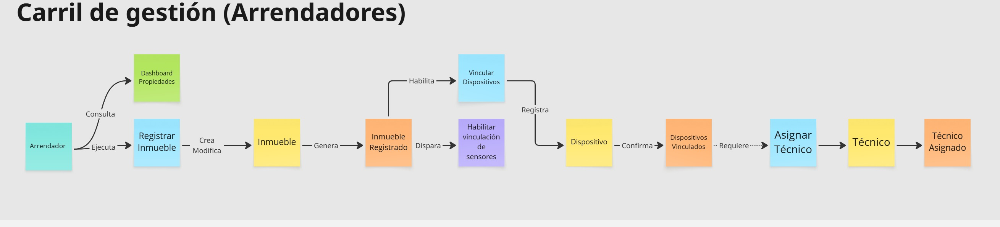

#### Nota. Flujo para el carril de gestión de inmuebles y administración (Arrendadores)  

#### Carril 2: Monitoreo IoT y Respuesta a Incidencias
Es el núcleo reactivo del sistema. Muestra cómo las lecturas enviadas por los sensores de agua y energía son procesadas por un motor de reglas para detectar anomalías. Ante una detección (como una fuga), el sistema dispara automáticamente una política de notificación y creación de incidencias.

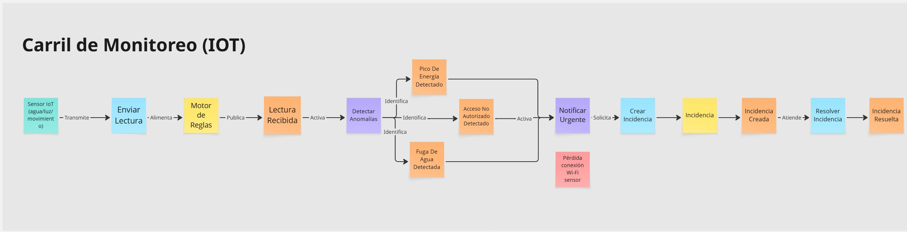

#### Nota. Flujo para el carril de monitorio (IOT)  

#### Carril 3: Carril del Inquilino
Este carril detalla el flujo realizado por el inquilino. Incluye datos como el historial de consumo, alertas de consumo y estados de dispositivos.

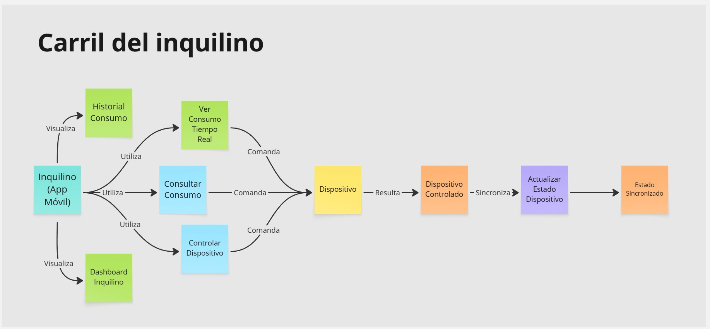

#### Nota. Flujo para el carril del inquilino  


---


## 2.5. Ubiquitous Language

A continuación, se presenta el glosario de términos y conceptos fundamentales para el dominio del negocio de Nexora. Este lenguaje común permite una comunicación fluida y sin ambigüedades entre los miembros del equipo y los stakeholders, basándose directamente en las necesidades identificadas en el proceso de Needfinding y de la definición de productos que hemos definido en el capítulo 1.


| Term (Término) | Definition (Definición) |
| :--- | :--- |
| **Tenant (Inquilino / Arrendatario)** | Individuo que alquila y reside en la unidad inmobiliaria, con interés principal en la comodidad, seguridad y eficiencia en el gasto de servicios. |
| **Property Manager (Administrador de Propiedades)** | Usuario encargado de la gestión operativa, supervisión y mantenimiento preventivo para asegurar la rentabilidad de uno o más inmuebles. |
| **Real Estate Company (Empresa Inmobiliaria)** | Entidad corporativa que gestiona activos inmobiliarios a gran escala y busca diferenciar su oferta mediante la implementación de tecnología IoT. |
| **Smart Housing Unit (Unidad Inmobiliaria Inteligente)** | Inmueble físico equipado con infraestructura tecnológica para el monitoreo y control automatizado de recursos y seguridad. |
| **Consumption Reading (Lectura de Consumo)** | Dato cuantitativo recopilado por los sensores respecto al uso de recursos básicos como agua y electricidad en un tiempo determinado. |
| **Incident (Incidencia)** | Reporte de una falla técnica o anomalía detectada en el inmueble que requiere intervención del personal de mantenimiento. |
| **Critical Alert (Alerta Crítica)** | Notificación de alta prioridad emitida automáticamente tras la detección de eventos de riesgo como fugas, intrusiones o fallas eléctricas. |
| **Smart Device (Dispositivo Inteligente)** | Componente de hardware (sensor o actuador) instalado en la propiedad que permite la recolección de datos y la ejecución de acciones remotas. |
| **Property Status (Estado del Inmueble)** | Condición operativa actual de la unidad inmobiliaria (ej. Seguro, En Alerta, En Mantenimiento) derivada del análisis de datos en tiempo real. |
| **Preventive Maintenance (Mantenimiento Preventivo)** | Estrategia de cuidado técnico programada para evitar el deterioro del activo y reducir costos por reparaciones reactivas. |


---

## 3.1. User Stories

| EPIC / Story ID | Título | Descripción | Criterios de Aceptación | Relacionado con (EPIC ID)|
| :--- | :--- | :--- | :--- | :--- |
| EP01 | Monitoreo IoT en tiempo real | Como inquilino, quiero visualizar el estado de los sensores de mi vivienda desde la aplicación móvil para garantizar un entorno seguro. | - | - |
| US01 | Visualización de nivel de gas | Como inquilino, quiero visualizar el nivel de gas desde la aplicación móvil para detectar posibles fugas. | Escenario 1:<br>Dado que el sensor transmite datos válidos,<br>Cuando se procesa la información,<br>Entonces se muestra el nivel de gas actualizado en menos de 5 segundos.<br>Escenario 2:<br>Dado que el sensor no transmite datos,<br>Cuando se intenta obtener la lectura,<br>Entonces se muestra el estado del sensor como no disponible. | EP01 |
| US02 | Visualización de calidad de aire | Como inquilino, quiero visualizar la calidad del aire desde la aplicación móvil para tomar decisiones preventivas. | Escenario 1:<br>Dado que los valores superan el umbral establecido,<br>Cuando se procesa la lectura,<br>Entonces se muestra el estado como no saludable.<br>Escenario 2:<br>Dado que los valores están dentro del rango normal,<br>Cuando se procesa la lectura,<br>Entonces se muestra el estado como saludable. | EP01 |
| US03 | Consulta de historial de eventos | Como inquilino, quiero consultar el historial de eventos desde la aplicación móvil para analizar incidentes pasados. | Escenario 1:<br>Dado que existen registros almacenados,<br>Cuando se solicita el historial,<br>Entonces se muestran los eventos ordenados por fecha.<br>Escenario 2:<br>Dado que se aplica un filtro,<br>Cuando se procesa la solicitud,<br>Entonces se muestran únicamente los eventos que cumplen el criterio. | EP01 |
| EP02 | Sistema de alertas | Como inquilino, quiero recibir alertas desde la aplicación móvil para reaccionar ante situaciones de riesgo. | - | - |
| US04 | Alerta por fuga de gas | Como inquilino, quiero recibir una notificación desde la aplicación móvil cuando se detecta una fuga para actuar de manera inmediata. | Escenario 1:<br>Dado que el nivel de gas supera el umbral crítico,<br>Cuando se procesa la lectura,<br>Entonces se envía una notificación en menos de 5 segundos.<br>Escenario 2:<br>Dado que ocurre un evento crítico,<br>Cuando se detecta la condición,<br>Entonces se activa un mecanismo de alerta local. | EP02 |
| US05 | Alerta preventiva por uso prolongado | Como inquilino, quiero recibir alertas desde la aplicación móvil cuando se detecta uso prolongado de gas para evitar riesgos. | Escenario 1:<br>Dado que existe actividad continua durante un periodo configurado,<br>Cuando se supera el tiempo establecido,<br>Entonces se genera una alerta preventiva.<br>Escenario 2:<br>Dado que se confirma la alerta,<br>Cuando se procesa la confirmación,<br>Entonces se desactiva la alerta. | EP02 |
| US06 | Registro de contactos de emergencia | Como inquilino, quiero registrar contactos desde la aplicación móvil para notificación en eventos críticos. | Escenario 1:<br>Dado que los datos ingresados son válidos,<br>Cuando se procesan los datos,<br>Entonces se registra el contacto correctamente.<br>Escenario 2:<br>Dado que ocurre un evento crítico sin respuesta,<br>Cuando se cumple el tiempo configurado,<br>Entonces se notifica al contacto registrado. | EP02 |
| US07 | Configuración de umbrales | Como inquilino, quiero configurar los umbrales desde la aplicación móvil para reducir falsas alarmas. | Escenario 1:<br>Dado que el valor ingresado está dentro del rango permitido,<br>Cuando se guarda la configuración,<br>Entonces se actualiza el umbral.<br>Escenario 2:<br>Dado que el valor está fuera del rango permitido,<br>Cuando se valida la entrada,<br>Entonces se rechaza la configuración. | EP02 |
| EP03 | Control de dispositivos | Como inquilino, quiero controlar dispositivos desde la aplicación móvil para mitigar riesgos en la vivienda. | - | - |
| US08 | Control de válvula de gas | Como inquilino, quiero controlar la válvula de gas desde la aplicación móvil para prevenir fugas. | Escenario 1:<br>Dado que la válvula se encuentra abierta,<br>Cuando se ejecuta la acción de cierre,<br>Entonces se ordena el cierre de la válvula.<br>Escenario 2:<br>Dado que se ejecuta la acción,<br>Cuando se recibe confirmación del dispositivo,<br>Entonces se actualiza el estado de la válvula. | EP03 |
| US09 | Automatización de ventilación | Como inquilino, quiero automatizar la ventilación desde la aplicación móvil para mantener condiciones seguras. | Escenario 1:<br>Dado que los valores superan el umbral definido,<br>Cuando se detecta la condición,<br>Entonces se activa el mecanismo de ventilación.<br>Escenario 2:<br>Dado que los valores vuelven a la normalidad,<br>Cuando se detecta la condición,<br>Entonces se desactiva el mecanismo. | EP03 |
| US10 | Modo ausencia | Como inquilino, quiero activar un modo de seguridad desde la aplicación móvil cuando no me encuentro en la vivienda. | Escenario 1:<br>Dado que el modo es activado,<br>Cuando se procesa la solicitud,<br>Entonces se aplican configuraciones de seguridad predefinidas.<br>Escenario 2:<br>Dado que ocurre una anomalía,<br>Cuando el modo está activo,<br>Entonces se genera una alerta prioritaria. | EP03 |
| US11 | Activación manual de alarma | Como inquilino, quiero activar una alarma manualmente desde la aplicación móvil ante una emergencia. | Escenario 1:<br>Dado que se solicita la activación,<br>Cuando se procesa la solicitud,<br>Entonces se activa la alarma.<br>Escenario 2:<br>Dado que se validan credenciales correctas,<br>Cuando se procesa la validación,<br>Entonces se desactiva la alarma. | EP03 |
| EP04 | Análisis de consumo y reportes | Como inquilino, quiero analizar mi consumo desde la aplicación móvil para optimizar el uso de recursos en mi vivienda. | - | - |
| US12 | Visualización de consumo de gas | Como inquilino, quiero visualizar mi consumo de gas desde la aplicación móvil para entender mis patrones de uso. | Escenario 1:<br>Dado que existen datos de consumo registrados,<br>Cuando se solicita la información,<br>Entonces se muestra el consumo correspondiente al periodo seleccionado.<br>Escenario 2:<br>Dado que no existen datos registrados,<br>Cuando se solicita la información,<br>Entonces se indica que no hay información disponible. | EP04 |
| US13 | Comparación de consumo | Como inquilino, quiero comparar mi consumo desde la aplicación móvil para evaluar mi eficiencia energética. | Escenario 1:<br>Dado que existen datos históricos y promedio,<br>Cuando se realiza la comparación,<br>Entonces se muestra la diferencia entre ambos valores.<br>Escenario 2:<br>Dado que el consumo supera el promedio,<br>Cuando se procesa la comparación,<br>Entonces se identifica el consumo como superior al esperado. | EP04 |
| US14 | Estimación de costo de consumo | Como inquilino, quiero visualizar una estimación de costo desde la aplicación móvil para anticipar mis gastos. | Escenario 1:<br>Dado que existen datos de consumo y tarifa configurada,<br>Cuando se realiza el cálculo,<br>Entonces se muestra el costo estimado del periodo.<br>Escenario 2:<br>Dado que cambia la tarifa configurada,<br>Cuando se recalcula la estimación,<br>Entonces se actualiza el costo proyectado. | EP04 |
| US15 | Exportación de reporte de consumo | Como inquilino, quiero exportar un reporte desde la aplicación móvil para compartir mi información de consumo. | Escenario 1:<br>Dado que existen datos disponibles,<br>Cuando se solicita la exportación,<br>Entonces se genera un archivo con la información.<br>Escenario 2:<br>Dado que no existen datos,<br>Cuando se solicita la exportación,<br>Entonces se indica que no hay información disponible. | EP04 |
| EP05 | Panel de propiedades | Como arrendador, quiero visualizar mis propiedades desde la aplicación web para gestionarlas eficientemente. | - | - |
| US16 | Visualización de panel de propiedades | Como arrendador, quiero visualizar el estado de mis propiedades desde la aplicación web para supervisarlas. | Escenario 1:<br>Dado que existen propiedades registradas,<br>Cuando se solicita la información,<br>Entonces se muestra la lista de propiedades con su estado.<br>Escenario 2:<br>Dado que existen alertas activas,<br>Cuando se presenta la información,<br>Entonces se resaltan las propiedades afectadas. | EP05 |
| US17 | Filtrado de propiedades | Como arrendador, quiero filtrar propiedades desde la aplicación web para identificar aquellas con incidencias. | Escenario 1:<br>Dado que existen propiedades con incidencias,<br>Cuando se aplica un filtro,<br>Entonces se muestran las propiedades correspondientes.<br>Escenario 2:<br>Dado que no existen coincidencias,<br>Cuando se procesa el filtro,<br>Entonces se indica que no hay resultados. | EP05 |
| EP06 | Gestión de alertas para arrendador | Como arrendador, quiero gestionar alertas desde la aplicación web para supervisar el estado de mis propiedades. | - | - |
| US18 | Recepción de alertas de consumo anómalo | Como arrendador, quiero recibir alertas desde la aplicación web cuando se detecten consumos anómalos para tomar acciones preventivas. | Escenario 1:<br>Dado que un valor supera el umbral configurado,<br>Cuando se procesa la lectura,<br>Entonces se genera una alerta registrada en el sistema.<br>Escenario 2:<br>Dado que existe una alerta generada,<br>Cuando se consulta el detalle,<br>Entonces se muestra el tipo de evento, valor registrado y propiedad asociada. | EP06 |
| US19 | Configuración de umbrales por propiedad | Como arrendador, quiero configurar umbrales desde la aplicación web para personalizar la detección de alertas por propiedad. | Escenario 1:<br>Dado que el valor ingresado es válido,<br>Cuando se guarda la configuración,<br>Entonces se actualizan los umbrales asociados a la propiedad.<br>Escenario 2:<br>Dado que el valor ingresado es inválido,<br>Cuando se valida la información,<br>Entonces se rechaza la configuración. | EP06 |
| US20 | Registro de incidencias críticas | Como arrendador, quiero que se registren incidencias desde la aplicación web para llevar control de eventos relevantes. | Escenario 1:<br>Dado que ocurre un evento crítico,<br>Cuando se procesa la lectura,<br>Entonces se registra la incidencia en el sistema.<br>Escenario 2:<br>Dado que existe una incidencia registrada,<br>Cuando se consulta el historial,<br>Entonces se muestra la incidencia con fecha, tipo y valor. | EP06 |
| US21 | Consulta de historial de incidencias | Como arrendador, quiero consultar el historial de incidencias desde la aplicación web para analizar eventos pasados. | Escenario 1:<br>Dado que existen incidencias registradas,<br>Cuando se solicita el historial,<br>Entonces se muestran ordenadas por fecha descendente.<br>Escenario 2:<br>Dado que se aplica un filtro,<br>Cuando se procesa la solicitud,<br>Entonces se muestran únicamente las incidencias que cumplen el criterio. | EP06 |
| US22 | Consulta de historial de alertas | Como arrendador, quiero consultar el historial de alertas desde la aplicación web para identificar patrones de riesgo. | Escenario 1:<br>Dado que existen alertas registradas,<br>Cuando se solicita el historial,<br>Entonces se muestran ordenadas por fecha descendente.<br>Escenario 2:<br>Dado que se aplica un filtro,<br>Cuando se procesa la solicitud,<br>Entonces se muestran únicamente las alertas que cumplen el criterio. | EP06 |
| EP07 | Gestión de mantenimiento | Como arrendador, quiero gestionar mantenimientos desde la aplicación web para asegurar el correcto funcionamiento de mis propiedades. | - | - |
| US23 | Programación de mantenimiento | Como arrendador, quiero registrar tareas de mantenimiento desde la aplicación web para prevenir fallas. | Escenario 1:<br>Dado que los datos ingresados son válidos,<br>Cuando se registra la tarea,<br>Entonces se almacena correctamente con fecha y responsable.<br>Escenario 2:<br>Dado que existe una tarea programada,<br>Cuando se aproxima la fecha definida,<br>Entonces se genera un recordatorio. | EP07 |
| EP08 | Reportes para arrendador | Como arrendador, quiero visualizar reportes desde la aplicación web para analizar el uso de recursos. | - | - |
| US24 | Visualización de consumo por propiedad | Como arrendador, quiero visualizar el consumo desde la aplicación web para analizar tendencias por propiedad. | Escenario 1:<br>Dado que existen datos de consumo,<br>Cuando se solicita la información,<br>Entonces se muestra el consumo correspondiente al periodo seleccionado.<br>Escenario 2:<br>Dado que se selecciona un periodo distinto,<br>Cuando se procesa la solicitud,<br>Entonces se actualiza la información mostrada. | EP08 |
| US25 | Exportación de reportes | Como arrendador, quiero exportar reportes desde la aplicación web para compartir información. | Escenario 1:<br>Dado que existen datos disponibles,<br>Cuando se solicita la exportación,<br>Entonces se genera un archivo con la información.<br>Escenario 2:<br>Dado que no existen datos,<br>Cuando se solicita la exportación,<br>Entonces se indica que no hay información disponible. | EP08 |
| EP09 | Gestión de dispositivos IoT | Como arrendador, quiero monitorear dispositivos desde la aplicación web para asegurar su funcionamiento. | - | - |
| US26 | Estado de sensores en tiempo real | Como arrendador, quiero visualizar el estado de sensores desde la aplicación web para detectar fallas. | Escenario 1:<br>Dado que el sensor está operativo,<br>Cuando se consulta el estado,<br>Entonces se muestra como activo.<br>Escenario 2:<br>Dado que el sensor pierde conexión,<br>Cuando se detecta la falta de comunicación,<br>Entonces se muestra como no disponible. | EP09 |
| US27 | Notificación de sensor desconectado | Como arrendador, quiero recibir alertas desde la aplicación web cuando un sensor se desconecta para tomar acción. | Escenario 1:<br>Dado que un sensor pierde conexión por un tiempo definido,<br>Cuando se detecta la condición,<br>Entonces se genera una alerta de desconexión.<br>Escenario 2:<br>Dado que se consulta la alerta,<br>Cuando se visualiza el detalle,<br>Entonces se muestra la información del dispositivo y la última lectura registrada. | EP09 |
| US32 | Calibración remota de sensores | Como arrendador, quiero ajustar parámetros desde la aplicación web para mantener precisión en las mediciones. | Escenario 1:<br>Dado que el valor ingresado está dentro del rango permitido,<br>Cuando se guarda la configuración,<br>Entonces se aplica el ajuste al sensor.<br>Escenario 2:<br>Dado que el valor está fuera del rango permitido,<br>Cuando se valida la entrada,<br>Entonces se rechaza la configuración. | EP09 |
| EP10 | Gestión de inquilinos | Como arrendador, quiero gestionar inquilinos desde la aplicación web para administrar mis propiedades. | - | - |
| US28 | Registro de inquilino | Como arrendador, quiero registrar inquilinos desde la aplicación web para asociarlos a propiedades. | Escenario 1:<br>Dado que los datos ingresados son válidos,<br>Cuando se registra el inquilino,<br>Entonces se almacena correctamente y se asocia a la propiedad.<br>Escenario 2:<br>Dado que la propiedad ya tiene un inquilino activo,<br>Cuando se intenta realizar la asignación,<br>Entonces se rechaza la operación. | EP10 |
| US34 | Transferencia de acceso | Como arrendador, quiero transferir el acceso desde la aplicación web para que el inquilino gestione su vivienda. | Escenario 1:<br>Dado que el inquilino es registrado,<br>Cuando se habilita el acceso,<br>Entonces se generan credenciales válidas.<br>Escenario 2:<br>Dado que finaliza el contrato,<br>Cuando se procesa la finalización,<br>Entonces se revoca el acceso. | EP10 |
| EP11 | Landing Page | Como visitante, quiero informarme desde la landing page para evaluar la adopción del producto. | - | - |
| US29 | Información para arrendadores | Como visitante, quiero conocer características desde la landing page para evaluar su utilidad. | Escenario 1:<br>Dado que se accede al contenido,<br>Cuando se navega por la información,<br>Entonces se muestran las funcionalidades disponibles.<br>Escenario 2:<br>Dado que se selecciona una característica,<br>Cuando se consulta el detalle,<br>Entonces se muestra información ampliada. | EP11 |
| US30 | Información para inquilinos | Como visitante, quiero comprender el funcionamiento desde la landing page para conocer sus beneficios. | Escenario 1:<br>Dado que se accede al contenido,<br>Cuando se revisa la información,<br>Entonces se describe el funcionamiento del sistema.<br>Escenario 2:<br>Dado que se desea continuar,<br>Cuando se realiza la acción correspondiente,<br>Entonces se permite el acceso a la aplicación. | EP11 |
| US31 | Envío de formulario de contacto | Como visitante, quiero enviar consultas desde la landing page para obtener más información del servicio. | Escenario 1:<br>Dado que los datos ingresados son válidos,<br>Cuando se envía la solicitud,<br>Entonces se registra correctamente.<br>Escenario 2:<br>Dado que existen campos incompletos,<br>Cuando se valida la información,<br>Entonces se rechaza el envío. | EP11 |
| EP13 | Servicios backend | Como developer, quiero implementar servicios backend para soportar la solución. | - | - |
| TS01 | API de recepción de datos de sensores | Como developer, quiero implementar un endpoint para recibir datos de sensores IoT. | Escenario 1:<br>Dado que la solicitud contiene datos válidos,<br>Cuando se procesa la petición,<br>Entonces se almacenan los datos correctamente.<br>Escenario 2:<br>Dado que la solicitud contiene datos inválidos,<br>Cuando se valida la información,<br>Entonces se responde con error. | EP13 |
| TS02 | Servicio de generación de alertas | Como developer, quiero implementar un servicio que procese datos para generar alertas automáticamente. | Escenario 1:<br>Dado que un valor supera el umbral,<br>Cuando se procesa la información,<br>Entonces se genera una alerta.<br>Escenario 2:<br>Dado que el valor no supera el umbral,<br>Cuando se procesa la información,<br>Entonces no se genera alerta. | EP13 |
| TS03 | Servicio de autenticación | Como developer, quiero implementar autenticación para proteger el acceso al sistema. | Escenario 1:<br>Dado que las credenciales son válidas,<br>Cuando se valida la autenticación,<br>Entonces se permite el acceso.<br>Escenario 2:<br>Dado que las credenciales son inválidas,<br>Cuando se valida la autenticación,<br>Entonces se rechaza el acceso. | EP13 |

---

## 3.2. Impact Mapping

A continuación se muestra el impact mapping del segmento arrendador.


A continuación se muestra el impact mapping del segmento inquilino.


---

## 3.3. Product Backlog


| # Orden | User Story Id | Título | Descripción | Story Points |
| :--- | :--- | :--- | :--- | :--- |
| 1 | US01 | Visualización de nivel de gas | Como inquilino, quiero visualizar el nivel de gas desde la aplicación móvil para detectar posibles fugas. | 5 |
| 2 | US04 | Alerta por fuga de gas | Como inquilino, quiero recibir una notificación desde la aplicación móvil cuando se detecta una fuga para actuar de manera inmediata. | 5 |
| 3 | US08 | Control de válvula de gas | Como inquilino, quiero controlar la válvula de gas desde la aplicación móvil para prevenir fugas. | 5 |
| 4 | US09 | Automatización de ventilación | Como inquilino, quiero automatizar la ventilación desde la aplicación móvil para mantener condiciones seguras. | 5 |
| 5 | US13 | Comparación de consumo | Como inquilino, quiero comparar mi consumo desde la aplicación móvil para evaluar mi eficiencia energética. | 5 |
| 6 | US14 | Estimación de costo de consumo | Como inquilino, quiero visualizar una estimación de costo desde la aplicación móvil para anticipar mis gastos. | 5 |
| 7 | US16 | Visualización de panel de propiedades | Como arrendador, quiero visualizar el estado de mis propiedades desde la aplicación web para supervisarlas. | 5 |
| 8 | US18 | Recepción de alertas de consumo anómalo | Como arrendador, quiero recibir alertas desde la aplicación web cuando se detecten consumos anómalos para tomar acciones preventivas. | 5 |
| 9 | US26 | Estado de sensores en tiempo real | Como arrendador, quiero visualizar el estado de sensores desde la aplicación web para detectar fallas. | 5 |
| 10 | US23 | Programación de mantenimiento | Como arrendador, quiero registrar tareas de mantenimiento desde la aplicación web para prevenir fallas. | 5 |
| 11 | US24 | Visualización de consumo por propiedad | Como arrendador, quiero visualizar el consumo desde la aplicación web para analizar tendencias por propiedad. | 5 |
| 12 | US34 | Transferencia de acceso | Como arrendador, quiero transferir el acceso desde la aplicación web para que el inquilino gestione su vivienda. | 5 |
| 13 | US32 | Calibración remota de sensores | Como arrendador, quiero ajustar parámetros desde la aplicación web para mantener precisión en las mediciones. | 5 |
| 14 | TS01 | API de recepción de datos de sensores | Como developer, quiero implementar un endpoint para recibir datos de sensores IoT para almacenarlos correctamente. | 5 |
| 15 | TS02 | Servicio de generación de alertas | Como developer, quiero implementar un servicio que procese datos para generar alertas automáticamente. | 5 |
| 16 | TS03 | Servicio de autenticación | Como developer, quiero implementar autenticación para proteger el acceso al sistema. | 5 |
| 17 | US29 | Información para arrendadores | Como visitante, quiero conocer características desde la landing page para evaluar su utilidad. | 3 |
| 18 | US30 | Información para inquilinos | Como visitante, quiero comprender el funcionamiento desde la landing page para conocer sus beneficios. | 3 |
| 19 | US02 | Visualización de calidad de aire | Como inquilino, quiero visualizar la calidad del aire desde la aplicación móvil para tomar decisiones preventivas. | 3 |
| 20 | US10 | Modo ausencia | Como inquilino, quiero activar un modo de seguridad desde la aplicación móvil cuando no me encuentro en la vivienda. | 3 |
| 21 | US05 | Alerta preventiva por uso prolongado | Como inquilino, quiero recibir alertas desde la aplicación móvil cuando se detecta uso prolongado de gas para evitar riesgos. | 3 |
| 22 | US03 | Consulta de historial de eventos | Como inquilino, quiero consultar el historial de eventos desde la aplicación móvil para analizar incidentes pasados. | 3 |
| 23 | US12 | Visualización de consumo de gas | Como inquilino, quiero visualizar mi consumo de gas desde la aplicación móvil para entender mis patrones de uso. | 3 |
| 24 | US15 | Exportación de reporte de consumo | Como inquilino, quiero exportar un reporte desde la aplicación móvil para compartir mi información de consumo. | 3 |
| 25 | US17 | Filtrado de propiedades | Como arrendador, quiero filtrar propiedades desde la aplicación web para identificar aquellas con incidencias. | 3 |
| 26 | US21 | Consulta de historial de incidencias | Como arrendador, quiero consultar el historial de incidencias desde la aplicación web para analizar eventos pasados. | 3 |
| 27 | US22 | Consulta de historial de alertas | Como arrendador, quiero consultar el historial de alertas desde la aplicación web para identificar patrones de riesgo. | 3 |
| 28 | US27 | Notificación de sensor desconectado | Como arrendador, quiero recibir alertas desde la aplicación web cuando un sensor se desconecta para tomar acción. | 3 |
| 29 | US19 | Configuración de umbrales por propiedad | Como arrendador, quiero configurar umbrales desde la aplicación web para personalizar la detección de alertas por propiedad. | 3 |
| 30 | US20 | Registro de incidencias críticas | Como arrendador, quiero que se registren incidencias desde la aplicación web para llevar control de eventos relevantes. | 3 |
| 31 | US25 | Exportación de reportes | Como arrendador, quiero exportar reportes desde la aplicación web para compartir información. | 3 |
| 32 | US28 | Registro de inquilino | Como arrendador, quiero registrar inquilinos desde la aplicación web para asociarlos a propiedades. | 3 |
| 33 | US31 | Envío de formulario de contacto | Como visitante, quiero enviar consultas desde la landing page para obtener más información del servicio. | 2 |
| 34 | US06 | Registro de contactos de emergencia | Como inquilino, quiero registrar contactos desde la aplicación móvil para notificación en eventos críticos. | 2 |
| 35 | US11 | Activación manual de alarma | Como inquilino, quiero activar una alarma manualmente desde la aplicación móvil ante una emergencia. | 2 |

Evidencia de Organizacion del Product Backlog en Jira:


---

## 4.1. Strategic-Level Domain-Driven Design

En esta sección, el equipo de **Nexora** introduce y explica el proceso realizado para las decisiones de nivel estratégico aplicando **Domain-Driven Design (DDD)**. El enfoque estratégico nos permite descomponer el sistema complejo de gestión de inmuebles inteligentes en partes más manejables y alineadas con los objetivos de negocio, como la eficiencia energética y la respuesta rápida ante incidencias.

### 4.1.1. Design-Level EventStorming

El proceso de Design-Level EventStorming se enfocó en refinar los eventos descubiertos en la fase de Big Picture, identificando las reglas de negocio (políticas) y los comandos que disparan los cambios de estado en el sistema.

#### 4.1.1.1 Candidate Context Discovery

A partir del dominio modelado en el EventStorming inicial, el equipo realizó la sesión de **Candidate Context Discovery**. Para este proceso, aplicamos la técnica de **look-for-pivotal-events** para identificar los puntos de transición donde el flujo de negocio cambia de responsabilidad.

Se identificaron los siguientes hitos o eventos clave (Pivotal Events):
- `Smart Device Registered`: Marca el inicio del ciclo de vida técnico del activo.
- `Anomaly Detected`: Evento crítico que dispara la lógica de reacción del sistema.
- `Incident Resolved`: Evento que cierra el ciclo de mantenimiento operativo.

Como resultado, se definieron 5 Bounded Contexts candidatos alineados con la naturaleza SaaS del negocio:

**Resource & Asset Management (Supporting):** Gestión de la jerarquía de inmuebles y dispositivos.


**Service Monitoring & Intelligence (Core):** Procesamiento de telemetría y detección de anomalías.


**Service Execution & Maintenance (Core):** Gestión de incidencias y trabajos técnicos en campo.


**Identity & Access Management (Generic):** Seguridad, roles de usuario y aislamiento multi-tenant.


**Subscriptions & Payment Management (Generic):** Gestión de planes comerciales de la plataforma.


---

#### 4.1.1.2 Domain Message Flows Modeling

En esta sección se visualiza la colaboración entre los contextos definidos a través de historias que resuelven problemas reales del negocio. Se han elaborado dos diagramas principales utilizando la técnica de **Domain Storytelling**:

### Escenario 1: Respuesta ante Emergencias (Fuga de Agua)
Este flujo representa el valor principal de Nexora: la capacidad de actuar sin intervención humana inicial para mitigar daños.

1.  **Sensor IoT** transmite lecturas de agua en tiempo real al **Monitoring Context**.
2.  **Monitoring Context** detecta un patrón de fuga analizando los datos (Auto-colaboración).
3.  **Monitoring Context** emite una **Alerta Crítica** hacia el **Service Execution Context**.
4.  **Service Execution Context** envía una **Notificación de Emergencia** al **Arrendador**.
5.  **Service Execution Context** asigna automáticamente una **Orden de Mantenimiento** al **Técnico**.
6.  **Técnico** reporta la **Reparación Finalizada** al sistema.
7.  **Service Execution Context** actualiza el **Estado de la Unidad** en el contexto de **Resource Management**.

<br>


*Nota. Diagrama de Domain Storytelling: Flujo de respuesta ante fugas.*

### Escenario 2: Gestión de Controles y Optimización del Arrendador
Este flujo demuestra cómo el sistema empodera al administrador para tomar decisiones basadas en datos y optimizar el portafolio.

1.  El **Arrendador** solicita un **Reporte de Consumo Global** al **Monitoring Context**.
2.  **Monitoring Context** procesa los datos y genera una **Analítica de Desempeño Energético**.
3.  El **Arrendador** recibe y analiza los resultados.
4.  El **Arrendador** identifica una unidad ineficiente y determina que requiere acción inmediata.
5.  El **Arrendador** solicita un **Mantenimiento Preventivo** a través del sistema.
6.  **Service Execution Context** procesa la solicitud y asigna una **Tarea de Inspección** al **Técnico**.
7.  El **Arrendador** recibe la confirmación de la **Visita Programada**.

<br>


*Nota. Diagrama de Domain Storytelling: Flujo de gestión y optimización de activos.*

---

#### 4.1.1.3 Bounded Context Canvases

A continuación, se presentan los lienzos detallados para cada uno de los contextos identificados. Estos lienzos sirven como la "ficha técnica" que define los límites, responsabilidades y proyecciones de cada subsistema dentro de Nexora.

### Bounded Context Canvas: Service Monitoring & Intelligence
Contexto encargado de transformar la telemetría bruta de los sensores en analítica accionable y detección proactiva de fallas.


- **Strategic Classification:** Core Domain | Business Model: Cost Reduction | Evolution: Product.
- **Context Overview:** Motor de análisis en tiempo real enfocado en la eficiencia energética y seguridad hídrica.
- **Capabilities:** Telemetry Ingestion, Pattern Recognition, Consumption Analytics, Real-time Dashboarding.
- **Business Rules:**
    *   Una lectura de agua constante por más de 30 min sin picos se clasifica automáticamente como fuga probable.
    *   Los reportes de ahorro energético se consolidan cada 24 horas para su visualización.
- **Ubiquitous Language:** Telemetry Stream, Consumption Threshold, Anomaly Pattern, Intelligence Report.
- **Dependencies:** 
    *   *Inbound:* Metadatos de dispositivos desde Resource BC.
    *   *Outbound:* Alertas críticas a Service Execution BC.
- **Assumptions & Open Questions:**
    *   **Assumptions:** Conectividad constante de sensores; los algoritmos de filtrado pueden ignorar ruidos menores (ej. humificadores).
    *   **Open Questions:** ¿Cómo manejar la detección offline prolongada? ¿Existen límites legales en el volumen de datos históricos por inquilino?

---

<br>

### Bounded Context Canvas: Service Execution & Maintenance
Responsable de la operatividad física y la respuesta inmediata a incidentes técnicos.


- **Strategic Classification:** Core Domain | Business Model: Operations Efficiency | Evolution: Custom Built.
- **Context Overview:** Orquestación integral del ciclo de vida de incidencias y despacho técnico en campo.
- **Capabilities:** Ticket Lifecycle Management, Technical Dispatching, SLA Tracking, Maintenance Scheduling.
- **Business Rules:**
    *   Toda Alerta Crítica recibida debe generar una incidencia en el sistema en menos de 5 segundos.
    *   Las tareas de mantenimiento preventivo tienen prioridad alta según el tiempo de vida reportado del sensor.
- **Ubiquitous Language:** Critical Alert, Incident Ticket, Technician, Resolution SLA, Dispatch Order.
- **Dependencies:** 
    *   *Inbound:* Alertas desde Monitoring BC.
    *   *Outbound:* Actualización del estado de operatividad de la unidad a Resource BC.
- **Assumptions & Open Questions:**
    *   **Assumptions:** Técnicos cuentan con dispositivos móviles y GPS; existencia de convenios previos de servicio técnico.
    *   **Open Questions:** ¿Cuál es la responsabilidad legal ante fallas críticas de asignación? ¿El historial de reparaciones será público para futuros compradores?

---

<br>

### Bounded Context Canvas: Resource & Asset Management
Este contexto define la estructura física y técnica que sostiene la jerarquía de la plataforma.


- **Strategic Classification:** Supporting Domain | Business Model: Inventory Control | Evolution: Product.
- **Context Overview:** Gestión de la jerarquía de activos (Propiedades, Unidades) e inventario de hardware IoT vinculado.
- **Capabilities:** Assets Inventory Management, Device Commissioning, Physical Mapping, Status Tracking.
- **Business Rules:**
    *   Un sensor inteligente no puede estar vinculado a más de una Unidad Habitacional simultáneamente.
    *   El alta de un nuevo sensor requiere validación de compatibilidad con el Gateway local de la propiedad.
- **Ubiquitous Language:** Smart Housing Unit, Property Portfolio, Device Pairing, Metadata, Gateway.
- **Dependencies:** 
    *   *Outbound:* Provee el contexto físico y metadatos de sensores a Monitoring BC.
- **Assumptions & Open Questions:**
    *   **Assumptions:** Estructura jerárquica clara (Edificio > Piso > Unidad); Gateways instalados por personal certificado.
    *   **Open Questions:** ¿Debe el inquilino poder registrar dispositivos propios? ¿Cómo se maneja el traspaso de activos entre inmobiliarias?

---

<br>

### Bounded Context Canvas: Identity & Access Management
Garantiza la seguridad y la correcta segregación de datos en el entorno multi-tenant.


- **Strategic Classification:** Generic Domain | Business Model: Compliance & Security | Evolution: Commodity.
- **Context Overview:** Administración centralizada de identidades, perfiles y políticas de acceso granular.
- **Capabilities:** SSO Integration, Role-Based Access Control (RBAC), User Lifecycle Management, Multi-tenant Isolation.
- **Business Rules:**
    *   Los datos de consumos deben estar aislados lógicamente entre diferentes empresas inmobiliarias clientes.
    *   El acceso a comandos críticos (ej: cierre de válvulas) requiere un rol de nivel "Manager" o superior.
- **Ubiquitous Language:** Tenant Profile, Manager Role, Authentication Policy, Data Isolation, Identity Provider.
- **Dependencies:** 
    *   *Inbound:* Recibe solicitudes de autorización de todos los demás contextos (Cross-cutting).
- **Assumptions & Open Questions:**
    *   **Assumptions:** Uso de estándares industriales (OAuth2/OIDC); identidades únicas por individuo.
    *   **Open Questions:** ¿Cómo impacta la ley de protección de datos (GDPR) en la visualización de consumos privados?

---

<br>

### Bounded Context Canvas: Subscriptions & Payment Management
Maneja la monetización SaaS y el ciclo de facturación de la plataforma Nexora.


- **Strategic Classification:** Generic Domain | Business Model: Revenue Generation | Evolution: Commodity.
- **Context Overview:** Gestión del ciclo de vida de suscripciones corporativas y motor de facturación por uso (metered billing).
- **Capabilities:** Recurring Billing Management, Plan Provisioning, Payment Gateway Integration, Usage Metering.
- **Business Rules:**
    *   La facturación se realiza mensualmente basándose en la cantidad de Unidades Inteligentes activas en la cuenta.
    *   La falta de pago restringe el acceso al Dashboard analítico, pero mantiene activo el sistema de alertas críticas de seguridad.
- **Ubiquitous Language:** SaaS Plan, Billing Cycle, Usage Quota, Invoice, Subscription Tier.
- **Dependencies:** 
    *   *Inbound:* Consume métricas de uso y cantidad de activos desde Resource BC.
- **Assumptions & Open Questions:**
    *   **Assumptions:** Integración con un proveedor externo (Stripe/PayPal); facturación en formato digital estándar.
    *   **Open Questions:** ¿Existirán periodos de gracia por impago? ¿Habrá descuentos dinámicos basados en ahorros detectados?


---

## 4.1.2. Context Mapping

En esta sección, el equipo de Nexora detalla las relaciones estructurales y los niveles de acoplamiento entre los Bounded Contexts identificados. El Context Mapping nos permite definir cómo fluye la información y qué grado de dependencia existe entre los equipos y subsistemas.

### Estrategias de Relación entre Contextos

Para llegar al diseño final, el equipo evaluó la naturaleza de cada interacción basándose en la soberanía de los datos y la necesidad de proteger los modelos core:

*   **Identity & Access Management (Open Host Service - OHS):** Se definió como un servicio abierto ya que todos los demás contextos dependen de él para la autenticación. Implementar una interfaz estandarizada evita que cada contexto tenga que negociar una integración particular.
*   **Service Monitoring a Service Execution (Event-Driven):** La relación es de bajo acoplamiento. El contexto de monitoreo "publica" alertas sin conocer quién las consume, permitiendo que el sistema de mantenimiento sea reactivo.
*   **Service Execution a Resource Management (Anti-Corruption Layer - ACL):** Se decidió implementar una capa anticorrupción para evitar que la lógica operativa de las reparaciones (técnicos, estados de inmuebles, etc) contamine el modelo limpio de los activos físicos e inmuebles.
*   **Resource Management a Subscriptions (Customer/Supplier):** Existe una relación de cliente/proveedor ya que el sistema de pagos necesita métricas de uso precisas del inventario para generar la facturación mensual.

### Análisis de Alternativas y Decisiones de Diseño

Siguiendo el proceso de diseño estratégico, el equipo se planteó las siguientes interrogantes para validar la arquitectura:

*   **¿Qué pasaría si movemos la gestión de dispositivos al contexto de Monitoreo?**
    *   *Decisión:* Se descartó. Aunque el monitoreo usa los dispositivos, el ciclo de vida del activo (compra, registro, baja) es una capacidad administrativa que pertenece a Resource & Asset Management. Mezclarlos sobrecargaría el contexto de Monitoreo.
*   **¿Qué pasaría si el contexto de Ejecución (Mantenimiento) se vuelve un "Conformista" del modelo de Monitoreo?**
    *   *Decisión:* Se descartó. Ser conformista obligaría a que el modelo de gestión de inmuebles dependa directamente de los cambios en el modelo de datos de telemetría. Al usar una comunicación por eventos, permitimos que el sistema de mantenimiento evolucione sus propios conceptos (como prioridades de reparación) de forma independiente a la complejidad técnica de los sensores.
*   **¿Qué pasaría si integramos la facturación dentro de Identity & Access Management?**
    *   *Decisión:* Se descartó. Aunque ambos son contextos genéricos, Identity se encarga de seguridad y autenticación, mientras que Subscriptions maneja la monetización y el modelo SaaS. Mezclarlos violaría el principio de responsabilidad única y complicaría la escalabilidad del modelo de negocio.
*   **¿Qué pasaría si aislamos la analítica en un contexto aparte?**
    *   *Decisión:* Se decidió mantenerla dentro de **Service Monitoring & Intelligence** ya que la detección de patrones de anomalía es la inteligencia intrínseca de la telemetría. Separarlos crearía una latencia innecesaria.

### Diagrama de Context Map

El siguiente diagrama sintetiza las relaciones finales y los patrones de integración adoptados:

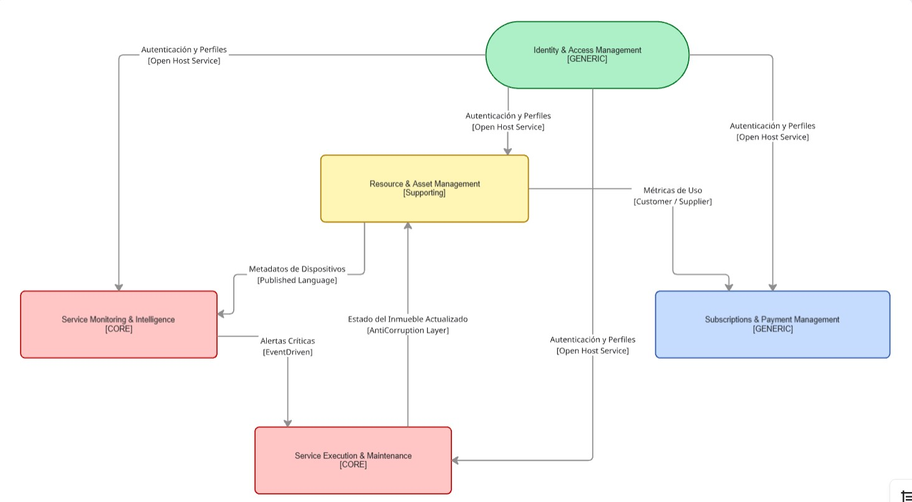


---

## 4.1.3.1. Software Architecture System Landscape Diagram

Esta vista muestra los **sistemas** alrededor de Nexora, identificando actores externos, sistemas principales dentro del alcance de la startup y sistemas externos con los que se integra.

<!-- imagen en markdown -->
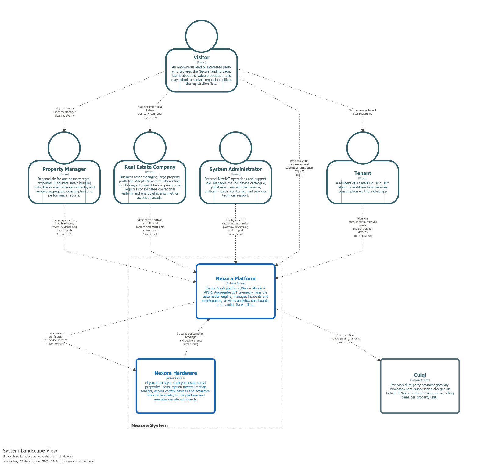

---

## 4.1.3.2. Context Level (C4)

Esta vista describe el **diagrama de contexto** centrado en el sistema principal **Nexora Platform**. Su propósito es clarificar quién usa el sistema, qué responsabilidades tiene y con qué sistemas externos se integra.

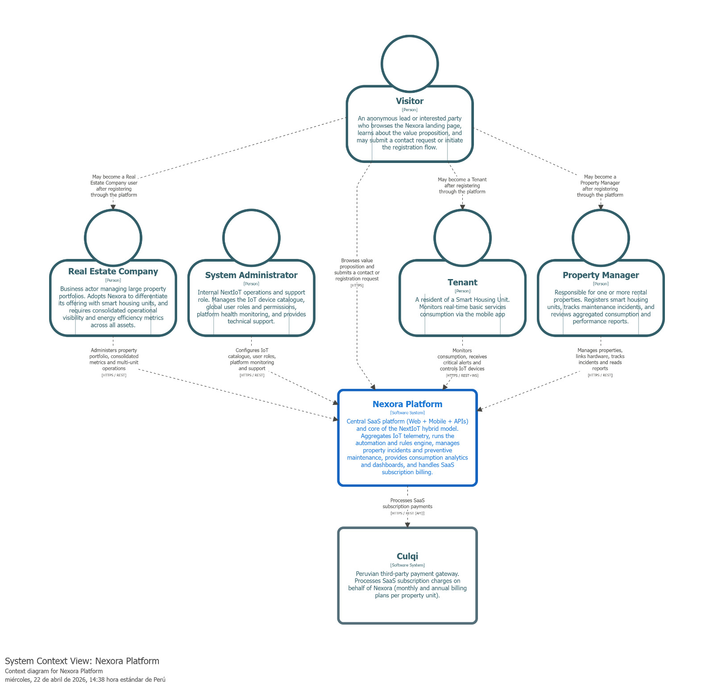 

---

## 4.1.3.3. Software Architecture Container Level Diagrams

Esta vista describe el **diagrama de Contenedores** centrado en el sistema principal **Nexora Platform**.

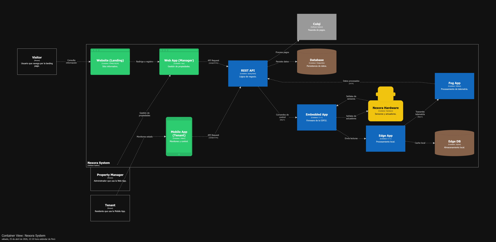

---

## 4.1.3.4. Software Architecture Deployment Diagrams

Esta vista describe el **diagrama de Deployment** centrado en el sistema principal **Nexora Platform**.

 

---

##### 4.2.1.1. Domain Layer

La Domain Layer contiene los conceptos centrales del negocio dentro del bounded context de Identity & Access Management. En esta capa se definen las entidades y relaciones necesarias para representar identidades digitales y control de acceso basado en roles, manteniendo independencia respecto a frameworks o detalles técnicos.

Para el alcance actual de NexIoT, esta capa fue diseñada de forma simple, coherente con la implementación desarrollada y enfocada en los requerimientos reales del proyecto.

### Entidades Principales del Dominio

#### User

Representa una identidad digital registrada dentro de la plataforma. Un usuario puede autenticarse, acceder a recursos protegidos e interactuar con el sistema según los roles asignados.

**Atributos:**

- id  
- firstName  
- lastName  
- email  
- password  
- roles  

El atributo `roles` permite asociar uno o varios perfiles de autorización a cada usuario.

#### Role

Representa un perfil de acceso asignable a los usuarios.

**Atributos:**

- id  
- name  

Los roles determinan qué tipo de acciones puede realizar un usuario dentro de la plataforma.

### Enumeración

#### RoleName

Permite definir valores controlados mediante una enumeración.

**Valores definidos:**

- ADMIN  
- LANDLORD  
- TENANT  

Estos valores reflejan el contexto actual de NexIoT y sus segmentos objetivo validados: arrendadores y arrendatarios.

### Relaciones del Dominio

- Un usuario puede tener múltiples roles.  
- Un rol puede ser asignado a múltiples usuarios.  

Esta relación muchos-a-muchos permite escalar el modelo de autorización conforme crezca la plataforma.

### Reglas de Negocio

1. Todo usuario debe tener al menos un rol asignado.  
2. El correo electrónico debe ser único.  
3. Un usuario debe autenticarse antes de acceder a recursos protegidos.  
4. Los permisos dependen de los roles asignados.  
5. Las contraseñas deben almacenarse de forma segura y cifrada.  

La Domain Layer constituye la base conceptual del bounded context y se refleja directamente en los diagramas de clases y base de datos.

---


---

##### 4.2.1.2. Interface Layer

La Interface Layer es responsable de exponer las capacidades del bounded context IAM hacia consumidores externos mediante APIs RESTful.

En la arquitectura actual, el principal consumidor externo es la aplicación móvil de NexIoT.

### Componente Principal

#### AuthController

Actúa como punto de entrada para las operaciones de autenticación y registro de usuarios.

Recibe solicitudes HTTP, valida datos de entrada, delega el procesamiento a componentes internos y retorna respuestas estructuradas.

### Endpoints Expuestos

| Método | Endpoint | Descripción |
|---|---|---|
| POST | /api/v1/auth/login | Autentica un usuario y retorna un token JWT |
| POST | /api/v1/auth/register | Registra un nuevo usuario en la plataforma |

### Recursos de Entrada

#### LoginRequest

Utilizado en el proceso de inicio de sesión.

**Campos:**

- email  
- password  

#### RegisterRequest

Utilizado en el proceso de registro.

**Campos:**

- firstName  
- lastName  
- email  
- password  
- roles  

### Recursos de Salida

#### AuthResponse

Retornado luego de una autenticación exitosa.

**Campos:**

- token  
- userId  
- firstName  
- lastName  
- email  
- roles  

#### UserResource

Retornado luego del registro exitoso de un usuario.

### Responsabilidades de la Interface Layer

- Recibir solicitudes del cliente.  
- Validar payloads de entrada.  
- Invocar lógica interna del sistema.  
- Retornar respuestas HTTP estructuradas.  
- Separar la comunicación externa de la lógica interna.  

Esta capa se representa en los diagramas mediante el AuthController y sus interacciones con la aplicación móvil.

---


---

##### 4.2.1.3. Application Layer

La Application Layer coordina los casos de uso del sistema y controla el flujo de ejecución entre la Interface Layer, los componentes de seguridad, las entidades del dominio y los servicios de infraestructura.

Su propósito no es almacenar datos ni modelar entidades, sino orquestar el comportamiento requerido por cada operación.

### Componentes Principales

#### JwtService

Responsable de generar y validar tokens JWT luego de una autenticación exitosa.

**Responsabilidades principales:**

- Generar tokens para usuarios autenticados.  
- Extraer usernames desde tokens.  
- Parsear y validar la estructura del token.  

#### CustomUserDetailsService

Responsable de cargar credenciales y roles desde persistencia durante el proceso de autenticación.

**Responsabilidades principales:**

- Buscar usuarios por email.  
- Proveer credenciales a Spring Security.  
- Retornar authorities autorizadas.  

### Casos de Uso Principales

#### User Login

1. AuthController recibe las credenciales.  
2. Spring Security valida las credenciales.  
3. CustomUserDetailsService carga al usuario.  
4. JwtService genera el token.  
5. Se retorna AuthResponse.  

#### User Registration

1. AuthController recibe los datos de registro.  
2. El sistema valida que el email no exista previamente.  
3. La contraseña es cifrada.  
4. Se asignan roles.  
5. El usuario es persistido.  
6. Se retorna UserResource.  

### Beneficios de la Application Layer

- Coordinación centralizada de casos de uso.  
- Separación entre API y persistencia.  
- Mayor mantenibilidad.  
- Mejor testabilidad de flujos.  

Este comportamiento orquestador se refleja en los diagramas de componentes y code level.

---


---

##### 4.2.1.4. Infrastructure Layer

La Infrastructure Layer contiene las implementaciones técnicas necesarias para persistencia de datos, ejecución de seguridad, inicialización del sistema y conectividad con la base de datos.

Esta capa soporta al resto de la arquitectura mediante componentes concretos basados en framework.

### Componentes de Persistencia

#### UserRepository

Proporciona operaciones de acceso a datos para usuarios.

**Operaciones principales:**

- findByEmail(email)  
- existsByEmail(email)  
- save(user)  

#### RoleRepository

Proporciona operaciones de persistencia para roles.

**Operaciones principales:**

- findByName(name)  
- save(role)  

Ambos repositorios se implementan mediante Spring Data JPA.

### Componentes de Seguridad

#### JwtAuthFilter

Intercepta solicitudes HTTP entrantes y valida tokens Bearer antes de permitir acceso a endpoints protegidos.

#### SecurityConfig

Define la configuración global de seguridad del sistema.

**Responsabilidades:**

- Registrar filtros.  
- Configurar reglas de acceso por rutas.  
- Definir comportamiento de autenticación.  
- Configurar seguridad stateless.  

### Componente de Inicialización

#### DataInitializer

Ejecuta lógica de inicialización durante el arranque de la aplicación.

**Responsabilidades:**

- Crear roles por defecto.  
- Registrar usuarios iniciales.  
- Preparar datos base del IAM.  

### Database Layer

#### IAM Database

Almacena la información persistente del bounded context.

### Tablas Principales

- users  
- roles  
- users_roles  

### Beneficios de la Infrastructure Layer

- Modelo de persistencia confiable.  
- Patrón repository reutilizable.  
- Filtrado seguro de solicitudes.  
- Inicialización rápida del entorno.  
- Almacenamiento relacional escalable.  

La Infrastructure Layer se encuentra representada en los diagramas de componentes, code level y base de datos.

---

##### 4.2.4.5. Bounded Context Software Architecture Component Level Diagrams

Este diagrama de nivel de componentes describe la arquitectura interna del bounded context **Identity & Access Management**. En esta vista se observa cómo la **Mobile App** consume los endpoints expuestos por el **AuthController**, el cual centraliza las operaciones de autenticación y registro de usuarios.

La seguridad del contexto se apoya en **SecurityConfig**, encargado de definir las reglas de acceso y registrar el filtro de autenticación, y en **JwtAuthFilter**, responsable de validar los tokens enviados en las solicitudes. Asimismo, **JwtService** permite generar y validar tokens JWT, mientras que **CustomUserDetailsService** carga las credenciales y roles del usuario desde persistencia.

Los componentes **UserRepository** y **RoleRepository** permiten acceder a la información almacenada en la base de datos IAM. Finalmente, **DataInitializer** prepara datos iniciales como roles y usuarios base para el funcionamiento del sistema.


---

##### 4.2.4.6. Bounded Context Software Architecture Code Level Diagrams

En esta sección se presentan los diagramas de nivel de código correspondientes al bounded context **Identity & Access Management**. Estos diagramas permiten visualizar la estructura interna del modelo de dominio y el diseño de persistencia utilizado para soportar las funcionalidades de autenticación y autorización.

---

###### 4.2.4.6.1. Bounded Context Domain Layer Class Diagrams

El diagrama de clases del dominio para el contexto de **Identity & Access Management** representa las principales clases, interfaces y relaciones que soportan el control de acceso de la plataforma. Se identifican como elementos centrales a **User**, **Role** y **RoleName**, los cuales permiten modelar identidades digitales y perfiles de autorización.

La clase **User** representa a los usuarios registrados en NexIoT y mantiene una relación muchos-a-muchos con **Role**, permitiendo que una misma cuenta pueda tener uno o más perfiles de acceso. La enumeración **RoleName** define los roles válidos para el sistema, adaptados al contexto del proyecto: **ADMIN**, **LANDLORD** y **TENANT**.

Además, el diagrama incluye componentes de seguridad como **JwtService**, **JwtAuthFilter**, **SecurityConfig** y **CustomUserDetailsService**, así como los repositorios **UserRepository** y **RoleRepository**, mostrando la trazabilidad entre las capas de interfaz, seguridad, dominio e infraestructura.


---

###### 4.2.4.6.2. Bounded Context Database Design Diagram

El diseño de base de datos del bounded context **Identity & Access Management** está orientado a soportar el registro de usuarios, la gestión de roles y la relación entre ambos. El modelo utiliza un enfoque relacional simple y coherente con la implementación en Spring Boot y JPA.

La tabla **users** almacena la información principal de cada usuario, incluyendo nombres, correo electrónico, contraseña cifrada y campos de auditoría. El campo **email** se define como único para evitar cuentas duplicadas. La tabla **roles** almacena los perfiles de acceso disponibles y define el campo **name** como único para asegurar consistencia en la asignación de roles.

Finalmente, la tabla **users_roles** resuelve la relación muchos-a-muchos entre usuarios y roles mediante las claves foráneas **user_id** y **role_id**, permitiendo un modelo flexible de autorización dentro de la plataforma.


---

#### 4.2.2. Bounded Context: Service Monitoring & Intelligence

Este Bounded Context es el núcleo analítico del sistema Nexora. Se encarga de la ingesta de telemetría proveniente de los sensores IoT (Gas, Aire, Temperatura), la evaluación de riesgos en tiempo real y la generación de alertas ante anomalías detectadas en las viviendas.

#### 4.2.2.1. Domain Layer

**App Móvil:**
En esta capa se describen las clases que representan las abstracciones del monitoreo para el inquilino. Se incluyen clases de serialización para visualizar niveles de gas y calidad de aire en tiempo real.

### DTO

**TelemetryDto**
| Atributo | Tipo | Descripción |
| :--- | :--- | :--- |
| id | int | Identificador único del registro de telemetría |
| gasPpm | double | Concentración de gas detectada en partes por millón |
| airQualityIndex | int | Índice de calidad del aire calculado |
| capturedAt | date | Fecha y hora exacta de la lectura |

**RealTimeStatusDto**
| Atributo | Tipo | Descripción |
| :--- | :--- | :--- |
| status | string | Estado general (Seguro, Advertencia, Peligro) |
| lastValue | double | Último valor de gas recibido |

---

**Backend:**
En esta capa se describen las clases que representan el núcleo del dominio del monitoreo. Se incluyen las entidades, objetos de valor y la lógica de detección de fugas bajo el patrón CQRS.

#### Entities

**MonitoringDevice**
Representa el nodo sensor (ESP32) desde la perspectiva de su flujo de datos.
| Atributo | Tipo |
| :--- | :--- |
| Id | int |
| DeviceCode | string |
| IsOnline | bool |
| LastCalibration | DateTime |

**Anomaly**
Representa una detección de lectura fuera de los parámetros normales (fugas o incendios).
| Atributo | Tipo |
| :--- | :--- |
| Id | int |
| Severity | string |
| Description | string |
| Resolved | bool |

---

#### Value Objects

**Thresholds**
| Atributo | Descripción |
| :--- | :--- |
| CriticalLevel | Valor PPM que dispara la alerta inmediata y cierre de válvula |
| WarningLevel | Valor que sugiere ventilación preventiva |

**WellnessStates**
| Atributo | Descripción |
| :--- | :--- |
| Safe | Niveles normales de gas y aire excelente |
| Risky | Presencia leve de gas o aire muy viciado |
| Danger | Fuga confirmada o niveles tóxicos |

---

#### Aggregates

**TelemetryRecord**
Representa el conjunto de datos capturados por el sistema IoT en un instante dado.
| Atributo | Tipo |
| :--- | :--- |
| Id | long |
| DeviceId | int |
| GasPpm | double |
| AirQuality | double |
| Temperature | double |
| CapturedAt | DateTime |

| Método | Descripción |
| :--- | :--- |
| EvaluateRisk | Compara la lectura contra los umbrales para determinar si existe una anomalía |
| IsCritical | Retorna verdadero si el nivel de gas exige el cierre automático de la válvula |

---

#### Commands & Queries

| Clase | Descripción |
| :--- | :--- |
| ProcessTelemetryCommand | Registra y analiza una nueva lectura de datos del sensor |
| CreateAnomalyCommand | Registra una incidencia de seguridad confirmada en el sistema |
| GetCurrentStatusQuery | Obtiene el estado más reciente de los sensores de una propiedad |
| GetTelemetryHistoryQuery | Consulta el histórico de lecturas para la generación de gráficos |

---

#### 4.2.2.2. Interface Layer

**Backend:**
Define los recursos y controladores que exponen la inteligencia del sistema a las aplicaciones cliente.

#### Resources
| Clase | Descripción |
| :--- | :--- |
| TelemetryResource | Entrega los datos de consumo y estado de aire al usuario |
| AnomalyResource | Detalla una incidencia de seguridad para el historial del arrendador |
| UpdateThresholdResource | Recurso para modificar los límites de alerta de un dispositivo |

#### Controllers

**MonitoringController**
| Ruta específica | Descripción |
| :--- | :--- |
| /api/v1/monitoring/stream | Canal de datos en tiempo real para la App Móvil |
| /api/v1/monitoring/anomalies | Consulta de alertas históricas por propiedad |


---

#### 4.2.2.3. Application Layer

**Backend:**

### CommandServices
| Clase | Descripción |
| :--- | :--- |
| TelemetryCommandService | Maneja la lógica de ingesta y validación de datos de la capa Edge |
| AnomalyCommandService | Orquesta el disparo de notificaciones cuando se detecta un riesgo |

### QueryServices
| Clase | Descripción |
| :--- | :--- |
| MonitoringQueryService | Gestiona la recuperación de estados actuales y datos históricos |


---

#### 4.2.2.4. Infrastructure Layer

**Backend:**

### Implementación de Repositorios
| Clase | Interfaz Implementada | Descripción |
| :--- | :--- | :--- |
| TelemetryRepository | ITelemetryRepository | Maneja la persistencia en base de datos de series temporales |
| AnomalyRepository | IAnomalyRepository | Persistencia y auditoría de alertas de seguridad |

### IoT Communication
| Clase | Descripción |
| :--- | :--- |
| MqttInboundAdapter | Adaptador técnico que traduce mensajes MQTT del hardware a objetos de dominio |


---

### 4.2.2.5. Bounded Context Software Architecture Component Level Diagrams

Este diagrama de nivel 3 describe la arquitectura interna del Bounded Context encargado de la "inteligencia" del sistema. Se observa un flujo basado en eventos donde el MQTT Inbound Adapter recibe la telemetría y la traslada a los servicios de aplicación (Telemetry Command Service).

La lógica de negocio reside en el Risk Evaluator, un servicio de dominio que analiza las lecturas en partes por millón (PPM) para identificar anomalías. Este diseño bajo el patrón CQRS permite separar eficientemente la ingesta masiva de datos (escritura) de la consulta de estados y alertas (lectura), permitiendo que la Mobile App obtenga respuestas rápidas sobre la seguridad de la vivienda.


---

### 4.2.2.6. Bounded Context Software Architecture Code Level Diagrams

#### 4.2.2.6.1. Bounded Context Domain Layer Class Diagrams

El diagrama de clases del dominio para el contexto de Monitoring & Intelligence define las reglas tácticas y las abstracciones del sistema. Se identifican como entidades clave a TelemetryRecord, que captura la medición sensorial, y Anomaly, que representa un incidente de seguridad.

El modelo utiliza un Domain Service (RiskEvaluator) para desacoplar la lógica de cálculo de riesgos de las entidades, permitiendo que el sistema sea flexible ante cambios en los umbrales de seguridad (Thresholds). El uso de enumeraciones para los estados de bienestar (WellnessState) asegura un lenguaje ubicuo consistente entre el desarrollo y el negocio.

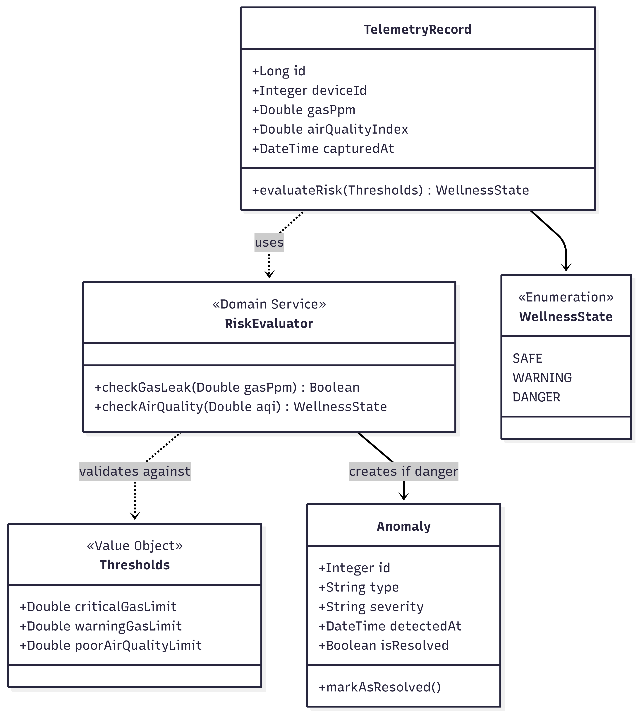

---
#### 4.2.2.6.2. Bounded Context Database Design Diagram

El diseño del esquema de base de datos para este contexto está optimizado para el almacenamiento de registros históricos y la gestión de eventos críticos. La tabla telemetry_logs utiliza tipos de datos de alta capacidad (BigInt) para soportar el flujo constante de lecturas de los sensores MQ-2 y MQ-135.

El esquema establece una relación de trazabilidad entre cada registro de telemetría y las posibles anomalies generadas, permitiendo una auditoría completa de qué lectura exacta disparó una alerta. Por otro lado, la tabla device_thresholds permite la personalización de los niveles de alerta por cada inmueble, brindando flexibilidad a la configuración del sistema de seguridad.

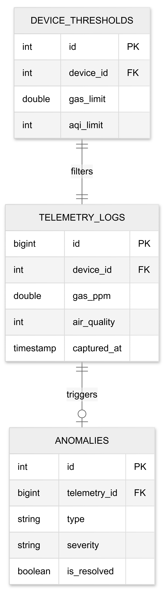


---

#### 4.2.3. Bounded Context: Resource & Asset Management

Este Bounded Context se encarga de la gestión de la infraestructura física y el inventario tecnológico del ecosistema Nexora. Su función principal es mantener la jerarquía de activos (propiedades y unidades) y asegurar la correcta vinculación y seguimiento del estado de los dispositivos IoT y sensores distribuidos en el complejo.

---

#### 4.2.3.1. Domain Layer

**App Móvil:**

En esta capa se describen las clases que representan las abstracciones del inventario para el administrador y el personal técnico. Se incluyen clases de serialización para gestionar el mapeo físico de los dispositivos en las unidades habitacionales.

---

### DTO

**AssetSummaryDto**

| Atributo | Tipo | Descripción |
| :--- | :--- | :--- |
| propertyId | int | Identificador de la propiedad o complejo |
| unitName | string | Etiqueta de la unidad habitacional (ej. "Apto 101") |
| deviceCount | int | Número total de dispositivos vinculados |

---

**DeviceStatusDto**

| Atributo | Tipo | Descripción |
| :--- | :--- | :--- |
| deviceId | int | Identificador único del dispositivo físico |
| model | string | Modelo o tipo de hardware |
| connectionState | string | Estado actual de conexión (Sincronizado, Offline) |
| batteryLevel | int | Nivel de energía reportado por el dispositivo |

---

**Backend:**

En esta capa se describen las clases que representan el núcleo del dominio de gestión de activos. Se incluyen las entidades que definen la jerarquía física, los objetos de valor de hardware y la lógica de comisionamiento de dispositivos bajo el patrón CQRS.

---

#### Entities

**PropertyAsset**

Representa la unidad física dentro de la jerarquía organizacional del sistema.

| Atributo | Tipo |
| :--- | :--- |
| Id | int |
| Name | string |
| ParentId | int |
| Type | string |
| IsActive | bool |

---

**IoTDevice**

Representa el hardware físico registrado en el inventario desde su perspectiva de activo fijo.

| Atributo | Tipo |
| :--- | :--- |
| Id | int |
| SerialNumber | string |
| FirmwareVersion | string |
| DeviceType | string |
| AssignedUnitId | int |

---

#### Value Objects

**DeviceMetadata**

| Atributo | Descripción |
| :--- | :--- |
| MACAddress | Dirección física única del hardware para su identificación |
| Manufacturer | Nombre del fabricante del componente |
| ProductionDate | Fecha de fabricación para control de ciclos de vida |

---

**PhysicalAddress**

| Atributo | Descripción |
| :--- | :--- |
| Latitude | Coordenada geográfica para geolocalización de la propiedad |
| Longitude | Coordenada geográfica para geolocalización de la propiedad |
| StreetAddress | Dirección física legible del inmueble |

---

#### Aggregates

**SmartUnit**

Representa la unidad habitacional como el núcleo donde convergen el espacio físico y los dispositivos vinculados.

| Atributo | Tipo |
| :--- | :--- |
| UnitId | int |
| GatewayId | int |
| LinkedDevices | List |
| LastSyncAt | DateTime |

---

| Método | Descripción |
| :--- | :--- |
| LinkSensor | Vincula un sensor a la unidad validando compatibilidad con el Gateway local |
| UnlinkSensor | Desvincula un dispositivo del inventario activo de la unidad |
| UpdateSyncStatus | Refleja el estado de sincronización global de la infraestructura de la unidad |

---

#### Commands & Queries

| Clase | Descripción |
| :--- | :--- |
| RegisterPropertyCommand | Crea una nueva entidad en la jerarquía de activos del sistema |
| LinkDeviceToUnitCommand | Ejecuta el proceso de vinculación técnica entre un sensor y una unidad |
| UpdateDeviceStateCommand | Modifica los metadatos o el estado operativo de un activo de hardware |
| GetPropertyHierarchyQuery | Consulta la estructura de árbol de las propiedades y sus unidades |
| GetUnitInventoryQuery | Obtiene la lista detallada de todos los activos asignados a una unidad |

---

#### 4.2.3.2. Interface Layer

**Backend:**

Define los recursos y controladores que permiten la gestión del inventario físico y la configuración de dispositivos a través de la API del sistema Nexora.

---

### Resources

| Clase | Descripción |
| :--- | :--- |
| PropertyResource | Expone los detalles de la infraestructura (edificios, pisos, unidades) |
| DeviceInventoryResource | Provee la información técnica y metadatos de los sensores y gateways |
| ProvisioningResource | Gestiona los datos necesarios para el proceso de vinculación de hardware |

---

### Controllers

**AssetManagementController**

| Ruta específica | Descripción |
| :--- | :--- |
| /api/v1/assets/properties | Gestión y consulta de la jerarquía física de inmuebles |
| /api/v1/assets/units/{id}/inventory | Listado de dispositivos vinculados a una unidad específica |

---

**DeviceController**

| Ruta específica | Descripción |
| :--- | :--- |
| /api/v1/devices/pair | Endpoint para ejecutar la vinculación de un nuevo sensor al Gateway |
| /api/v1/devices/{id}/status | Actualización y consulta del estado operativo del hardware |

---

#### 4.2.3.3. Application Layer

**Backend:**

---

### Command Services

| Clase | Descripción |
| :--- | :--- |
| AssetCommandService | Orquesta la creación de la jerarquía de inmuebles y el registro de nuevas unidades |
| DeviceProvisioningCommandService | Gestiona el flujo lógico de vinculación (pairing) entre sensores y gateways, validando compatibilidad |

---

### Query Services

| Clase | Descripción |
| :--- | :--- |
| PropertyQueryService | Recupera la estructura organizacional de los activos y el mapeo físico de las propiedades |
| InventoryQueryService | Provee consultas sobre el estado del stock tecnológico y la disponibilidad de dispositivos |

---

#### 4.2.3.4. Infrastructure Layer

**Backend:**

---

### Implementación de Repositorios

| Clase | Interfaz Implementada | Descripción |
| :--- | :--- | :--- |
| PropertyRepository | IPropertyRepository | Gestiona la persistencia de la jerarquía de inmuebles y unidades en la base de datos relacional |
| DeviceRepository | IDeviceRepository | Maneja el ciclo de vida de los registros de hardware y su asignación técnica |

---

### IoT Communication

| Clase | Descripción |
| :--- | :--- |
| DevicePairingAdapter | Adaptador técnico que gestiona los protocolos de enlace y handshaking entre el Gateway y los sensores |
| GatewayStatusService | Servicio de infraestructura que monitorea el "heartbeat" y la salud de la red local de dispositivos |

---

#### 4.2.3.5. Bounded Context Software Architecture Component Level Diagrams

Este diagrama de nivel 3 describe la arquitectura interna del Bounded Context encargado de la gestión del inventario físico y la configuración de dispositivos IoT dentro del ecosistema Nexora. Se observa un flujo REST donde la Mobile App interactúa con dos controladores especializados: el `AssetManagementController`, responsable de exponer la jerarquía de propiedades y unidades, y el `DeviceController`, encargado de los endpoints de pairing y consulta de estado de hardware.

Ambos controladores delegan la lógica hacia la capa de aplicación, compuesta por los servicios `AssetCommandService` y `DeviceProvisioningCommandService` para operaciones de escritura, y por `PropertyQueryService` e `InventoryQueryService` para las consultas. La infraestructura separa claramente la persistencia relacional (a través de `PropertyRepository` y `DeviceRepository`) de la comunicación IoT (mediante el `DevicePairingAdapter` y el `GatewayStatusService`), asegurando un diseño desacoplado donde los protocolos de enlace con hardware no contaminan la lógica de negocio.


---

### 4.2.3.6. Bounded Context Software Architecture Code Level Diagrams

#### 4.2.3.6.1. Bounded Context Domain Layer Class Diagrams

El diagrama de clases del dominio para el contexto de Resource & Asset Management define las reglas tácticas para la jerarquía de activos físicos y el ciclo de vida de los dispositivos IoT. Se identifican como entidades clave `PropertyAsset`, que modela la unidad física dentro de la jerarquía organizacional del complejo (con soporte para relaciones padre-hijo entre edificios, pisos y unidades), e `IoTDevice`, que representa el hardware registrado como activo fijo con su firmware y tipo de dispositivo.

El Aggregate Root `SmartUnit` actúa como el núcleo donde convergen el espacio físico y los dispositivos vinculados, exponiendo métodos como `linkSensor`, `unlinkSensor` y `updateSyncStatus` para gestionar el inventario activo de una unidad habitacional. Los Value Objects `DeviceMetadata` y `PhysicalAddress` garantizan la inmutabilidad e identidad de los datos de hardware y geolocalización respectivamente. Finalmente, el modelo aplica el patrón CQRS mediante Commands (`RegisterPropertyCommand`, `LinkDeviceToUnitCommand`, `UpdateDeviceStateCommand`) y Queries (`GetPropertyHierarchyQuery`, `GetUnitInventoryQuery`), separando explícitamente las intenciones de escritura de las de lectura.


---

#### 4.2.3.6.2. Bounded Context Database Design Diagram

El diseño del esquema de base de datos para el contexto de Resource & Asset Management está orientado a la persistencia de la jerarquía de activos físicos y al ciclo de vida completo de los dispositivos IoT. La tabla `properties` actúa como el núcleo jerárquico del modelo gracias a su auto-referencia mediante la columna `parent_id`, lo que permite representar de forma natural la estructura de complejo → piso → unidad sin necesidad de tablas adicionales.

El esquema establece una cadena de relaciones donde cada `smart_unit` pertenece a una `property`, cada `iot_device` se vincula a una `smart_unit`, y cada dispositivo posee exactamente un registro en `device_metadata` con sus datos físicos únicos (dirección MAC, fabricante y fecha de producción). La tabla `unit_provisioning_log` cierra el diseño asegurando la trazabilidad de cada operación de pairing, lo que facilita auditorías técnicas y el control del historial de comisionamiento de dispositivos en campo.


---

### 4.2.4. Bounded Context: Service Execution & Maintenance Bounded context  
Responsable de la ejecución operativa de mantenimientos y la atención de incidentes técnicos en tiempo real. Gestiona órdenes de trabajo, técnicos y seguimiento de reparaciones.

#### 4.2.4.1. Domain Layer  
En esta capa se definen las entidades, agregados y reglas de negocio relacionadas con la ejecución de servicios técnicos

---

### Entities

**MaintenanceOrder**

| Elemento | Detalle |
| ----- | ----- |
| Descripción | Representa una orden de mantenimiento generada a partir de un incidente o solicitud. |

**Atributos**

| Nombre | Tipo | Descripción |
| ----- | ----- | ----- |
| id | int | Identificador único de la orden |
| propertyId | int | Identificador de la propiedad afectada |
| technicianId | int | Técnico asignado |
| status | string | Estado de la orden |
| priority | string | Nivel de prioridad |
| createdAt | DateTime | Fecha de creación |
| completedAt | DateTime | Fecha de finalización |

**Métodos**

| Nombre | Descripción |
| ----- | ----- |
| assignTechnician() | Asigna un técnico a la orden |
| startWork() | Inicia el trabajo de mantenimiento |
| completeWork() | Finaliza la orden |

---

#### Technician

| Elemento | Detalle |
| ----- | ----- |
| Descripción | Representa al técnico encargado de ejecutar tareas de mantenimiento. |

**Atributos**

| Nombre | Tipo | Descripción |
| ----- | ----- | ----- |
| id | int | Identificador del técnico |
| name | string | Nombre del técnico |
| specialty | string | Especialidad técnica |
| availabilityStatus | string | Estado de disponibilidad |

**Métodos**

| Nombre | Descripción |
| ----- | ----- |
| assignTask() | Asigna una tarea al técnico |
| updateAvailability() | Actualiza su disponibilidad |

---

#### Incident

| Elemento | Detalle |
| ----- | ----- |
| Descripción | Representa una alerta o problema detectado que requiere mantenimiento. |

**Atributos**

| Nombre | Tipo | Descripción |
| ----- | ----- | ----- |
| id | int | Identificador del incidente |
| type | string | Tipo de incidente |
| severity | string | Nivel de severidad |
| detectedAt | DateTime | Fecha de detección |
| status | string | Estado del incidente |

---

###  Value Objects

#### PriorityLevel

| Elemento | Detalle |
| ----- | ----- |
| Descripción | Define el nivel de prioridad de una orden de mantenimiento. |

| Valor | Descripción |
| ----- | ----- |
| High | Alta prioridad |
| Medium | Prioridad media |
| Low | Baja prioridad |

---

#### MaintenanceStatus

| Elemento | Detalle |
| ----- | ----- |
| Descripción | Define el estado de la orden de mantenimiento. |

| Valor | Descripción |
| ----- | ----- |
| Pending | Pendiente |
| Assigned | Asignada |
| InProgress | En progreso |
| Completed | Completada |

---

###  Aggregates

#### MaintenanceAggregate

| Elemento | Detalle |
| ----- | ----- |
| Descripción | Coordina la lógica principal del mantenimiento integrando órdenes e incidentes. |

**Métodos**

| Nombre | Descripción |
| ----- | ----- |
| createOrderFromIncident() | Genera una orden desde un incidente |
| assignTechnician() | Asigna un técnico |
| closeOrder() | Cierra la orden |

---

###  Domain Services

#### MaintenanceAssignmentService

| Elemento | Detalle |
| ----- | ----- |
| Descripción | Gestiona la asignación automática de técnicos según disponibilidad y prioridad. |

---

#### NotificationDomainService

| Elemento | Detalle |
| ----- | ----- |
| Descripción | Define la lógica de envío de notificaciones del sistema. |

---

### Repositories (Interfaces)

| Interfaz | Descripción |
| ----- | ----- |
| IMaintenanceOrderRepository | Maneja la persistencia de órdenes de mantenimiento |
| ITechnicianRepository | Maneja la persistencia de técnicos |

---

#### 4.2.4.2. Interface Layer.

Esta capa expone las funcionalidades mediante controladores que reciben solicitudes externas.

### Controllers

**MaintenanceController**

| Endpoint | Descripción |
| ----- | ----- |
| POST /maintenance/orders | Crea una orden de mantenimiento |
| PUT /maintenance/orders/{id}/assign | Asigna técnico |
| PUT /maintenance/orders/{id}/complete | Finaliza orden |

---

**IncidentController**

| Endpoint | Descripción |
| ----- | ----- |
| POST /incidents | Registra un incidente desde otro bounded context |

---

#### 4.2.4.3. Application Layer.

En esta capa se gestionan los flujos de negocio mediante handlers y servicios.

**Command Handlers**

| Clase | Descripción |
| ----- | ----- |
| CreateMaintenanceOrderCommandHandler | Crea órdenes de mantenimiento |
| AssignTechnicianCommandHandler | Asigna técnicos automáticamente |
| CompleteMaintenanceCommandHandler | Finaliza órdenes |

---

 

**Event Handlers**

| Clase | Descripción |
| ----- | ----- |
| IncidentReceivedEventHandler | Procesa incidentes del Monitoring |
| MaintenanceCompletedEventHandler | Maneja acciones post-mantenimiento |

---

**Application Services**

| Clase | Descripción |
| ----- | ----- |
| MaintenanceService | Coordina los procesos principales del mantenimiento |


---

#### 4.2.4.4. Infrastructure Layer.

Esta capa implementa persistencia e integración con servicios externos.

### Repositories

| Clase | Interfaz | Descripción |
| ----- | ----- | ----- |
| MaintenanceOrderRepositoryImpl | IMaintenanceOrderRepository | Persistencia de órdenes |
| TechnicianRepositoryImpl | ITechnicianRepository | Persistencia de técnicos |

---

### Adapters

| Clase | Descripción |
| ----- | ----- |
| NotificationAdapter | Envío de notificaciones |
| MessageBrokerAdapter | Comunicación por eventos (RabbitMQ/Kafka) |


---

#### 4.2.4.5. Bounded Context Software Architecture Component Level Diagrams

Este diagrama de nivel 3 describe la arquitectura interna del Bounded Context encargado de la ejecución operativa de mantenimientos y la atención de incidentes técnicos. Se observa un flujo basado en eventos donde el Incident Event Consumer recibe alertas provenientes del Monitoring Context y las traslada a los servicios de aplicación (Maintenance Command Service), encargados de orquestar la creación y gestión de órdenes de mantenimiento.

La lógica de negocio reside en el Maintenance Aggregate y en servicios de dominio como MaintenanceAssignmentService, que permiten gestionar la asignación automática de técnicos según disponibilidad y prioridad. Este diseño sigue un enfoque desacoplado y orientado a eventos, donde se separan las operaciones de escritura (gestión de órdenes) de las consultas (estado de mantenimiento), permitiendo además la integración con aplicaciones móviles para notificación y actualización en tiempo real.

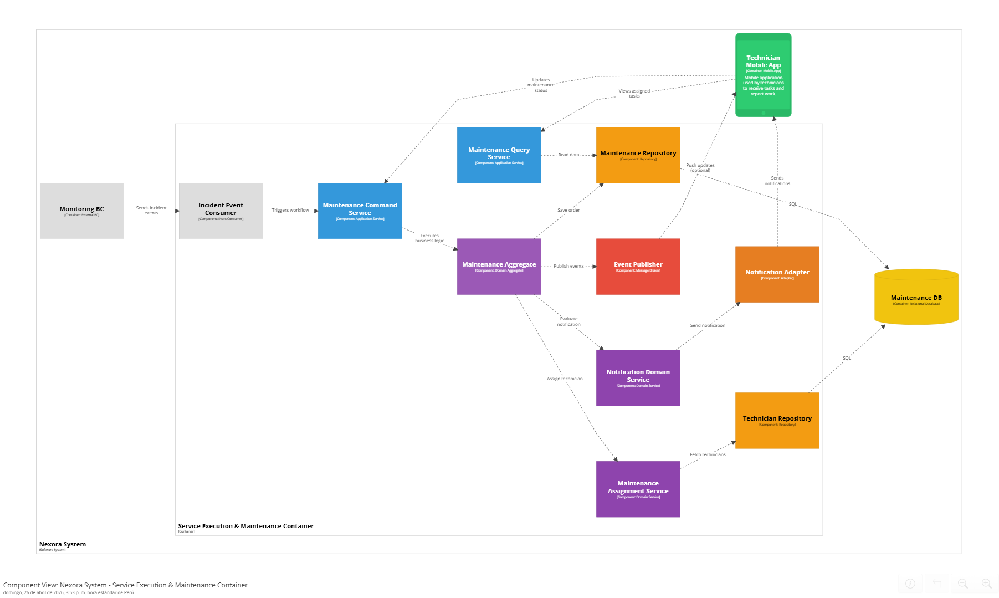

---

### 4.2.4.6. Bounded Context Software Architecture Code Level Diagrams

#### 4.2.4.6.1. Bounded Context Domain Layer Class Diagrams

El diagrama de clases del dominio para el contexto de Service Execution & Maintenance define las reglas tácticas para la gestión de órdenes de mantenimiento y la atención de incidentes técnicos. Se identifican como entidades clave a MaintenanceOrder, que representa la ejecución de trabajos técnicos, Technician, encargado de realizar las tareas, y Incident, que representa la alerta recibida desde el Monitoring Context.

El modelo utiliza un Domain Service (MaintenanceAssignmentService) para desacoplar la lógica de asignación de técnicos de las entidades, permitiendo una mayor flexibilidad en la gestión de disponibilidad y prioridad. Asimismo, el uso de value objects como PriorityLevel y MaintenanceStatus asegura la consistencia del lenguaje ubicuo dentro del dominio.


---

#### 4.2.4.6.2. Bounded Context Database Design Diagram

El diseño del esquema de base de datos para el contexto de Service Execution & Maintenance está orientado a la gestión de órdenes de mantenimiento y la trazabilidad de incidentes técnicos. La tabla maintenance_orders actúa como el núcleo del modelo, almacenando el ciclo de vida completo de cada intervención técnica.

El esquema establece una relación directa entre los incidentes detectados y las órdenes generadas, permitiendo identificar qué evento originó cada acción de mantenimiento. Asimismo, la tabla technicians permite gestionar la asignación de recursos humanos, asegurando la disponibilidad y especialización adecuada para cada tarea. Este diseño facilita el seguimiento, auditoría y control de las operaciones en campo.


---

## 4.2.5. Bounded Context: Subscriptions & Payment Management

En este bounded context se gestiona la monetización SaaS de la plataforma Nexora, incluyendo el ciclo de vida de suscripciones corporativas, la facturación recurrente por uso y la integración con la pasarela de pagos externa Culqi.

### 4.2.5.1. Domain Layer

En la capa de dominio se definen las clases centrales que representan el núcleo del sistema de suscripciones y pagos, junto con las reglas de negocio del bounded context.

#### Entities

•⁠  ⁠*Subscription:* Representa la suscripción activa de una cuenta corporativa. Incluye atributos como ⁠ id ⁠, ⁠ accountId ⁠, ⁠ planId ⁠, ⁠ startDate ⁠, ⁠ renewalDate ⁠, ⁠ status ⁠ y ⁠ activeUnitCount ⁠, que almacenan el estado actual del contrato entre el cliente y la plataforma.
•⁠  ⁠*Invoice:* Representa una factura generada al cierre de un Billing Cycle. Incluye atributos como ⁠ id ⁠, ⁠ subscriptionId ⁠, ⁠ amount ⁠, ⁠ issuedDate ⁠, ⁠ dueDate ⁠ y ⁠ status ⁠, que registran el cobro correspondiente a un período de facturación.
•⁠  ⁠*BillingAccount:* Cuenta de facturación asociada a un Property Manager o Real Estate Company. Contiene atributos como ⁠ id ⁠, ⁠ ownerId ⁠, ⁠ ownerType ⁠, ⁠ culqiCustomerId ⁠ y ⁠ defaultPaymentMethodToken ⁠, que identifican al cliente y su método de pago registrado en Culqi.

#### Value Objects

•⁠  ⁠*SaaSPlan:* Define el tier de suscripción (Basic, Professional, Enterprise) junto con el precio unitario por Smart Unit activa y el intervalo de facturación.
•⁠  ⁠*BillingCycle:* Encapsula el período de facturación con su fecha de inicio y fin, y la cantidad de unidades activas registradas al cierre del período.
•⁠  ⁠*UsageQuota:* Representa la cantidad de Smart Units activas en un período determinado, consumida desde el Resource & Asset Management Bounded Context.
•⁠  ⁠*SubscriptionStatus:* Define el estado de la suscripción mediante una enumeración: ⁠ Active ⁠, ⁠ Overdue ⁠, ⁠ Suspended ⁠ y ⁠ Cancelled ⁠.
•⁠  ⁠*InvoiceStatus:* Define el estado de la factura mediante una enumeración: ⁠ Pending ⁠, ⁠ Paid ⁠, ⁠ Failed ⁠ y ⁠ Refunded ⁠.
•⁠  ⁠*Money:* Encapsula el monto y la moneda (⁠ PEN ⁠/⁠ USD ⁠) de cualquier valor monetario en el dominio.

#### Aggregates

•⁠  ⁠*SubscriptionAggregate:* Raíz de agregado principal. Encapsula ⁠ Subscription ⁠, ⁠ SaaSPlan ⁠, ⁠ BillingCycle ⁠ y la lista de ⁠ Invoice ⁠ asociadas. Controla las transiciones de estado, aplica las reglas de negocio de acceso y expone operaciones como ⁠ changePlan() ⁠, ⁠ updateUsage() ⁠, ⁠ restrict() ⁠ y ⁠ cancel() ⁠.
•⁠  ⁠*BillingAccountAggregate:* Encapsula ⁠ BillingAccount ⁠ y el token de método de pago. Gestiona la identidad del cliente en Culqi y expone operaciones como ⁠ updatePaymentToken() ⁠ y ⁠ updateCulqiId() ⁠.

#### Domain Events

•⁠  ⁠⁠ InvoiceGeneratedEvent ⁠: Disparado cuando se genera una nueva factura al cierre del ciclo de facturación.
•⁠  ⁠⁠ SubscriptionExpiredEvent ⁠: Disparado cuando una suscripción es suspendida por falta de pago.
•⁠  ⁠⁠ PlanChangedEvent ⁠: Disparado cuando el cliente cambia de tier de suscripción.
•⁠  ⁠⁠ PaymentFailedEvent ⁠: Disparado cuando un intento de cobro a través de Culqi no se procesa correctamente.
•⁠  ⁠⁠ AccessRestrictedEvent ⁠: Disparado cuando se restringe el acceso al Dashboard analítico por mora en el pago.

#### Repositories (Interfaces)

•⁠  ⁠*ISubscriptionRepository:* Define los métodos ⁠ findById() ⁠, ⁠ findByAccountId() ⁠, ⁠ save() ⁠ y ⁠ delete() ⁠ para gestionar la persistencia del ⁠ SubscriptionAggregate ⁠.
•⁠  ⁠*IInvoiceRepository:* Define los métodos ⁠ findById() ⁠, ⁠ findBySubscription() ⁠, ⁠ save() ⁠ y ⁠ listOverdue() ⁠ para gestionar la persistencia de ⁠ Invoice ⁠.
•⁠  ⁠*IBillingAccountRepository:* Define los métodos ⁠ findById() ⁠, ⁠ findByOwner() ⁠, ⁠ save() ⁠ y ⁠ delete() ⁠ para gestionar la persistencia del ⁠ BillingAccountAggregate ⁠.

---

---

### 4.2.5.2. Interface Layer

Esta capa expone las funcionalidades del bounded context a través de controladores que manejan las solicitudes HTTP provenientes de la Nexora Mobile App y la Nexora Web App, así como los callbacks externos de Culqi.

#### Controllers

•⁠  ⁠*SubscriptionController:* Maneja las solicitudes relacionadas con el ciclo de vida de suscripciones.
  - *Métodos:*
    - ⁠ createSubscription ⁠: Crea una nueva suscripción para una billing account.
    - ⁠ changePlan ⁠: Actualiza el tier de suscripción de una cuenta.
    - ⁠ cancelSubscription ⁠: Cancela una suscripción activa.
    - ⁠ getSubscriptionStatus ⁠: Consulta el estado actual de una suscripción.

•⁠  ⁠*BillingController:* Maneja las solicitudes relacionadas con facturas y ciclos de facturación.
  - *Métodos:*
    - ⁠ getCurrentInvoice ⁠: Obtiene la factura del período en curso.
    - ⁠ getInvoiceHistory ⁠: Lista el historial de facturas de una suscripción.
    - ⁠ triggerManualBilling ⁠: Permite a un administrador disparar manualmente el ciclo de facturación.

•⁠  ⁠*WebhookController:* Recibe y valida los callbacks asincrónicos enviados por Culqi tras el procesamiento de un cobro.
  - *Métodos:*
    - ⁠ handleCulqiWebhook ⁠: Parsea el payload del webhook, valida la firma de Culqi y delega el resultado al ⁠ PaymentResultHandler ⁠.

---

---

### 4.2.5.3. Application Layer

La capa de aplicación orquesta los flujos de negocio y coordina la interacción entre la capa de dominio y la infraestructura. Al tratarse de una arquitectura monolítica, la comunicación entre componentes se realiza mediante llamadas directas en proceso.

#### Services

•⁠  ⁠*SubscriptionAppService:* Orquesta las operaciones del ciclo de vida de suscripciones: creación, cambio de plan y cancelación. Coordina el ⁠ SubscriptionAggregate ⁠, el ⁠ BillingAccountAggregate ⁠ y el ⁠ SubscriptionRepository ⁠.
•⁠  ⁠*BillingEngineService:* Ejecuta el ciclo de facturación mensual. Consulta el ⁠ UsageQuota ⁠ actual a través del ⁠ UsageMetricsService ⁠, calcula el monto de la ⁠ Invoice ⁠ multiplicando las unidades activas por el precio unitario del ⁠ SaaSPlan ⁠, y coordina el cobro con el ⁠ CulqiPaymentAdapter ⁠.
•⁠  ⁠*UsageMetricsService:* Consulta la cantidad de Smart Units activas por cuenta directamente al bounded context Resource & Asset Management mediante llamadas HTTP REST, y actualiza el ⁠ UsageQuota ⁠ correspondiente en el ⁠ SubscriptionAggregate ⁠.
•⁠  ⁠*AccessControlService:* Evalúa el estado de pago de la suscripción y aplica la regla de negocio principal: restringe el acceso al Dashboard analítico en cuentas con mora, manteniendo activo el sistema de alertas críticas de seguridad. Notifica al bounded context Service Monitoring & Intelligence mediante llamada HTTP REST.

#### Event Handlers

•⁠  ⁠*PaymentResultHandler:* Procesa el resultado recibido del webhook de Culqi a través del ⁠ WebhookController ⁠. Actualiza el estado de la ⁠ Invoice ⁠ y de la ⁠ Subscription ⁠ en el ⁠ SubscriptionAggregate ⁠ y notifica al ⁠ AccessControlService ⁠ para que evalúe el estado de acceso.

---

---

### 4.2.5.4. Infrastructure Layer

En esta capa se implementan los repositorios y los adaptadores externos que integran el bounded context con sistemas de terceros.

#### Repositories (Implementaciones)

•⁠  ⁠*SubscriptionRepositoryImpl:* Implementa ⁠ ISubscriptionRepository ⁠ sobre PostgreSQL mediante Entity Framework Core. Gestiona la persistencia y consulta del ⁠ SubscriptionAggregate ⁠ y sus facturas asociadas en la base de datos compartida Nexora DB.
•⁠  ⁠*InvoiceRepositoryImpl:* Implementa ⁠ IInvoiceRepository ⁠ sobre PostgreSQL. Gestiona la persistencia de ⁠ Invoice ⁠ y expone consultas de facturas vencidas para el proceso de cobro.
•⁠  ⁠*BillingAccountRepositoryImpl:* Implementa ⁠ IBillingAccountRepository ⁠ sobre PostgreSQL. Gestiona la persistencia del ⁠ BillingAccountAggregate ⁠ y los tokens de pago en la Nexora DB.

#### Adapters

•⁠  ⁠*CulqiPaymentAdapter:* Implementa la integración con la pasarela de pagos Culqi actuando como Anti-Corruption Layer. Abstrae las operaciones de tokenización de tarjetas, cobro recurrente, reembolsos y el parseo de webhooks, aislando el dominio de los detalles del proveedor externo.
  - *Métodos:*
    - ⁠ tokenizeCard ⁠: Tokeniza los datos de la tarjeta del cliente a través de la API de Culqi.
    - ⁠ chargeRecurring ⁠: Ejecuta un cobro recurrente sobre el token almacenado en el ⁠ BillingAccount ⁠.
    - ⁠ refund ⁠: Procesa el reembolso de un cobro previamente procesado.
    - ⁠ parseWebhook ⁠: Valida la firma y parsea el payload de los callbacks enviados por Culqi.

---

---

### 4.2.5.5. Bounded Context Software Architecture Component Level Diagrams

-⁠  ⁠**Nexora Mobile App:** Aplicación móvil Flutter utilizada por Property Managers para gestionar suscripciones y consultar el historial de facturación.
-⁠  ⁠**Nexora Web App:** Aplicación web utilizada por Property Managers para gestionar suscripciones y consultar el historial de facturación desde un navegador.
- **Subscription Controller:** Gestiona las operaciones del ciclo de vida de suscripciones: creación, cambio de plan, cancelación y consulta de estado.
- **Billing Controller:** Gestiona la consulta de facturas y el disparo manual del ciclo de facturación para administradores.
- **Webhook Controller:** Recibe y valida los callbacks asincrónicos de Culqi, delegando el resultado al Payment Result Event Handler.
- **Subscription App Service:** Orquesta los comandos del ciclo de vida de suscripciones coordinando el dominio y la infraestructura.
- **Billing Engine Service:** Ejecuta el ciclo de facturación mensual calculando el monto de la Invoice a partir del UsageQuota y el SaaSPlan, y coordinando el cobro con el Culqi Payment Adapter.
- **Access Control Service:** Aplica la regla de negocio de restricción de acceso al Dashboard por mora, manteniendo activas las alertas críticas de seguridad.
- **Usage Metrics Event Handler:** Consume eventos del Resource BC y actualiza el UsageQuota por cuenta en el SubscriptionAggregate.
- **Payment Result Event Handler:** Procesa el resultado del webhook de Culqi y actualiza el estado de Invoice y Subscription.
- **Culqi Payment Adapter:** Anti-Corruption Layer que abstrae la comunicación con la API REST de Culqi.
- **Subscription Repository:** Gestiona la persistencia de los agregados de suscripción, factura y billing account sobre PostgreSQL.


---

### 4.2.5.6. Bounded Context Software Architecture Code Level Diagrams

#### 4.2.5.6.1. Bounded Context Domain Layer Class Diagrams

El diagrama de clases refleja las dos raíces de agregado del bounded context. `SubscriptionAggregate` es la raíz principal y encapsula la entidad `Subscription` junto con los value objects `SaaSPlan`, `BillingCycle`, `UsageQuota` y `SubscriptionStatus`, además de la lista de entidades `Invoice` mediante una relación de composición. `BillingAccountAggregate` encapsula la cuenta de facturación y su token de pago en Culqi.

- **SubscriptionAggregate:** Raíz de agregado principal. Controla el ciclo de vida completo de la suscripción y aplica todas las invariantes del dominio.
- **BillingAccountAggregate:** Gestiona la identidad financiera del cliente y su vinculación con Culqi.
- **Invoice:** Entidad que representa la factura generada por cada ciclo de facturación.
- **SaaSPlan, BillingCycle, UsageQuota, SubscriptionStatus, InvoiceStatus, Money:** Value objects inmutables que encapsulan conceptos del dominio sin identidad propia.
- **ISubscriptionRepository, IInvoiceRepository, IBillingAccountRepository:** Interfaces que abstraen la persistencia de los agregados hacia la capa de infraestructura.


#### 4.2.5.6.2. Bounded Context Database Design Diagram

El modelo relacional está compuesto por seis tablas. `billing_account` actúa como raíz del modelo financiero y se relaciona con `subscription` en una relación de uno a muchos. Cada `subscription` genera uno o más registros en `billing_cycle` por cada período de facturación, y uno o más registros en `invoice` a lo largo de su vida. Cada `billing_cycle` produce exactamente una `invoice` en una relación de uno a uno. Las `invoice` pueden tener uno o más registros en `payment_attempt`, que registran cada intento de cobro realizado a través de Culqi.

Las relaciones entre tablas son las siguientes:

- `billing_account` `1` ────► `N` `subscription`: Una billing account puede tener una o más subscriptions.
- `subscription` `1` ────► `N` `billing_cycle`: Una subscription genera uno o más billing cycles.
- `subscription` `1` ────► `N` `invoice`: Una subscription acumula una o más invoices.
- `billing_cycle` `1` ────► `1` `invoice`: Cada billing cycle produce exactamente una invoice.
- `invoice` `1` ────► `N` `payment_attempt`: Una invoice puede tener uno o más payment attempts.


---

# Capítulo V: Solution UI/UX Design
## 5.1. Style Guidelines
### 5.1.1. General Style Guidelines

En esta sección se establecen los lineamientos visuales y comunicacionales que guiarán el diseño de Nexora, asegurando coherencia en todos los puntos de contacto con el usuario. Estas decisiones están fundamentadas en la naturaleza tecnológica del producto, su enfoque en eficiencia operativa y su rol dentro del ecosistema inmobiliario inteligente.

El sistema de diseño toma como referencia principios de **Material Design** y **Human-Centered Design**, adaptados al contexto de plataformas IoT y dashboards de monitoreo en tiempo real, donde la claridad, jerarquía visual y respuesta rápida son esenciales.

<br>

---

#### **Branding**

El branding de Nexora está diseñado para reflejar una **marca tecnológica, confiable y orientada a la eficiencia**, alineada con su propuesta de valor basada en automatización, análisis de datos y conectividad inteligente.

Se construye sobre cuatro pilares fundamentales:

1. **Tecnología accesible:**
   Nexora traduce la complejidad del IoT en una experiencia simple, intuitiva y comprensible para usuarios no técnicos.

2. **Eficiencia operativa:**
   La identidad visual transmite orden, precisión y optimización, atributos clave para administradores de propiedades.

3. **Seguridad y confianza:**
   Se priorizan elementos visuales sólidos y estructurados que generen credibilidad en el manejo de datos y control de inmuebles.

4. **Innovación sostenible:**
   La marca comunica modernidad sin perder responsabilidad ambiental, alineándose con la eficiencia energética.

<br>

---

#### **Logo**

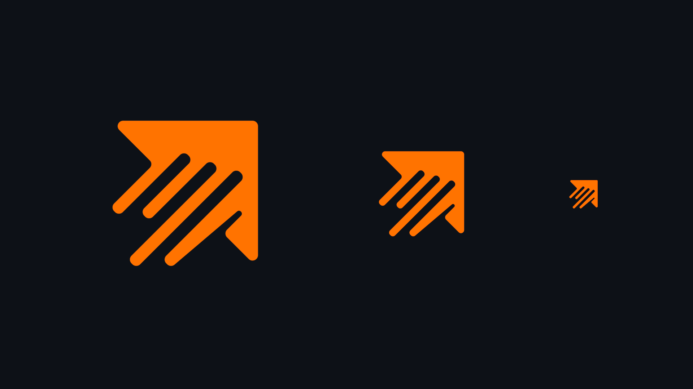

<br>

El logotipo de Nexora representa visualmente la **dirección, conectividad y flujo de datos** dentro de un ecosistema inteligente.

**Elementos clave:**

1. **Flecha ascendente:**
   Simboliza progreso, optimización y crecimiento, alineado con la mejora continua en la gestión inmobiliaria.

2. **Líneas internas paralelas:**
   Representan los flujos de datos y la comunicación entre dispositivos IoT, evocando conectividad y sincronización.

3. **Forma angular:**
   Refuerza una estética tecnológica, moderna y dinámica, asociada a sistemas digitales y precisión.

4. **Color naranja predominante:**
   Introduce energía e innovación, diferenciando la marca dentro de un sector tradicionalmente sobrio como el inmobiliario.

*El logo sintetiza la esencia de Nexora: transformar datos en decisiones inteligentes.*

<br>

---

#### **Favicon**

El favicon es una simplificación del logotipo, manteniendo la **flecha característica** como elemento principal.

Esto permite mantener reconocimiento de marca incluso en interfaces mínimas como pestañas del navegador o aplicaciones móviles.

<br>

---

#### **Tipografía**

La selección tipográfica de Nexora responde a la necesidad de equilibrar **expresividad visual y funcionalidad**, en coherencia con los principios de diseño centrados en el usuario y la naturaleza tecnológica de la plataforma.

Se adopta una combinación de dos tipografías: **Exo 2** para títulos e **Inter** para contenido y componentes de interfaz. Esta decisión se fundamenta en criterios de **jerarquía visual, legibilidad en entornos digitales y coherencia con el branding tecnológico** del sistema.

<br>

**Exo 2 — Títulos y encabezados**

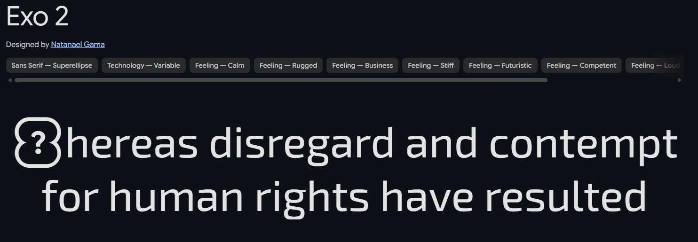

Se emplea en títulos y encabezados debido a su carácter geométrico y contemporáneo, que refuerza la percepción de innovación, precisión y modernidad.

* Aporta personalidad y diferenciación visual.
* Mejora la identificación de secciones clave.
* Refuerza el carácter tecnológico de la plataforma.

<br>

**Inter — Texto y componentes UI**

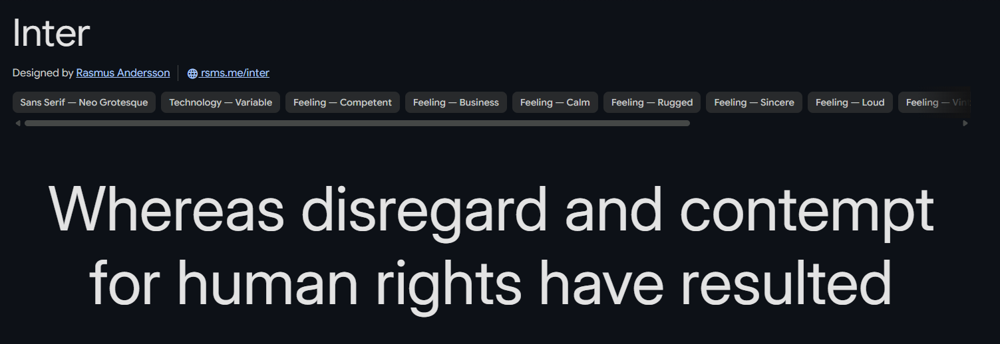

Se utiliza como tipografía base para textos, labels y elementos funcionales de la interfaz, priorizando claridad y eficiencia en la lectura.

* Alta legibilidad en pantallas y tamaños pequeños.
* Ideal para dashboards, métricas y contenido continuo.
* Reduce la carga cognitiva del usuario.

<br>

---

**Síntesis de la decisión tipográfica**

La combinación de ambas tipografías permite:

* Establecer una **jerarquía visual clara** entre títulos y contenido.
* Garantizar **legibilidad y accesibilidad** en distintos dispositivos.
* Mantener una **experiencia consistente y eficiente**.
* Reforzar el **carácter tecnológico y profesional** de la marca.

<br>

---

#### **Colores**


La paleta de Nexora está diseñada para equilibrar **tecnología, confianza y dinamismo**, combinando tonos neutros con un color acento fuerte.

##### **Colores principales:**

1. **Naranja (#ff7300) – Color primario**

   * Representa innovación, energía y acción.
   * Se utiliza en botones principales, indicadores activos y elementos clave de interacción.

2. **Azul profundo (#173183) – Color secundario**

   * Transmite confianza, estabilidad y tecnología.
   * Ideal para dashboards, encabezados y elementos estructurales.

##### **Colores neutros:**

3. **Gris claro (#f5f7f2)**

   * Fondo principal, aporta limpieza visual.

4. **Gris oscuro (#2f2f2f)**

   * Texto principal, alto contraste y legibilidad.

---

##### **Principios de uso del color:**

* **Jerarquía visual clara:** El naranja se reserva para acciones clave (CTA).
* **Contraste funcional:** Garantiza accesibilidad (WCAG).
* **Consistencia:** Cada color cumple un rol definido dentro del sistema.
* **Feedback visual:**

  * Naranja → acción / activo
  * Azul → información / estructura
  * Gris → neutral / fondo

<br>

---

#### **Spacing (Espaciado)**

Se adopta un sistema de espaciado basado en una **escala de 8px**, estándar en diseño de interfaces modernas.

**Escala base:**

* 4px (micro espacio)
* 8px (base)
* 16px (espacio estándar)
* 24px (secciones)
* 32px – 48px (bloques grandes)

**Principios:**

* **Consistencia:** mantiene orden visual en dashboards complejos.
* **Respiración visual:** evita sobrecarga de información.
* **Escalabilidad:** facilita diseño responsive en distintos dispositivos.

<br>

---

#### **Tono de Comunicación**

El tono de Nexora responde a un equilibrio entre tecnología avanzada y facilidad de uso, considerando que sus usuarios incluyen tanto perfiles técnicos como no técnicos.

1. **Serio, pero accesible:**
   Se comunica profesionalismo sin caer en tecnicismos innecesarios.

2. **Formal, pero claro:**
   Lenguaje estructurado, directo y comprensible.

3. **Respetuoso y confiable:**
   Refuerza la seguridad en el manejo de datos e infraestructura.

4. **Sereno y orientado a soluciones:**
   Evita alarmismo; prioriza claridad y control ante incidencias.

5. **Preciso y funcional:**
   Cada mensaje tiene un propósito: informar, alertar o guiar acciones.

<br>

---

#### **Principios de Diseño Aplicados**

**Las decisiones de diseño de Nexora se fundamentan en principios consolidados del diseño centrado en el usuario (*Human-Centered Design*) y en estándares internacionales de usabilidad, como la norma ISO 9241, así como en las heurísticas de usabilidad propuestas por Jakob Nielsen.** Estos lineamientos permiten garantizar una experiencia eficiente, comprensible y consistente en entornos de alta demanda informativa, como los sistemas de monitoreo IoT.

- **Usabilidad primero:**
Siguiendo los principios de la ingeniería de usabilidad, el sistema prioriza la facilidad de aprendizaje (*learnability*) y la eficiencia de uso (*efficiency*). Las interfaces están diseñadas para ser intuitivas desde el primer contacto, utilizando patrones de interacción reconocibles y reduciendo la carga cognitiva del usuario. Esto resulta clave en contextos donde los usuarios no necesariamente poseen conocimientos técnicos avanzados.

- **Visibilidad del estado del sistema:**
En concordancia con una de las heurísticas principales de Nielsen, Nexora garantiza que el sistema mantenga informado al usuario en todo momento. Los estados de dispositivos, alertas y métricas se presentan en tiempo real mediante indicadores claros y actualizados, permitiendo una supervisión constante sin ambigüedad.

- **Feedback inmediato:**
Toda acción del usuario genera una respuesta perceptible por parte del sistema en un tiempo adecuado. Este principio refuerza la percepción de control y confiabilidad, elementos fundamentales en plataformas de gestión operativa. El feedback se implementa a través de cambios visuales, notificaciones y confirmaciones de acción.

- **Jerarquía visual y diseño de la información:**
La organización de la interfaz responde a principios de arquitectura de la información y percepción visual. Se priorizan los elementos críticos mediante el uso estratégico de color, tamaño, contraste y posición, facilitando el escaneo rápido de la información. Esto es especialmente relevante en dashboards donde se manejan múltiples fuentes de datos simultáneamente.

- **Minimalismo funcional:**
Inspirado en el principio de “estética y diseño minimalista” de Nielsen, se eliminan elementos innecesarios que no aportan valor a la tarea del usuario. Este enfoque reduce la sobrecarga cognitiva y mejora la claridad general de la interfaz, permitiendo que el usuario se concentre en la información y acciones relevantes.

- **Accesibilidad:**
El diseño considera criterios de accesibilidad basados en las pautas WCAG, asegurando niveles adecuados de contraste, legibilidad tipográfica y estructura visual. Esto permite que la plataforma sea utilizable por una mayor diversidad de usuarios, incluyendo aquellos con limitaciones visuales o en condiciones de uso adversas.

- **Consistencia y estándares:**
Se mantiene coherencia en todos los componentes y patrones de interacción, siguiendo convenciones ampliamente adoptadas en diseño de interfaces. La consistencia reduce la necesidad de reaprendizaje y minimiza errores, alineándose con el principio de “consistencia y estándares” de Nielsen.

- **Eficiencia en la interacción:**
El sistema optimiza los flujos de trabajo mediante la reducción de pasos innecesarios y la priorización de acciones frecuentes. Esto responde al principio de flexibilidad y eficiencia de uso, permitiendo que tanto usuarios novatos como expertos interactúen con el sistema de manera productiva.

---

### 5.1.2. Web, Mobile and IoT Style Guide

En esta sección se definen los lineamientos específicos de diseño e interacción para los distintos puntos de contacto del ecosistema **Nexora**, asegurando coherencia con los **General Style Guidelines** previamente establecidos y adaptando la experiencia a las particularidades de cada entorno: web, mobile e interfaces físicas IoT.

Estos lineamientos serán materializados y centralizados en un **Design System en Figma**, que funcionará como repositorio vivo de componentes, patrones y prototipos interactivos, facilitando la colaboración entre equipos de diseño y desarrollo.

---

#### **5.1.2.1. Web Style Guidelines (Aplicación Web - Arrendadores)**

La aplicación web está orientada principalmente a **administradores de propiedades (arrendadores)**, quienes requieren gestionar múltiples inmuebles, monitorear métricas y tomar decisiones operativas.

##### **Enfoque de diseño**

El diseño web prioriza:

* Alta densidad de información controlada
* Visualización estructurada tipo dashboard
* Eficiencia en tareas recurrentes
* Escalabilidad para múltiples propiedades

---

##### **Estructura de interfaz**

Se adopta un patrón de **Dashboard Layout**:

* **Sidebar lateral (izquierda):**

  * Navegación principal (Inicio, Propiedades, Dispositivos, Alertas, Reportes, Configuración, Suscripción, Ayuda)
  * Íconos + texto (colapsable)

<br>


<br>

* **Topbar superior:**

  * Búsqueda global
  * Notificaciones
  * Perfil de usuario

<br>


* **Main Content:**

  * Visualización dinámica según módulo seleccionado

<br>

---

##### **Componentes clave**

1. **Cards de métricas**

   * Uso de KPIs: consumo energético, estado de dispositivos, incidencias
   * Colores:

     * Azul → información
     * Naranja → acción/alerta leve
     * Rojo (derivado) → error crítico

2. **Tablas inteligentes**

   * Ordenamiento, filtros, búsqueda
   * Paginación optimizada
   * Acciones rápidas (editar, ver, eliminar)

3. **Gráficos y visualización**

   * Line charts → consumo en el tiempo
   * Bar charts → comparativas por unidad
   * Pie charts → distribución de dispositivos

4. **Estados visuales**

   * Online → indicador verde
   * Offline → gris
   * Error → rojo

<br>

---

##### **Interacciones**

* Hover states claros en botones y filas
* Feedback inmediato en acciones CRUD
* Confirmaciones para acciones críticas
* Uso de modales para edición rápida

<br>

---

##### **Responsive Design**

* Breakpoints:

  * Desktop ≥ 1280px
  * Tablet ≥ 768px
  
* Sidebar colapsable en tablet
* Priorización de métricas clave en pantallas pequeñas

<br>

---

##### **Principios aplicados**

* **Optimización cognitiva:** organización jerárquica
* **Scan rápido:** uso de patrones visuales repetitivos
* **Eficiencia operativa:** reducción de clics

---

#### **5.1.2.2. Mobile Style Guidelines (Aplicación Móvil - Arrendatarios)**

La aplicación móvil está orientada a **inquilinos (arrendatarios)**, cuyo objetivo principal es el **control de dispositivos IoT** de manera rápida, simple e intuitiva.

<br>

---

##### **Enfoque de diseño**

El diseño mobile prioriza:

* Simplicidad extrema
* Acciones rápidas (1–2 taps)
* **Interacción táctil intuitiva
* Contexto en tiempo real

---

##### **Estructura de navegación**

Se adopta un patrón de **Bottom Navigation**:

* Inicio
* Dispositivos
* Automatizaciones
* Notificaciones
* Perfil

<br>


<br>

---

##### **Pantallas clave**

1. **Home (Dashboard simplificado)**

   * Estado general del hogar
   * Accesos rápidos (luces, clima, seguridad)

2. **Control de dispositivos**

   * Cards interactivas:

     * Switch (on/off)
     * Slider (intensidad, temperatura)
     * Botones de acción

3. **Automatizaciones**

   * Creación de reglas:

     * “Si X → entonces Y”
   * Ejemplo:

     * Si no hay movimiento → apagar luces

4. **Alertas**

   * Notificaciones push
   * Historial de eventos

<br>

---

##### **Patrones de interacción**

* **Gestos táctiles:**

  * Swipe → navegación
  * Tap → acción
  * Long press → configuración avanzada

* **Feedback inmediato:**

  * Animaciones suaves (150–300ms)
  * Cambio de estado visual instantáneo

<br>

---

##### **Componentes clave**

* Toggles grandes (uso con pulgar)
* Botones con alto contraste (naranja)
* Cards con sombras suaves (elevación)

<br>

---

##### **Accesibilidad**

* Tamaño mínimo táctil: 48px
* Alto contraste
* Uso de iconografía clara

<br>

---

##### **Principios aplicados**

* Mobile-first
* Minimización de esfuerzo
* Control en tiempo real

<br>

---

#### **5.1.2.3. IoT Style Guidelines (Interfaz de Dispositivos Físicos)**

Esta sección define los lineamientos para la interacción con **dispositivos físicos IoT** dentro del ecosistema Nexora.

A diferencia de web y mobile, aquí se consideran **interfaces embebidas y comportamiento físico-digital**.

<br>

---

##### **Enfoque de diseño**

* Interacción mínima
* Feedback inmediato físico/visual
* Alta claridad de estado
* Bajo margen de error

<br>

---

##### **Tipos de interfaz IoT**

1. **Interfaces sin pantalla**

   * LEDs
   * Botones físicos
   * Indicadores sonoros

2. **Interfaces con pantalla**

   * Displays pequeños (LCD/OLED)
   * Paneles táctiles básicos

<br>

---

##### **Estándares de feedback**

**Colores LED:**

* Verde → operativo / conectado
* Naranja → proceso / transición
* Rojo → error / alerta
* Azul → sincronización

<br>


<br>

---

##### **Interacciones físicas**

* **Botón único**

  * Tap → acción primaria (encender/apagar)
  * Long press → reset o emparejamiento

* **Botones múltiples**

  * Separación clara por función
  * Etiquetado físico o iconográfico

<br>

---

##### **Sincronización con App**

* Cada acción física debe reflejarse en:

  * App móvil
  * Plataforma web

* Latencia máxima aceptable:

  * < 1 segundo (ideal)

<br>

---

##### **Estados del dispositivo**

* Conectado
* Desconectado
* En sincronización
* Error técnico
* Bajo nivel de batería

Todos deben ser visibles mediante:

* LED
* App móvil
* Web dashboard

<br>

---

##### **Principios de diseño IoT**

* Visibilidad del estado
* Redundancia de feedback (visual + digital)
* Robustez operativa
* Consistencia cross-platform

<br>

---

#### **5.1.2.4. Implementación en Figma (Design System Nexora)**

Para garantizar consistencia y escalabilidad, todos los lineamientos serán implementados en un **Design System centralizado en Figma**, que incluirá:

<br>

##### **Librerías compartidas**

* Componentes UI (botones, inputs, cards)
* Iconografía
* Tipografía (Exo 2, Inter)
* Colores y tokens de diseño

<br>

---

##### **Sistemas definidos**

1. **Web Design System**

   * Dashboards
   * Tablas
   * Gráficos

2. **Mobile Design System**

   * Navegación
   * Componentes táctiles
   * Microinteracciones

3. **IoT Interaction System**

   * Estados de dispositivos
   * Flujos de emparejamiento
   * Feedback visual

<br>

---

##### **Prototipos**

* Flujos completos:

  * Registro
  * Vinculación de dispositivos
  * Gestión de propiedades
  * Control IoT

<br>

---

##### **Beneficios**

* Consistencia visual total
* Reducción de errores en desarrollo
* Escalabilidad del producto
* Mejor comunicación entre equipos

---


---


---


---


---


---


---


---


---


---


---


---


---


---

# Capítulo VI: Product Implementation, Validation & Deployment
# 6.1. Software Configuration Management
### 6.1.1. Software Development Environment Configuration

En esta sección se define el ecosistema de herramientas que soporta el ciclo de vida completo del desarrollo de Nexora. La selección responde a criterios de colaboración distribuida, escalabilidad, integración continua y compatibilidad con arquitecturas modernas (web, mobile e IoT).

Las herramientas se organizan según su propósito dentro del proceso de desarrollo.

<br>

---

## 1. Project Management

La gestión del proyecto se enfoca en metodologías ágiles, permitiendo iteración continua, visibilidad del progreso y trazabilidad de decisiones.

### Herramienta: Jira (SaaS)

| Campo | Valor |
| ------------- | ------------------------------------------------------------------------------------------------------------------------------------------------------------------------------------------------------------------------------------------------------------------------------------------------------- |
| Categoría     | Project Management |
| Herramienta   | Jira |
| Logo          |  |
| Descripción   | Plataforma para la gestión ágil del proyecto Nexora. Permite administrar el product backlog, planificación de sprints, seguimiento de historias de usuario y control de incidencias. Se utiliza también para definir lineamientos técnicos como convenciones de ramas, arquitectura y flujo de trabajo. |
| Uso en Nexora | Gestión de backlog, sprint planning, seguimiento de desarrollo  |
| URL  | [https://www.atlassian.com/software/jira](https://www.atlassian.com/software/jira) |

---

### Herramienta: Trello (SaaS)

| Campo| Valor  |
| ------------- | ------------------------------------------------------------------------------------------------------------------------------------------------------------------------------------------------------ |
| Categoría     | Team Management    |
| Herramienta   | Trello  |
| Logo          |  |
| Descripción   | Herramienta visual para la gestión de tareas del equipo. Se utiliza para organizar actividades relacionadas con documentación, entregables académicos y seguimiento general del progreso del proyecto. |
| Uso en Nexora | Gestión de capítulos, tareas del equipo y organización interna |
| URL           | [https://trello.com](https://trello.com) |

---

<br>

## 2. Requirements Management

La gestión de requisitos se realiza de forma integrada con herramientas ágiles y documentación estructurada.

### Herramienta: Jira + Documentación estructurada

| Campo| Valor   |
| ------------- | -------------------------------------------------------------------------------------------------------------------------------------- |
| Categoría     | Requirements Management    |
| Herramienta   | Jira    |
| Logo          |  |
| Descripción   | Se emplea para definir y gestionar historias de usuario, criterios de aceptación y priorización de funcionalidades del sistema Nexora. |
| Uso en Nexora | Definición de user stories, épicas, criterios de aceptación |
| URL  | [https://www.atlassian.com/software/jira](https://www.atlassian.com/software/jira)|

---

<br>

## 3. Product UX/UI Design

El diseño UX/UI es crítico en Nexora debido a la interacción entre usuarios, dashboards y dispositivos IoT.

### Herramienta: Figma (SaaS)

| Campo| Valor  |
| ------------- | ------------------------------------------------------------------------------------------------------------------------------------------------------------------------------------------------------------------ |
| Categoría     | Product UX/UI Design|
| Herramienta   | Figma  |
| Logo          |  |
| Descripción   | Plataforma colaborativa para diseño de interfaces. Permite crear wireframes, prototipos interactivos y sistemas de diseño alineados con los Style Guidelines definidos. Facilita validación temprana con usuarios. |
| Uso en Nexora | Diseño de landing page, web app, mobile app e interfaces IoT |
| URL  | [https://www.figma.com](https://www.figma.com)     |

---

<br>

## 4. Software Development

El desarrollo de Nexora se divide en tres frentes: web, mobile e integración IoT.

---

### Herramienta: Visual Studio Code (Local)

| Campo| Valor  |
| ------------- | --------------------------------------------------------------------------------------------------- |
| Categoría     | Software Development (Landing Page) |
| Herramienta   | Visual Studio Code     |
| Logo          |  |
| Descripción   | Editor de código ligero y extensible. Utilizado para el desarrollo de la landing page del proyecto. |
| Tecnologías   | HTML, CSS, JavaScript  |
| Uso en Nexora | Desarrollo de landing page |
| URL           | [https://code.visualstudio.com](https://code.visualstudio.com)     |

---

### Herramienta: WebStorm

| Campo| Valor  |
| ------------- | ---------------------------------------------------------------------------------------------------------------------------------------------------------------- |
| Categoría     | Software Development (Web Application)|
| Herramienta   | WebStorm    |
| Logo          |  |
| Descripción   | IDE especializado en desarrollo web moderno. Proporciona herramientas avanzadas para trabajar con frameworks frontend y mejorar la productividad del desarrollo. |
| Tecnologías   | Vue.js, Tailwind CSS   |
| Uso en Nexora | Desarrollo de la aplicación web (dashboard de gestión) |
| URL  | [https://www.jetbrains.com/webstorm/](https://www.jetbrains.com/webstorm/) |

---

### Herramienta: Android Studio

| Campo| Valor  |
| ------------- | ------------------------------------------------------------------------------------------------------------------- |
| Categoría     | Software Development (Mobile) |
| Herramienta   | Android Studio   |
| Logo          |  |
| Descripción   | IDE oficial para desarrollo móvil. Permite construir, probar y depurar aplicaciones multiplataforma usando Flutter. |
| Tecnologías   | Flutter (Dart)   |
| Uso en Nexora | Desarrollo de la aplicación móvil para control IoT  |
| URL  | [https://developer.android.com/studio](https://developer.android.com/studio)|

---

<br>

## 5. Software Testing

Las pruebas aseguran la calidad del sistema en entornos distribuidos (web, mobile, IoT).

### Herramientas utilizadas:

| Campo| Valor|
| ------------- | -------------------------------------------------------------------------------------------------------------- |
| Categoría     | Software Testing|
| Herramienta   | Postman     |
| Logo          |  |
| Descripción   | Herramienta para pruebas de APIs REST. Permite validar endpoints del backend, autenticación y flujos de datos. |
| Uso en Nexora | Testing de APIs del sistema|
| URL  | [https://www.postman.com](https://www.postman.com)      |

---

| Campo| Valor  |
| ------------- | ---------------------------------------------------------------------------------------------- |
| Categoría     | Software Testing  |
| Herramienta   | Emuladores Android (Android Studio)     |
| Logo          |  |
| Descripción   | Permiten simular dispositivos móviles para pruebas de la app sin necesidad de hardware físico. |
| Uso en Nexora | Testing de aplicación móvil    |
| URL  | [https://developer.android.com/studio](https://developer.android.com/studio) |

---

<br>

## 6. Software Deployment

El despliegue considera la naturaleza distribuida del sistema (backend, frontend e IoT).

### Herramientas utilizadas:

| Campo| Valor      |
| ------------- | ----------------------------------------------------------------------------------------------------------------------------------------- |
| Categoría     | Software Deployment   |
| Herramienta   | GitHub     |
| Logo          |  |
| Descripción   | Plataforma para repositorios remotos que permite integración continua, control de versiones y despliegue automatizado mediante pipelines. |
| Uso en Nexora | Gestión de repositorios y despliegue   |
| URL  | [https://github.com](https://github.com) |

---

<br>

## 7. Version Control

El control de versiones es esencial para el trabajo colaborativo y la trazabilidad del código.

---

### Herramienta: Git (Local/CLI)

| Campo| Valor     |
| ------------- | --------------------------------------------------------------------------------------------------------------------------------------------------- |
| Categoría     | Version Control      |
| Herramienta   | Git |
| Logo          |  |
| Descripción   | Sistema distribuido de control de versiones que permite gestionar cambios en el código fuente, trabajar con ramas y realizar integraciones seguras. |
| Uso en Nexora | Control de versiones en todos los componentes del sistema   |
| URL  | [https://git-scm.com](https://git-scm.com)|

---

### Herramienta: GitHub (SaaS)

| Campo| Valor |
| ------------- | ------------------------------------------------------------------------------------------------------------------------- |
| Categoría     | Version Control |
| Herramienta   | GitHub|
| Logo          |  |
| Descripción   | Plataforma colaborativa basada en Git que permite gestionar repositorios, revisar código y mantener historial de cambios. |
| Uso en Nexora | Repositorio central del proyecto  |
| URL  | [https://github.com](https://github.com)     |

---

<br>

## 8. Software Documentation

La documentación es clave para mantener coherencia técnica y facilitar la colaboración.

### *Herramientas utilizadas:

| Campo| Valor  |
| ------------- | ------------------------------------------------------------------------------------------------------------------------ |
| Categoría     | Software Documentation |
| Herramienta   | Markdown + GitHub |
| Logo          |  |
| Descripción   | Documentación técnica versionada dentro del repositorio del proyecto, permitiendo trazabilidad y actualización continua. |
| Uso en Nexora | Documentación de arquitectura, APIs y decisiones técnicas |
| URL  | [https://www.markdownguide.org/](https://www.markdownguide.org/) |

---

## 6.1.2. Source Code Management

La gestión del código fuente en Nexora se establece como un pilar clave para garantizar colaboración eficiente, trazabilidad de cambios y control de calidad en todos los componentes del sistema (web, mobile e IoT).

Se adopta GitHub como plataforma central y Git como sistema de control de versiones, implementando el modelo GitFlow junto con estándares como Semantic Versioning y Conventional Commits.

---

<br>

### 1. Repositorios en GitHub

La arquitectura del proyecto Nexora se organiza en múltiples repositorios, cada uno enfocado en un producto específico. Esta separación permite mantener independencia de despliegue, escalabilidad y control granular del desarrollo.

| **Repositorio** | **Descripción** | **URL** |
| -------------------------------- | ---------------------------------------------------------------------------------------------------------------------------------------------------------------------------------------- | ------------------------------------------------------------------------------------------------------------------------ |
| **Landing Page** | Contiene el desarrollo de la página de presentación del producto Nexora. Incluye diseño responsivo, contenido informativo y recursos visuales orientados a conversión. | [https://github.com/upc-202610-1ASI0572-6779-NexIot/nexora.website](https://github.com/upc-202610-1ASI0572-6779-NexIot/nexora.website) |
| **Frontend Web Application** | Repositorio de la aplicación web (dashboard) utilizada por administradores de propiedades. Incluye interfaces de gestión, monitoreo y control del sistema IoT. | [https://github.com/upc-202610-1ASI0572-6779-NexIot/nexora.webapp](https://github.com/upc-202610-1ASI0572-6779-NexIot/nexora.webapp) |
| **Web Services (Backend API)** | Contiene los servicios backend responsables de la lógica de negocio, gestión de usuarios, propiedades, reservas y otros datos no relacionados directamente con IoT. Incluye APIs RESTful y pruebas. | [https://github.com/upc-202610-1ASI0572-6779-NexIot/nexora.webservice](https://github.com/upc-202610-1ASI0572-6779-NexIot/nexora.webservice) |
| **Mobile Application (Flutter)** | Repositorio de la aplicación móvil multiplataforma utilizada por inquilinos para controlar dispositivos IoT. | [https://github.com/upc-202610-1ASI0572-6779-NexIot/nexora.mobileapp](https://github.com/upc-202610-1ASI0572-6779-NexIot/nexora.mobileapp) |
| **IoT Integration Layer** | Contiene componentes relacionados con la integración con dispositivos IoT, adaptadores de comunicación y simulaciones de dispositivos. | [https://github.com/upc-202610-1ASI0572-6779-NexIot/nexora.embeddedapp](https://github.com/upc-202610-1ASI0572-6779-NexIot/nexora.embeddedapp) |
| **Edge Service (Backend API)** | Servicio encargado de recibir, procesar y enrutar los datos provenientes de dispositivos IoT. Gestiona la comunicación en tiempo real, telemetría y eventos de sensores. | [https://github.com/upc-202610-1ASI0572-6779-NexIot/nexora.edgeservice](https://github.com/upc-202610-1ASI0572-6779-NexIot/nexora.edgeservice) |
| **Project Documentation** | Repositorio que centraliza la documentación del proyecto: Lean UX, arquitectura, diseño, validaciones y entregables. | [https://github.com/upc-202610-1ASI0572-6779-NexIot/nexora.report](https://github.com/upc-202610-1ASI0572-6779-NexIot/nexora.report) |

<br>

> **Nota:** En el repositorio de *Web Services* se incluyen explícitamente:
>
> * Pruebas unitarias
> * Pruebas de integración
> * Pruebas de aceptación (cuando aplique)

---

<br>

### 2. Workflow de Control de Versiones (GitFlow)

Para estructurar el desarrollo y permitir trabajo paralelo sin afectar estabilidad, se implementa el modelo GitFlow, basado en el artículo “A successful Git branching model”.

---

#### Estructura de ramas

| **Rama**      | **Descripción** |
| ------------- | -------------------------------------------------------------------------- |
| **master**      | Rama principal que contiene versiones estables listas para producción.     |
| **develop**   | Rama de integración donde se consolidan las funcionalidades en desarrollo. |
| **feature/*** | Ramas para nuevas funcionalidades, creadas desde `develop`.                |
| **release/*** | Ramas para preparación de nuevas versiones antes de producción.            |
| **hotfix/***  | Ramas para correcciones críticas en producción.                            |

---

#### Flujo de trabajo

1. Nuevas funcionalidades se desarrollan en ramas `feature/*`
2. Se integran a `develop` mediante `merge --no-ff`
3. Para una versión, se crea una rama `release/*`
4. Se realizan pruebas finales y ajustes
5. Se fusiona en `develop` y `master`
6. En caso de errores críticos en producción → `hotfix/*`

---

<br>

### 3. Convenciones de nombres de ramas

Para mantener consistencia y trazabilidad, se definen convenciones estrictas:

#### Feature Branches

| Formato                          | Ejemplo                                        |
| -------------------------------- | ---------------------------------------------- |
| `feature/<modulo>-<descripcion>` | `feature/auth-login`, `feature/device-pairing` |

---

#### Release Branches

| Formato          | Ejemplo          |
| ---------------- | ---------------- |
| `release/vX.Y.Z` | `release/v1.0.0` |

---

#### Hotfix Branches

| Formato                | Ejemplo                                         |
| ---------------------- | ----------------------------------------------- |
| `hotfix/<descripcion>` | `hotfix/login-error`, `hotfix/token-expiration` |

#### Ejemplo a seguir

Se adjunta algunas ramas definidas por el equipo de Nexora para un desarrollo correcto. <br>
_(Nota: Las convenciones se han establecido en Jira)_


---

<br>

### 4. Versionado Semántico (Semantic Versioning 2.0.0)

Nexora adopta Semantic Versioning para gestionar versiones de software:

Formato:

```
MAJOR.MINOR.PATCH
```

| **Componente** | **Descripción**                                |
| -------------- | ---------------------------------------------- |
| **MAJOR**      | Cambios incompatibles con versiones anteriores |
| **MINOR**      | Nuevas funcionalidades compatibles             |
| **PATCH**      | Correcciones de errores                        |

---

#### Ejemplos aplicados a Nexora

* `v1.0.0` → Primera versión estable del sistema
* `v1.1.0` → Nueva funcionalidad (ej. monitoreo avanzado IoT)
* `v1.1.1` → Corrección de errores menores

---

<br>

### 5. Convenciones de Commits (Conventional Commits)

Para asegurar claridad en el historial del proyecto, se adopta el estándar Conventional Commits.

---

#### Estructura del commit

```
<tipo>(<scope>): <descripcion>
```

---

#### Tipos de commits

| **Tipo**     | **Descripción**     | **Ejemplo**                                             |
| ------------ | ------------------- | ------------------------------------------------------- |
| **feat**     | Nueva funcionalidad | `feat(auth): implementar login con JWT`                 |
| **fix**      | Corrección de error | `fix(api): corregir error en endpoint de dispositivos`  |
| **docs**     | Documentación       | `docs: actualizar arquitectura del sistema`             |
| **style**    | Cambios visuales    | `style(ui): ajustar espaciado en dashboard`             |
| **refactor** | Mejora de código    | `refactor(service): optimizar lógica de inventario`     |
| **test**     | Pruebas             | `test(api): agregar pruebas de integración para assets` |
| **chore**    | Tareas menores      | `chore: actualizar dependencias`                        |

---


---

