<!-- 
    CARÁTULA
-->

<p align="center"> </p>
<div align="center"><strong><span>Universidad Peruana de Ciencias Aplicadas</span></strong></div>
<div align="center"> <strong>Ingeniería de Software</strong> </div>
<div align="center"> <strong>Periodo: 202610</strong> </div>

<br>

<div align="center">1ASI0572 | Desarrollo de Soluciones IoT</div>
<div align="center"><strong>NRC:</strong> 6779</div>

<br>

<div align="center"> <strong>Docente:</strong> Velasquez Nuñez, Angel Augusto </div>

<br>

<div align="center"> <strong>Informe del Trabajo Final</strong> </div>

<br>

<div align="center"><strong>StartUp:</strong> NexIoT </div><div align="center"></div>
<div align="center"><strong>Producto:</strong> Nexora</div><div align="center"></div>

<br>

<div align="center">Argomedo Camacho, Jhosep Jamil (U20231D978);</div>
<div align="center">Castañeda Llanos, Kevin Alexander (u202318814);</div>
<div align="center">Linares Arroyo, Jorge Alexandro (U202318624);</div>
<div align="center">Muñoz Vilcapoma, Mauricio Rigoberto (u202217212);</div>
<div align="center">O'higgins Rosales, Andrea Namie (u20221b178);</div>
<div align="center">Peña Riofrio, Maria Fernanda (u202113279);</div>
<div align="center">Ramirez Tello, Sebastian (U202316122).</div>

<br>

<div align="center">Abril, 2026</div>

# Registro de versiones del Informe

| Versión | Fecha | Autor(es) | Descripción de modificación |
|----------|------------|------------|------------|
| AV1.0 | 19/04/2026 | Jhosep Argomedo Camacho | Inicialización del informe técnico del proyecto NexIoT, elaboración de portada, estructura general del documento, historial de versiones, tabla de contenidos, perfiles del equipo y desarrollo inicial del Capítulo I: Introducción, incluyendo Startup Profile, antecedentes, Problem Statements, Assumptions, Hypothesis Statements y Lean UX Canvas. |
| AV1.1 | 20/04/2026 | Kevin Alexander Castañeda Llanos, Jhosep Argomedo Camacho | Desarrollo del Capítulo II: Requirements Elicitation & Analysis, incorporando entrevistas, empathy maps, event storming, ubiquitous language y técnicas de análisis de requerimientos. Además, se añadieron diagramas y evidencias iniciales relacionadas con IoT Monitoring y segmentación de usuarios. |
| AV1.2 | 21/04/2026 | Kevin Alexander Castañeda Llanos, Mauricio Vilcapoma, Sebastian Ramirez, Jorge Linares, Andrea O'Higgins | Incorporación y refinamiento del Capítulo III: Requirements Specification, incluyendo User Stories, Product Backlog, Impact Mapping, User Task Matrix, User Personas y User Journey Mapping. Asimismo, se añadieron artefactos de Strategic DDD y Candidate Context Discovery. |
| AV1.3 | 22/04/2026 | Kevin Alexander Castañeda Llanos, Jorge Linares, Andrea O'Higgins, Maria Fernanda Peña | Desarrollo del Capítulo IV: Software Design, integrando Context Mapping, Domain Message Flows, Bounded Context Canvases, diagramas C4 (System Landscape, Context Level y Container Level), análisis competitivo y modelado estratégico de arquitectura de software. |
| AV1.4 | 23/04/2026 | Jorge Linares | Ampliación de la documentación arquitectónica mediante la incorporación detallada de diagramas Container Level y reorganización de secciones relacionadas con bounded contexts y arquitectura empresarial. |
| AV1.5 | 24/04/2026 | Jhosep Argomedo Camacho, Sebastian Ramirez, Andrea O'Higgins | Refinamiento de estrategias competitivas, actualización del Front-Matter y mejora de diagramas e imágenes arquitectónicas. Además, se añadieron nuevos artefactos relacionados con entrevistas, backlog y documentación de bounded contexts. |
| AV1.6 | 25/04/2026 | Andrea O'Higgins, Jorge Linares | Incorporación de bounded contexts relacionados con Subscriptions & Payments y Service Monitoring & Intelligence, incluyendo capas Domain, Interface, Application e Infrastructure, así como diagramas y documentación técnica complementaria. |
| AV1.7 | 26/04/2026 | Jhosep Argomedo Camacho, Mauricio Vilcapoma, Jorge Linares, Andrea O'Higgins, Kevin Alexander Castañeda Llanos, Sebastian Ramirez, Maria Fernanda Peña | Consolidación general del AV1 mediante correcciones de arquitectura táctica y estratégica, actualización de perfiles, entrevistas, Student Outcomes, bounded contexts, diagramas C4, Deployment Diagram, Product Backlog y Needfinding. Además, se realizaron ajustes al Lean UX, eliminación del tercer segmento objetivo y publicación de la versión release V1.0 del proyecto. |
| TB1.0 | 28/04/2026 | Jhosep Argomedo Camacho | Inicialización de la estructura correspondiente a los capítulos V y VI, relacionados con Solution UI/UX Design y Product Implementation, Validation & Deployment. |
| TB1.1 | 01/05/2026 | Jhosep Argomedo Camacho | Desarrollo inicial de lineamientos visuales del sistema, incluyendo branding, tipografía, colores, identidad visual y Style Guidelines multiplataforma para Web, Mobile e IoT. |
| TB1.2 | 02/05/2026 | Jhosep Argomedo Camacho | Incorporación de la sección Source Code Management, definición de convenciones de ramas y commits, configuración del entorno de desarrollo y estructura base del capítulo de implementación y despliegue. |
| TB1.3 | 04/05/2026 | Jorge Linares | Incorporación de Navigation Systems y documentación relacionada con arquitectura de navegación para aplicaciones web y móviles. |
| TB1.4 | 05/05/2026 | Maria Fernanda Peña, Kevin Alexander Castañeda Llanos | Desarrollo de la Information Architecture, incluyendo Organization Systems y optimización SEO mediante meta tags y convenciones de indexación para la aplicación web. |
| TB1.5 | 10/05/2026 | Andrea O'Higgins, Mauricio Vilcapoma | Desarrollo y refinamiento de wireframes de alta fidelidad para aplicaciones web e IoT, incluyendo Searching Systems, dispositivos inteligentes, automatizaciones, alertas, reportes de consumo y arquitectura visual de pantallas. |
| TB1.6 | 11/05/2026 | Kevin Alexander Castañeda Llanos, Mauricio Vilcapoma | Actualización de mockups y wireframes de Landing Page, incorporación de vistas Home, FAQ, Tenant y Property Manager, así como documentación relacionada con IoT Design. |
| TB1.7 | 12/05/2026 | Kevin Alexander Castañeda Llanos, Sebastian Ramirez | Incorporación de convenciones de desarrollo para Backend y Frontend, lineamientos SCM, mejoras de SEO y documentación de Labeling Systems para la arquitectura de información. |
| TB1.8 | 13/05/2026 | Jhosep Argomedo Camacho, Jorge Linares, Kevin Alexander Castañeda Llanos, Sebastian Ramirez | Reestructuración del informe para Sprint 1, actualización de Lean UX según la tercera edición del libro Lean UX, incorporación de capítulos V y VI, refinamiento de User Stories, Product Backlog, Wireflows y documentación de UI/UX y Product Implementation. |
| TB1.9 | 14/05/2026 | Jhosep Argomedo Camacho, Mauricio Vilcapoma, Maria Fernanda Peña, Andrea O'Higgins, Jorge Linares, Sebastian Ramirez | Consolidación final del TB1 mediante actualización de Sprint Planning, Sprint Backlog, evidencias de despliegue y desarrollo, Tactical DDD, corrección de User Personas y User Task Matrix, actualización de entrevistas, bounded contexts y documentación arquitectónica del sistema. |

## Collaboration Insights

En esta sección, el equipo detalla la metodología de trabajo colaborativo empleada para la elaboración del informe técnico y presenta las evidencias de contribución de cada integrante en el repositorio del proyecto.

## Repositorio del Proyecto

El informe del proyecto se gestiona de manera colaborativa en un repositorio dedicado dentro de la organización de GitHub del equipo:

*   **URL de la Organización:** [https://github.com/upc-202610-1ASI0572-6779-NexIot](https://github.com/upc-202610-1ASI0572-6779-NexIot)
*   **URL del Repositorio del Informe:** [https://github.com/upc-202610-1ASI0572-6779-NexIot/nexora.report](https://github.com/upc-202610-1ASI0572-6779-NexIot/nexora.report)

## Actividades de Elaboración por Entrega

### Entrega AV1 (Análisis y Validación 1)
Durante esta etapa inicial, el equipo se enfocó en la definición estratégica y técnica del proyecto.
*   **Metodología:** Se realizaron sesiones de redacción conjunta para los perfiles de la startup y la definición del problema. La elaboración del DDD estratégico y los diagramas C4 iniciales se distribuyó por Bounded Contexts.
*   **Colaboración:** Cada miembro fue responsable de documentar sus hallazgos de entrevistas y diseñar la arquitectura táctica de sus respectivos módulos, integrando los archivos Markdown directamente en el repositorio.

### Entrega TB1 (Trabajo de Base 1)
Esta fase se centró en el diseño de UI/UX y la documentación del primer ciclo de implementación.
*   **Metodología:** El equipo adoptó una estructura de documentación modular. Se asignaron responsabilidades para la redacción de lineamientos de diseño, arquitectura de información y evidencias de ejecución.
*   **Colaboración:** Se realizaron revisiones cruzadas (*Peer Reviews*) de los contenidos antes de consolidar la versión final, asegurando que todos los apartados mantuvieran un tono y estilo coherente.

## Analíticos de Colaboración del Informe


### Insights de Github (AV1)

A continuación, se presentan las evidencias gráficas del repositorio `nexora.report`, que ilustran la participación activa y equitativa de todos los miembros del equipo:

### 1. Historial de Commits (Activity)
Evidencia la frecuencia de trabajo y la colaboración constante a lo largo de las semanas de desarrollo.


### Insights de Github (TB1)

A continuación, se presentan las evidencias gráficas para el segundo entregable del reporte:

#### 1. Historial de Commits (Activity)


#### 2. Historial de Commits (Activity)


#### 4. Network Graph


## Interpretación de los Analíticos

A partir de las evidencias mostradas, el equipo concluye lo siguiente:

1.  **Participación Equitativa:** El gráfico de contribuyentes demuestra que todos los miembros del equipo han realizado aportes significativos al repositorio del informe, cumpliendo con el requisito de participación conjunta en todas las etapas.
2.  **Coherencia con el Registro de Versiones:** La actividad registrada en GitHub (fechas y autores) guarda total coherencia con el [Registro de Versiones del Informe](./02-version-history.md), validando la veracidad de los cambios documentados.
3.  **Flujo de Trabajo Iterativo:** La frecuencia de commits muestra un proceso de elaboración progresivo y no acumulativo al final de los plazos, lo que facilitó la revisión y mejora continua de la calidad del documento final.


### [Registro de Versiones del Informe](#registro-de-versiones-del-informe)

### [Project Report Collaboration Insights](#project-report-collaboration-insights)

### [Contenido](#contenido)

### [Tabla de contenidos](#tabla-de-contenidos)

### [Student Outcome](#student-outcome)

### [Capítulo I: Introducción](#capítulo-i-introducción)
- [1.1. Startup Profile](#11-startup-profile)
  - [1.1.1. Descripción de la Startup](#111-descripción-de-la-startup)
  - [1.1.2. Perfiles de integrantes del equipo](#112-perfiles-de-integrantes-del-equipo)
- [1.2. Solution Profile](#12-solution-profile)
  - [1.2.1 Antecedentes y problemática](#121-antecedentes-y-problemática)
  - [1.2.2 Lean UX Process](#122-lean-ux-process)
    - [1.2.2.1. Lean UX Problem Statements](#1221-lean-ux-problem-statements)
    - [1.2.2.2. Lean UX Assumptions](#1222-lean-ux-assumptions)
    - [1.2.2.3. Lean UX Hypothesis Statements](#1223-lean-ux-hypothesis-statements)
    - [1.2.2.4. Lean UX Canvas](#1224-lean-ux-canvas)
- [1.3. Segmentos objetivo](#13-segmentos-objetivo)

### [Capítulo II: Requirements Elicitation & Analysis](#capítulo-ii-requirements-elicitation--analysis)
- [2.1. Competidores](#21-competidores)
  - [2.1.1. Análisis competitivo](#211-análisis-competitivo)
  - [2.1.2. Estrategias y tácticas frente a competidores](#212-estrategias-y-tácticas-frente-a-competidores)
- [2.2. Entrevistas](#22-entrevistas)
  - [2.2.1. Diseño de entrevistas](#221-diseño-de-entrevistas)
  - [2.2.2. Registro de entrevistas](#222-registro-de-entrevistas)
  - [2.2.3. Análisis de entrevistas](#223-análisis-de-entrevistas)
- [2.3. Needfinding](#23-needfinding)
  - [2.3.1. User Personas](#231-user-personas)
  - [2.3.2. User Task Matrix](#232-user-task-matrix)
  - [2.3.3. User Journey Mapping](#233-user-journey-mapping)
  - [2.3.4. Empathy Mapping](#234-empathy-mapping)
- [2.4. Big Picture EventStorming](#24-big-picture-eventstorming)
- [2.5. Ubiquitous Language](#25-ubiquitous-language)

### [Capítulo III: Requirements Specification](#capítulo-iii-requirements-specification)
- [3.1. User Stories](#31-user-stories)
- [3.2. Impact Mapping](#32-impact-mapping)
- [3.3. Product Backlog](#33-product-backlog)

### [Capítulo IV: Solution Software Design](#capítulo-iv-solution-software-design)
- [4.1. Strategic-Level Domain-Driven Design](#41-strategic-level-domain-driven-design)
  - [4.1.1. Design-Level EventStorming](#411-design-level-eventstorming)
    - [4.1.1.1 Candidate Context Discovery](#4111-candidate-context-discovery)
    - [4.1.1.2 Domain Message Flows Modeling](#4112-domain-message-flows-modeling)
    - [4.1.1.3 Bounded Context Canvases](#4113-bounded-context-canvases)
  - [4.1.2. Context Mapping](#412-context-mapping)
  - [4.1.3. Software Architecture](#413-software-architecture)
    - [4.1.3.1. Software Architecture System Landscape Diagram](#4131-software-architecture-system-landscape-diagram)
    - [4.1.3.2. Software Architecture Context Level Diagrams](#4132-software-architecture-context-level-diagrams)
    - [4.1.3.2. Software Architecture Container Level Diagrams](#4132-software-architecture-container-level-diagrams)
    - [4.1.3.3. Software Architecture Deployment Diagrams](#4133-software-architecture-deployment-diagrams)
- [4.2. Tactical-Level Domain-Driven Design](#42-tactical-level-domain-driven-design)
  - [4.2.1. Bounded Context: Resource & Asset Management](#421-bounded-context)
    - [4.2.1.1. Domain Layer](#4211-domain-layer)
    - [4.2.1.2. Interface Layer](#4212-interface-layer)
    - [4.2.1.3. Application Layer](#4213-application-layer)
    - [4.2.1.4. Infrastructure Layer](#4214-infrastructure-layer)
    - [4.2.1.5. Bounded Context Software Architecture Component Level Diagrams](#4215-bounded-context-software-architecture-component-level-diagrams)
    - [4.2.1.6. Bounded Context Software Architecture Code Level Diagrams](#4216-bounded-context-software-architecture-code-level-diagrams)
      - [4.2.1.6.1. Bounded Context Domain Layer Class Diagrams](#42161-bounded-context-domain-layer-class-diagrams)
      - [4.2.1.6.2. Bounded Context Database Design Diagram](#42162-bounded-context-database-design-diagram)
  - [4.2.2. Bounded Context: Service Monitoring & Intelligence](#422-bounded-context)
    - [4.2.2.1. Domain Layer](#4221-domain-layer)
    - [4.2.2.2. Interface Layer](#4222-interface-layer)
    - [4.2.2.3. Application Layer](#4223-application-layer)
    - [4.2.2.4. Infrastructure Layer](#4224-infrastructure-layer)
    - [4.2.2.5. Bounded Context Software Architecture Component Level Diagrams](#4225-bounded-context-software-architecture-component-level-diagrams)
    - [4.2.2.6. Bounded Context Software Architecture Code Level Diagrams](#4226-bounded-context-software-architecture-code-level-diagrams)
      - [4.2.2.6.1. Bounded Context Domain Layer Class Diagrams](#42261-bounded-context-domain-layer-class-diagrams)
      - [4.2.2.6.2. Bounded Context Database Design Diagram](#42262-bounded-context-database-design-diagram)
  - [4.2.3. Bounded Context: Service Execution & Maintenance](#423-bounded-context)
    - [4.2.3.1. Domain Layer](#4231-domain-layer)
    - [4.2.3.2. Interface Layer](#4232-interface-layer)
    - [4.2.3.3. Application Layer](#4233-application-layer)
    - [4.2.3.4. Infrastructure Layer](#4234-infrastructure-layer)
    - [4.2.3.5. Bounded Context Software Architecture Component Level Diagrams](#4235-bounded-context-software-architecture-component-level-diagrams)
    - [4.2.3.6. Bounded Context Software Architecture Code Level Diagrams](#4236-bounded-context-software-architecture-code-level-diagrams)
      - [4.2.3.6.1. Bounded Context Domain Layer Class Diagrams](#42361-bounded-context-domain-layer-class-diagrams)
      - [4.2.3.6.2. Bounded Context Database Design Diagram](#42362-bounded-context-database-design-diagram)
  - [4.2.4. Bounded Context: Identity & Access Management](#424-bounded-context)
    - [4.2.4.1. Domain Layer](#4241-domain-layer)
    - [4.2.4.2. Interface Layer](#4242-interface-layer)
    - [4.2.4.3. Application Layer](#4243-application-layer)
    - [4.2.4.4. Infrastructure Layer](#4244-infrastructure-layer)
    - [4.2.4.5. Bounded Context Software Architecture Component Level Diagrams](#4245-bounded-context-software-architecture-component-level-diagrams)
    - [4.2.4.6. Bounded Context Software Architecture Code Level Diagrams](#4246-bounded-context-software-architecture-code-level-diagrams)
      - [4.2.4.6.1. Bounded Context Domain Layer Class Diagrams](#42461-bounded-context-domain-layer-class-diagrams)
      - [4.2.4.6.2. Bounded Context Database Design Diagram](#42462-bounded-context-database-design-diagram)
  - [4.2.5. Bounded Context: Subscriptions & Payment Management](#425-bounded-context)
    - [4.2.5.1. Domain Layer](#4251-domain-layer)
    - [4.2.5.2. Interface Layer](#4252-interface-layer)
    - [4.2.5.3. Application Layer](#4253-application-layer)
    - [4.2.5.4. Infrastructure Layer](#4254-infrastructure-layer)
    - [4.2.5.5. Bounded Context Software Architecture Component Level Diagrams](#4255-bounded-context-software-architecture-component-level-diagrams)
    - [4.2.5.6. Bounded Context Software Architecture Code Level Diagrams](#4256-bounded-context-software-architecture-code-level-diagrams)
      - [4.2.5.6.1. Bounded Context Domain Layer Class Diagrams](#42561-bounded-context-domain-layer-class-diagrams)
      - [4.2.5.6.2. Bounded Context Database Design Diagram](#42562-bounded-context-database-design-diagram)

### [Capítulo V: Solution UI/UX Design](#capítulo-v-solution-uiux-design)
- [5.1. Style Guidelines](#51-style-guidelines)
  - [5.1.1. General Style Guidelines](#511-general-style-guidelines)
  - [5.1.2. Web, Mobile and IoT Style Guidelines](#512-web-mobile-and-iot-style-guidelines)
- [5.2. Information Architecture](#52-information-architecture)
  - [5.2.1. Organization Systems](#521-organization-systems)
  - [5.2.2. Labeling Systems](#522-labeling-systems)
  - [5.2.3. SEO Tags and Meta Tags](#523-seo-tags-and-meta-tags)
  - [5.2.4. Searching Systems](#524-searching-systems)
  - [5.2.5. Navigation Systems](#525-navigation-systems)
- [5.3. Landing Page UI Design](#53-landing-page-ui-design)
  - [5.3.1. Landing Page Wireframe](#531-landing-page-wireframe)
  - [5.3.2. Landing Page Mock-up](#532-landing-page-mock-up)
- [5.4. Applications UX/UI Design](#54-applications-uxui-design)
  - [5.4.1. Applications Wireframes](#541-applications-wireframes)
  - [5.4.2. Applications Wireflow Diagrams](#542-applications-wireflow-diagrams)
  - [5.4.2. Applications Mock-ups](#542-applications-mock-ups)
  - [5.4.3. Applications User Flow Diagrams](#543-applications-user-flow-diagrams)
- [5.5. Applications Prototyping](#55-applications-prototyping)
- [5.6. IoT Device Design](#56-iot-device-design)

### [Capítulo VI: Product Implementation, Validation & Deployment](#capítulo-vi-product-implementation-validation--deployment)
- [6.1. Software Configuration Management](#61-software-configuration-management)
  - [6.1.1. Software Development Environment Configuration](#611-software-development-environment-configuration)
  - [6.1.2. Source Code Management](#612-source-code-management)
  - [6.1.3. Source Code Style Guide & Conventions](#613-source-code-style-guide--conventions)
  - [6.1.4. Software Deployment Configuration](#614-software-deployment-configuration)
- [6.2. Landing Page, Services & Applications Implementation](#62-landing-page-services--applications-implementation)
  - [6.2.1. Sprint 1](#621-sprint-1)
    - [6.2.1.1. Sprint Planning 1](#6211-sprint-planning-1)
    - [6.2.1.2. Aspect Leaders and Collaborators](#62x2-aspect-leaders-and-collaborators)
    - [6.2.1.3. Sprint Backlog 1](#6213-sprint-backlog-1)
    - [6.2.1.4. Development Evidence for Sprint Review](#6214-development-evidence-for-sprint-review)
    - [6.2.1.5. Testing Suite Evidence for Sprint Review](#6215-testing-suite-evidence-for-sprint-review)
    - [6.2.1.6. Execution Evidence for Sprint Review](#6216-execution-evidence-for-sprint-review)
    - [6.2.1.7. Services Documentation Evidence for Sprint Review](#6217-services-documentation-evidence-for-sprint-review)
    - [6.2.1.8. Software Deployment Evidence for Sprint Review](#6218-software-deployment-evidence-for-sprint-review)
    - [6.2.1.9. Team Collaboration Insights during Sprint](#6219-team-collaboration-insights-during-sprint)

    
### [Conclusiones](#conclusiones)

### [Bibliografía](#bibliografía)

### [Anexos](#anexos)

## ABET – EAC - Student Outcome 5

**Criterio:**  
La capacidad de funcionar efectivamente en un equipo cuyos miembros juntos proporcionan liderazgo, crean un entorno de colaboración e inclusivo, establecen objetivos, planifican tareas y cumplen objetivos.

En el siguiente cuadro se describen las acciones realizadas y conclusiones del grupo que sustentan el logro del criterio.

### Student Outcome

| Criterio específico | Acciones realizadas | Conclusiones |
|--------------------|--------------------|--------------|
| Trabaja en equipo para proporcionar liderazgo en forma conjunta | **Argomedo Camacho, Jhosep Jamil (AV1)** <br> En esta entrega, participé activamente en la definición del perfil de nuestra startup, incluyendo la descripción de la empresa y los perfiles de los integrantes del equipo. También contribuí en el desarrollo del Solution Profile, trabajando en los antecedentes, la problemática y la estructuración del Lean UX Process, así como en la identificación de problem statements, assumptions, hypothesis statements, el Lean UX Canvas y los segmentos objetivo. Además, trabajé en el diseño y desarrollo del bounded context de Resource Asset Management, elaborando sus diagramas y coordinando con el equipo para asegurar la coherencia y la integración de nuestras aportaciones. <br><br>**Argomedo Camacho, Jhosep Jamil (TB1)** <br> En esta entrega, participé activamente en la definición de los lineamientos visuales y técnicos del proyecto mediante el desarrollo del General Style Guidelines, así como de los Web, Mobile and IoT Style Guidelines, estableciendo estándares de diseño y desarrollo para asegurar consistencia entre las distintas plataformas del producto. Asimismo, lideré el diseño de los wireframes y mock-ups de la Landing Page, aportando en la definición visual de la interfaz. Además, contribuí en la configuración del Software Development Environment y en la elaboración de las User Stories, facilitando la organización técnica y funcional del proyecto para el equipo. <br><br> **Peña Riofrio, Maria Fernanda (AV1)** <br> En esta entrega, se conversó en equipo sobre el análisis competitivo directo para nuestro proyecto. Participé activamente en la elaboración de entrevistas para arrendadores y en el desarrollo de un bounded context con sus respectivos diagramas.<br><br>**Peña Riofrio, Maria Fernanda (TB1)** <br> Participé en el desarrollo del proyecto IoT mediante la creación del Organization Systems, wireframes, wireflows, mockups y prototipo de la aplicación móvil. Además, colaboré en la Landing Page desarrollando la sección How it Works y en la aplicación web implementando las secciones Choose Your Plan y Checkout.<br><br> **Castañeda Llanos, Kevin Alexander (AV1)** <br> En esta entrega, se conversó en equipo sobre el análisis competitivo directo para nuestro proyecto. Participé activamente en la elaboración de entrevistas para arrendadores y en el desarrollo de un bounded context con sus respectivos diagramas. <br> <br> **Kevin Alexander Castañeda Llanos (TB1)** <br> Participe de forma efectiva en el proceso de realización de la Aplicación Web y la Landing Page. Además, lideré en la creación de los wireframes y mockups para la Landing Page, así como también la creación del Deployment Configuration y el Code Style Guide Conventions. <br>  <br> **O'Higgins Rosales, Andrea Namie (AV1)** <br> En esta entrega, se conversó en equipo sobre el análisis competitivo directo para nuestro proyecto. Participé activamente en la elaboración de entrevistas para arrendadores y en el desarrollo de un bounded context con sus respectivos diagramas. <br><br> **O'Higgins Rosales, Andrea Namie (TB1)** <br> En esta entrega, colaboré con diseño de los wireframes, mockups y wireflow para la aplicación móvil, estableciendo las bases visuales y de interacción que el equipo utilizó como referencia durante el desarrollo del frontend. Asimismo, desarrollé las secciones hero, alliances y product de la Landing Page. Esto permitió al equipo avanzar con mayor claridad en el diseño y desarrollo de los productos, alineando las decisiones de interfaz con la arquitectura de información definida para Nexora.<br><br> **Muñoz Vilcapoma, Mauricio (AV1)** <br> Participé en la creación del User Task Matrix, el desarrollo del Journey Mapping, apoyo en actividades de Needfinding y en la redacción del Bounded Context, contribuyendo con la organización y documentación de artefactos clave del proyecto.<br><br> **Linares Arroyo, Jorge Alexandro (AV1)** <br> En esta entrega, lideré la definición técnica y estratégica del proyecto mediante la elaboración del Impact Mapping, alineando los objetivos de negocio con las capacidades de la plataforma. Fui responsable del diseño de la arquitectura del sistema, desarrollando los diagramas de Containers y Deployment, asegurando una infraestructura distribuida capaz de soportar la comunicación entre el hardware ESP32 y la nube. Asimismo, redacté y estructuré el Bounded Context de Service Monitoring & Intelligence, definiendo la lógica de dominio para la detección de anomalías y telemetría, y lideré la creación del Product Backlog en Jira, priorizando las historias de usuario y técnicas según su valor crítico para el MVP.<br><br>**Linares Arroyo, Jorge Alexandro (TB1)** <br> En esta entrega, lideré el diseño de la arquitectura de información y la experiencia de usuario de la aplicación web mediante el desarrollo de los navigation systems, wireframes, mockups y wireflows, definiendo el estándar visual y de flujo técnico. Asimismo, fui responsable del modelado y especificación del bounded context de Service Monitoring/Alerts, asegurando su alineación con las necesidades de la plataforma. Adicionalmente, asumí la dirección técnica en el desarrollo del application prototyping para validar los flujos críticos del sistema antes de su implementación en el frontend.<br><br> **Ramirez Tello, Sebastian (AV1)** <br> Participé en la alineación estratégica del proyecto mediante la elaboración del Impact Mapping y la estructuración del Product Backlog. Asimismo, contribuí en el desarrollo técnico de un Bounded Context, elaborando sus diagramas y asegurando la integración de la lógica de dominio con los objetivos del equipo.<br><br>  **Ramirez Tello, Sebastian (TB1)** <br> En esta entrega, participé activamente en el diseño de la interfaz de la aplicación web mediante la elaboración de wireframes, mockups y wireflows, coordinando con los integrantes del equipo para alinear la experiencia de usuario con los requerimientos funcionales del proyecto. Asimismo, desarrollé la sección About Us de la Landing Page y el apartado de propiedades dentro de la aplicación web, contribuyendo al desarrollo de componentes clave del producto y asegurando la integración entre diseño y desarrollo frontend. | **Conclusión general:**<br> El equipo logró un liderazgo compartido donde cada integrante asumió la responsabilidad de un área crítica, logrando integrar con éxito el análisis de usuarios, la arquitectura de software distribuida y el diseño de componentes IoT en una solución cohesiva denominada Nexora. |
| Crea un entorno colaborativo e inclusivo, establece metas, planifica tareas y cumple objetivos | **Argomedo Camacho, Jhosep Jamil (AV1)** <br> En esta entrega, promoví un entorno colaborativo e inclusivo mediante el seguimiento constante de las tareas del equipo, asegurando la participación activa de todos los integrantes. Me encargué de organizar y planificar el trabajo creando tableros en Jira y Trello para gestionar y monitorear el avance de las actividades, además de definir lapsos de tiempo para el cumplimiento de cada tarea. Esto permitió establecer metas claras, mejorar la coordinación del equipo y asegurar el logro de los objetivos planteados en el desarrollo del proyecto. <br><br> **Argomedo Camacho, Jhosep Jamil (TB1)** <br> Durante esta entrega, promoví un entorno colaborativo mediante la coordinación constante con el equipo para definir estándares de diseño, criterios de desarrollo y requerimientos funcionales del proyecto. Participé en la planificación y estructuración del Sprint 1, organizando tareas y prioridades junto a los integrantes para asegurar el cumplimiento de los objetivos planteados. Asimismo, desarrollé la Landing Page correspondiente a la vista de arrendadores, cumpliendo con los plazos establecidos y contribuyendo al avance continuo de los entregables del sprint. <br><br> **Peña Riofrio, Maria Fernanda (AV1)** <br> En esta entrega, se fomentó un entorno colaborativo, participando activamente con el equipo para tener una idea concreta tanto en la elección de competidores adecuados para la startup como en las estrategias elegidas para superarlas. Además, se promovió la participación constante del equipo para coordinar ideas en nuestros Bounded Context.<br><br> **Peña Riofrio, Maria Fernanda (TB1)** <br> Contribuí al trabajo colaborativo coordinando tareas relacionadas con UX/UI y prototipado, apoyando en la integración visual y funcional del proyecto para cumplir los objetivos y entregables establecidos en cada sprint. <br><br> **Castañeda Llanos, Kevin Alexander (AV1)** <br> En esta entrega, se fomentó un entorno colaborativo, participando activamente con el equipo para tener una idea concreta tanto en la elección de competidores adecuados para la startup como en las estrategias elegidas para superarlas. Además, se promovió la participación constante del equipo para coordinar ideas en nuestros Bounded Context. <br> <br> **Kevin Alexander Castañeda Llanos (TB1)** <br> Fomenté un entorno colabotativo apoyando a los demás en tareas grupales, así como también dando seguimiento de las tareas que se deben de realizar, para así mostrar un Sprint en donde todos participan por igual. <br> <br> **O'Higgins Rosales, Andrea Namie (AV1)** <br> En esta entrega, se fomentó un entorno colaborativo, participando activamente con el equipo para tener una idea concreta tanto en la elección de competidores adecuados para la startup como en las estrategias elegidas para superarlas. Además, se promovió la participación constante del equipo para coordinar ideas en nuestros Bounded Context. <br><br> **O'Higgins Rosales, Andrea Namie (TB1)** <br> Elaboré la documentación del searching systems en el informe del proyecto, garantizando que las decisiones de diseño de búsqueda tanto para la aplicación móvil como para la web quedaran formalizadas y accesibles para todos los integrantes del equipo. Adicionalmente, desarrollé la Documentation of Development Evidence for Sprint Review, consolidando las evidencias de los avances del sprint de forma ordenada para facilitar la revisión y el seguimiento colectivo del progreso. <br><br> **Muñoz Vilcapoma, Mauricio (AV1)** <br> Colaboré en la estructuración de entregables vinculados al análisis de usuarios y arquitectura funcional, manteniendo coordinación constante con el equipo para alinear contenidos, reorganizar información y cumplir los plazos establecidos para cada avance del proyecto.<br><br> **Linares Arroyo, Jorge Alexandro (AV1)** <br> Contribuí a la creación de un entorno colaborativo mediante la facilitación de sesiones de diseño para el Product Backlog, donde establecimos los Story Points y criterios de aceptación de forma consensuada. Planifiqué las tareas técnicas relacionadas con la arquitectura IoT, estableciendo hitos claros para la integración de los componentes de hardware con el backend. Además, coordiné con los responsables de otros Bounded Contexts para garantizar la interoperabilidad de la plataforma, asegurando que el flujo de datos desde los sensores hasta la aplicación móvil se cumpliera dentro de los plazos establecidos y bajo los estándares de calidad definidos por el equipo. <br><br>**Linares Arroyo, Jorge Alexandro (TB1)** <br> Contribuí al cumplimiento de los objetivos del equipo mediante el desarrollo de la documentación técnica correspondiente al primer sprint, facilitando un marco de referencia claro para el desarrollo del frontend. Promoví un entorno de colaboración al diseñar e implementar el apartado de FAQ de la landing page bajo los plazos establecidos, coordinando activamente con los encargados de los lineamientos de diseño para garantizar la consistencia visual del producto y asegurar la entrega oportuna de los artefactos del sprint. <br><br> **Ramirez Tello, Sebastian (AV1)** <br> Colabore en la redacción de User Stories y la definición de criterios de aceptación junto al equipo. Colaboré en la planificación de tareas y el seguimiento del backlog para asegurar el cumplimiento de las metas y la entrega oportuna de los requerimientos funcionales del proyecto.<br><br> **Ramirez Tello, Sebastian (TB1)** <br> Durante esta entrega, promoví un entorno de trabajo colaborativo mediante la comunicación constante con el equipo para validar diseños, funcionalidades y flujos de navegación de la aplicación web. Además, participé en la planificación y ejecución de las tareas asignadas durante el sprint, cumpliendo con los plazos establecidos para el desarrollo de la sección About Us de la Landing Page y del módulo de propiedades de la aplicación web, contribuyendo al cumplimiento de los objetivos planteados para la entrega. | **Conclusión general:**<br> A través del uso de herramientas de gestión como Jira y sesiones constantes de sincronización, el equipo estableció metas realistas y cumplió con el 100% de los entregables planeados, fomentando un ambiente inclusivo donde las decisiones técnicas fueron validadas colectivamente. |

# Capítulo I: Introduction

## 1.1. Startup Profile

### 1.1.1. Descripción de la Startup

NexIoT surge como una propuesta innovadora en el sector inmobiliario, orientada a transformar la gestión y experiencia de viviendas en alquiler mediante la integración de tecnologías inteligentes. En un contexto donde la digitalización, la automatización y la eficiencia energética son cada vez más relevantes, NexIoT busca convertir los inmuebles tradicionales en espacios conectados, seguros y altamente eficientes, tanto para arrendadores como para arrendatarios.

Nuestra plataforma tecnológica permite la integración de dispositivos IoT, como sensores de movimiento, medidores de consumo, cerraduras inteligentes y sistemas de automatización, conectados a un sistema central que recopila y analiza datos en tiempo real. Esto posibilita la generación de alertas, automatizaciones inteligentes y reportes detallados que optimizan la administración de los inmuebles y mejoran la experiencia de quienes los habitan.

NexIoT está diseñada para atender a dos actores principales dentro del ecosistema de alquiler inteligente:

* **Arrendadores (administradores de propiedades):** quienes requieren herramientas para supervisar inmuebles, monitorear dispositivos IoT, gestionar incidencias y optimizar la operación de sus propiedades desde una plataforma web centralizada.

* **Arrendatarios (inquilinos):** quienes buscan una experiencia de vivienda más cómoda, segura y eficiente mediante el control inteligente de dispositivos IoT desde una aplicación móvil intuitiva.

La propuesta de valor de NexIoT se fundamenta en la integración de hardware inteligente con una plataforma de software basada en suscripción, permitiendo escalar el servicio de manera flexible según las necesidades de cada usuario. Este enfoque no solo mejora la eficiencia operativa de los arrendadores, sino que también incrementa el confort, control y seguridad para los arrendatarios.

<br>

**Misión:** <br>
Proporcionar soluciones tecnológicas inteligentes que permitan a los arrendadores gestionar sus propiedades de manera eficiente, segura y sostenible, mejorando al mismo tiempo la experiencia y calidad de vida de los arrendatarios mediante automatización y monitoreo IoT.

**Visión:** <br>
Ser líderes en la transformación digital del sector inmobiliario en Latinoamérica, impulsando la adopción de hogares inteligentes como estándar en propiedades en alquiler.

**Valores:** <br>

* **Innovación:** Apostamos por el uso continuo de tecnologías emergentes para mejorar nuestros servicios.
* **Eficiencia:** Optimizamos recursos y procesos para generar valor tangible a nuestros usuarios.
* **Seguridad:** Garantizamos la protección de los datos y la confiabilidad de nuestros sistemas.
* **Sostenibilidad:** Promovemos el uso responsable de los recursos energéticos mediante soluciones inteligentes.
* **Orientación al usuario:** Diseñamos experiencias centradas en las necesidades reales de arrendadores y arrendatarios.
* **Escalabilidad:** Construimos soluciones adaptables al crecimiento y evolución del mercado inmobiliario.

<br>

Más que una plataforma tecnológica, NexIoT representa una evolución en la forma de gestionar propiedades en alquiler, donde la inteligencia de los datos, la automatización y la conectividad se convierten en aliados estratégicos para construir un ecosistema residencial más eficiente, seguro y sostenible.

### 1.1.2. Perfiles de integrantes del equipo

| **Integrante** | **Perfil** | **Foto** |
|----------------|------------|----------|
| **Jhosep Jamil Argomedo Camacho** <br><br> **Código:** U20231D978 <br><br> **Carrera:** Ingeniería de Software <br><br> **Rol:** Miembro de equipo | Soy estudiante de Ingeniería de Software con experiencia en desarrollo de aplicaciones web y móviles utilizando React. Manejo bases de datos SQL y NoSQL, así como el desarrollo de APIs RESTful para la integración de sistemas. Utilizo herramientas como Git, GitHub y Figma, y aplico metodologías ágiles como SCRUM. Me caracterizo por mi responsabilidad, trabajo en equipo y enfoque en el desarrollo de soluciones eficientes y escalables. |  |
| **Sebastian Ramirez Tello** <br><br> **Código:** U202316122 <br><br> **Carrera:** Ingeniería de Software <br><br> **Rol:** Miembro de equipo | Soy estudiante de Ingeniería de Software en la UPC. Manejo herramientas como Git, GitHub y Figma, así como lenguajes de programación como HTML, CSS, Python, JavaScript, y bases de datos SQL y NoSQL.  me destaco por mi responsabilidad y habilidad para coordinar equipos, enfocándome en el logro de objetivos comunes. |  |
| **Jorge Alexandro Linares Arroyo** <br><br> **Código:** U202318624 <br><br> **Carrera:** Ingeniería de Software <br><br> **Rol:** Miembro de equipo | Estudiante de la carrera de Ingeniería de Software, interesado por el mundo tecnológico y cuento con habilidades para formar parte de ello con conocimiento en desarrollo web. Me considero una persona muy perseverante que le gusta hacer las cosas detalladamente y con criterio. |  |
| **Andrea Namie O'Higgins Rosales** <br><br> **Código:** U20221B178 <br><br> **Carrera:** Ingeniería de Software <br><br> **Rol:** Miembro de equipo | Soy estudiante de Ingeniería de Software en la Universidad Peruana de Ciencias Aplicadas. Me considero una persona organizada, responsable y comprometida con cada proyecto en el que participo. Tengo disposición para colaborar en equipo, aportar soluciones técnicas e investigar de manera proactiva con el fin de contribuir activamente al cumplimiento de los objetivos planteados. |  |
|**Maria Fernada Peña Riofrio** <br><br> **Código:** U202113279 <br><br> **Carrera:** Ingeniería de Software <br><br> **Rol:** Miembro de equipo | Soy estudiante de Ingeniería de Software con interés en el desarrollo móvil y frontend, así como en el diseño de experiencias de usuario. Tengo conocimientos en desarrollo web con Vue y Vite, también en el diseño UX/UI y el desarrollo de interfaces funcionales y atractivas en Figma. Aplico metodologías ágiles como SCRUM y me caracterizo por mi aprendizaje autónomo y enfoque en crear soluciones eficientes y centradas en el usuario. |  |
|**Castañeda Llanos, Kevin Alexander** <br><br> **Código:** U202317110 <br><br> **Carrera:** Ingeniería de Software <br><br> **Rol:** Miembro de equipo | Soy estudiante de Ingeniería de Software con interés en el desarrollo web y la creación de aplicaciones web impulsadas con IA como sistemas RAG, IA generativa y agentes inteligentes. Tengo experiencia en lenguajes como Next, Typescript, Python, FastAPI, Django y Bases de Datos vectoriales. |  |
| **Mauricio Muñoz Vilcapoma** <br><br> **Código:** U202217212 <br><br> **Carrera:** Ingeniería de Software <br><br> **Rol:** Miembro de equipo | Soy estudiante de Ingeniería de Software en la UPC con interés en desarrollo web, backend y soluciones empresariales. Manejo tecnologías como Java, Python, JavaScript y Angular, además de bases de datos SQL y APIs REST. Cuento con conocimientos en arquitecturas de software, metodologías ágiles, Git, GitHub, Excel e IA aplicada a productividad. Me caracterizo por mi responsabilidad, aprendizaje continuo y enfoque en desarrollar soluciones funcionales y escalables. |  |

## 1.2. Solution Profile

En esta sección, se presenta en detalle el perfil de la solución, respaldado por un sólido fundamento de antecedentes y desarrollado de manera metódica, siguiendo el proceso de Lean UX.

### 1.2.1. Antecedentes y Problemática

En los últimos años, la adopción de tecnologías basadas en el Internet de las Cosas (IoT) ha crecido significativamente, especialmente en el ámbito de los hogares inteligentes. Según el informe de McKinsey & Company, el IoT tiene el potencial de generar entre 5.5 y 12.6 billones de dólares anuales a nivel global para el año 2030, siendo los hogares inteligentes uno de los sectores con mayor impacto económico y social (McKinsey Global Institute, 2021). Esta expansión responde a la creciente demanda por eficiencia energética, seguridad y automatización en entornos residenciales.

En paralelo, el consumo energético en edificios residenciales representa una proporción considerable del gasto energético global. La International Energy Agency (IEA) señala que los edificios son responsables de aproximadamente el 30% del consumo final de energía y cerca del 27% de las emisiones globales de CO₂ (IEA, 2022). En este contexto, la implementación de tecnologías inteligentes, como sensores y sistemas automatizados, se ha identificado como una solución clave para optimizar el uso de recursos y reducir el impacto ambiental.

Sin embargo, a pesar del avance tecnológico, el sector de propiedades en alquiler presenta una adopción limitada de soluciones IoT. Un estudio de Deloitte indica que, aunque más del 60% de los consumidores muestra interés en dispositivos inteligentes para el hogar, la penetración real sigue siendo baja en viviendas alquiladas debido a barreras como costos iniciales, falta de incentivos para arrendadores y problemas de interoperabilidad entre dispositivos (Deloitte, 2020). Esta brecha evidencia una oportunidad de innovación en modelos de negocio que integren hardware y software de manera accesible y escalable.

Desde la perspectiva de la gestión inmobiliaria, los arrendadores y administradores de propiedades enfrentan desafíos significativos en el monitoreo y mantenimiento de inmuebles. Según un reporte de PwC, la falta de visibilidad en tiempo real sobre el estado de las propiedades incrementa los costos operativos y reduce la eficiencia en la atención de incidencias (PwC, 2019). Problemas como fugas de agua, fallas eléctricas o consumos excesivos suelen detectarse tardíamente, generando gastos innecesarios y afectando la experiencia de los arrendatarios.

Por otro lado, los arrendatarios demandan cada vez más experiencias digitales integradas en su vida cotidiana. De acuerdo con Statista, el mercado global de smart homes superó los 120 mil millones de dólares en 2023, impulsado principalmente por usuarios jóvenes que priorizan la comodidad, el control remoto y la eficiencia energética (Statista, 2023). No obstante, estas soluciones suelen estar orientadas a propietarios individuales y no a ecosistemas de alquiler, lo que limita su adopción en este segmento.

Adicionalmente, en América Latina, la digitalización del sector inmobiliario aún se encuentra en etapas iniciales. El Banco Interamericano de Desarrollo (BID) destaca que la región presenta rezagos en la adopción de tecnologías digitales para la gestión urbana y residencial, lo que impacta directamente en la eficiencia operativa y la calidad de vida de los usuarios (BID, 2021). Esta situación se agrava en mercados de alquiler, donde existe menor inversión en innovación tecnológica.

En síntesis, la problemática central radica en la falta de integración de soluciones tecnológicas inteligentes en propiedades en alquiler, lo que genera ineficiencias en el consumo de recursos, limitaciones en la gestión operativa y una experiencia subóptima para los arrendatarios. A pesar del potencial demostrado del IoT, persisten barreras estructurales, económicas y tecnológicas que dificultan su adopción en este segmento específico del mercado inmobiliario.

Frente a este escenario, surge la necesidad de desarrollar plataformas como Nexora, que permitan cerrar esta brecha mediante un modelo integral que combine dispositivos inteligentes con software de gestión, adaptado a las dinámicas del alquiler y orientado a generar valor tanto para arrendadores como para arrendatarios.

---

## The 5W's

### 1. What? (¿Qué?)

**¿Cuál es el problema?** <br>
En el sector de propiedades en alquiler existe una limitada integración de tecnologías inteligentes que permitan monitorear, automatizar y optimizar la gestión de los inmuebles. Esto genera ineficiencias en el consumo de recursos (agua, electricidad), falta de control en tiempo real sobre incidencias (fallas, fugas, accesos) y una experiencia poco digitalizada para los arrendatarios. Además, los arrendadores carecen de herramientas centralizadas que les permitan tomar decisiones basadas en datos.

**¿Cuál es la relación con la persona en cuestión?** <br>
Los arrendadores y arrendatarios dependen de una gestión eficiente del inmueble para garantizar seguridad, ahorro y confort. Nexora se posiciona como una solución que conecta dispositivos inteligentes con una plataforma central, permitiendo control remoto, automatización y análisis de datos en tiempo real.

---

### 2. When? (¿Cuándo?)

**¿Cuándo sucede el problema?** <br>
El problema ocurre de manera constante durante todo el ciclo de vida del alquiler:

* Durante el uso diario del inmueble (consumo de servicios).
* En situaciones de fallas o incidencias técnicas.
* En procesos de mantenimiento preventivo o correctivo.

<br>

**¿Cuándo utiliza el cliente el producto?** <br>
Nexora se utiliza de forma continua, permitiendo supervisión en tiempo real, generación de alertas inmediatas y análisis histórico para la toma de decisiones.

---

### 3. Where? (¿Dónde?)

**¿Dónde ocurre el problema?** <br>
El problema se presenta principalmente en propiedades residenciales destinadas al alquiler, tanto en entornos urbanos como semiurbanos. Es especialmente evidente en mercados donde la digitalización inmobiliaria aún es incipiente, como en varios países de América Latina.

**¿Dónde interactúa el usuario con la solución?** <br>
Los usuarios interactúan con Nexora desde cualquier lugar mediante dispositivos móviles o plataformas web, permitiendo el monitoreo remoto del inmueble sin necesidad de presencia física.

---

### 4. Who? (¿Quién?)

**¿Quiénes están involucrados?** <br>

* Arrendadores y administradores de propiedades.
* Arrendatarios (inquilinos).
* Equipo técnico encargado de la implementación IoT.

<br>

**¿A quiénes les sucede el problema?** <br>
A todos los actores del ecosistema de alquiler inteligente:

* Los arrendatarios enfrentan costos elevados, menor confort y poca capacidad de control sobre su entorno residencial.
* Los arrendadores presentan dificultades para supervisar propiedades, gestionar incidencias y monitorear el consumo de recursos en tiempo real.

<br>

**¿Quién lo utilizará?** <br>
Principalmente arrendadores y administradores de propiedades, con interacción directa de los arrendatarios mediante aplicaciones móviles para monitoreo, automatización y control básico de dispositivos IoT.

---

### 5. Why? (¿Por qué?)

**¿Cuál es la causa del problema?** <br>
La problemática surge por múltiples factores:

* Altos costos iniciales de implementación de tecnología IoT.
* Falta de soluciones adaptadas específicamente al mercado de alquiler.
* Baja digitalización en la gestión inmobiliaria, especialmente en Latinoamérica.
* Ausencia de integración entre hardware (sensores) y software (plataformas de gestión).

Esto provoca que muchos inmuebles operen de forma reactiva, en lugar de preventiva y basada en datos.

---

## The 2H’s

### 1. How? (¿Cómo?)

**¿Cómo se implementará la solución?** <br>
Nexora se implementa mediante la integración de dispositivos IoT (sensores de movimiento, medidores de consumo, actuadores y dispositivos inteligentes) conectados a una plataforma central en la nube. Esta plataforma:

* Recopila datos en tiempo real.
* Ejecuta automatizaciones (por ejemplo, apagado automático de luces).
* Genera alertas ante eventos anómalos.
* Proporciona dashboards analíticos para la toma de decisiones.

<br>

**¿Cómo interactúan los usuarios con el sistema?** <br>
A través de aplicaciones móviles y web, donde pueden:

* Monitorear consumo energético y de agua.
* Recibir notificaciones en tiempo real.
* Gestionar incidencias y mantenimiento.
* Configurar automatizaciones personalizadas.

<br>

**¿Qué condiciones impulsan su uso?** <br>
La necesidad de reducir costos operativos, mejorar la seguridad, optimizar la gestión de propiedades y ofrecer una experiencia moderna e inteligente a los arrendatarios.

---

### 2. How much? (¿Cuánto?)

**¿Cuánto impacta el problema?** <br>
El impacto es significativo en términos económicos y operativos:

* Según la International Energy Agency (IEA, 2022), los edificios representan cerca del 30% del consumo energético global, lo que evidencia el potencial de ahorro mediante soluciones inteligentes.
* La falta de mantenimiento predictivo incrementa costos operativos entre un 10% y 40% en gestión de propiedades (PwC, 2019).
* El uso de tecnologías IoT puede reducir el consumo energético en edificios entre un 10% y 25% mediante automatización y monitoreo (McKinsey Global Institute, 2021).

<br>

**¿Cuánto cuesta implementar la solución?** <br>
El costo de un sistema como Nexora depende del alcance:

* **MVP (Producto Mínimo Viable):** entre USD 20,000 y USD 50,000 (incluyendo plataforma básica y primeros dispositivos).
* **Implementación por inmueble:** entre USD 100 y USD 500 por unidad (sensores y dispositivos básicos).
* **Modelo SaaS:** suscripción mensual por propiedad, que puede oscilar entre USD 5 y USD 20 según funcionalidades.

Este modelo híbrido (hardware + software) permite una adopción progresiva y escalable, reduciendo la barrera de entrada para arrendadores y facilitando el acceso a experiencias inteligentes para los arrendatarios.


### 1.2.2. Lean UX Process
#### 1.2.2.1. Lean UX Problem Statements

El estado actual del mercado de gestión de propiedades en alquiler en América Latina se ha enfocado principalmente en arrendadores y administradores que dependen de métodos manuales, herramientas no integradas (hojas de cálculo, llamadas telefónicas, visitas físicas) y plataformas genéricas no diseñadas para el contexto de alquiler, lo que genera ineficiencias operativas, tiempos de respuesta tardíos ante incidencias y una experiencia deficiente para los inquilinos.

Lo que los productos y servicios existentes no logran resolver es la ausencia de una plataforma integral, específicamente diseñada para propiedades en alquiler, que combine dispositivos IoT con un sistema centralizado de monitoreo en tiempo real, automatización de procesos y análisis de datos accesible para arrendadores y arrendatarios sin requerir conocimientos técnicos avanzados.

Nexora, producto de la startup NextIoT, abordará esta brecha mediante un modelo híbrido que integra hardware IoT instalable con una plataforma SaaS (dashboard web para arrendadores y aplicación móvil para arrendatarios), diseñada específicamente para el contexto de viviendas en alquiler y orientada a la gestión centralizada, el monitoreo preventivo y la reducción de costos operativos.

El enfoque inicial será en arrendadores independientes y pequeñas administradoras de propiedades en Lima, Perú, que gestionan entre 2 y 20 unidades de alquiler y actualmente no cuentan con ninguna solución tecnológica integrada para su operación diaria.
Sabremos que hemos tenido éxito cuando observemos las siguientes conductas medibles en nuestra audiencia objetivo:

- Al menos el 60% de los arrendadores onboardeados utiliza el dashboard web como herramienta principal de gestión dentro de los primeros 90 días.
- Una reducción del 40% en el tiempo promedio de respuesta ante incidencias reportadas en propiedades gestionadas con Nexora.
- Al menos el 75% de los arrendatarios activos utiliza la aplicación móvil de forma diaria durante el primer mes tras la instalación.
- Una tasa de retención del 70% de arrendadores suscriptores al término del primer año de operación.

---

### 1.2.2.2. Lean UX Assumptions

En la fase inicial de desarrollo de la plataforma Nexora, producto de la startup NextIoT, hemos identificado y estructurado una serie de supuestos fundamentales siguiendo los principios de la metodología Lean UX (3rd Edition). Estos supuestos representan nuestras hipótesis iniciales sobre quiénes son nuestros usuarios, qué necesidades buscan resolver, cómo interactuarán con la tecnología IoT, cómo operará el modelo de negocio y qué impacto esperamos generar. Formalizar estas creencias nos permite enfocar el desarrollo del producto en la validación temprana, reducir la incertidumbre y tomar decisiones estratégicas basadas en evidencia.

Los supuestos se clasifican en cinco categorías:

- **User Assumptions:** Creencias sobre las necesidades, comportamientos y motivaciones de propietarios de inmuebles e inquilinos en el contexto de viviendas en alquiler.
- **User Outcome Assumptions:** Beneficios y cambios de comportamiento que esperamos que los usuarios logren al utilizar Nexora.
- **Business Assumptions:** Hipótesis sobre la viabilidad del modelo de negocio híbrido (hardware IoT + SaaS) y su adopción en el mercado inmobiliario.
- **Business Outcome Assumptions:** Resultados medibles que esperamos alcanzar como organización.
- **Feature Assumptions:** Creencias sobre cómo las funcionalidades clave resolverán los problemas identificados y validarán nuestra propuesta de valor.

<br>

**USER ASSUMPTIONS**

- Creemos que los **arrendadores** son propietarios o administradores que gestionan entre 2 y 20 unidades de alquiler, actualmente resuelven incidencias de forma reactiva y manual, y no disponen de ninguna herramienta centralizada para monitorear el estado de sus propiedades en tiempo real.

- Creemos que los **arrendatarios** son inquilinos urbanos de entre 22 y 45 años, habituados al uso de smartphones, que valoran la autonomía sobre su entorno doméstico, pero que actualmente no tienen visibilidad sobre su consumo real de servicios básicos ni control sobre los dispositivos de su vivienda.

- Creemos que el **70% de los arrendadores** no cuenta con un sistema centralizado de seguimiento de incidencias, lo que los obliga a depender de comunicación informal (WhatsApp, llamadas) para coordinar mantenimiento, generando demoras y pérdida de información.

- Creemos que el **60% de los arrendatarios** percibe un gasto innecesario en servicios básicos (agua, electricidad) porque no dispone de herramientas que les entreguen datos comprensibles y accionables sobre su consumo.

- Creemos que tanto arrendadores como arrendatarios **adoptarán la plataforma si el proceso de instalación y onboarding es guiado, visual y completable en menos de 10 minutos**, ya que la resistencia al cambio tecnológico es la principal barrera de adopción en el segmento objetivo.

<br>

**USER OUTCOME ASSUMPTIONS**

- Creemos que si los arrendadores utilizan el dashboard web de Nexora, entonces **reducirán el tiempo de respuesta ante incidencias en al menos un 40%**, al pasar de una gestión reactiva y fragmentada a una centralizada con alertas automáticas.

- Creemos que si los arrendatarios acceden al monitoreo de consumo en tiempo real desde la app móvil, entonces **reducirán su gasto en servicios básicos entre un 15% y un 25%**, al tomar decisiones informadas sobre su uso diario de agua y electricidad.

- Creemos que si los arrendadores cuentan con una plataforma centralizada que reemplaza sus herramientas fragmentadas, entonces **el 70% reportará una mejora significativa en su experiencia de gestión** durante los primeros 90 días de uso activo.

- Creemos que si los arrendatarios pueden controlar dispositivos inteligentes de forma intuitiva desde la app móvil, entonces **el 75% la utilizará diariamente**, incorporándola como parte natural de su rutina en el hogar.

- Creemos que si Nexora proporciona alertas inteligentes ante anomalías detectadas por sensores IoT, entonces los arrendadores **prevendrán al menos el 60% de los incidentes críticos** que actualmente se detectan de forma tardía o accidental.

<br>

**BUSINESS ASSUMPTIONS**

- Creemos que el modelo de negocio de Nexora se sustentará en un **esquema híbrido**: venta o instalación de dispositivos IoT (hardware) + suscripción mensual al software (SaaS), combinando ingresos por implementación inicial con ingresos recurrentes y escalables.

- Creemos que el **60% de los ingresos** provendrá de suscripciones recurrentes y el 40% restante de la implementación inicial de dispositivos, lo que garantiza estabilidad financiera desde el primer año.

- Creemos que al menos el **50% de los arrendadores contactados** estará dispuesto a pagar una suscripción mensual si durante el proceso comercial se demuestra de forma tangible el ahorro operativo y el mayor control sobre sus propiedades.

- Creemos que **establecer alianzas con inmobiliarias y administradoras de edificios** en Lima permitirá acelerar la adquisición de clientes, facilitando el acceso simultáneo a múltiples propiedades desde el primer contacto comercial y reduciendo el costo de adquisición por cliente (CAC).

- Creemos que el mercado de propiedades en alquiler en Perú representa una **oportunidad de crecimiento sostenido**, dado que la penetración actual de soluciones IoT integradas en el segmento residencial de alquiler es menor al 5% en América Latina.

<br>

**BUSINESS OUTCOME ASSUMPTIONS**

- Creemos que si Nexora logra una adopción efectiva, entonces **alcanzará una tasa de retención del 70% en el primer año**, impulsada por el valor continuo que genera el monitoreo en tiempo real y la automatización de procesos repetitivos.

- Creemos que si la plataforma ofrece una experiencia de usuario intuitiva y un onboarding guiado, entonces **reduciremos los costos de soporte técnico en un 25%** al minimizar errores de configuración y consultas recurrentes durante los primeros meses.

- Creemos que si se implementa correctamente el modelo SaaS con facturación recurrente, entonces **se generará un flujo de ingresos predecible y escalable** que permitirá financiar la expansión a nuevas ciudades a partir del segundo año de operaciones.

- Creemos que si se establecen alianzas estratégicas con inmobiliarias y administradoras, entonces **se reducirá el CAC en un 20%** respecto al canal de adquisición directa, al aprovechar la confianza y la red de contactos de esos socios.

- Creemos que si los usuarios perciben ahorros concretos y medibles en sus servicios básicos, entonces **aumentará orgánicamente la disposición a pagar y el número de referidos**, reduciendo la dependencia de canales de adquisición pagados.

<br>

**FEATURE ASSUMPTIONS**

- Creemos que un **dashboard web multi-propiedad para arrendadores** con visualización en tiempo real del estado operativo de todas sus unidades logrará que el **80% de los arrendadores activos lo adopte como herramienta principal de gestión** en los primeros 60 días tras el onboarding.

- Creemos que una **aplicación móvil para arrendatarios** que centraliza el control de dispositivos IoT (iluminación, sensores, consumo) logrará que el **75% la utilice diariamente**, convirtiéndola en la interfaz principal de su experiencia doméstica.

- Creemos que la **funcionalidad de monitoreo de consumo** (agua y energía eléctrica) con historial, comparativas y proyecciones permitirá a los usuarios tomar decisiones informadas que se traducirán en una reducción observable del gasto en servicios dentro del primer trimestre de uso.

- Creemos que el **sistema de alertas inteligentes configurables** ante anomalías detectadas por sensores IoT (fugas, accesos no autorizados, consumo inusual) logrará que el **60% de los arrendadores configure al menos una alerta personalizada** durante el proceso de onboarding.

- Creemos que el **módulo de gestión de incidencias** (registro, asignación, seguimiento y cierre) permitirá a los arrendadores reducir el tiempo promedio de resolución de problemas y mejorar la satisfacción del inquilino, al reemplazar la comunicación informal por un flujo estructurado y trazable.

- Creemos que la **compatibilidad con dispositivos IoT estándar** (Wi-Fi, Zigbee, MQTT) y un flujo de configuración guiado paso a paso lograrán que el **70% de los nuevos usuarios conecte al menos un dispositivo en la primera semana** de uso activo.

- Creemos que una **landing page orientada a conversión** con propuesta de valor segmentada por tipo de usuario (arrendador / arrendatario), casos de uso reales y llamados a la acción claros logrará una **tasa de conversión del 20%** de visitantes a usuarios registrados durante la etapa de lanzamiento.

- Creemos que los **reportes analíticos periódicos** (semanales y mensuales) sobre consumo, incidencias activas y estado de dispositivos permitirán a los arrendadores tomar decisiones de mantenimiento preventivo, contribuyendo a una reducción sostenida de costos operativos a lo largo del tiempo.

---

### 1.2.2.3. Lean UX Hypothesis Statements

> *We believe we will achieve [this business outcome]*
> *If [these personas]*
> *Attain [this benefit/user outcome]*
> *With [this feature or solution]*

<br>

**Hipótesis 1** <br>
Creemos que lograremos **una tasa de adopción del 60% entre arrendadores durante el primer año y una reducción del 40% en el tiempo promedio de respuesta ante incidencias**
si los **arrendadores (propietarios y administradores de propiedades en alquiler)**
logran **visibilidad centralizada en tiempo real del estado operativo de todas sus propiedades y reciben notificaciones automáticas ante cualquier anomalía detectada**
con el **dashboard web de monitoreo multi-propiedad y el sistema de alertas inteligentes en tiempo real**.

<br>

**Hipótesis 2** <br>
Creemos que lograremos **una retención del 70% de arrendatarios activos al término del primer año**
si los **arrendatarios (inquilinos de propiedades equipadas con Nexora)**
logran **reducir entre un 15% y un 25% su gasto mensual en servicios básicos gracias a decisiones informadas sobre su consumo**
con la **aplicación móvil de monitoreo de consumo en tiempo real con historial y comparativas**.

<br>

**Hipótesis 3** <br>
Creemos que lograremos **una reducción del 25% en los costos operativos de gestión inmobiliaria para arrendadores**
si los **arrendadores**
logran **gestionar incidencias y solicitudes de mantenimiento de forma centralizada, estructurada y con trazabilidad completa desde el reporte hasta el cierre**
con el **módulo de gestión de incidencias integrado en la plataforma web**.

<br>

**Hipótesis 4** <br>
Creemos que lograremos **una tasa de conversión del 20% de visitantes interesados a usuarios registrados activos**
si los **arrendadores en etapa de evaluación de la plataforma**
logran **comprender de forma clara e inmediata el valor diferencial de Nexora frente a sus métodos actuales y visualizar el impacto concreto en su operación diaria**
con una **landing page optimizada con propuesta de valor segmentada, casos de uso reales y llamados a la acción orientados al registro**.

<br>

**Hipótesis 5** <br>
Creemos que lograremos **que el 75% de los arrendatarios utilice la aplicación móvil diariamente durante el primer mes de uso**
si los **arrendatarios**
logran **controlar de forma sencilla e intuitiva los dispositivos inteligentes de su vivienda desde un único punto de acceso, sin requerir conocimientos técnicos**
con la **interfaz móvil centrada en experiencia de usuario, con automatizaciones programables y control de dispositivos en un toque**.

<br>

**Hipótesis 6** <br>
Creemos que lograremos **una reducción del 20% en incidentes críticos no detectados oportunamente en propiedades gestionadas con Nexora**
si los **arrendadores**
logran **recibir notificaciones inmediatas y contextualizadas ante anomalías detectadas por los sensores IoT instalados en sus propiedades**
con el **sistema de alertas inteligentes configurables por propiedad, tipo de sensor y umbral de activación**.

<br>

**Hipótesis 7** <br>
Creemos que lograremos **que el 70% de los nuevos usuarios conecte al menos un dispositivo IoT durante la primera semana de uso**
si **arrendadores y arrendatarios**
logran **completar el proceso de instalación y configuración de dispositivos sin asistencia técnica presencial y en menos de 10 minutos**
con la **compatibilidad con estándares IoT abiertos (Wi-Fi, Zigbee, MQTT) y el flujo de onboarding guiado paso a paso integrado en la plataforma**.

<br>

**Hipótesis 8** <br>
Creemos que lograremos **una disminución del 25% en consultas al soporte técnico durante los primeros seis meses de operación**
si **arrendadores y arrendatarios**
logran **resolver dudas de uso de forma autónoma desde la primera sesión, sin necesidad de contactar al equipo de soporte**
con una **interfaz optimizada bajo principios de UX, con tooltips contextuales, tutoriales integrados y documentación accesible desde la propia plataforma**.

<br>

**Hipótesis 9** <br>
Creemos que lograremos **una mejora del 30% en la eficiencia de gestión de arrendadores que administran tres o más propiedades simultáneamente**
si los **arrendadores con cartera de múltiples inmuebles**
logran **tener una vista unificada que consolida en tiempo real el estado operativo, las alertas activas y el consumo de todos sus inmuebles desde un único panel**
con el **dashboard web multi-propiedad con filtros comparativos entre unidades y resumen ejecutivo exportable**.

<br>

**Hipótesis 10** <br>
Creemos que lograremos **una reducción del 20% en el consumo energético promedio de las propiedades gestionadas con Nexora**
si los **arrendatarios**
logran **identificar patrones de consumo ineficiente y actuar sobre ellos gracias a información histórica, comparativas y recomendaciones personalizadas de ahorro**
con los **reportes analíticos periódicos y el módulo de recomendaciones de eficiencia energética dentro de la aplicación móvil**.

---

### 1.2.2.4. Lean UX Canvas


## 1.3. Segmentos Objetivos

### Segmento 1: Administradores de Propiedades (Arrendadores)

Este segmento está conformado por propietarios o administradores responsables de uno o múltiples inmuebles en alquiler, quienes requieren herramientas para optimizar la gestión operativa, reducir costos y mejorar la eficiencia en el mantenimiento y supervisión.

| **Aspecto**       | **Detalle** |
| ----------------- | ---------------------------------------------------------------------------------------------------------------------------------------------------------------------------------------------------------------------------------------------------------------------------------------------------------------------------------------------------------------- |
| **Rango de edad** | 30 – 60 años |
| **Geografía**     | Zonas urbanas de Perú y principales ciudades de Latinoamérica |
| **Estadísticas**  | - El 30% de las viviendas en América Latina se encuentran en régimen de alquiler (BID, 2021). <br> - Los costos de mantenimiento reactivo pueden ser entre 10% y 40% más altos que el mantenimiento preventivo (PwC, 2019). <br> - El 75% de las empresas inmobiliarias considera la digitalización clave para mejorar la eficiencia operativa (Deloitte, 2021). |
| **Problema**      | Falta de herramientas para monitorear inmuebles en tiempo real, gestión ineficiente de incidencias y mantenimiento, y escasa información para la toma de decisiones basada en datos.  |

---

<br>

### Segmento 2: Inquilinos (Arrendatarios)

Este segmento incluye a personas que alquilan viviendas y buscan mejorar su calidad de vida mediante el uso de tecnología que les permita optimizar el consumo de servicios, aumentar su comodidad y tener mayor control sobre su entorno doméstico.

| **Aspecto** | **Detalle** |
| ----------------- | ------------------------------------------------------------------------------------------------------------------------------------------------------------------------------------------------------------------------------------------------------------------------------------------------------------------------------------------------------------------------------------------------------ |
| **Rango de edad** | 20 – 45 años |
| **Geografía**     | Zonas urbanas y periurbanas de Perú y Latinoamérica |
| **Estadísticas**  | - El 55% de los hogares urbanos en América Latina viven en régimen de alquiler o soluciones habitacionales similares (BID, 2021). <br> - El 70% de los jóvenes entre 25 y 39 años en LATAM prioriza el alquiler frente a la compra de vivienda (CAF, 2020). <br> - El 60% de los consumidores muestra interés en dispositivos de hogar inteligente para mejorar confort y eficiencia (Deloitte, 2020). |
| **Problema**      | Falta de control sobre el consumo de servicios básicos (agua, electricidad), escasa visibilidad de gastos y limitada capacidad para interactuar con tecnologías inteligentes dentro del hogar. |

# Capítulo II: Requirements Elicitation & Analysis
## 2.1. Competidores
### 2.1.1. Análisis competitivo.

<table>
  <tr>
    <th colspan="7" valign="top"><b>Competitive Analysis Landscape</b></th>
  </tr>
  <tr>
    <td colspan="2" rowspan="2">¿Por qué llevar a cabo este análisis?</td>
    <td colspan="5">Escriba en el recuadro la pregunta que busca responder o el objetivo de este análisis.</td>
  </tr>
  <tr>
    <td colspan="5">El análisis competitivo es fundamental para entender el entorno en el que NexIoT opera, identificar las fortalezas y debilidades de los competidores, y descubrir oportunidades y amenazas en el mercado. Este análisis ayuda a posicionar mejor nuestra startup en relación con los competidores y a definir estrategias que maximicen nuestra ventaja competitiva.</td>
  </tr>
  <tr>
    <td colspan="3">Nombre y Logo</td>
    <td colspan="1" valign="top" style="font-weight: bold;">
        NexIoT
        <br>
        <div style="text-align: center; margin-top: 10px;">
                
        </div>
    </td>
    <td colspan="1" valign="top" style="font-weight: bold;">
    SmartRent
    <div style="text-align: center; margin-top: 10px;">
                
        </div>
    </td>
    <td colspan="1" valign="top" style="font-weight: bold;">
      ButterflyMX
      <div style="text-align: center; margin-top: 10px;">
                
      </div>
      </td>
    <td colspan="1" valign="top" style="font-weight: bold;" >
      Savant
      <div style="text-align: center; margin-top: 10px;">
                
            </div>
    </td>
  </tr>
  <tr>
    <td colspan="1" rowspan="2"><p>Perfil</p></td>
    <td colspan="2">Overview</td>
    <td colspan="1" valign="top">Plataforma IoT para la gestión inteligente de propiedades en alquiler que integra sensores, monitoreo en tiempo real y automatización, permitiendo optimizar el consumo, la seguridad y la operación de los inmuebles. </td>
    <td colspan="1" valign="top">Es una plataforma tecnológica enfocada en la automatización y gestión de propiedades residenciales en alquiler mediante el uso de dispositivos IoT.</td>
    <td colspan="1" valign="top">Es una plataforma tecnológica que ofrece soluciones de acceso inteligente para edificios residenciales y propiedades en alquiler.</td>
    <td colspan="1" valign="top">Es una plataforma de automatización del hogar que permite la integración y control de múltiples dispositivos inteligentes dentro de una vivienda.</td>
  </tr>
  <tr>
    <td colspan="2">Ventaja competitiva¿Qué valor ofrece a los clientes?</td>
    <td colspan="1" valign="top">Integra hardware IoT y software en una sola plataforma, ofreciendo monitoreo en tiempo real, automatización basada en datos y optimización del consumo energético, con un enfoque accesible para el mercado latinoamericano.</td>
    <td colspan="1" valign="top">Permite administrar múltiples propiedades de forma remota con integración de dispositivos IoT a gran escala.</td>
    <td colspan="1" valign="top">Facilita el acceso seguro y remoto a edificios, mejorando la experiencia del usuario y la seguridad.</td>
    <td colspan="1" valign="top">Ofrece una experiencia premium de automatización completa con alta personalización en hogares inteligentes
</td>
  </tr>
  <tr>
    <td colspan="1" rowspan="2"><p>Perfil de Marketing</p></td>
    <td colspan="2">Mercado objetivo</td>
    <td colspan="1" valign="top">Inmobiliarias, administradores de propiedades y propietarios en Latinoamérica.</td>
    <td colspan="1" valign="top">Empresas inmobiliarias y complejos residenciales de gran escala en mercados desarrollados.</td>
    <td colspan="1" valign="top">Edificios residenciales, condominios y propiedades urbanas.</td>
    <td colspan="1" valign="top">Usuarios de alto poder adquisitivo interesados en la automatización y control inteligente del hogar de forma avanzada.</td>
  </tr>
  <tr>
    <td colspan="2">Estrategias de marketing</td>
    <td colspan="1" valign="top"> Alianzas estratégicas con inmobiliarias, marketing digital enfocado en eficiencia energética y smart living.</td>
    <td colspan="1" valign="top">Marketing B2B dirigido a grandes empresas inmobiliarias y desarrolladores de proyectos residenciales.</td>
    <td colspan="1" valign="top">Promoción basada en seguridad, conveniencia y modernización de accesos en edificios.</td>
    <td colspan="1" valign="top">Marketing enfocado en lujo, exclusividad y experiencias personalizadas.</td>
  </tr>
  <tr>
    <td colspan="1" rowspan="3"><p>Perfil de Producto</p></td>
    <td colspan="2">Productos & Servicios</td>
    <td colspan="1" valign="top">Plataforma SaaS + integración de sensores IoT (movimiento, consumo, automatización) con app web y móvil.</td>
    <td colspan="1" valign="top">Software de gestión + dispositivos IoT (cerraduras, termostatos, sensores).</td>
    <td colspan="1" valign="top">Sistema de intercomunicación inteligente y control de accesos mediante app móvil.</td>
    <td colspan="1" valign="top">Sistema completo de automatización (iluminación, clima, seguridad, entretenimiento).</td>
  </tr>
  <tr>
    <td colspan="2">Precios & Costos</td>
    <td colspan="1" valign="top">Modelo de suscripción flexible adaptado al tamaño de la propiedad + costos de instalación</td>
    <td colspan="1" valign="top">Modelo de suscripción + costos de instalación de hardware.</td>
    <td colspan="1" valign="top">Suscripción por uso del sistema de acceso inteligente.</td>
    <td colspan="1" valign="top">Alto costo de instalación y dispositivos premium.</td>
  </tr>
  <tr>
    <td colspan="2">Canales de distribución (Web y/o Móvil)</td>
    <td colspan="1" valign="top">Web y móvil (iOS y Android).</td>
    <td colspan="1" valign="top">Web y móvil (iOS y Android).</td>
    <td colspan="1" valign="top">Web y móvil (iOS y Android).</td>
    <td colspan="1" valign="top">Móvil (iOS y Android).</td>
  </tr>
  <tr>
    <td colspan="1" rowspan="5"><p>Análisis SWOT</p></td>
    <td colspan="6">Realice esto para su startup y sus competidores. Sus fortalezas deberían apoyar sus oportunidades y contribuir a lo que ustedes definen como su posible ventaja competitiva.</td>
  </tr>
  <tr>
    <td colspan="2">Fortalezas</td>
    <td colspan="1" valign="top">Solución integral IoT, enfoque en LATAM, monitoreo en tiempo real, automatización inteligente y optimización del consumo energético.</td>
    <td colspan="1" valign="top">Alta escalabilidad y experiencia en gestión de grandes propiedades.</td>
    <td colspan="1" valign="top">Alta especialización en control de procesos.</td>
    <td colspan="1" valign="top">Alta calidad y tecnología avanzada.</td>
  </tr>
  <tr>
    <td colspan="2">Debilidades</td>
    <td colspan="1" valign="top">Baja presencia de marca, necesidad de inversión inicial en hardware IoT y dependencia de conectividad estable.</td>
    <td colspan="1" valign="top">Alto costo y enfoque limitado a grandes mercados</td>
    <td colspan="1" valign="top">Funcionalidad limitada a accesos, poca integración IoT completa.</td>
    <td colspan="1" valign="top">Muy costoso y poco accesible.</td>
  </tr>
  <tr>
    <td colspan="2">Oportunidades</td>
    <td colspan="1" valign="top">Crecimiento del mercado smart home en LATAM y digitalización inmobiliaria.</td>
    <td colspan="1" valign="top">Expansión en mercados internacionales.</td>
    <td colspan="1" valign="top">Creciente demanda de seguridad en edificios.</td>
    <td colspan="1" valign="top">Crecimiento del mercado premium de hogares inteligentes.</td>
  </tr>
  <tr>
    <td colspan="2">Amenazas</td>
    <td colspan="1" valign="top">Competencia de grandes empresas tecnológicas y adopción lenta del IoT.</td>
    <td colspan="1" valign="top">Nuevas startups más accesibles.</td>
    <td colspan="1" valign="top">Integración de nuevas tecnologías en otras plataformas.</td>
    <td colspan="1" valign="top">Competidores más económicos con soluciones similares.</td>
  </tr>
</table>

### 2.1.2. Estrategias y tácticas frente a competidores (Mejorado)

Para competir eficazmente con plataformas como SmartRent, ButterflyMX y Savant, NexIoT define un enfoque estratégico basado en **diferenciación funcional, accesibilidad en el mercado latinoamericano y especialización en el segmento de alquileres**, alineando sus acciones con las oportunidades del mercado y las debilidades identificadas en la competencia.

---

#### 1. Estrategia: Diferenciación mediante gestión integral enfocada en alquileres

**Contexto:**
Competidores como ButterflyMX ofrecen soluciones parciales (accesos), mientras que Savant se enfoca en automatización doméstica sin orientación a alquiler.

**Tácticas:**

* Desarrollo de una **plataforma unificada (Nexora)** que integre:

  * Monitoreo en tiempo real
  * Gestión de incidencias
  * Control de consumo energético

* Implementación de un **dashboard web multi-propiedad** para arrendadores.
* Desarrollo de una **app móvil para arrendatarios**, enfocada en control y ahorro.

**Ventaja:** Cobertura completa del ciclo de gestión inmobiliaria.

---

#### 2. Estrategia: Accesibilidad y adaptación al mercado latinoamericano

**Contexto:**
SmartRent y Savant presentan altos costos y están orientados a mercados desarrollados.

**Tácticas:**

* Implementación de un **modelo SaaS escalable** con planes según número de propiedades.
* Reducción de barreras de entrada mediante:

  * Instalación modular de dispositivos IoT
  * Integración con hardware estándar (no propietario)

* Diseño de interfaces simples para usuarios con baja adopción tecnológica.

**Ventaja:** Penetración en mercados donde la competencia no es viable económicamente.

---

#### 3. Estrategia: Automatización basada en datos (Data-Driven IoT)

**Contexto:**
Muchas soluciones dependen de configuraciones manuales y no explotan completamente los datos.

**Tácticas:**

* Implementación de **alertas inteligentes automáticas** (fugas, consumo anómalo, inactividad).
* Generación de **reportes analíticos para arrendadores** (uso, costos, incidencias).
* Desarrollo de **recomendaciones de optimización de consumo** para arrendatarios.

**Ventaja:** Evolución de “control” → “gestión inteligente”.

---

#### 4. Estrategia: Enfoque en el ecosistema completo

**Contexto:**
Los competidores no integran completamente a todos los actores del ecosma inmobiliario.

**Tácticas:**

* Diseñar experiencias diferenciadas por segmento:

  * **Arrendador:** control, eficiencia, reportes
  * **Arrendatario:** comodidad, ahorro, control móvil

* Implementar un sistema de **roles y permisos** dentro de la plataforma.

**Ventaja:** Red de valor completa → mayor retención y adopción.

---

#### 5. Estrategia: Alianzas estratégicas con inmobiliarias (Go-To-Market)

**Contexto:**
El costo de adquisición de clientes puede ser alto en modelos B2C directos.

**Tácticas:**

* Establecer convenios con **empresas inmobiliarias** para implementar Nexora en múltiples propiedades.
* Ofrecer **pilotos o pruebas gratuitas** en proyectos nuevos.
* Integrar Nexora como **valor agregado en la oferta inmobiliaria**.

**Ventaja:** Escalabilidad rápida y reducción del CAC.

---

#### 6. Estrategia: Simplicidad y experiencia de usuario (UX como ventaja competitiva)

**Contexto:**
Muchas plataformas IoT son complejas y poco intuitivas.

**Tácticas:**

* Diseño de una **app móvil centrada en acciones rápidas** (encender, monitorear, alertas).
* Dashboard web con **visualización clara y KPIs clave**.
* Onboarding guiado para configuración de dispositivos.

**Ventaja:** Mayor adopción y menor abandono.

---

#### 7. Estrategia: Mitigación de amenazas del mercado

**Amenazas identificadas:**

* Baja adopción de IoT
* Dependencia de conectividad
* Competencia de grandes empresas

**Tácticas:**

* Implementación de funcionalidades básicas offline o tolerantes a fallos.
* Educación del usuario mediante contenido (landing page + onboarding).
* Posicionamiento como solución especializada en alquileres (nicho).

## 2.2. Entrevistas

### 2.2.1. Diseño de entrevistas

El objetivo de estas entrevistas es recolectar información cualitativa relevante que permita comprender el comportamiento, necesidades, frustraciones y contexto de los tres segmentos definidos. Esto facilitará la construcción de User Personas, User Journeys y User Stories, alineando el desarrollo de la landing page, aplicación web (arrendadores) y aplicación móvil (arrendatarios).

Se aplican buenas prácticas de entrevistas:

- Preguntas abiertas y neutrales (evitando inducir respuestas).
- Enfoque en experiencias reales (no en suposiciones).
- Secuencia lógica: contexto → comportamiento → problemas → necesidades → percepción tecnológica.
- Separación entre preguntas principales y complementarias (profundización).

---

<br>

## Segmento 1: Inquilinos (Arrendatarios)

### Objetivo de la entrevista

Comprender hábitos de consumo, uso de tecnología en el hogar, necesidades de control, percepción sobre ahorro y disposición a usar aplicaciones móviles para gestionar dispositivos IoT.

---

### Datos demográficos y contexto

**Principales:**

* ¿Cuál es tu edad?
* ¿En qué distrito o ciudad resides?
* ¿Vives solo o con otras personas?

**Complementarias:**

* ¿Cuál es tu ocupación actual?
* ¿Trabajas de forma presencial, remota o híbrida?
* ¿Cuánto tiempo llevas viviendo en una propiedad alquilada?

---

### Comportamiento y uso actual

**Principales:**

* ¿Cómo gestionas actualmente el consumo de servicios como luz y agua?
* ¿Sueles revisar tus gastos mensuales de servicios? ¿Cómo lo haces?
* ¿Has utilizado algún dispositivo inteligente en tu hogar (luces inteligentes, sensores, etc.)?

**Complementarias:**

* ¿Qué aplicaciones usas con más frecuencia en tu día a día?
* ¿Desde qué dispositivo accedes principalmente a aplicaciones (smartphone, laptop, tablet)?
* ¿Qué tan cómodo te sientes usando tecnología en el hogar?

---

### Problemas y frustraciones

**Principales:**

* ¿Qué dificultades tienes al controlar tu consumo de servicios?
* ¿Te ha ocurrido algún problema en tu vivienda que no se detectó a tiempo?
* ¿Qué es lo que más te incomoda de vivir en una propiedad alquilada?

**Complementarias:**

* ¿Sientes que pagas más de lo que deberías en servicios?
* ¿Qué tan fácil es comunicar problemas al arrendador?
* ¿Qué situaciones te generan estrés en tu vivienda?

---

### Necesidades y expectativas

**Principales:**

* ¿Qué te gustaría poder controlar desde tu celular dentro de tu hogar?
* ¿Qué tan importante es para ti ahorrar en servicios básicos?
* ¿Te interesaría recibir alertas sobre consumo o problemas en tu vivienda?

**Complementarias:**

* ¿Qué funcionalidades considerarías esenciales en una app para tu hogar?
* ¿Preferirías una app simple o con muchas opciones configurables?
* ¿Qué valoras más: ahorro, seguridad o comodidad?

---

### Percepción y adopción tecnológica

**Principales:**

* ¿Estarías dispuesto a usar una app para controlar dispositivos inteligentes en tu vivienda?
* ¿Qué te motivaría a usarla constantemente?

**Complementarias:**

* ¿Tienes experiencia con apps de automatización o smart home?
* ¿Qué te haría dejar de usar una aplicación de este tipo?

---

<br><br>

# Segmento 2: Administradores de Propiedades (Arrendadores)

### Objetivo de la entrevista

Comprender cómo gestionan sus inmuebles, qué problemas enfrentan en mantenimiento y monitoreo, y su disposición a adoptar soluciones tecnológicas.

---

### Datos demográficos y contexto

**Principales:**

* ¿Cuál es tu edad?
* ¿Cuántas propiedades administras actualmente?
* ¿En qué ciudad o zona operas?

**Complementarias:**

* ¿Tu actividad principal es la gestión de propiedades?
* ¿Trabajas de manera independiente o con una empresa?

---

### Comportamiento y gestión actual

**Principales:**

* ¿Cómo realizas actualmente el monitoreo de tus propiedades?
* ¿Cómo gestionas incidencias o problemas reportados por inquilinos?
* ¿Utilizas alguna herramienta digital para la gestión?

**Complementarias:**

* ¿Con qué frecuencia revisas el estado de tus propiedades?
* ¿Qué canales utilizas para comunicarte con inquilinos?
* ¿Qué tan organizado consideras tu proceso actual?

---

### Problemas y frustraciones

**Principales:**

* ¿Cuál es el mayor problema que enfrentas al gestionar tus propiedades?
* ¿Has tenido pérdidas económicas por fallas no detectadas a tiempo?
* ¿Qué tan difícil es controlar el mantenimiento de tus inmuebles?

**Complementarias:**

* ¿Cuánto tiempo te toma resolver incidencias?
* ¿Qué situaciones te generan más costos o complicaciones?
* ¿Qué te gustaría mejorar en tu proceso actual?

---

### Necesidades y expectativas

**Principales:**

* ¿Qué tipo de información te gustaría tener en tiempo real sobre tus propiedades?
* ¿Te sería útil recibir alertas automáticas sobre problemas?
* ¿Qué funcionalidades considerarías clave en una plataforma de gestión?

**Complementarias:**

* ¿Preferirías una solución simple o más completa?
* ¿Qué tan importante es para ti la automatización?
* ¿Te interesaría ver reportes históricos y análisis de datos?

---

### Percepción y adopción tecnológica

**Principales:**

* ¿Estarías dispuesto a usar una plataforma digital para gestionar tus propiedades?
* ¿Pagarías por una solución que te ayude a reducir costos y mejorar el control?

**Complementarias:**

* ¿Qué te generaría confianza en una solución tecnológica?
* ¿Qué barreras ves para adoptar este tipo de herramientas?

---

<br><br>

## Segmento 3: Empresas Inmobiliarias (Proveedores de soluciones IoT)

### Objetivo de la entrevista

Comprender el nivel de digitalización, interés en IoT, necesidades de diferenciación y viabilidad de integración con soluciones como Nexora.

---

### Datos demográficos y contexto

**Principales:**

* ¿Cuál es tu rol dentro de la empresa?
* ¿En qué ciudad o mercado operan?
* ¿Qué tipo de propiedades gestionan o comercializan?

**Complementarias:**

* ¿Cuántos proyectos manejan actualmente?
* ¿Cuál es el tamaño de la empresa?

---

### Comportamiento y estrategia actual

**Principales:**

* ¿Utilizan actualmente tecnología IoT en sus propiedades?
* ¿Cómo gestionan el mantenimiento y monitoreo de inmuebles?
* ¿Qué herramientas digitales utilizan?

**Complementarias:**

* ¿Están invirtiendo en innovación tecnológica?
* ¿Qué tan importante es la digitalización en su estrategia?

---

### Problemas y frustraciones

**Principales:**

* ¿Qué dificultades enfrentan al implementar tecnología en sus propiedades?
* ¿Qué limita la adopción de soluciones inteligentes en su negocio?

**Complementarias:**

* ¿Existen problemas de integración entre dispositivos?
* ¿Qué barreras encuentran en sus clientes (propietarios/inquilinos)?

---

### Necesidades y expectativas

**Principales:**

* ¿Qué valor buscarían en una plataforma como Nexora?
* ¿Les interesaría ofrecer propiedades inteligentes como parte de su propuesta?
* ¿Qué funcionalidades considerarían esenciales?

**Complementarias:**

* ¿Qué beneficios esperan (ahorro, diferenciación, eficiencia)?
* ¿Qué tipo de reportes o métricas necesitan?

---

### Percepción y adopción tecnológica

**Principales:**

* ¿Estarían dispuestos a integrar una solución como Nexora en sus proyectos?
* ¿Qué modelo prefieren: compra de tecnología, suscripción o ambos?

**Complementarias:**

* ¿Qué factores influyen en la decisión de adopción?
* ¿Qué los haría elegir una solución sobre otra?

## 2.2.2. Registro de Entrevistas

### Segmento 1: Inquilinos (Arrendatarios)

#### Entrevista 1

| **Campo** | **Detalle** |
| --------------------- | --------------------------------------------------------------------------------------------------------------------------------------------------------------------------------------------------------------------------------------------------------------------------------------------------------------------------------------------------------------------------------------------------------------------------------------------------------------------------- |
|  |  Enlace: [https://upcedupe-my.sharepoint.com/:v:/g/personal/u20221b178_upc_edu_pe/IQDwQoPzna4aR7DQdkB41uIpAeV-AgTOQzLZBYqrvZQAdvw?e=F6ha5q]()  |
| **Entrevistado(a)**      | Diaz Fiestas, Jorge Luis |
| **Edad**              | 26 años  |
| **Rubro**             | Ing. Sistemas |
| **Ubicación**         | Lince, Lima |
| **Medio**             |  Google Meet |
| **Entrevistador**     | Ramirez Tello, Sebastian  |
| **Instante inicio**   | 00:00:10   |
| **Duración**          | 5 min 15 seg |
| **Resumen**           |Luis de 26 es un profesional organizado que trabaja en el área de sistemas bajo una modalidad híbrida y reside en una vivienda alquilada desde hace aproximadamente tres años. Debido a su perfil analítico y orientado al orden, actualmente utiliza hojas de cálculo en Excel para registrar y controlar sus gastos mensuales, especialmente aquellos relacionados con servicios básicos. Aunque considera que esta herramienta le permite mantener cierto nivel de control sobre sus consumos, reconoce que el ingreso manual de información representa una limitación importante, ya que puede ocasionar errores, omisiones e imprecisiones en el seguimiento de sus gastos. Durante la entrevista, Luis manifestó preocupación por la dificultad de detectar incrementos inusuales en el consumo de agua y electricidad antes de recibir la facturación mensual. En ese sentido, expresó gran interés en contar con un sistema capaz de enviar notificaciones automáticas ante consumos excesivos o comportamientos fuera de lo habitual, ya que considera que esto le permitiría tomar decisiones oportunas para evitar gastos innecesarios y mejorar la administración de sus recursos.
|            | Asimismo, mostró afinidad hacia soluciones tecnológicas orientadas a la automatización y la comodidad dentro del hogar. Entre las funcionalidades que más valoró destacó la posibilidad de controlar dispositivos relacionados con el consumo energético, como iluminación o interruptores inteligentes, directamente desde una aplicación móvil. Para Luis, este tipo de herramientas no solo aportan practicidad y comodidad en el día a día, sino que también representan una alternativa eficiente para fomentar el ahorro y optimizar el uso de los servicios básicos dentro de su vivienda. |

---

#### Entrevista 2 
| **Campo** | **Detalle** |
| --------------------- | --------------------------------------------------------------------------------------------------------------------------------------------------------------------------------------------------------------------------------------------------------------------------------------------------------------------------------------------------------------------------------------------------------------------------------------------------------------------------- |
|  | Enlace: [https://upcedupe-my.sharepoint.com/:v:/g/personal/u20221b178_upc_edu_pe/IQDwQoPzna4aR7DQdkB41uIpAeV-AgTOQzLZBYqrvZQAdvw?e=F6ha5q]()  |
| **Entrevistado(a)**      | Castro Soto, Diego |
| **Edad**              | 25 años  |
| **Rubro**             | Ing. Software |
| **Ubicación**         | Jesus María, Lima |
| **Medio**             |  Zoom |
| **Entrevistador**     | O'Higgins Rosales, Andrea  |
| **Instante inicio**   | 00:05:28   |
| **Duración**          | 5 min 33 seg |
| **Resumen**           | Diego Castro es un joven de 25 años que reside solo en el distrito de Jesús María, Lima, y se desempeña como practicante con ingresos limitados, lo que lo hace especialmente sensible al control de sus gastos en servicios básicos. Reconoce no llevar una gestión adecuada de sus consumos de agua y luz, recurriendo únicamente a estimaciones mentales y revisando su factura mensual que recibe por correo electrónico, sin realizar ningún análisis adicional más allá del monto total.  <br> Diego relató un incidente con una filtración en una tubería que pasó desapercibida hasta generar un impacto notable en su factura, evidenciando la falta de herramientas de detección temprana en su hogar. Situaciones como olvidar dispositivos encendidos, dejar el grifo abierto o el uso intensivo del aire acondicionado en verano son fuentes recurrentes de consumo excesivo que él mismo identifica como hábitos difíciles de controlar sin apoyo tecnológico.  
|            | En cuanto a tecnología, Diego cuenta con experiencia previa en aplicaciones de automatización del hogar, habiendo utilizado una app para controlar luces inteligentes conectadas por Wi-Fi, lo que lo posiciona como un usuario con baja curva de aprendizaje frente a soluciones IoT. Mostró una disposición muy positiva hacia el uso de una aplicación móvil para gestionar el consumo de agua y electricidad desde su celular, indicando que la usaría varias veces por semana, motivado principalmente por el ahorro económico. Destacó además el valor de recibir alertas en tiempo real ante consumos irregulares o problemas en su vivienda, identificando las notificaciones push al smartphone como la funcionalidad de mayor utilidad para su caso. |

---
#### Entrevista 3

| **Campo** | **Detalle** |
| --------------------- | --------------------------------------------------------------------------------------------------------------------------------------------------------------------------------------------------------------------------------------------------------------------------------------------------------------------------------------------------------------------------------------------------------------------------------------------------------------------------- |
|  | Enlace: [Entrevista Joaquín](https://upcedupe-my.sharepoint.com/:v:/g/personal/u20221b178_upc_edu_pe/IQDwQoPzna4aR7DQdkB41uIpAeV-AgTOQzLZBYqrvZQAdvw?e=F6ha5q) |
| **Entrevistado(a)** | Joaquín |
| **Edad** | 25 años |
| **Rubro** | Desarrollador Web |
| **Ubicación** | San Miguel, Lima |
| **Medio** | Virtual |
| **Entrevistador** | Muñoz Vilcapoma, Mauricio |
| **Instante inicio** | 00:11:00 |
| **Duración** | 10 min 57 seg |
| **Resumen** | Joaquín es un joven de 25 años que reside en San Miguel junto con su madre en un departamento alquilado desde hace aproximadamente 3 a 4 meses. Ambos comparten la gestión económica del hogar, especialmente el control de pagos y servicios. Actualmente trabaja como desarrollador web en modalidad híbrida, por lo que valora herramientas digitales que le permitan ahorrar tiempo y organizar mejor sus responsabilidades domésticas. Para administrar sus gastos utilizan principalmente Excel, complementándolo con recordatorios en notas y coordinación vía WhatsApp. Aunque este método les permite cierto orden, reconoce que depende demasiado del registro manual y de recordatorios entre familiares. Entre sus principales problemas menciona olvidos en pagos, como el internet durante el primer mes de mudanza, cobros elevados en el recibo de luz que no siempre coinciden con su consumo real, y fallas recurrentes en servicios como agua e internet. También expresa interés por una solución móvil que centralice pagos pendientes, pagos realizados y alertas automáticas. Valora especialmente funciones como apagar luces o televisor desde el celular, recibir notificaciones ante consumos inusuales y reducir el gasto eléctrico. Aunque muestra entusiasmo por la automatización del hogar, también manifiesta cierta preocupación por depender de dispositivos conectados o posibles fallas técnicas. |

### Segmento 2: Administradores de Propiedades (Arrendadores)

#### Entrevista 1

| **Campo** | **Detalle** |
| --------------------- | --------------------------------------------------------------------------------------------------------------------------------------------------------------------------------------------------------------------------------------------------------------------------------------------------------------------------------------------------------------------------------------------------------------------------------------------------------------------------- |
| | Enlace: [https://upcedupe-my.sharepoint.com/:v:/g/personal/u20221b178_upc_edu_pe/IQDwQoPzna4aR7DQdkB41uIpAeV-AgTOQzLZBYqrvZQAdvw?e=F6ha5q]()  |
| **Entrevistado(a)**      | Salvatierra Arbierto, Erica |
| **Edad**              | 47 años  |
| **Rubro**             | Arrendadora, Dueña de Bodega |
| **Ubicación**         | Breña, Lima |
| **Medio**             | Presencial  |
| **Entrevistador**     | Peña Riofrio, Maria Fernanda  |
| **Instante inicio**   | 00:22:40   |
| **Duración**          | 9 min 40 seg |
| **Resumen**           | La señora Erika nos cuenta que su trabajo principal es ser dueña de una bodega, pero gracias a esos ingresos, tiene 2 propiedades a su nombre. Erika trabaja de manera independiente y actualmente administra los pagos con sus inquilinos mes a mes, además de realizar un chequeo cada 3 meses. Nos comenta que, si ocurre algún incidente, su principal medio de comunicación con los inquilinos es WhatsApp, aunque en casos urgentes utilizan llamadas telefónicas. También menciona que le gustaría visitar con más frecuencia las viviendas, pero el tiempo entre ella y los inquilinos lo dificulta. |
| | La señora Erika considera muy útil recibir alertas automáticas, ya que le facilitaría comunicarse con personal externo para solucionar problemas en los departamentos. Esto también le ayudaría a conocer mejor el estado de las viviendas y optimizar su tiempo para dedicarlo a otras actividades. |
| | En cuanto a su personalidad, se mostró como una persona responsable, organizada y práctica. Respecto a tecnología, utiliza principalmente un smartphone para comunicarse y coordinar con sus inquilinos mediante WhatsApp y llamadas telefónicas. Sus principales canales de interacción son la mensajería instantánea y las llamadas. Además, suele apoyarse en aplicaciones móviles y navegadores comunes como Chrome desde el celular para mantenerse informada y gestionar temas relacionados con sus propiedades. También se observa que valora herramientas tecnológicas que le permitan ahorrar tiempo, mejorar la comunicación y supervisar sus departamentos de manera más sencilla.  |

### Entrevista 2 

| **Campo** | **Detalle** |
| --------------------- | --------------------------------------------------------------------------------------------------------------------------------------------------------------------------------------------------------------------------------------------------------------------------------------------------------------------------------------------------------------------------------------------------------------------------------------------------------------------------- |
| | Enlace: [https://upcedupe-my.sharepoint.com/:v:/g/personal/u20221b178_upc_edu_pe/IQDwQoPzna4aR7DQdkB41uIpAeV-AgTOQzLZBYqrvZQAdvw?e=F6ha5q]()  |
| **Entrevistado(a)**      | Canahuiri Frisancho, Yoselin Mijayra |
| **Edad**              | 25 años  |
| **Rubro**             | Arrendadora, Dueña de 4 propiedades |
| **Ubicación**         | Surco, Lima |
| **Medio**             | Virtual  |
| **Entrevistador**     | Castañeda Llanos, Kevin Alexander  |
| **Instante inicio**   | 00:31:43   |
| **Duración**          | 6 min 20 seg |
| **Resumen**           | Yoselin Canahuiri es una arrendadora independiente de 25 años que gestiona cuatro propiedades. Para mantener la comunicación con sus inquilinos, utiliza mayormente WhatsApp, reservando las llamadas para situaciones urgentes. Aunque suele visitar sus inmuebles una vez al mes, reconoce que le gustaría tener una mayor frecuencia para supervisar su estado, pero su agenda actual se lo impide. Valora positivamente el uso de alertas automáticas, ya que le facilitarían una respuesta más rápida ante posibles incidentes. Además, considera que recibir notificaciones sobre el estado de sus propiedades le permitiría gestionar mejor su tiempo y optimizar sus visitas. 
| 

### 2.2.3. Análisis de entrevistas

### Segmento 1: Inquilinos (Arrendatarios)

El análisis realizado a las entrevistas del segmento de inquilinos permitió identificar patrones de comportamiento, necesidades y problemáticas comunes relacionadas con la gestión del hogar y el consumo de servicios básicos. La muestra analizada evidencia que el 100% de los entrevistados vive actualmente en viviendas alquiladas y mantiene responsabilidades directas sobre pagos de servicios y organización doméstica.

En relación con la gestión de gastos, el 67% de los entrevistados utiliza herramientas manuales como Excel, notas o recordatorios para controlar pagos y consumos, mientras que el 33% reconoce no llevar un control estructurado y basarse únicamente en estimaciones mentales o revisión de recibos. Esto evidencia una dependencia significativa de procesos manuales que pueden ocasionar errores, olvidos o falta de seguimiento detallado de consumos.

Asimismo, el 100% de los entrevistados manifestó preocupación por consumos elevados de servicios como agua y electricidad. Entre las principales situaciones identificadas se encuentran dispositivos olvidados encendidos, filtraciones de agua, uso excesivo de aire acondicionado y cobros inesperados en recibos mensuales. Estas problemáticas generan interés por herramientas que permitan monitorear consumos y recibir alertas tempranas ante anomalías.

Respecto al uso de tecnología, el 100% de los participantes utiliza smartphones y aplicaciones digitales como medio principal para organizar actividades y comunicarse. Además, el 67% mostró interés y experiencia previa en automatización del hogar o control remoto de dispositivos inteligentes, valorando especialmente funciones como apagar luces desde el celular, controlar energía y recibir notificaciones en tiempo real.

Finalmente, a nivel subjetivo, se identificó que los entrevistados valoran principalmente la comodidad, el ahorro económico, la practicidad y el ahorro de tiempo. También se evidenció una percepción positiva hacia soluciones IoT orientadas al hogar inteligente, siempre que estas sean fáciles de usar y contribuyan a reducir preocupaciones relacionadas con gastos o incidentes domésticos. Sin embargo, un 33% manifestó cierta preocupación respecto a la dependencia tecnológica o posibles fallas de dispositivos conectados.

### Segmento 2: Administradores de Propiedades (Arrendadores)

El análisis de entrevistas realizadas al segmento de arrendadores permitió identificar necesidades relacionadas con la supervisión remota de propiedades, la comunicación con inquilinos y la optimización del tiempo de gestión. La totalidad de entrevistadas administra propiedades de forma independiente y mantiene contacto frecuente con sus inquilinos para coordinar pagos, resolver incidentes y supervisar el estado de los departamentos.

En cuanto a comunicación, el 100% utiliza WhatsApp como principal canal de interacción con los inquilinos, complementándolo con llamadas telefónicas en situaciones urgentes. Esto demuestra una fuerte dependencia de herramientas móviles y mensajería instantánea para la administración diaria de sus propiedades.

Asimismo, el 100% de las entrevistadas indicó que le gustaría supervisar con mayor frecuencia el estado de las viviendas; sin embargo, las limitaciones de tiempo y actividades laborales dificultan realizar visitas constantes. Debido a ello, consideran valioso contar con sistemas que les permitan monitorear incidentes y recibir alertas automáticas sobre problemas dentro de los departamentos.

Respecto al uso de tecnología, el 100% utiliza smartphones como principal dispositivo de gestión y comunicación. Además, se identificó una actitud positiva hacia herramientas digitales que permitan ahorrar tiempo, mejorar la coordinación con terceros y facilitar la supervisión remota de inmuebles.

A nivel subjetivo, las entrevistadas se caracterizan por ser personas organizadas, responsables y prácticas, priorizando soluciones simples, rápidas y funcionales. También se observó una fuerte valoración hacia tecnologías que reduzcan la necesidad de supervisión presencial y permitan responder rápidamente ante incidentes o emergencias en las propiedades administradas.

### 2.3.1. User Personas

En esta sección se presentan las fichas de User Persona correspondientes a los segmentos objetivo identificados para NexIoT y su producto Nexora. Estos arquetipos representan perfiles semi-ficticios construidos a partir del análisis de entrevistas realizadas, necesidades detectadas en el mercado inmobiliario, problemática identificada y patrones de comportamiento observados en usuarios potenciales dentro del contexto urbano de Lima Metropolitana.

Las fichas permiten comprender las características, objetivos, motivaciones, frustraciones, hábitos tecnológicos y comportamiento digital de los usuarios más representativos del ecosistema inmobiliario abordado por la solución. Asimismo, facilitan la toma de decisiones relacionadas con la experiencia de usuario, funcionalidades prioritarias y enfoque general del producto.

Para la construcción de los User Persona se consideraron factores como:

- Rutinas y estilo de vida de los usuarios
- Nivel de adopción tecnológica
- Necesidades operativas y domésticas
- Canales de comunicación más utilizados
- Problemas frecuentes asociados a seguridad, monitoreo y gestión inmobiliaria
- Motivaciones y frustraciones identificadas durante el proceso de needfinding
- Contexto social y tecnológico del entorno peruano

Los segmentos objetivo considerados son los siguientes:

1. **Valeria Torres** – Inquilina  
2. **Carlos Mendoza** – Administrador Inmobiliario  

#### User Persona – Valeria Torres

Valeria Torres representa el segmento de jóvenes profesionales que alquilan departamentos en Lima Metropolitana y buscan mayor tranquilidad, comodidad y control sobre su hogar. Este perfil se caracteriza por mantener una rutina urbana acelerada, utilizar herramientas digitales diariamente y valorar soluciones simples que permitan optimizar tiempo, reducir preocupaciones y evitar gastos inesperados relacionados con servicios y seguridad del inmueble.


#### User Persona – Carlos Mendoza

Carlos Mendoza representa el segmento de administradores inmobiliarios responsables de supervisar múltiples propiedades y coordinar operaciones relacionadas con mantenimiento, incidencias y atención a inquilinos. Este perfil prioriza la eficiencia operativa, la reducción de costos y el acceso rápido a información centralizada que le permita tomar decisiones y gestionar propiedades de manera más práctica y organizada.


### 2.3.2. User Task Matrix

En esta sección se presenta el User Task Matrix correspondiente a los segmentos objetivo identificados para NexIoT y su producto Nexora. Este artefacto permite identificar las tareas reales que los usuarios realizan actualmente para cumplir sus objetivos cotidianos dentro del entorno inmobiliario, independientemente de la existencia de una solución tecnológica que las automatice o facilite.

El análisis de tareas fue elaborado tomando como referencia los hallazgos obtenidos durante el proceso de entrevistas, las problemáticas detectadas en el ecosistema inmobiliario y las características definidas en los User Persona previamente desarrollados. Asimismo, se consideraron factores relacionados con hábitos operativos, rutinas urbanas, supervisión de propiedades, gestión doméstica y coordinación manual de actividades.

Los segmentos considerados son los siguientes:

1. **Valeria Torres** – Inquilina  
2. **Carlos Mendoza** – Administrador Inmobiliario  

Cada tarea fue evaluada según:

- **Frecuencia (F):** qué tan seguido el usuario realiza la tarea.
- **Importancia (I):** nivel de impacto de la tarea para alcanzar sus objetivos o resolver problemas relevantes.

La escala utilizada es la siguiente:

- **Alta (A)**
- **Media (M)**
- **Baja (B)**

---

| Tarea | Valeria (F) | Valeria (I) | Carlos (F) | Carlos (I) |
|---|---|---|---|---|
| Revisar gastos y recibos de servicios | A | A | M | A |
| Verificar condiciones de seguridad del inmueble | A | A | A | A |
| Reportar incidencias o problemas del inmueble | M | A | A | A |
| Coordinar mantenimientos o reparaciones | B | M | A | A |
| Supervisar el estado general de propiedades | B | M | A | A |
| Coordinar comunicación con propietarios o inquilinos | M | A | A | A |
| Organizar información relacionada con incidencias y mantenimientos | B | M | A | A |
| Revisar consumos y costos operativos | M | A | A | A |
| Realizar seguimiento a problemas reportados | M | A | A | A |
| Gestionar múltiples propiedades o espacios | B | B | A | A |
| Resolver problemas operativos de manera manual | M | A | A | A |
| Buscar formas de reducir gastos y tiempo operativo | M | A | A | A |

---

### Análisis e interpretación

Las tareas identificadas reflejan actividades reales y cotidianas que ambos segmentos realizan actualmente dentro del ecosistema inmobiliario. Estas tareas se desarrollan frecuentemente mediante procesos manuales, comunicación directa, supervisión presencial y herramientas básicas como llamadas telefónicas, mensajería y registros informales.

#### Tareas de mayor frecuencia e importancia

Las actividades con mayor prioridad para ambos segmentos son:

- Verificar condiciones de seguridad del inmueble
- Reportar incidencias o problemas
- Coordinar comunicación relacionada con la propiedad
- Revisar consumos y costos
- Resolver problemas operativos

Estas tareas representan necesidades críticas debido a que impactan directamente en la seguridad, tranquilidad, eficiencia y control operativo de los usuarios.

#### Diferencias entre segmentos

**Valeria Torres – Inquilina**

Valeria se enfoca principalmente en actividades relacionadas con la gestión cotidiana del hogar, control de gastos y tranquilidad personal. Sus tareas suelen estar orientadas a:

- revisar recibos y consumos,
- reportar problemas del departamento,
- verificar seguridad cuando está fuera de casa,
- coordinar incidencias con terceros,
- y reducir preocupaciones domésticas.

Además, muchas de sus actividades están condicionadas por su rutina urbana y el tiempo limitado que posee debido al trabajo y desplazamientos diarios.

**Carlos Mendoza – Administrador Inmobiliario**

Carlos realiza tareas más operativas y administrativas relacionadas con la supervisión de múltiples propiedades. Sus actividades incluyen:

- coordinar mantenimientos,
- supervisar incidencias,
- organizar información operativa,
- atender comunicación constante con inquilinos,
- controlar costos,
- y resolver problemas operativos de manera continua.

A diferencia de Valeria, Carlos presenta una mayor frecuencia en tareas relacionadas con supervisión y coordinación debido a la cantidad de propiedades bajo su responsabilidad.

#### Coincidencias entre segmentos

Ambos perfiles comparten necesidades relacionadas con:

- seguridad del inmueble,
- control de incidencias,
- reducción de problemas operativos,
- mejor organización de información,
- y disminución de tiempo invertido en tareas manuales.

Estas coincidencias evidencian oportunidades para el diseño de soluciones que permitan simplificar procesos, mejorar la visibilidad de información y optimizar la gestión de propiedades y espacios residenciales.

#### Conclusión

El User Task Matrix evidencia que tanto inquilinos como administradores inmobiliarios enfrentan tareas repetitivas, manuales y dependientes de coordinación constante para gestionar adecuadamente sus espacios y propiedades. Aunque ambos segmentos comparten preocupaciones relacionadas con seguridad, control y eficiencia, cada uno presenta prioridades distintas según su rol dentro del ecosistema inmobiliario.

Mientras Valeria prioriza tranquilidad, control de gastos y comodidad cotidiana, Carlos se enfoca en eficiencia operativa, supervisión y administración de múltiples propiedades. Estas diferencias permiten identificar necesidades específicas que deberán considerarse durante el diseño de la experiencia de usuario y definición de funcionalidades prioritarias para Nexora.

### 2.3.3. User Journey Mapping

En esta sección se presentan los User Journey Maps elaborados para cada User Persona. Estos mapas representan el recorrido actual de cada segmento para alcanzar sus objetivos sin la existencia de Nexora, permitiendo identificar procesos manuales, fricciones, emociones y oportunidades de mejora.

Se desarrolló un journey map por cada segmento objetivo:

1. **Valeria Torres** – Inquilina
2. **Carlos Mendoza** – Administrador / Propietario

#### User Journey Map – Valeria Torres


#### User Journey Map – Carlos Mendoza


### 2.3.4. Empathy Mapping

En esta sección se presentan los mapas de empatía para nuestros dos segmentos objetivo, elaborados mediante la herramienta UXPressia. Estos artefactos nos permiten profundizar en el entorno, comportamiento, aspiraciones y preocupaciones de nuestros usuarios, asegurando que la solución **Nexora** esté alineada con su realidad emocional y operativa.

#### Mapa de Empatía – Valeria Torres (Inquilina)

Valeria representa a los arrendatarios jóvenes que buscan independencia, ahorro y modernidad en su hogar. A continuación, se presenta su mapa de empatía detallando lo que ve, oye, piensa, siente, hace y dice, junto con sus dolores y ganancias.


---

#### Mapa de Empatía – Carlos Mendoza (Administrador/Propietario)

Carlos representa a quienes gestionan múltiples propiedades y buscan optimizar su rentabilidad y tiempo mediante el monitoreo remoto y la prevención de incidencias.


# 2.4. Big Picture EventStorming

En esta sección, el equipo presenta el modelado de **Big Picture EventStorming** enfocado en la fase de **Needfinding**. A diferencia de un modelado de solución, este proceso se centra en el "Problem Space", mapeando la situación actual de los arrendadores e inquilinos sin la intervención de la plataforma Nexora. El objetivo es identificar los cuellos de botella, ineficiencias y puntos de dolor que justifican el desarrollo de nuestra solución IoT.

### Descripción de la sesión
La sesión se realizó de forma colaborativa utilizando **Miro**, con una duración de 2 horas. El equipo se dividió en roles de expertos de dominio y stakeholders para simular el flujo actual de gestión de inmuebles. Se priorizó la identificación de **Hotspots** (post-its rojos) para resaltar dónde el modelo tradicional falla en la detección de fugas o en la transparencia del consumo energético.

### Objetivos de la Actividad
*   **Comprensión del Problema:** Visualizar el ciclo de vida actual de un alquiler y cómo se gestionan los incidentes críticos de forma reactiva.
*   **Identificación de Puntos de Dolor:** Exponer los "Hotspots" donde la falta de datos en tiempo real genera pérdidas económicas y conflictos entre las partes.
*   **Descubrimiento de Oportunidades:** Validar que la automatización y el monitoreo IoT resolverían los cuellos de botella detectados en la comunicación y el mantenimiento.

### Modelado por Carriles (Swimlanes)

#### Carril 1: Gestión de Inmuebles y Administración (Arrendador e Inmobiliaria)
Este carril detalla el flujo administrativo tradicional. Se observa una fuerte dependencia de procesos manuales, como la toma de fotos a medidores físicos y el registro en hojas de cálculo, lo que genera una alta probabilidad de error humano y falta de datos históricos confiables.


**Nota.** Mapeo de la gestión administrativa actual y procesos de mantenimiento correctivo.

#### Carril 2: El Ciclo de las Averías y el Gasto (Incidentes y Consumo)
Muestra la "ceguera" operativa del modelo actual. Los eventos reflejan cómo una fuga de agua o un consumo excesivo de energía pasan desapercibidos durante semanas, convirtiéndose en incidentes solo cuando el daño físico es evidente o el recibo llega con montos impagables.


**Nota.** Flujo de detección reactiva de problemas y el impacto económico de las fugas no detectadas.

#### Carril 3: Experiencia del Inquilino (Arrendatario)
Se enfoca en la frustración del usuario final. Los eventos muestran la incertidumbre ante cobros elevados y la dificultad para comunicarse con la inmobiliaria. La falta de control sobre sus propios gastos de servicios es el principal punto de fricción identificado en este carril.


**Nota.** Percepción del inquilino ante la falta de transparencia en los consumos y la lentitud en el soporte.

### Conclusiones del EventStorming
El taller permitió concluir que el modelo actual es **excesivamente reactivo**. Los principales Hotspots identificados se centran en la demora de detección de anomalías y en la desconfianza mutua entre arrendador e inquilino por la falta de evidencia basada en datos. Nexora atacará estos puntos transformando el mantenimiento correctivo en preventivo y otorgando transparencia total a través del monitoreo IoT en tiempo real.


## 2.5. Ubiquitous Language

A continuación, se presenta el glosario de términos y conceptos fundamentales para el dominio del negocio de Nexora. Este lenguaje común permite una comunicación fluida y sin ambigüedades entre los miembros del equipo y los stakeholders, basándose directamente en las necesidades identificadas en el proceso de Needfinding y de la definición de productos que hemos definido en el capítulo 1.


| Term (Término) | Definition (Definición) |
| :--- | :--- |
| **Tenant (Inquilino / Arrendatario)** | Individuo que alquila y reside en la unidad inmobiliaria, con interés principal en la comodidad, seguridad y eficiencia en el gasto de servicios. |
| **Property Manager (Administrador de Propiedades)** | Usuario encargado de la gestión operativa, supervisión y mantenimiento preventivo para asegurar la rentabilidad de uno o más inmuebles. |
| **Real Estate Company (Empresa Inmobiliaria)** | Entidad corporativa que gestiona activos inmobiliarios a gran escala y busca diferenciar su oferta mediante la implementación de tecnología IoT. |
| **Smart Housing Unit (Unidad Inmobiliaria Inteligente)** | Inmueble físico equipado con infraestructura tecnológica para el monitoreo y control automatizado de recursos y seguridad. |
| **Consumption Reading (Lectura de Consumo)** | Dato cuantitativo recopilado por los sensores respecto al uso de recursos básicos como agua y electricidad en un tiempo determinado. |
| **Incident (Incidencia)** | Reporte de una falla técnica o anomalía detectada en el inmueble que requiere intervención del personal de mantenimiento. |
| **Critical Alert (Alerta Crítica)** | Notificación de alta prioridad emitida automáticamente tras la detección de eventos de riesgo como fugas, intrusiones o fallas eléctricas. |
| **Smart Device (Dispositivo Inteligente)** | Componente de hardware (sensor o actuador) instalado en la propiedad que permite la recolección de datos y la ejecución de acciones remotas. |
| **Property Status (Estado del Inmueble)** | Condición operativa actual de la unidad inmobiliaria (ej. Seguro, En Alerta, En Mantenimiento) derivada del análisis de datos en tiempo real. |
| **Preventive Maintenance (Mantenimiento Preventivo)** | Estrategia de cuidado técnico programada para evitar el deterioro del activo y reducir costos por reparaciones reactivas. |


# 3.1. User Stories — Nexora IoT Management Platform

A continuación se presenta el conjunto completo de Epics, User Stories y Technical Stories identificados para la plataforma Nexora. Las User Stories de Landing Page cubren las secciones del sitio web estático orientadas a visitantes y segmentos específicos. Las User Stories de la Plataforma Web cubren exhaustivamente todas las interfaces de administración para arrendadores (dashboard, propiedades, dispositivos, monitoreo, reportes, configuración, suscripción). Las Technical Stories documentan los servicios RESTful API requeridos para el funcionamiento del backend del sistema.

---

| Epic / Story ID | Título | Descripción | Criterios de Aceptación | Relacionado con (Epic ID) |
|---|---|---|---|---|
| **EP01** | **Navegación y Experiencia Base de la Landing Page** | Agrupa funcionalidades relacionadas con navegación, accesibilidad, experiencia responsive y usabilidad general de la landing page de Nexora. | — | — |
| US01 | Acceso rápido a información | Como visitante de la landing page, quiero acceder rápidamente a las diferentes secciones informativas para conocer las funcionalidades y beneficios de Nexora de manera organizada. | **Escenario 1: Navegación directa a sección**<br>Dado que el visitante se encuentra en la landing page,<br>Cuando solicita acceder a una sección específica,<br>Entonces el sistema muestra la información correspondiente de manera inmediata.<br><br>**Escenario 2: Navegación en dispositivo móvil**<br>Dado que el visitante accede desde un dispositivo móvil,<br>Cuando navega entre las secciones disponibles,<br>Entonces el sistema mantiene una navegación accesible y ordenada. | EP01 |
| US02 | Experiencia intuitiva de navegación | Como visitante de Nexora, quiero interactuar con una experiencia clara e intuitiva para comprender fácilmente la información y funcionalidades de la plataforma. | **Escenario 1: Comprensión del contenido**<br>Dado que el visitante explora la plataforma,<br>Cuando accede a las funcionalidades principales,<br>Entonces puede comprender el contenido sin requerir asistencia adicional.<br><br>**Escenario 2: Identificación de información relevante**<br>Dado que el visitante navega entre distintas secciones,<br>Cuando interactúa con el contenido disponible,<br>Entonces identifica fácilmente la información relevante. | EP01 |
| US03 | Adaptabilidad multidispositivo | Como usuario móvil o desktop, quiero acceder correctamente a la landing page desde distintos dispositivos para mantener una experiencia de navegación consistente. | **Escenario 1: Acceso desde computadora**<br>Dado que el usuario accede desde una computadora,<br>Cuando navega por las diferentes secciones,<br>Entonces el contenido mantiene una distribución organizada.<br><br>**Escenario 2: Acceso desde smartphone o tablet**<br>Dado que el usuario accede desde un smartphone o tablet,<br>Cuando interactúa con la plataforma,<br>Entonces el sistema adapta correctamente el contenido al tamaño de pantalla. | EP01 |
| **EP02** | **Conversión y Presentación Comercial** | Agrupa funcionalidades relacionadas con la presentación comercial de Nexora y la captación de potenciales clientes. | — | — |
| US04 | Solicitud de demostración | Como potencial cliente, quiero solicitar una demostración de Nexora para conocer el funcionamiento de la plataforma antes de contratar el servicio. | **Escenario 1: Registro de intención de contacto**<br>Dado que el visitante se encuentra explorando la plataforma,<br>Cuando solicita una demostración,<br>Entonces el sistema registra correctamente la intención de contacto.<br><br>**Escenario 2: Continuación del flujo comercial**<br>Dado que el visitante desea obtener más información,<br>Cuando inicia el proceso de demostración,<br>Entonces el sistema permite continuar con el flujo de contacto comercial. | EP02 |
| US05 | Comprensión de propuesta de valor | Como visitante interesado en soluciones IoT, quiero comprender los beneficios principales de Nexora para evaluar si la plataforma se adapta a mis necesidades. | **Escenario 1: Revisión de información principal**<br>Dado que el visitante accede a la landing page,<br>Cuando revisa la información principal de la plataforma,<br>Entonces comprende los beneficios relacionados con automatización, monitoreo y eficiencia.<br><br>**Escenario 2: Identificación del valor agregado**<br>Dado que el visitante analiza la solución ofrecida,<br>Cuando revisa las funcionalidades generales del sistema,<br>Entonces identifica el valor agregado de Nexora. | EP02 |
| US06 | Consulta de alianzas y referencias | Como visitante de la plataforma, quiero consultar alianzas y referencias asociadas a Nexora para incrementar mi confianza en el servicio ofrecido. | **Escenario 1: Identificación de organizaciones relacionadas**<br>Dado que el visitante revisa información institucional de Nexora,<br>Cuando consulta las referencias y colaboraciones disponibles,<br>Entonces identifica organizaciones o entidades relacionadas con la plataforma. | EP02 |
| US07 | Acceso a conversión comercial | Como potencial cliente, quiero acceder rápidamente al proceso de contacto comercial para obtener información sobre la contratación del servicio. | **Escenario 1: Inicio del proceso de conversión**<br>Dado que el visitante finaliza el recorrido de la landing page,<br>Cuando solicita iniciar contacto comercial,<br>Entonces el sistema permite continuar con el proceso de conversión. | EP02 |
| **EP03** | **Producto para Arrendadores** | Agrupa funcionalidades relacionadas con la plataforma web de administración inteligente para arrendadores y administradores de propiedades. | — | — |
| US08 | Información de plataforma para arrendadores | Como arrendador, quiero conocer las funcionalidades de la plataforma de administración inteligente para optimizar la gestión de mis propiedades. | **Escenario 1: Revisión de funcionalidades disponibles**<br>Dado que el arrendador accede a la información del producto,<br>Cuando revisa las funcionalidades disponibles,<br>Entonces comprende las capacidades de monitoreo y administración ofrecidas por Nexora.<br><br>**Escenario 2: Consulta del detalle del producto**<br>Dado que el arrendador requiere más información,<br>Cuando consulta el detalle del producto,<br>Entonces el sistema presenta información específica para gestión inmobiliaria. | EP03 |
| US09 | Comprensión de beneficios operativos y solución inmobiliaria | Como administrador de propiedades, quiero comprender cómo Nexora optimiza la gestión inmobiliaria para evaluar el impacto operativo de la plataforma. | **Escenario 1: Análisis de beneficios operativos**<br>Dado que el administrador revisa la solución ofrecida,<br>Cuando analiza los beneficios operativos disponibles,<br>Entonces identifica mejoras relacionadas con eficiencia, control y monitoreo.<br><br>**Escenario 2: Comprensión de soluciones a problemáticas comunes**<br>Dado que el administrador consulta problemas comunes de gestión inmobiliaria,<br>Cuando revisa las soluciones proporcionadas por Nexora,<br>Entonces comprende cómo la plataforma ayuda a resolver dichas problemáticas. | EP03 |
| US10 | Consulta de funcionalidades de administración | Como administrador de propiedades, quiero conocer las funcionalidades disponibles para la administración de inmuebles para comprender las herramientas incluidas en la plataforma. | **Escenario 1: Identificación de capacidades del sistema**<br>Dado que el administrador accede a la información del sistema,<br>Cuando consulta las funcionalidades disponibles,<br>Entonces identifica capacidades relacionadas con monitoreo, reportes y gestión operativa. | EP03 |
| US11 | Monitoreo IoT en tiempo real | Como arrendador, quiero consultar el estado de sensores y dispositivos IoT en tiempo real para supervisar el funcionamiento de mis propiedades y detectar incidencias rápidamente. | **Escenario 1: Consulta de estado de dispositivos operativos**<br>Dado que los dispositivos IoT se encuentran operativos,<br>Cuando el arrendador consulta el estado del sistema,<br>Entonces el sistema muestra información actualizada de los dispositivos conectados.<br><br>**Escenario 2: Detección de anomalías**<br>Dado que ocurre una interrupción o incidencia,<br>Cuando el sistema detecta anomalías en los dispositivos,<br>Entonces registra el evento y notifica el estado correspondiente. | EP03 |
| **EP04** | **Producto para Arrendatarios** | Agrupa funcionalidades relacionadas con la experiencia móvil y automatización inteligente para arrendatarios. | — | — |
| US12 | Información de aplicación para arrendatarios | Como arrendatario, quiero conocer las funcionalidades de la aplicación móvil Nexora para comprender cómo interactuar con los dispositivos IoT de mi vivienda. | **Escenario 1: Revisión de funcionalidades disponibles**<br>Dado que el arrendatario consulta información del producto,<br>Cuando revisa las funcionalidades disponibles,<br>Entonces comprende cómo controlar dispositivos y automatizaciones inteligentes.<br><br>**Escenario 2: Acceso a información de viviendas inteligentes**<br>Dado que el arrendatario requiere mayor detalle sobre la solución,<br>Cuando accede a la información del producto,<br>Entonces obtiene información específica orientada a viviendas inteligentes. | EP04 |
| US13 | Comprensión de beneficios y automatización inteligente | Como arrendatario, quiero comprender cómo Nexora mejora mi experiencia dentro de la vivienda inteligente para aprovechar los beneficios de automatización y monitoreo. | **Escenario 1: Identificación de ventajas de automatización**<br>Dado que el arrendatario revisa la solución ofrecida,<br>Cuando consulta los beneficios de automatización disponibles,<br>Entonces identifica ventajas relacionadas con comodidad, eficiencia y control remoto.<br><br>**Escenario 2: Comprensión del ecosistema inteligente**<br>Dado que el arrendatario consulta el funcionamiento del ecosistema inteligente,<br>Cuando revisa las automatizaciones disponibles,<br>Entonces comprende cómo interactúan los dispositivos IoT dentro de la vivienda. | EP04 |
| **EP05** | **Páginas Especializadas de Producto** | Agrupa funcionalidades relacionadas con páginas independientes de producto para arrendadores y arrendatarios. | — | — |
| US14 | Acceso a páginas especializadas de producto | Como visitante interesado en un perfil específico, quiero acceder a información especializada para arrendadores o arrendatarios para conocer funcionalidades adaptadas a mis necesidades. | **Escenario 1: Acceso a contenido especializado**<br>Dado que el visitante consulta información de Nexora,<br>Cuando solicita acceder a contenido especializado,<br>Entonces el sistema muestra información orientada a su perfil.<br><br>**Escenario 2: Revisión de beneficios y funcionalidades específicas**<br>Dado que el visitante revisa las soluciones específicas,<br>Cuando consulta beneficios y funcionalidades del producto,<br>Entonces obtiene información detallada relacionada con su segmento. | EP05 |
| **EP06** | **Planes y Suscripciones (Landing Page)** | Agrupa funcionalidades relacionadas con la presentación, comparación e inicio de contratación de planes Nexora desde el sitio web estático. | — | — |
| US15 | Comparación de planes de suscripción | Como visitante interesado en contratar Nexora, quiero comparar los planes disponibles para seleccionar la opción más adecuada según mis necesidades. | **Escenario 1: Visualización de planes con ciclo mensual**<br>Dado que el visitante consulta los planes disponibles,<br>Cuando selecciona la modalidad de facturación mensual,<br>Entonces el sistema muestra los planes Starter, Business y Enterprise con sus precios y características correspondientes.<br><br>**Escenario 2: Visualización de planes con ciclo anual**<br>Dado que el visitante consulta los planes disponibles,<br>Cuando selecciona la modalidad de facturación anual,<br>Entonces el sistema muestra los precios ajustados con el descuento aplicable por pago anual.<br><br>**Escenario 3: Consulta de plan Enterprise personalizado**<br>Dado que el visitante requiere una solución a escala industrial,<br>Cuando consulta el plan Enterprise,<br>Entonces el sistema presenta la opción de contactar al equipo de ventas para una configuración personalizada. | EP06 |
| US16 | Inicio de contratación del servicio | Como usuario interesado en Nexora, quiero iniciar el proceso de contratación del servicio para acceder a la plataforma y sus funcionalidades. | **Escenario 1: Inicio de contratación desde plan Starter**<br>Dado que el visitante selecciona el plan Starter,<br>Cuando confirma el inicio del proceso,<br>Entonces el sistema redirige al flujo de pago correspondiente al plan seleccionado.<br><br>**Escenario 2: Inicio de contratación desde plan Business**<br>Dado que el visitante selecciona el plan Business,<br>Cuando confirma la selección con el botón de actualización,<br>Entonces el sistema redirige al flujo de pago con el resumen del pedido precargado. | EP06 |
| **EP07** | **Confianza, Soporte y Comunidad** | Agrupa funcionalidades relacionadas con testimonios, soporte, preguntas frecuentes y contacto institucional. | — | — |
| US17 | Consulta de testimonios de clientes | Como visitante de Nexora, quiero consultar experiencias de otros usuarios para conocer referencias reales sobre el uso de la plataforma. | **Escenario 1: Acceso a testimonios disponibles**<br>Dado que el visitante revisa información relacionada con clientes de Nexora,<br>Cuando consulta testimonios disponibles,<br>Entonces accede a opiniones y experiencias relacionadas con la plataforma. | EP07 |
| US18 | Consulta de preguntas frecuentes y registro de consultas | Como visitante de la plataforma, quiero consultar preguntas frecuentes y registrar nuevas consultas para resolver dudas relacionadas con Nexora y sus servicios. | **Escenario 1: Consulta de pregunta registrada**<br>Dado que el visitante requiere información adicional,<br>Cuando consulta una pregunta registrada,<br>Entonces el sistema muestra la respuesta correspondiente.<br><br>**Escenario 2: Registro de nueva consulta**<br>Dado que el visitante no encuentra información suficiente,<br>Cuando registra una nueva consulta,<br>Entonces el sistema almacena correctamente la solicitud enviada. | EP07 |
| US19 | Acceso a información de contacto y soporte | Como usuario interesado, quiero acceder a información de contacto y soporte para comunicarme con Nexora ante dudas o consultas. | **Escenario 1: Consulta de medios de contacto**<br>Dado que el usuario requiere asistencia,<br>Cuando consulta la información de contacto disponible,<br>Entonces el sistema proporciona medios oficiales de comunicación. | EP07 |
| US20 | Acceso a redes y canales oficiales | Como visitante de la plataforma, quiero acceder a los canales oficiales de Nexora para conocer novedades y contenido relacionado con la startup. | **Escenario 1: Redirección a plataformas oficiales**<br>Dado que el visitante consulta información institucional,<br>Cuando accede a los canales oficiales de Nexora,<br>Entonces el sistema redirige correctamente a las plataformas correspondientes. | EP07 |
| **EP08** | **Información Institucional y Legal** | Agrupa funcionalidades relacionadas con identidad corporativa, términos legales e información institucional de Nexora. | — | — |
| US21 | Acceso a información institucional | Como visitante de la plataforma, quiero acceder a información institucional de Nexora para conocer más sobre la startup y sus servicios. | **Escenario 1: Consulta de recursos corporativos**<br>Dado que el visitante consulta información institucional,<br>Cuando accede a los recursos corporativos disponibles,<br>Entonces obtiene información relacionada con Nexora y sus servicios. | EP08 |
| US22 | Consulta de términos y condiciones | Como visitante o usuario de Nexora, quiero consultar los términos y condiciones del servicio para conocer las políticas y responsabilidades asociadas al uso de la plataforma. | **Escenario 1: Visualización de políticas del servicio**<br>Dado que el usuario requiere información legal del servicio,<br>Cuando consulta los términos y condiciones disponibles,<br>Entonces el sistema muestra las políticas relacionadas con privacidad, responsabilidades y uso de la plataforma.<br><br>**Escenario 2: Comprensión de condiciones de uso**<br>Dado que el usuario accede a la información legal,<br>Cuando revisa el contenido disponible,<br>Entonces puede comprender las condiciones de uso de Nexora. | EP08 |
| US23 | Consulta de información corporativa | Como visitante de la plataforma, quiero conocer la misión, visión y propósito de Nexora para comprender la identidad y objetivos de la startup. | **Escenario 1: Identificación de misión y valores**<br>Dado que el visitante accede a la información corporativa,<br>Cuando consulta el contenido institucional disponible,<br>Entonces identifica la misión, visión y valores de Nexora. | EP08 |
| US24 | Comprensión de propuesta de valor institucional | Como potencial cliente, quiero comprender la propuesta de valor institucional de Nexora para identificar cómo la plataforma resuelve problemas relacionados con automatización y gestión inteligente de propiedades. | **Escenario 1: Comprensión del valor diferencial**<br>Dado que el visitante consulta la propuesta institucional de Nexora,<br>Cuando revisa los beneficios y objetivos presentados,<br>Entonces comprende el valor diferencial de la plataforma. | EP08 |
| US25 | Consulta de integrantes del equipo | Como visitante interesado en la startup, quiero conocer a los integrantes del equipo y sus roles para identificar a las personas responsables del desarrollo del proyecto. | **Escenario 1: Revisión de perfiles del equipo**<br>Dado que el visitante consulta información del equipo de Nexora,<br>Cuando revisa los perfiles disponibles,<br>Entonces identifica nombres y roles de los integrantes del proyecto. | EP08 |
| **EP09** | **Gestión de Acceso y Autenticación** | Agrupa funcionalidades relacionadas con autenticación, control de acceso, recuperación de credenciales y administración de sesiones de usuarios en Nexora. | — | — |
| US26 | Autenticación de usuarios | Como usuario registrado de Nexora, quiero autenticarme mediante mis credenciales de acceso para ingresar de manera segura a la plataforma. | **Escenario 1: Autenticación con credenciales válidas**<br>Dado que el usuario posee una cuenta activa registrada en la plataforma,<br>Cuando ingresa credenciales válidas,<br>Entonces el sistema autentica la identidad del usuario y habilita el acceso a las funcionalidades autorizadas.<br><br>**Escenario 2: Conservación de sesión activa**<br>Dado que el usuario mantiene una sesión válida dentro del período permitido,<br>Cuando accede nuevamente a la plataforma antes de la expiración de 30 días,<br>Entonces el sistema conserva la sesión activa sin solicitar una nueva autenticación.<br><br>**Escenario 3: Solicitud de credenciales**<br>Dado que el usuario requiere autenticarse en la plataforma,<br>Cuando inicia el proceso de acceso,<br>Entonces el sistema solicita las credenciales necesarias para validar su identidad. | EP09 |
| US27 | Validación de acceso y bloqueo de cuenta | Como usuario registrado de Nexora, quiero recibir validaciones de autenticación y control de intentos fallidos para mantener la seguridad de mi cuenta. | **Escenario 1: Rechazo de credenciales incorrectas**<br>Dado que el usuario intenta acceder a la plataforma,<br>Cuando ingresa credenciales incorrectas,<br>Entonces el sistema rechaza la autenticación e informa que las credenciales no son válidas.<br><br>**Escenario 2: Bloqueo por intentos fallidos consecutivos**<br>Dado que el usuario realiza intentos fallidos consecutivos de autenticación,<br>Cuando supera el límite de 3 intentos permitidos,<br>Entonces el sistema bloquea la cuenta e informa el motivo del bloqueo.<br><br>**Escenario 3: Impedimento de acceso a cuenta bloqueada**<br>Dado que la cuenta del usuario se encuentra bloqueada,<br>Cuando intenta autenticarse nuevamente,<br>Entonces el sistema impide el acceso a la plataforma. | EP09 |
| US28 | Restricción de acceso por estado de suscripción | Como usuario de Nexora, quiero conocer el estado de mi suscripción al intentar acceder a la plataforma para comprender las restricciones de acceso aplicadas a mi cuenta. | **Escenario 1: Denegación por suscripción vencida**<br>Dado que la suscripción del usuario se encuentra vencida o pendiente de pago,<br>Cuando intenta autenticarse en la plataforma,<br>Entonces el sistema deniega el acceso e informa que la cuenta presenta restricciones por estado de pago.<br><br>**Escenario 2: Acceso a opciones de regularización**<br>Dado que el usuario posee restricciones de acceso por estado de suscripción,<br>Cuando consulta las alternativas disponibles de regularización,<br>Entonces el sistema proporciona acceso a la información de planes o renovación del servicio. | EP09 |
| US29 | Recuperación de credenciales de acceso | Como usuario registrado de Nexora, quiero recuperar mis credenciales mediante un mecanismo de verificación por correo electrónico para restablecer el acceso a mi cuenta en caso de olvido de contraseña. | **Escenario 1: Solicitud de recuperación de credenciales**<br>Dado que el usuario no recuerda su contraseña de acceso,<br>Cuando solicita el proceso de recuperación de credenciales,<br>Entonces el sistema solicita la dirección de correo electrónico asociada a la cuenta.<br><br>**Escenario 2: Envío de instrucciones de restablecimiento**<br>Dado que el usuario proporciona un correo electrónico válido asociado a la cuenta,<br>Cuando confirma la solicitud de recuperación,<br>Entonces el sistema envía instrucciones para el restablecimiento de contraseña.<br><br>**Escenario 3: Actualización de contraseña**<br>Dado que el usuario accede al mecanismo de restablecimiento enviado por correo electrónico,<br>Cuando registra una nueva contraseña válida,<br>Entonces el sistema actualiza las credenciales y habilita nuevamente el acceso a la plataforma. | EP09 |
| **EP10** | **Dashboard Principal de Monitoreo** | Agrupa funcionalidades relacionadas con el panel principal de administración, incluyendo KPIs globales, monitoreo de calidad del aire, niveles de gas, estado del sistema, salud del gateway y el panel de alertas recientes. | — | — |
| US30 | Visualización de KPIs globales del sistema | Como administrador de operaciones, quiero visualizar los indicadores clave del sistema en el panel principal para tener una visión inmediata del estado general de todas las propiedades monitoreadas. | **Escenario 1: Carga de KPIs con datos actualizados**<br>Dado que el administrador ha iniciado sesión en la plataforma,<br>Cuando accede al panel principal,<br>Entonces el sistema muestra los indicadores de filtraciones activas, calidad del aire promedio, dispositivos en línea sobre el total y consumo energético diario en kWh.<br><br>**Escenario 2: KPI con valor fuera de rango normal**<br>Dado que un indicador supera el umbral normal de operación,<br>Cuando el sistema evalúa los valores actuales,<br>Entonces resalta el indicador correspondiente con una señal visual de advertencia o criticidad. | EP10 |
| US31 | Monitoreo de niveles de gas y calidad del aire | Como administrador de operaciones, quiero visualizar el gráfico de niveles de gas en PPM y el índice de calidad del aire para detectar condiciones ambientales fuera del rango seguro en mis propiedades. | **Escenario 1: Visualización del gráfico de gas con telemetría en vivo**<br>Dado que los sensores de gas se encuentran operativos,<br>Cuando el administrador accede al panel principal,<br>Entonces el sistema muestra el gráfico de Gas Levels (PPM) con los datos de las últimas 24 horas de todas las zonas monitoreadas.<br><br>**Escenario 2: Cambio de rango temporal del gráfico**<br>Dado que el administrador visualiza el gráfico de niveles de gas,<br>Cuando selecciona el rango de 7 días,<br>Entonces el sistema actualiza el gráfico con los datos históricos del período seleccionado.<br><br>**Escenario 3: Visualización del índice de calidad del aire**<br>Dado que el administrador revisa el panel principal,<br>Cuando consulta el módulo de Air Quality Index,<br>Entonces el sistema muestra el porcentaje de calidad general junto con las lecturas individuales de monóxido de carbono, dióxido de nitrógeno y partículas PM2.5. | EP10 |
| US32 | Monitoreo del estado de salud del sistema | Como administrador de operaciones, quiero conocer el estado de salud del gateway principal y la latencia de datos para verificar que la infraestructura de comunicación IoT opera correctamente. | **Escenario 1: Verificación del estado del gateway principal**<br>Dado que el administrador accede al módulo System Health del panel principal,<br>Cuando el sistema carga la información de conectividad,<br>Entonces muestra el estado del Main Gateway (activo o inactivo) y la latencia actual de transmisión de datos en milisegundos.<br><br>**Escenario 2: Gateway en estado inactivo**<br>Dado que el gateway principal pierde conectividad,<br>Cuando el sistema detecta la interrupción,<br>Entonces actualiza el estado del gateway a inactivo en el panel y genera una alerta de tipo crítico. | EP10 |
| US33 | Visualización y acceso al panel de alertas recientes | Como administrador de operaciones, quiero visualizar las alertas más recientes del sistema en el panel principal para tener acceso inmediato a las incidencias activas y su nivel de severidad. | **Escenario 1: Carga del panel de alertas recientes**<br>Dado que el administrador accede al panel principal,<br>Cuando el sistema carga las alertas del período reciente,<br>Entonces muestra las alertas clasificadas por nivel de severidad (crítico, advertencia, informativo, resuelto), con descripción, tiempo transcurrido y acción asociada.<br><br>**Escenario 2: Acceso al listado completo de alertas**<br>Dado que el administrador visualiza el panel de alertas recientes,<br>Cuando selecciona la opción de ver todas las alertas,<br>Entonces el sistema redirige al módulo completo de gestión de alertas.<br><br>**Escenario 3: Alerta crítica con acción de despacho**<br>Dado que existe una alerta crítica activa en el panel,<br>Cuando el administrador visualiza la alerta con acción de despacho disponible,<br>Entonces el sistema muestra el control para despachar al equipo de respuesta directamente desde el panel. | EP10 |
| **EP11** | **Gestión de Propiedades** | Agrupa funcionalidades relacionadas con el inventario de propiedades, registro, edición, vinculación de dispositivos, gestión de arrendatarios, cambio de estado operativo y visualización de métricas de salud por propiedad. | — | — |
| US34 | Visualización del inventario de propiedades con métricas de salud | Como administrador de operaciones, quiero visualizar el inventario completo de propiedades con sus métricas de salud, estado de suscripción y datos de arrendatario para tener una visión consolidada del portafolio. | **Escenario 1: Carga del inventario con KPIs globales**<br>Dado que el administrador accede al módulo de gestión de propiedades,<br>Cuando el sistema carga la información disponible,<br>Entonces muestra los KPIs globales (total de activos, arrendatarios activos, puntaje de salud promedio y alertas pendientes) y el listado de propiedades con edificio, ID de unidad, nombre del arrendatario, estado de suscripción y health score en porcentaje.<br><br>**Escenario 2: Filtrado del inventario de propiedades**<br>Dado que el administrador gestiona múltiples propiedades,<br>Cuando aplica filtros disponibles sobre el listado,<br>Entonces el sistema muestra únicamente las propiedades que coinciden con el criterio seleccionado.<br><br>**Escenario 3: Exportación del inventario**<br>Dado que el administrador requiere el listado de propiedades en un archivo,<br>Cuando solicita la exportación del inventario,<br>Entonces el sistema genera el archivo correspondiente y lo pone disponible para descarga.<br><br>**Escenario 4: Visualización de tendencia de salud del sistema**<br>Dado que el administrador revisa el módulo de propiedades,<br>Cuando el sistema carga el gráfico de System Health Trends,<br>Entonces muestra la evolución del puntaje de salud del sistema durante la semana en curso. | EP11 |
| US35 | Registro de nueva propiedad con vinculación de gateway IoT | Como administrador de operaciones, quiero registrar una nueva propiedad ingresando su información general y vinculando los gateways IoT correspondientes para activar el monitoreo de la instalación. | **Escenario 1: Registro exitoso de propiedad con gateway vinculado**<br>Dado que el administrador accede al formulario de nueva propiedad,<br>Cuando completa los campos de nombre, tipo de propiedad, código de zonificación y dirección física, vincula al menos un gateway por número de serie o código QR, y confirma el registro,<br>Entonces el sistema almacena la propiedad con estado activo y la muestra en el inventario de propiedades.<br><br>**Escenario 2: Guardado como borrador**<br>Dado que el administrador completa información parcial del formulario,<br>Cuando selecciona la opción de guardar como borrador,<br>Entonces el sistema almacena la propiedad en estado Draft sin activar el monitoreo.<br><br>**Escenario 3: Validación de campos obligatorios**<br>Dado que el administrador intenta registrar una propiedad con datos incompletos,<br>Cuando confirma el registro sin completar todos los campos requeridos,<br>Entonces el sistema informa los campos faltantes e impide el guardado hasta su corrección.<br><br>**Escenario 4: Vinculación de gateway con número de serie inválido**<br>Dado que el administrador ingresa un número de serie de gateway,<br>Cuando el sistema no encuentra el dispositivo en el registro,<br>Entonces informa que el identificador no corresponde a ningún dispositivo disponible. | EP11 |
| US36 | Edición de información de propiedad y gestión de arrendatario | Como administrador de operaciones, quiero editar los datos de una propiedad, actualizar la información del arrendatario y gestionar el estado operativo de la unidad para mantener el sistema actualizado. | **Escenario 1: Actualización de datos del arrendatario**<br>Dado que el administrador accede a la pantalla de edición de una propiedad,<br>Cuando modifica el nombre y correo del arrendatario y confirma la actualización,<br>Entonces el sistema almacena los nuevos datos del arrendatario y los refleja en el inventario de propiedades.<br><br>**Escenario 2: Cambio de estado operativo a Ocupado**<br>Dado que el administrador accede a la configuración de estado de una propiedad,<br>Cuando cambia el estado de Vacant a Occupied y guarda los cambios,<br>Entonces el sistema activa el monitoreo completo y los ciclos de facturación de los sensores vinculados.<br><br>**Escenario 3: Cambio de estado operativo a Vacante**<br>Dado que el administrador cambia el estado de una propiedad a Vacant,<br>Cuando confirma el cambio,<br>Entonces el sistema suspende el monitoreo activo y detiene los ciclos de facturación asociados.<br><br>**Escenario 4: Advertencia por cambios no guardados**<br>Dado que el administrador modifica campos de la propiedad sin guardar,<br>Cuando el sistema detecta cambios pendientes,<br>Entonces muestra un indicador de cambios no guardados con la hora del último autoguardado. | EP11 |
| US37 | Gestión de vinculación de dispositivos en propiedad | Como administrador de operaciones, quiero vincular, desvincular o reemplazar el hardware de gateway asociado a una propiedad para mantener la continuidad del monitoreo IoT. | **Escenario 1: Vinculación de nuevo gateway a propiedad**<br>Dado que el administrador accede a la sección de Device Linkage de una propiedad,<br>Cuando ingresa el número de serie del nuevo gateway o lo registra mediante escaneo de código QR y confirma,<br>Entonces el sistema vincula el dispositivo a la propiedad y comienza a recibir señales del gateway.<br><br>**Escenario 2: Desvinculación de gateway activo**<br>Dado que el administrador selecciona la opción de desvincular el dispositivo actual de una propiedad,<br>Cuando confirma la operación,<br>Entonces el sistema desasocia el gateway y suspende la transmisión de datos de ese dispositivo para la propiedad.<br><br>**Escenario 3: Reemplazo de hardware de gateway**<br>Dado que el administrador selecciona la opción de reemplazar el hardware de una propiedad,<br>Cuando ingresa el identificador del nuevo gateway y confirma,<br>Entonces el sistema desvincula el dispositivo anterior y asocia el nuevo, preservando el historial de eventos. | EP11 |
| **EP12** | **Gestión de Flota de Dispositivos IoT** | Agrupa funcionalidades relacionadas con la visión global de la flota de dispositivos, registro de activos, filtrado por estado, gestión de firmware, visualización de distribución geográfica y acciones de mantenimiento. | — | — |
| US38 | Visualización del estado global de la flota de dispositivos | Como administrador de flota, quiero visualizar el estado operativo de todos los dispositivos IoT registrados para identificar equipos en línea, con bajo señal, en falla de comunicación o con actualizaciones pendientes. | **Escenario 1: Carga del listado de la flota con KPIs**<br>Dado que el administrador accede al módulo de gestión de dispositivos,<br>Cuando el sistema carga la información disponible,<br>Entonces muestra los KPIs de la flota (porcentaje de estado operacional, carga promedio del gateway, alertas activas críticas y desviación de firmware) y el listado de dispositivos con Device ID, ubicación, estado, señal Wi-Fi RSSI, versión de firmware, uptime y acciones disponibles.<br><br>**Escenario 2: Filtrado de dispositivos por estado**<br>Dado que el administrador requiere identificar dispositivos con problemas,<br>Cuando aplica el filtro por estado (Online, Needs Maintenance u Offline),<br>Entonces el sistema muestra únicamente los dispositivos que corresponden al estado seleccionado.<br><br>**Escenario 3: Visualización de distribución geográfica de la flota**<br>Dado que el administrador revisa el módulo de dispositivos,<br>Cuando el sistema carga el componente Fleet Geo-Distribution,<br>Entonces muestra la ubicación georreferenciada de los dispositivos de la flota en el mapa. | EP12 |
| US39 | Registro de nuevo activo IoT | Como administrador de flota, quiero registrar un nuevo dispositivo gateway en la plataforma para incorporarlo a la flota de monitoreo de mis propiedades. | **Escenario 1: Registro exitoso de activo**<br>Dado que el administrador selecciona la opción de registrar un nuevo activo,<br>Cuando completa los datos requeridos del dispositivo y confirma el registro,<br>Entonces el sistema almacena el nuevo dispositivo y lo muestra en el listado de la flota con estado inicial.<br><br>**Escenario 2: Registro de dispositivo con ID duplicado**<br>Dado que el administrador intenta registrar un dispositivo con un identificador ya existente,<br>Cuando confirma el registro,<br>Entonces el sistema informa que el identificador ya se encuentra en uso e impide el guardado. | EP12 |
| US40 | Gestión de firmware de dispositivos IoT | Como administrador de flota, quiero visualizar la distribución de versiones de firmware y actualizar dispositivos desactualizados para mantener la flota en la versión estable más reciente. | **Escenario 1: Visualización del mix de versiones de firmware**<br>Dado que el administrador accede al módulo de dispositivos,<br>Cuando el sistema carga la sección de Firmware Version Mix,<br>Entonces muestra la distribución porcentual de versiones de firmware (latest, stable, legacy/dev) entre todos los dispositivos de la flota.<br><br>**Escenario 2: Actualización de firmware de un dispositivo específico**<br>Dado que un dispositivo tiene firmware desactualizado,<br>Cuando el administrador ejecuta la acción de actualización (Flash) sobre ese dispositivo,<br>Entonces el sistema inicia el proceso de actualización y refleja el nuevo estado en el listado de la flota.<br><br>**Escenario 3: Actualización global forzada de firmware**<br>Dado que el administrador requiere actualizar todos los dispositivos de la flota,<br>Cuando ejecuta la opción de Force Update Global Fleet y confirma la acción,<br>Entonces el sistema programa la actualización de firmware para todos los dispositivos registrados en la flota. | EP12 |
| US41 | Reinicio remoto de dispositivo con fallo de comunicación | Como administrador de flota, quiero reiniciar remotamente un dispositivo que presenta fallo de comunicación para restablecer su conectividad sin intervención física. | **Escenario 1: Reinicio remoto exitoso**<br>Dado que un dispositivo presenta estado de fallo de comunicación,<br>Cuando el administrador ejecuta la acción de Reboot sobre ese dispositivo,<br>Entonces el sistema envía la instrucción de reinicio al dispositivo y actualiza su estado en el listado mientras se restablece la conexión.<br><br>**Escenario 2: Reinicio sobre dispositivo en línea**<br>Dado que el administrador intenta reiniciar un dispositivo que se encuentra en línea sin incidencias,<br>Cuando ejecuta la acción de Reboot,<br>Entonces el sistema solicita confirmación antes de proceder con el reinicio del dispositivo activo. | EP12 |
| **EP13** | **Detalle y Diagnóstico de Dispositivo** | Agrupa funcionalidades relacionadas con la telemetría en vivo, analítica de alta densidad, logs del sistema, perfil de hardware, calibración y acciones de mantenimiento de un dispositivo individual. | — | — |
| US42 | Visualización de telemetría en vivo de dispositivo | Como administrador de flota, quiero visualizar la telemetría en vivo de un dispositivo IoT específico, incluyendo uptime, señal RSSI, estado de salud y detalles de conexión, para diagnosticar su funcionamiento en tiempo real. | **Escenario 1: Carga de telemetría con dispositivo activo**<br>Dado que el administrador accede al detalle de un dispositivo activo,<br>Cuando el sistema carga la información de telemetría,<br>Entonces muestra el estado ACTIVE, el uptime acumulado, la potencia de señal RSSI con su calificación, el porcentaje de salud operacional y los detalles de conexión (SSID, IP, MAC, protocolo y marca de tiempo del último sincronismo).<br><br>**Escenario 2: Visualización del osciloscópio en tiempo real**<br>Dado que el administrador accede a la sección de analítica del dispositivo,<br>Cuando el sistema carga el componente de visualización en tiempo real,<br>Entonces muestra el gráfico de telemetría continua transmitida a 10 Hz mediante WebSockets.<br><br>**Escenario 3: Cambio de rango temporal de analítica**<br>Dado que el administrador revisa la analítica de alta densidad del dispositivo,<br>Cuando selecciona un rango temporal diferente (1H, 24H o 7D),<br>Entonces el sistema actualiza los indicadores de temperatura promedio, carga pico, uso de RAM y pérdida de paquetes con los datos del período seleccionado. | EP13 |
| US43 | Consulta de logs de eventos del sistema y perfil de hardware | Como administrador de flota, quiero consultar el registro de eventos del sistema y el perfil de hardware de un dispositivo para analizar su historial de operación y evaluar si requiere mantenimiento o actualización. | **Escenario 1: Visualización de logs de eventos recientes**<br>Dado que el administrador accede al detalle de un dispositivo,<br>Cuando el sistema carga la sección de System Event Logs,<br>Entonces muestra los eventos más recientes con descripción y marca de tiempo, incluyendo operaciones de mantenimiento, cambios de conectividad y actualizaciones de calibración.<br><br>**Escenario 2: Acceso al listado completo de logs**<br>Dado que el administrador requiere revisar el historial completo de eventos del dispositivo,<br>Cuando selecciona la opción de ver todos los logs,<br>Entonces el sistema muestra el registro completo de eventos del dispositivo en orden cronológico.<br><br>**Escenario 3: Consulta del perfil de hardware**<br>Dado que el administrador accede al detalle de un dispositivo,<br>Cuando el sistema carga la sección de Hardware Profile,<br>Entonces muestra la versión de firmware instalada, revisión del hardware, frecuencia del procesador y temperatura interna del chip. | EP13 |
| US44 | Calibración y mantenimiento remoto de dispositivo | Como administrador de flota, quiero ejecutar acciones de calibración, actualización de firmware y reinicio en un dispositivo individual para mantenerlo operativo sin necesidad de intervención física. | **Escenario 1: Inicio de calibración del sensor**<br>Dado que el administrador accede al detalle de un dispositivo,<br>Cuando ejecuta la acción de Calibrate Sensor,<br>Entonces el sistema envía la instrucción de calibración al dispositivo y registra el evento en el historial de logs con la marca de tiempo correspondiente.<br><br>**Escenario 2: Actualización de firmware del dispositivo**<br>Dado que el administrador accede al perfil de hardware de un dispositivo,<br>Cuando ejecuta la acción de Firmware Update,<br>Entonces el sistema inicia el proceso de actualización y actualiza el estado del dispositivo durante la operación.<br><br>**Escenario 3: Reinicio forzado del dispositivo**<br>Dado que el administrador accede al perfil de hardware de un dispositivo,<br>Cuando ejecuta la acción de Hard Reboot y confirma la operación,<br>Entonces el sistema envía la instrucción de reinicio y registra el evento en el log del dispositivo. | EP13 |
| **EP14** | **Centro de Alertas y Gestión de Emergencias** | Agrupa funcionalidades relacionadas con el monitoreo de eventos críticos en tiempo real, gestión de alertas por nivel de severidad, exportación de reportes de incidencias, respuesta a emergencias y soporte de incidentes activos. | — | — |
| US45 | Visualización del centro de alertas de emergencia con eventos en tiempo real | Como supervisor de operaciones, quiero visualizar todos los eventos críticos activos en el centro de alertas para priorizar la respuesta ante incidencias y conocer el tiempo de respuesta promedio del sistema. | **Escenario 1: Carga del centro de alertas con KPIs**<br>Dado que el supervisor accede al módulo de Emergency Alerts Center,<br>Cuando el sistema carga la información disponible,<br>Entonces muestra el número de alertas críticas activas, advertencias pendientes, tiempo de respuesta promedio y porcentaje de sensores en línea.<br><br>**Escenario 2: Visualización de eventos críticos con actualizaciones en vivo**<br>Dado que el supervisor visualiza el listado de eventos críticos recientes,<br>Cuando el sistema detecta un nuevo evento,<br>Entonces actualiza el listado en tiempo real con el nuevo evento incluyendo timestamp, ID de propiedad, tipo de sensor, nivel PPM y estado.<br><br>**Escenario 3: Filtrado de eventos por estado**<br>Dado que el supervisor revisa el listado de eventos críticos,<br>Cuando aplica un filtro de estado sobre el listado,<br>Entonces el sistema muestra únicamente los eventos que corresponden al estado seleccionado. | EP14 |
| US46 | Gestión de respuesta a incidencia crítica activa | Como supervisor de operaciones, quiero gestionar la respuesta a la incidencia primaria activa para coordinar la acción correctiva y dar seguimiento al tiempo transcurrido desde su activación. | **Escenario 1: Visualización de la incidencia primaria activa**<br>Dado que existe una incidencia crítica activa en el sistema,<br>Cuando el supervisor accede al centro de alertas,<br>Entonces el sistema muestra la incidencia primaria con su descripción, tiempo transcurrido, imagen de la instalación y acciones disponibles (Manage Response y View Map).<br><br>**Escenario 2: Inicio de gestión de respuesta a incidencia**<br>Dado que el supervisor visualiza la incidencia primaria activa,<br>Cuando selecciona la opción de gestionar la respuesta,<br>Entonces el sistema accede al flujo de coordinación de respuesta para la incidencia seleccionada.<br><br>**Escenario 3: Acceso a soporte de incidentes**<br>Dado que el supervisor requiere asistencia técnica durante una emergencia,<br>Cuando consulta el panel de Incident Support,<br>Entonces el sistema muestra el número de línea directa de soporte técnico disponible las 24 horas. | EP14 |
| US47 | Exportación de reporte de incidencias | Como supervisor de operaciones, quiero exportar el reporte de incidencias del centro de alertas para documentar los eventos y compartirlos con el equipo de gestión. | **Escenario 1: Exportación exitosa del reporte de incidencias**<br>Dado que el supervisor accede al centro de alertas de emergencia,<br>Cuando solicita la exportación del reporte de incidencias,<br>Entonces el sistema genera el documento en formato PDF y lo pone disponible para descarga con los eventos registrados en el período actual. | EP14 |
| US48 | Investigación de alerta individual desde el centro de emergencias | Como supervisor de operaciones, quiero acceder al detalle de una alerta específica desde el centro de emergencias para iniciar la investigación de la incidencia. | **Escenario 1: Acceso al detalle de alerta para investigación**<br>Dado que el supervisor visualiza el listado de eventos críticos,<br>Cuando selecciona la acción de investigar sobre una alerta específica,<br>Entonces el sistema redirige al detalle completo de la alerta con la información de la incidencia.<br><br>**Escenario 2: Acceso al log de alerta en estado de investigación**<br>Dado que una alerta se encuentra en estado de investigación activa,<br>Cuando el supervisor selecciona la acción de ver log,<br>Entonces el sistema muestra el registro de actividades realizadas sobre la alerta desde su generación. | EP14 |
| **EP15** | **Detalle de Incidencia y Asignación de Personal** | Agrupa funcionalidades relacionadas con el análisis completo de una alerta crítica, incluyendo visualización de tendencia del sensor, ubicación exacta, historial del activo, asignación de técnicos especializados y acciones de emergencia. | — | — |
| US49 | Visualización del detalle completo de una incidencia crítica | Como supervisor de operaciones, quiero visualizar el detalle completo de una alerta crítica para comprender el contexto de la incidencia, la tendencia de la variable monitoreada y el historial del activo afectado. | **Escenario 1: Carga del detalle de la alerta crítica**<br>Dado que el supervisor accede al detalle de una alerta,<br>Cuando el sistema carga la información disponible,<br>Entonces muestra el nivel de criticidad, timestamp de activación, descripción del sensor afectado con ubicación y lectura actual, metadatos del activo (Asset ID, sustancia, último servicio) y las acciones globales disponibles (Export Log, Emergency Shutdown).<br><br>**Escenario 2: Visualización de la ubicación exacta del sensor**<br>Dado que el supervisor revisa el detalle de la incidencia,<br>Cuando consulta la sección de Exact Location,<br>Entonces el sistema muestra el plano de la instalación con la ubicación del sensor afectado señalizada.<br><br>**Escenario 3: Análisis de la tendencia de la variable crítica**<br>Dado que el supervisor analiza la incidencia activa,<br>Cuando revisa el gráfico de tendencia del sensor,<br>Entonces el sistema muestra la evolución temporal de la variable monitoreada desde el período previo a la activación de la alerta hasta el momento actual.<br><br>**Escenario 4: Consulta del historial del activo**<br>Dado que el supervisor revisa el detalle de la incidencia,<br>Cuando consulta la sección de Asset History,<br>Entonces el sistema muestra el historial de intervenciones previas sobre el activo con fecha, tipo de operación y estado de resolución. | EP15 |
| US50 | Asignación de técnico especializado para atención de incidencia | Como supervisor de operaciones, quiero buscar y asignar un técnico especializado disponible para atender una incidencia crítica para garantizar una respuesta calificada y oportuna. | **Escenario 1: Búsqueda de técnico por especialidad**<br>Dado que el supervisor accede al panel de Asignar Personal en el detalle de una incidencia,<br>Cuando ingresa una especialidad en el buscador o aplica un filtro de categoría,<br>Entonces el sistema muestra los técnicos que coinciden con el criterio, indicando disponibilidad, distancia, calificación y número de reparaciones realizadas.<br><br>**Escenario 2: Asignación exitosa de técnico disponible**<br>Dado que el supervisor selecciona un técnico con estado disponible,<br>Cuando confirma la asignación,<br>Entonces el sistema registra la asignación del técnico a la incidencia y actualiza el estado de la alerta.<br><br>**Escenario 3: Intento de asignación de técnico no disponible**<br>Dado que el supervisor visualiza la lista de técnicos,<br>Cuando intenta asignar un técnico que no aparece como disponible,<br>Entonces el sistema informa que el técnico no se encuentra disponible en el momento e impide la asignación. | EP15 |
| US51 | Activación del protocolo de apagado de emergencia | Como supervisor de operaciones, quiero activar el apagado de emergencia del sistema afectado ante una incidencia crítica para evitar daños mayores en la instalación. | **Escenario 1: Activación del Emergency Shutdown**<br>Dado que el supervisor visualiza el detalle de una alerta crítica,<br>Cuando selecciona la opción de Emergency Shutdown y confirma la acción,<br>Entonces el sistema ejecuta el protocolo de apagado de emergencia en la instalación afectada y registra el evento con la marca de tiempo y el responsable de la acción.<br><br>**Escenario 2: Cancelación del Emergency Shutdown antes de confirmar**<br>Dado que el supervisor inicia el proceso de Emergency Shutdown,<br>Cuando cancela la acción antes de confirmar,<br>Entonces el sistema descarta la solicitud y mantiene el estado operativo sin cambios. | EP15 |
| **EP16** | **Reportes de Consumo y Analítica** | Agrupa funcionalidades relacionadas con la visualización de consumo energético y de gas, analítica comparativa, desglose por propiedad, proyección de costos, recomendaciones de inteligencia artificial y exportación de reportes. | — | — |
| US52 | Visualización de métricas de consumo del período actual | Como administrador de operaciones, quiero visualizar el consumo total de energía eléctrica y gas del período de facturación actual junto con los costos proyectados para controlar el presupuesto operativo. | **Escenario 1: Carga de métricas de consumo del período**<br>Dado que el administrador accede al módulo de reportes de consumo,<br>Cuando el sistema carga la información del período de facturación activo,<br>Entonces muestra el consumo total de energía en kWh, el consumo de gas en m³ con su variación respecto al período anterior, y el costo proyectado total con indicador de progreso frente al presupuesto límite definido.<br><br>**Escenario 2: Alerta visual de proximidad al límite de presupuesto**<br>Dado que el costo proyectado se aproxima al límite de presupuesto establecido,<br>Cuando el sistema calcula que se ha superado el 80% del presupuesto,<br>Entonces muestra un indicador visual de advertencia en el módulo de costos proyectados. | EP16 |
| US53 | Análisis comparativo de consumo por período y tipo de recurso | Como administrador de operaciones, quiero visualizar el gráfico comparativo de consumo de gas y energía por mes para identificar tendencias, picos de consumo y oportunidades de optimización en mis propiedades. | **Escenario 1: Visualización del gráfico comparativo por período predefinido**<br>Dado que el administrador accede al módulo de reportes,<br>Cuando el sistema carga el gráfico de Comparative Consumption Analytics con el período por defecto,<br>Entonces muestra el consumo mensual de gas (m³) y energía (kWh) como series diferenciadas en el gráfico de barras.<br><br>**Escenario 2: Cambio del período de análisis**<br>Dado que el administrador visualiza el gráfico comparativo,<br>Cuando selecciona un período diferente desde el selector temporal,<br>Entonces el sistema actualiza el gráfico con los datos del período seleccionado manteniendo ambas series de consumo. | EP16 |
| US54 | Consulta del desglose de consumo por propiedad | Como administrador de operaciones, quiero consultar el desglose de consumo energético y de gas por propiedad individual para identificar las instalaciones con mayor impacto en el consumo total. | **Escenario 1: Visualización del desglose de propiedades**<br>Dado que el administrador accede al módulo de reportes,<br>Cuando el sistema carga la sección de Property Breakdown,<br>Entonces muestra cada propiedad con su nombre, ubicación, consumo de energía en kWh, consumo de gas en m³ y estado operativo (Optimal, Monitor o High Load).<br><br>**Escenario 2: Acceso al listado completo de propiedades**<br>Dado que el administrador revisa el desglose de consumo,<br>Cuando selecciona la opción de ver todas las propiedades,<br>Entonces el sistema muestra el desglose completo de consumo para todas las propiedades registradas.<br><br>**Escenario 3: Acceso al log de auditoría completo**<br>Dado que el administrador requiere el registro completo de actividad del sistema,<br>Cuando selecciona la opción de Full Audit Log,<br>Entonces el sistema muestra el registro de todas las operaciones y eventos del período auditado. | EP16 |
| US55 | Consulta de recomendaciones de inteligencia artificial | Como administrador de operaciones, quiero consultar las recomendaciones generadas automáticamente por el sistema de inteligencia artificial para identificar oportunidades de ahorro energético y eficiencia operativa. | **Escenario 1: Visualización de recomendaciones de optimización**<br>Dado que el administrador accede al módulo de reportes,<br>Cuando el sistema carga el panel de AI Insights,<br>Entonces muestra las recomendaciones activas clasificadas por tipo (oportunidad fuera de pico, alerta de eficiencia u otras) con descripción del impacto estimado.<br><br>**Escenario 2: Sin recomendaciones disponibles**<br>Dado que el sistema no ha identificado oportunidades de optimización en el período actual,<br>Cuando el administrador consulta el panel de AI Insights,<br>Entonces el sistema informa que no existen recomendaciones activas para el período analizado. | EP16 |
| US56 | Exportación del reporte de consumo | Como administrador de operaciones, quiero exportar el reporte de consumo en los formatos disponibles para compartir la información con el equipo directivo o archivarla. | **Escenario 1: Exportación en formato PDF**<br>Dado que el administrador accede al módulo de reportes de consumo,<br>Cuando solicita la exportación en formato PDF,<br>Entonces el sistema genera el documento con los datos del período actual y lo pone disponible para descarga.<br><br>**Escenario 2: Exportación en formato CSV**<br>Dado que el administrador accede al módulo de reportes de consumo,<br>Cuando solicita la exportación en formato CSV,<br>Entonces el sistema genera el archivo con los datos tabulares del período y lo pone disponible para descarga. | EP16 |
| **EP17** | **Configuración del Sistema y Perfil** | Agrupa funcionalidades relacionadas con la administración del perfil personal, seguridad de la cuenta (contraseña y autenticación de dos factores), alertas de acceso crítico, gestión del equipo operativo, preferencias de notificación, contactos de emergencia y configuración de umbrales de sensores. | — | — |
| US57 | Gestión del perfil personal y ubicación de operaciones | Como administrador, quiero actualizar mi información personal y ubicación de operaciones para mantener mis datos de cuenta vigentes en la plataforma. | **Escenario 1: Actualización exitosa de datos personales**<br>Dado que el administrador accede a la sección de perfil en Settings,<br>Cuando modifica el nombre, apellidos, correo electrónico o ubicación de operaciones y guarda los cambios,<br>Entonces el sistema actualiza la información y la refleja en la vista del perfil.<br><br>**Escenario 2: Intento de guardar perfil con correo inválido**<br>Dado que el administrador modifica su correo electrónico con un formato inválido,<br>Cuando intenta guardar los cambios,<br>Entonces el sistema informa el error de formato e impide el guardado hasta su corrección. | EP17 |
| US58 | Gestión de seguridad de la cuenta: contraseña y 2FA | Como administrador, quiero cambiar mi contraseña y activar la autenticación de dos factores para proteger el acceso a mi cuenta ante accesos no autorizados. | **Escenario 1: Cambio exitoso de contraseña**<br>Dado que el administrador accede a la sección de Seguridad en su perfil,<br>Cuando selecciona la opción de cambiar contraseña e ingresa y confirma la nueva contraseña válida,<br>Entonces el sistema actualiza las credenciales y confirma el cambio.<br><br>**Escenario 2: Activación del segundo factor de autenticación**<br>Dado que el administrador accede a la sección de Seguridad,<br>Cuando activa la autenticación de dos factores,<br>Entonces el sistema habilita el mecanismo de segundo factor y requiere su uso en el próximo inicio de sesión.<br><br>**Escenario 3: Desactivación del segundo factor de autenticación**<br>Dado que el administrador accede a la sección de Seguridad con 2FA activo,<br>Cuando desactiva la autenticación de dos factores y confirma la acción,<br>Entonces el sistema deshabilita el mecanismo y solo requiere credenciales simples en los accesos siguientes. | EP17 |
| US59 | Gestión de alertas de acceso crítico detectado | Como administrador, quiero recibir alertas cuando se detecte un acceso desde una IP o dispositivo no reconocido para tomar medidas preventivas ante posibles accesos no autorizados a mi cuenta. | **Escenario 1: Visualización de alerta de acceso crítico**<br>Dado que el sistema detecta un inicio de sesión desde una dirección IP diferente a las habituales,<br>Cuando el administrador accede a la sección de Seguridad de su perfil,<br>Entonces el sistema muestra una alerta de Acceso Crítico Detectado con el detalle de la IP de origen y el tiempo transcurrido desde el evento. | EP17 |
| US60 | Gestión del equipo operativo | Como administrador, quiero visualizar y administrar los miembros del equipo operativo asociados a mi cuenta para controlar los roles y accesos dentro de la plataforma. | **Escenario 1: Visualización del equipo operativo**<br>Dado que el administrador accede a la sección de Equipo Operativo en su perfil,<br>Cuando el sistema carga la información del equipo,<br>Entonces muestra el listado de integrantes con nombre y rol asignado (Admin, Landlord, Tenant).<br><br>**Escenario 2: Acceso a la administración completa del equipo**<br>Dado que el administrador visualiza el resumen del equipo en su perfil,<br>Cuando selecciona la opción de administrar el equipo completo,<br>Entonces el sistema redirige al módulo completo de gestión del equipo operativo. | EP17 |
| US61 | Configuración de preferencias de notificación | Como administrador, quiero configurar las preferencias de notificación del sistema para controlar qué tipos de alertas se envían por SMS al inquilino, por push al administrador y cuáles activan protocolos de alerta automática a servicios de emergencia. | **Escenario 1: Activación de notificaciones SMS al inquilino**<br>Dado que el administrador accede a la pestaña de Notifications en Settings,<br>Cuando activa la opción de Alertas por SMS al Inquilino y guarda los cambios,<br>Entonces el sistema envía mensajes de texto automáticos ante eventos de mantenimiento preventivo e incidencias detectadas en la unidad.<br><br>**Escenario 2: Activación de notificaciones push al administrador**<br>Dado que el administrador accede a las preferencias de notificación,<br>Cuando activa la opción de Notificaciones Push al Administrador y guarda los cambios,<br>Entonces el sistema envía alertas en tiempo real a la consola Nexora y a los dispositivos móviles vinculados ante cambios de estado críticos.<br><br>**Escenario 3: Activación de alerta automática a servicios de emergencia**<br>Dado que el administrador activa la opción de alerta automática a emergencias,<br>Cuando el sistema detecta una anomalía de nivel 5,<br>Entonces activa los protocolos de seguridad externos y contacta automáticamente a los servicios de emergencia configurados.<br><br>**Escenario 4: Restablecimiento de preferencias predeterminadas**<br>Dado que el administrador desea revertir todos los cambios de notificación,<br>Cuando selecciona la opción de Restablecer Predeterminados y confirma,<br>Entonces el sistema restaura todas las preferencias de notificación a los valores de fábrica. | EP17 |
| US62 | Configuración de contactos de emergencia | Como administrador, quiero registrar y actualizar los números de contacto de emergencia para que el sistema pueda comunicarse automáticamente con los servicios correspondientes ante incidencias graves. | **Escenario 1: Registro de contactos de emergencia**<br>Dado que el administrador accede a la sección de Contactos de Emergencia en Settings,<br>Cuando ingresa los números de teléfono de incendios, seguridad privada, coordinador de riesgos y línea directa de mantenimiento, y guarda los cambios,<br>Entonces el sistema almacena los contactos y los activa para marcado automático ante anomalías de nivel 5 con alerta automática habilitada.<br><br>**Escenario 2: Guardado con campo de contacto vacío**<br>Dado que el administrador guarda la configuración de contactos con uno o más campos vacíos,<br>Cuando el sistema procesa la solicitud,<br>Entonces almacena los campos completados y deja los campos vacíos sin número asignado, sin impedir el guardado de los datos disponibles. | EP17 |
| US63 | Configuración de umbrales de temperatura por sensor | Como administrador, quiero configurar el rango óptimo y los umbrales críticos de temperatura para cada sensor, y activar el protocolo de estabilidad térmica, para garantizar condiciones seguras de operación en las instalaciones. | **Escenario 1: Configuración del rango óptimo de temperatura**<br>Dado que el administrador accede al modal de Temperature Threshold Configuration,<br>Cuando ajusta el slider del rango óptimo entre los extremos permitidos de 0°C y 50°C y guarda los umbrales,<br>Entonces el sistema actualiza el rango objetivo del HVAC con los nuevos valores configurados.<br><br>**Escenario 2: Configuración de umbrales críticos alto y bajo**<br>Dado que el administrador accede al modal de configuración de umbrales,<br>Cuando ingresa el valor de Critical High y el valor de Critical Low y guarda los cambios,<br>Entonces el sistema registra los umbrales y los aplica como condiciones de activación para los protocolos de enfriamiento máximo y calefacción auxiliar respectivamente.<br><br>**Escenario 3: Activación del protocolo de estabilidad térmica**<br>Dado que el administrador habilita el protocolo de Thermal Stability,<br>Cuando el sistema detecta una temperatura fuera del rango crítico configurado,<br>Entonces activa automáticamente el override de emergencia del HVAC y notifica al equipo de mantenimiento.<br><br>**Escenario 4: Restablecimiento de umbrales de fábrica**<br>Dado que el administrador selecciona la opción de Reset to Factory Defaults en el modal de umbrales,<br>Cuando confirma la acción,<br>Entonces el sistema restaura todos los valores de temperatura al estado predeterminado de fábrica.<br><br>**Escenario 5: Despliegue de cambios de configuración**<br>Dado que el administrador guarda nuevos umbrales de temperatura,<br>Cuando ejecuta la acción de Deploy Changes,<br>Entonces el sistema distribuye la configuración actualizada a todos los sensores aplicables y confirma el despliegue exitoso. | EP17 |
| US64 | Visualización y actualización del método de pago desde el perfil | Como administrador, quiero visualizar el plan de suscripción activo y el método de pago registrado desde mi perfil para tener una visión rápida del estado de mi suscripción y poder actualizar la tarjeta cuando sea necesario. | **Escenario 1: Visualización del resumen de suscripción en perfil**<br>Dado que el administrador accede a la sección de Suscripción y Pagos en su perfil,<br>Cuando el sistema carga la información disponible,<br>Entonces muestra el nombre del plan activo, el precio mensual, la opción de cambiar plan y el método de pago registrado con los últimos cuatro dígitos y fecha de expiración.<br><br>**Escenario 2: Actualización del método de pago**<br>Dado que el administrador selecciona la opción de actualizar tarjeta en el resumen de suscripción,<br>Cuando ingresa los datos de la nueva tarjeta y confirma,<br>Entonces el sistema actualiza el método de pago activo y muestra la nueva tarjeta en el perfil. | EP17 |
| **EP18** | **Gestión de Suscripción y Facturación** | Agrupa funcionalidades relacionadas con la visualización del plan activo, límites de uso, historial de facturación, métodos de pago, gestión del account manager, logs de uso, cambio de plan y proceso de checkout. | — | — |
| US65 | Visualización del plan activo y límites de uso | Como administrador, quiero visualizar el plan de suscripción activo con sus límites de uso de dispositivos y procesamiento de datos para anticipar cuándo necesito ampliar la capacidad. | **Escenario 1: Carga del resumen del plan activo**<br>Dado que el administrador accede al módulo de Subscription,<br>Cuando el sistema carga la información de suscripción,<br>Entonces muestra el nombre del plan activo, el ciclo de facturación, la fecha del próximo pago, el monto de renovación y el estado activo de la suscripción.<br><br>**Escenario 2: Visualización de límites de uso en tiempo real**<br>Dado que el administrador consulta el módulo de suscripción,<br>Cuando el sistema carga la sección de Usage Limit,<br>Entonces muestra la proporción de dispositivos activos sobre el límite permitido y el volumen de datos procesados sobre el límite del plan, con indicador visual del porcentaje restante y días hasta el reinicio del ciclo.<br><br>**Escenario 3: Aviso de proximidad al límite de dispositivos**<br>Dado que el número de dispositivos activos supera el 80% del límite del plan,<br>Cuando el sistema evalúa el uso actual,<br>Entonces muestra un aviso al administrador indicando que se aproxima al límite contratado. | EP18 |
| US66 | Consulta del historial de facturación y descarga de comprobantes | Como administrador, quiero consultar el historial de facturas pagadas y descargar los comprobantes en PDF para llevar el control contable de los pagos realizados. | **Escenario 1: Visualización del historial de facturación**<br>Dado que el administrador accede al módulo de suscripción,<br>Cuando el sistema carga la sección de Billing History,<br>Entonces muestra el listado de facturas con ID de factura, fecha, monto, estado de pago y opciones de visualización y descarga.<br><br>**Escenario 2: Descarga de comprobante de factura**<br>Dado que el administrador visualiza el historial de facturación,<br>Cuando selecciona la descarga de una factura específica,<br>Entonces el sistema genera el comprobante en PDF y lo pone disponible para descarga inmediata.<br><br>**Escenario 3: Exportación del historial de facturación en CSV**<br>Dado que el administrador requiere el historial completo en formato tabular,<br>Cuando solicita la exportación del historial en CSV,<br>Entonces el sistema genera el archivo con todos los registros de facturación disponibles. | EP18 |
| US67 | Gestión del método de pago registrado | Como administrador, quiero actualizar o agregar un método de pago para garantizar la renovación automática de mi suscripción sin interrupciones. | **Escenario 1: Edición del método de pago activo**<br>Dado que el administrador accede a la sección de Payment Method en el módulo de suscripción,<br>Cuando selecciona la opción de editar y actualiza los datos de la tarjeta registrada,<br>Entonces el sistema actualiza el método de pago y lo muestra con los nuevos datos enmascarados.<br><br>**Escenario 2: Registro de nuevo método de pago**<br>Dado que el administrador selecciona la opción de agregar un nuevo método de pago,<br>Cuando ingresa los datos de la nueva tarjeta y confirma,<br>Entonces el sistema registra el nuevo método de pago y lo establece como medio de cobro activo. | EP18 |
| US68 | Coordinación con el account manager dedicado | Como administrador con plan Enterprise, quiero contactar y programar una llamada con mi account manager asignado para obtener soporte personalizado y optimizar el uso de la plataforma. | **Escenario 1: Visualización del account manager asignado**<br>Dado que el administrador accede al módulo de suscripción con un plan que incluye account manager dedicado,<br>Cuando el sistema carga la sección de Dedicated Account Manager,<br>Entonces muestra el nombre, correo y foto del account manager asignado junto con la opción de programar una llamada.<br><br>**Escenario 2: Programación de llamada con account manager**<br>Dado que el administrador selecciona la opción de agendar una llamada,<br>Cuando confirma la solicitud,<br>Entonces el sistema inicia el flujo de programación de llamada con el account manager asignado. | EP18 |
| US69 | Cambio o actualización del plan de suscripción | Como administrador, quiero cambiar mi plan de suscripción desde el módulo de suscripción para ajustar la capacidad de la plataforma a mis necesidades operativas actuales. | **Escenario 1: Inicio del proceso de cambio de plan**<br>Dado que el administrador accede al módulo de suscripción,<br>Cuando selecciona la opción de Upgrade Plan,<br>Entonces el sistema redirige a la pantalla de selección de planes disponibles con las características y precios actualizados.<br><br>**Escenario 2: Acceso a gestión de funcionalidades del plan**<br>Dado que el administrador requiere habilitar o deshabilitar funcionalidades adicionales sin cambiar de plan,<br>Cuando selecciona la opción de Manage Features,<br>Entonces el sistema muestra las funcionalidades opcionales disponibles para el plan activo. | EP18 |
| US70 | Selección de plan y modalidad de facturación | Como potencial cliente o administrador que busca escalar, quiero comparar y seleccionar el plan más adecuado entre las opciones disponibles en la pantalla de selección de planes para activar o actualizar mi suscripción. | **Escenario 1: Comparación de planes en modalidad mensual**<br>Dado que el usuario accede a la pantalla de selección de planes,<br>Cuando visualiza los planes con la modalidad de facturación mensual activa,<br>Entonces el sistema muestra los planes Starter, Business y Enterprise con sus precios mensuales y la lista de funcionalidades incluidas en cada uno.<br><br>**Escenario 2: Cambio a modalidad de facturación anual**<br>Dado que el usuario revisa los planes disponibles,<br>Cuando selecciona la modalidad de facturación anual,<br>Entonces el sistema actualiza los precios mostrados aplicando el descuento correspondiente y señala el ahorro obtenido.<br><br>**Escenario 3: Selección de plan y redirección al checkout**<br>Dado que el usuario selecciona un plan específico,<br>Cuando confirma la selección mediante el botón correspondiente,<br>Entonces el sistema redirige al proceso de pago con el resumen del plan seleccionado precargado. | EP18 |
| US71 | Proceso de pago seguro para activación de suscripción | Como usuario que ha seleccionado un plan, quiero completar el pago de mi suscripción de forma segura ingresando los datos de mi tarjeta para activar el acceso a la plataforma. | **Escenario 1: Visualización del resumen de orden y formulario de pago**<br>Dado que el usuario accede a la pantalla de checkout,<br>Cuando el sistema carga la información de la orden,<br>Entonces muestra el plan seleccionado, el número de unidades, el subtotal, el impuesto aplicado (IGV 18%) y el total a pagar, junto con el formulario de datos de tarjeta.<br><br>**Escenario 2: Pago exitoso con datos de tarjeta válidos**<br>Dado que el usuario completa el formulario con nombre del titular, número de tarjeta válido, fecha de expiración y CVV,<br>Cuando confirma el pago,<br>Entonces el sistema procesa la transacción, activa el plan seleccionado y notifica al usuario la confirmación del pago.<br><br>**Escenario 3: Pago rechazado por datos inválidos**<br>Dado que el usuario ingresa datos de tarjeta inválidos o incompletos,<br>Cuando el sistema intenta procesar la transacción,<br>Entonces informa el rechazo del pago con el motivo correspondiente e invita al usuario a verificar los datos ingresados.<br><br>**Escenario 4: Acceso al soporte durante el proceso de pago**<br>Dado que el usuario experimenta dificultades durante el proceso de pago,<br>Cuando selecciona la opción de Contact Support,<br>Entonces el sistema pone al usuario en contacto con el equipo de facturación disponible las 24 horas. | EP18 |
| **EP19** | **RESTful API — Autenticación y Acceso** | Agrupa los servicios del backend relacionados con autenticación, gestión de sesiones, control de acceso, bloqueo de cuentas y recuperación de credenciales. | — | — |
| TS01 | API de autenticación con credenciales | Como developer, quiero consumir el endpoint de login para autenticar usuarios y obtener tokens de acceso y renovación que permitan gestionar la sesión en la plataforma. | **Escenario 1: Autenticación exitosa**<br>Dado que el developer realiza una petición POST a /api/v1/auth/login con credenciales válidas,<br>Cuando el sistema valida el usuario y contraseña,<br>Entonces responde con HTTP 200 incluyendo access_token, refresh_token, rol del usuario y tiempo de expiración.<br><br>**Escenario 2: Credenciales incorrectas**<br>Dado que el developer realiza la petición con credenciales inválidas,<br>Cuando el sistema no puede validar las credenciales,<br>Entonces responde con HTTP 401 e incrementa el contador de intentos fallidos para la cuenta.<br><br>**Escenario 3: Cuenta bloqueada**<br>Dado que la cuenta ha superado el límite de 3 intentos fallidos,<br>Cuando el developer realiza una nueva petición de login,<br>Entonces el sistema responde con HTTP 423 indicando que la cuenta se encuentra bloqueada. | EP19 |
| TS02 | API de renovación y cierre de sesión | Como developer, quiero consumir endpoints de refresh y logout para gestionar el ciclo de vida de los tokens de sesión y garantizar el cierre seguro de sesiones. | **Escenario 1: Renovación exitosa de token**<br>Dado que el developer realiza una petición POST a /api/v1/auth/refresh con un refresh_token válido y no expirado,<br>Cuando el sistema valida el token,<br>Entonces responde con HTTP 200 y un nuevo access_token con la vigencia correspondiente.<br><br>**Escenario 2: Refresh token expirado**<br>Dado que el developer realiza la petición con un refresh_token expirado,<br>Cuando el sistema verifica la vigencia,<br>Entonces responde con HTTP 401 indicando que la sesión ha expirado y requiere nueva autenticación.<br><br>**Escenario 3: Cierre de sesión**<br>Dado que el developer realiza una petición POST a /api/v1/auth/logout con un token válido,<br>Cuando el sistema procesa la solicitud,<br>Entonces invalida el token activo, responde con HTTP 200 y confirma el cierre de sesión. | EP19 |
| TS03 | API de recuperación de contraseña | Como developer, quiero consumir los endpoints del flujo de recuperación de contraseña para permitir que los usuarios restablezcan el acceso a su cuenta mediante verificación por correo electrónico. | **Escenario 1: Solicitud de recuperación con correo registrado**<br>Dado que el developer realiza una petición POST a /api/v1/auth/forgot-password con un correo válido registrado,<br>Cuando el sistema localiza la cuenta asociada,<br>Entonces responde con HTTP 200 y envía un correo con el enlace de restablecimiento con vigencia de 30 minutos.<br><br>**Escenario 2: Solicitud con correo no registrado**<br>Dado que el developer realiza la petición con un correo que no corresponde a ninguna cuenta,<br>Cuando el sistema busca la cuenta,<br>Entonces responde con HTTP 200 sin revelar si el correo existe o no, por razones de seguridad.<br><br>**Escenario 3: Restablecimiento exitoso de contraseña**<br>Dado que el developer realiza una petición POST a /api/v1/auth/reset-password con un token válido y la nueva contraseña,<br>Cuando el sistema valida el token y los requisitos de contraseña,<br>Entonces actualiza las credenciales, responde con HTTP 200 e invalida el token de restablecimiento. | EP19 |
| TS04 | API de validación de sesión y 2FA | Como developer, quiero consumir endpoints que permitan verificar el estado de una sesión activa y gestionar el segundo factor de autenticación para implementar flujos de seguridad avanzados. | **Escenario 1: Verificación de sesión activa**<br>Dado que el developer realiza una petición GET a /api/v1/auth/me con un access_token válido,<br>Cuando el sistema valida el token,<br>Entonces responde con HTTP 200 incluyendo los datos del usuario autenticado, su rol y el tiempo de expiración del token.<br><br>**Escenario 2: Activación del segundo factor de autenticación**<br>Dado que el developer realiza una petición POST a /api/v1/auth/2fa/enable con token válido,<br>Cuando el sistema procesa la solicitud,<br>Entonces responde con HTTP 200 incluyendo el QR de configuración y el secreto de backup para el autenticador.<br><br>**Escenario 3: Validación de código 2FA**<br>Dado que el developer realiza una petición POST a /api/v1/auth/2fa/verify con el código generado,<br>Cuando el sistema valida el código contra el secreto registrado,<br>Entonces responde con HTTP 200 si el código es válido o HTTP 401 si ha expirado o es incorrecto. | EP19 |
| **EP20** | **RESTful API — Propiedades** | Agrupa los servicios del backend relacionados con el registro, consulta, actualización, eliminación de propiedades, gestión de arrendatarios y vinculación de gateways IoT. | — | — |
| TS05 | API de consulta y registro de propiedades | Como developer, quiero consumir endpoints que permitan listar y registrar propiedades para gestionar el portafolio inmobiliario de los arrendadores desde la plataforma. | **Escenario 1: Listado de propiedades del arrendador**<br>Dado que el developer realiza una petición GET a /api/v1/properties con token válido y parámetros de paginación,<br>Cuando el sistema recupera las propiedades del usuario autenticado,<br>Entonces responde con HTTP 200 y el arreglo de propiedades con nombre, tipo, dirección, estado, health score y número de dispositivos vinculados.<br><br>**Escenario 2: Registro exitoso de propiedad**<br>Dado que el developer realiza una petición POST a /api/v1/properties con los datos requeridos,<br>Cuando el cuerpo contiene propertyName, propertyType, zoningCode y physicalAddress,<br>Entonces el sistema responde con HTTP 201 y el objeto de la propiedad creada con su propertyId y estado Draft.<br><br>**Escenario 3: Campos obligatorios faltantes**<br>Dado que el developer realiza la petición POST con datos incompletos,<br>Cuando el sistema valida el cuerpo de la solicitud,<br>Entonces responde con HTTP 400 y el detalle de los campos requeridos faltantes. | EP20 |
| TS06 | API de actualización y eliminación de propiedades | Como developer, quiero consumir endpoints que permitan actualizar los datos de una propiedad y eliminarla cuando corresponda para mantener el inventario consistente. | **Escenario 1: Actualización exitosa de propiedad**<br>Dado que el developer realiza una petición PATCH a /api/v1/properties/{propertyId} con datos válidos y token autorizado,<br>Cuando el cuerpo contiene los campos a modificar,<br>Entonces el sistema responde con HTTP 200 y el objeto actualizado de la propiedad.<br><br>**Escenario 2: Cambio de estado operativo de propiedad**<br>Dado que el developer realiza la petición PATCH con el campo operationalStatus,<br>Cuando el valor es Occupied o Vacant,<br>Entonces el sistema actualiza el estado, responde con HTTP 200 y activa o suspende los ciclos de monitoreo y facturación según corresponda.<br><br>**Escenario 3: Eliminación de propiedad sin dispositivos activos**<br>Dado que el developer realiza una petición DELETE a /api/v1/properties/{propertyId},<br>Cuando la propiedad no tiene dispositivos activos ni arrendatarios vigentes,<br>Entonces el sistema elimina el registro y responde con HTTP 200.<br><br>**Escenario 4: Intento de eliminación con dispositivos activos**<br>Dado que el developer intenta eliminar una propiedad con dispositivos activos vinculados,<br>Cuando el sistema verifica las dependencias,<br>Entonces responde con HTTP 409 indicando que la propiedad tiene dispositivos activos asociados. | EP20 |
| TS07 | API de vinculación y gestión de gateways en propiedad | Como developer, quiero consumir endpoints que permitan vincular, desvincular y reemplazar gateways IoT en una propiedad para gestionar la infraestructura de monitoreo de las instalaciones. | **Escenario 1: Vinculación exitosa de gateway a propiedad**<br>Dado que el developer realiza una petición POST a /api/v1/properties/{propertyId}/gateways con el serialNumber del dispositivo,<br>Cuando el sistema localiza el dispositivo disponible y no vinculado,<br>Entonces responde con HTTP 201 con el objeto de vinculación que incluye el gatewayId, estado LINKED y marca de tiempo.<br><br>**Escenario 2: Gateway no encontrado**<br>Dado que el developer realiza la petición con un serialNumber que no corresponde a ningún dispositivo registrado,<br>Cuando el sistema busca el dispositivo,<br>Entonces responde con HTTP 404 indicando que el dispositivo no fue encontrado.<br><br>**Escenario 3: Desvinculación de gateway activo**<br>Dado que el developer realiza una petición DELETE a /api/v1/properties/{propertyId}/gateways/{gatewayId},<br>Cuando el gateway se encuentra vinculado a esa propiedad,<br>Entonces el sistema lo desvincula, suspende la transmisión y responde con HTTP 200. | EP20 |
| TS08 | API de gestión de arrendatarios en propiedad | Como developer, quiero consumir endpoints que permitan registrar, actualizar y desvincular arrendatarios de una propiedad para administrar la ocupación y el acceso de los inquilinos. | **Escenario 1: Registro de arrendatario en propiedad**<br>Dado que el developer realiza una petición POST a /api/v1/properties/{propertyId}/tenants con los datos del arrendatario,<br>Cuando el cuerpo contiene tenantName y contactEmail válidos,<br>Entonces el sistema crea la cuenta del arrendatario, la vincula a la propiedad, responde con HTTP 201 y envía las credenciales al correo registrado.<br><br>**Escenario 2: Correo electrónico ya registrado**<br>Dado que el developer realiza la petición con un correo que ya pertenece a una cuenta existente,<br>Cuando el sistema verifica la unicidad del correo,<br>Entonces responde con HTTP 409 indicando que el correo ya se encuentra en uso.<br><br>**Escenario 3: Desvinculación de arrendatario**<br>Dado que el developer realiza una petición DELETE a /api/v1/properties/{propertyId}/tenants/{tenantId},<br>Cuando el arrendatario está vinculado a esa propiedad,<br>Entonces el sistema revoca el acceso, actualiza el estado de la propiedad a Vacant y responde con HTTP 200. | EP20 |
| **EP21** | **RESTful API — Dispositivos y Flota IoT** | Agrupa los servicios del backend relacionados con el registro, consulta, configuración, actualización de firmware y mantenimiento remoto de dispositivos IoT en la flota. | — | — |
| TS09 | API de consulta de la flota de dispositivos | Como developer, quiero consumir endpoints que devuelvan el listado y las métricas globales de la flota de dispositivos para alimentar el módulo de Device Fleet Overview en la plataforma. | **Escenario 1: Listado de la flota con filtrado por estado**<br>Dado que el developer realiza una petición GET a /api/v1/devices con token válido y parámetro status,<br>Cuando el sistema recupera los dispositivos del usuario autenticado,<br>Entonces responde con HTTP 200 y el arreglo de dispositivos con deviceId, location, status, wifiRSSI, firmwareVersion, uptime y alertCount.<br><br>**Escenario 2: KPIs globales de la flota**<br>Dado que el developer realiza una petición GET a /api/v1/devices/fleet/stats con token válido,<br>Cuando el sistema calcula las métricas agregadas,<br>Entonces responde con HTTP 200 incluyendo operationalStatusPercent, gatewayLoadAvg, activeCriticalAlerts y firmwareDriftCount.<br><br>**Escenario 3: Sin dispositivos registrados**<br>Dado que el developer realiza la petición para un usuario sin dispositivos registrados,<br>Cuando el sistema evalúa el portafolio,<br>Entonces responde con HTTP 200 y un arreglo vacío. | EP21 |
| TS10 | API de detalle y telemetría de dispositivo individual | Como developer, quiero consumir endpoints que devuelvan la telemetría en vivo y la analítica de un dispositivo específico para alimentar la pantalla de Device Details en la plataforma. | **Escenario 1: Consulta de telemetría en vivo del dispositivo**<br>Dado que el developer realiza una petición GET a /api/v1/devices/{deviceId}/telemetry con token válido,<br>Cuando el dispositivo se encuentra activo y transmitiendo,<br>Entonces responde con HTTP 200 incluyendo uptime, signalRSSI, healthPercent, connectionDetails (SSID, IP, MAC, protocol) y lastSyncAt.<br><br>**Escenario 2: Consulta de analítica del dispositivo por rango temporal**<br>Dado que el developer realiza una petición GET a /api/v1/devices/{deviceId}/analytics con parámetro timeRange (1h, 24h, 7d),<br>Cuando el sistema recupera los datos históricos,<br>Entonces responde con HTTP 200 con avgTemp, peakLoad, ramUsage y packetLoss del período solicitado.<br><br>**Escenario 3: Dispositivo inactivo**<br>Dado que el developer realiza la petición sobre un dispositivo sin conexión,<br>Cuando el sistema evalúa el estado del dispositivo,<br>Entonces responde con HTTP 200 incluyendo status OFFLINE y la marca de tiempo de la última señal recibida. | EP21 |
| TS11 | API de logs y perfil de hardware de dispositivo | Como developer, quiero consumir endpoints que devuelvan el registro de eventos del sistema y el perfil de hardware de un dispositivo para integrar el historial y los datos técnicos en la plataforma. | **Escenario 1: Consulta de logs del sistema del dispositivo**<br>Dado que el developer realiza una petición GET a /api/v1/devices/{deviceId}/logs con token válido y parámetros de paginación,<br>Cuando el sistema recupera el historial de eventos,<br>Entonces responde con HTTP 200 y el arreglo de logs con eventType, description, timestamp y severity.<br><br>**Escenario 2: Consulta del perfil de hardware**<br>Dado que el developer realiza una petición GET a /api/v1/devices/{deviceId}/hardware,<br>Cuando el sistema recupera la información del dispositivo,<br>Entonces responde con HTTP 200 con firmwareVersion, hardwareRev, coreFrequency y chipTemp.<br><br>**Escenario 3: Logs filtrados por rango de fechas**<br>Dado que el developer realiza la petición de logs con parámetros from y to,<br>Cuando el sistema aplica el filtro temporal,<br>Entonces responde con HTTP 200 únicamente con los eventos dentro del rango especificado. | EP21 |
| TS12 | API de acciones remotas sobre dispositivo | Como developer, quiero consumir endpoints que permitan ejecutar acciones remotas sobre un dispositivo (calibrar, actualizar firmware, reiniciar) para integrar las operaciones de mantenimiento en la plataforma. | **Escenario 1: Calibración remota del sensor**<br>Dado que el developer realiza una petición POST a /api/v1/devices/{deviceId}/actions/calibrate con token autorizado,<br>Cuando el sistema envía la instrucción al dispositivo,<br>Entonces responde con HTTP 202 indicando que la calibración ha sido programada y registra el evento en el log del dispositivo.<br><br>**Escenario 2: Actualización remota de firmware**<br>Dado que el developer realiza una petición POST a /api/v1/devices/{deviceId}/actions/firmware-update,<br>Cuando el sistema verifica la disponibilidad de una versión más reciente,<br>Entonces responde con HTTP 202, inicia el proceso de actualización y actualiza el estado del dispositivo a UPDATING.<br><br>**Escenario 3: Reinicio remoto del dispositivo**<br>Dado que el developer realiza una petición POST a /api/v1/devices/{deviceId}/actions/reboot con token autorizado,<br>Cuando el sistema procesa la instrucción,<br>Entonces responde con HTTP 202, envía la instrucción de reinicio y registra el evento con timestamp y usuario responsable.<br><br>**Escenario 4: Actualización global de firmware de la flota**<br>Dado que el developer realiza una petición POST a /api/v1/devices/fleet/actions/force-update con token de rol admin,<br>Cuando el sistema programa la actualización masiva,<br>Entonces responde con HTTP 202 con el número de dispositivos programados para actualización y el jobId de seguimiento. | EP21 |
| **EP22** | **RESTful API — Alertas y Emergencias** | Agrupa los servicios del backend relacionados con la generación, consulta, actualización y gestión de alertas críticas, asignación de personal, acciones de emergencia y exportación de reportes de incidencias. | — | — |
| TS13 | API de consulta y filtrado de alertas | Como developer, quiero consumir endpoints que devuelvan el listado de alertas del sistema con filtrado por estado y severidad para alimentar el centro de alertas y los paneles de monitoreo. | **Escenario 1: Listado de alertas con filtro de estado**<br>Dado que el developer realiza una petición GET a /api/v1/alerts con parámetro status=critical y token válido,<br>Cuando el sistema recupera las alertas del período activo,<br>Entonces responde con HTTP 200 y el arreglo de alertas con alertId, timestamp, propertyId, sensorType, ppmLevel, status y actions disponibles.<br><br>**Escenario 2: KPIs del centro de alertas**<br>Dado que el developer realiza una petición GET a /api/v1/alerts/stats con token válido,<br>Cuando el sistema calcula las métricas agregadas,<br>Entonces responde con HTTP 200 con activeCritical, pendingWarnings, meanResponseTimeSeconds y sensorsOnlinePercent.<br><br>**Escenario 3: Sin alertas activas**<br>Dado que el developer realiza la petición sin alertas activas en el sistema,<br>Cuando el sistema evalúa el estado,<br>Entonces responde con HTTP 200 y un arreglo vacío con las estadísticas en cero. | EP22 |
| TS14 | API de detalle y actualización de estado de alerta | Como developer, quiero consumir endpoints que devuelvan el detalle completo de una alerta y permitan actualizar su estado para integrar el flujo de investigación y resolución en la plataforma. | **Escenario 1: Consulta del detalle de alerta**<br>Dado que el developer realiza una petición GET a /api/v1/alerts/{alertId} con token válido,<br>Cuando el sistema recupera la alerta,<br>Entonces responde con HTTP 200 con criticality, triggeredAt, sensorId, location, reading, threshold, assetId, substanceType, lastService, pressureTrend y assetHistory.<br><br>**Escenario 2: Actualización de estado de alerta**<br>Dado que el developer realiza una petición PATCH a /api/v1/alerts/{alertId} con el nuevo status,<br>Cuando el sistema actualiza la alerta,<br>Entonces responde con HTTP 200 con el objeto actualizado incluyendo el nuevo estado y el timestamp de la modificación.<br><br>**Escenario 3: Alerta no encontrada**<br>Dado que el developer realiza la petición con un alertId inexistente,<br>Cuando el sistema busca el registro,<br>Entonces responde con HTTP 404 con un mensaje de error descriptivo. | EP22 |
| TS15 | API de asignación de técnicos y personal de emergencia | Como developer, quiero consumir endpoints que permitan buscar técnicos disponibles por especialidad y asignarlos a una incidencia para integrar el flujo de despacho de personal en la plataforma. | **Escenario 1: Búsqueda de técnicos disponibles por especialidad**<br>Dado que el developer realiza una petición GET a /api/v1/technicians con parámetros specialty y available=true,<br>Cuando el sistema filtra el personal disponible,<br>Entonces responde con HTTP 200 y el arreglo de técnicos con nombre, especialidad, disponibilidad, distancia en km, rating y número de reparaciones.<br><br>**Escenario 2: Asignación de técnico a incidencia**<br>Dado que el developer realiza una petición POST a /api/v1/alerts/{alertId}/assignments con el technicianId,<br>Cuando el técnico se encuentra disponible,<br>Entonces responde con HTTP 201 con el objeto de asignación y actualiza el estado de la alerta a ASSIGNED.<br><br>**Escenario 3: Técnico no disponible**<br>Dado que el developer intenta asignar un técnico con estado no disponible,<br>Cuando el sistema verifica la disponibilidad,<br>Entonces responde con HTTP 409 indicando que el técnico no se encuentra disponible. | EP22 |
| TS16 | API de acción de apagado de emergencia | Como developer, quiero consumir el endpoint que permite activar el protocolo de apagado de emergencia sobre una instalación afectada para integrar esta acción crítica en el flujo de respuesta a incidencias. | **Escenario 1: Activación exitosa del Emergency Shutdown**<br>Dado que el developer realiza una petición POST a /api/v1/alerts/{alertId}/emergency-shutdown con token de rol supervisor o admin,<br>Cuando el sistema procesa la instrucción,<br>Entonces responde con HTTP 202, ejecuta el protocolo de apagado en la instalación afectada y registra el evento con timestamp, alertId y userId responsable.<br><br>**Escenario 2: Acción ejecutada por usuario sin permisos suficientes**<br>Dado que el developer realiza la petición con un token de rol insuficiente,<br>Cuando el sistema valida los permisos del solicitante,<br>Entonces responde con HTTP 403 indicando que la acción requiere privilegios de supervisor o administrador. | EP22 |
| TS17 | API de exportación de reporte de incidencias | Como developer, quiero consumir el endpoint de exportación de reportes de incidencias para permitir la descarga del historial de alertas del período en formato PDF desde la plataforma. | **Escenario 1: Generación exitosa del reporte PDF**<br>Dado que el developer realiza una petición GET a /api/v1/alerts/export con parámetros de período y token válido,<br>Cuando el sistema genera el documento,<br>Entonces responde con HTTP 200 con el archivo PDF en el cuerpo de la respuesta y el header Content-Disposition con el nombre del archivo.<br><br>**Escenario 2: Período sin alertas registradas**<br>Dado que el developer realiza la petición para un período sin datos,<br>Cuando el sistema evalúa los registros del período indicado,<br>Entonces responde con HTTP 404 indicando que no existen alertas registradas para el período especificado. | EP22 |
| **EP23** | **RESTful API — Reportes y Consumo** | Agrupa los servicios del backend relacionados con el cálculo y entrega de métricas de consumo energético y de gas, analítica comparativa, desglose por propiedad, recomendaciones de IA, proyección de costos y exportación de reportes. | — | — |
| TS18 | API de métricas de consumo del período activo | Como developer, quiero consumir el endpoint que devuelve las métricas de consumo del período de facturación activo para alimentar los KPIs del módulo de Consumption Reports. | **Escenario 1: Consulta de métricas de consumo del período activo**<br>Dado que el developer realiza una petición GET a /api/v1/reports/consumption/summary con token válido,<br>Cuando el sistema calcula las métricas del ciclo activo,<br>Entonces responde con HTTP 200 con energyConsumptionKwh, gasConsumptionM3, projectedCost, budgetLimit y las variaciones porcentuales respecto al período anterior.<br><br>**Escenario 2: Sin datos del período activo**<br>Dado que el developer realiza la petición sin datos registrados en el período actual,<br>Cuando el sistema consulta el ciclo activo,<br>Entonces responde con HTTP 200 con valores en cero y el flag noDataAvailable en true. | EP23 |
| TS19 | API de analítica comparativa de consumo | Como developer, quiero consumir el endpoint que devuelve los datos de consumo mensual agrupados para renderizar el gráfico comparativo de gas y energía en la plataforma. | **Escenario 1: Consulta de analítica comparativa por período**<br>Dado que el developer realiza una petición GET a /api/v1/reports/consumption/comparative con parámetros period=6m y token válido,<br>Cuando el sistema agrega los datos por mes,<br>Entonces responde con HTTP 200 y el arreglo mensual con month, energyKwh y gasM3 para cada mes del período.<br><br>**Escenario 2: Parámetro de período inválido**<br>Dado que el developer realiza la petición con un valor de período no soportado,<br>Cuando el sistema valida el parámetro,<br>Entonces responde con HTTP 400 indicando los valores de período aceptados.<br><br>**Escenario 3: Sin datos históricos para el período solicitado**<br>Dado que el developer solicita un período sin registros disponibles,<br>Cuando el sistema consulta el historial,<br>Entonces responde con HTTP 200 y un arreglo vacío. | EP23 |
| TS20 | API de desglose de consumo por propiedad y recomendaciones de IA | Como developer, quiero consumir los endpoints que devuelven el desglose de consumo individual por propiedad y las recomendaciones generadas por el sistema de inteligencia artificial para integrar estos módulos en la plataforma. | **Escenario 1: Desglose de consumo por propiedad**<br>Dado que el developer realiza una petición GET a /api/v1/reports/consumption/breakdown con token válido,<br>Cuando el sistema recupera el consumo por propiedad del período activo,<br>Entonces responde con HTTP 200 y el arreglo con propertyName, location, energyKwh, gasM3 y operationalStatus para cada propiedad.<br><br>**Escenario 2: Consulta de recomendaciones de IA**<br>Dado que el developer realiza una petición GET a /api/v1/reports/insights con token válido,<br>Cuando el sistema evalúa los patrones de consumo,<br>Entonces responde con HTTP 200 y el arreglo de recomendaciones con type, title, description e estimatedSavings.<br><br>**Escenario 3: Sin recomendaciones activas**<br>Dado que el sistema no ha identificado oportunidades de optimización,<br>Cuando el developer realiza la petición de insights,<br>Entonces responde con HTTP 200 y un arreglo vacío. | EP23 |
| TS21 | API de exportación de reportes de consumo | Como developer, quiero consumir los endpoints que permitan exportar el reporte de consumo en formato PDF y CSV para integrar las opciones de descarga en la plataforma. | **Escenario 1: Exportación en formato PDF**<br>Dado que el developer realiza una petición GET a /api/v1/reports/consumption/export?format=pdf con token válido,<br>Cuando el sistema genera el documento,<br>Entonces responde con HTTP 200 con el archivo PDF en el cuerpo y el header Content-Disposition con el nombre del archivo.<br><br>**Escenario 2: Exportación en formato CSV**<br>Dado que el developer realiza una petición GET a /api/v1/reports/consumption/export?format=csv con token válido,<br>Cuando el sistema genera el archivo,<br>Entonces responde con HTTP 200 con el archivo CSV en el cuerpo y el header Content-Type application/csv.<br><br>**Escenario 3: Formato de exportación no soportado**<br>Dado que el developer realiza la petición con un formato no soportado,<br>Cuando el sistema valida el parámetro,<br>Entonces responde con HTTP 400 indicando los formatos de exportación disponibles. | EP23 |
| **EP24** | **RESTful API — Configuración del Sistema** | Agrupa los servicios del backend relacionados con la gestión del perfil del usuario, seguridad (contraseña y 2FA), preferencias de notificación, contactos de emergencia, umbrales de sensores y gestión del equipo operativo. | — | — |
| TS22 | API de gestión del perfil de usuario | Como developer, quiero consumir endpoints que permitan consultar y actualizar el perfil del usuario autenticado para integrar la pantalla de Settings en la plataforma. | **Escenario 1: Consulta del perfil del usuario**<br>Dado que el developer realiza una petición GET a /api/v1/users/me con token válido,<br>Cuando el sistema recupera los datos del usuario autenticado,<br>Entonces responde con HTTP 200 con firstName, lastName, email, operationalLocation, role y twoFactorEnabled.<br><br>**Escenario 2: Actualización del perfil**<br>Dado que el developer realiza una petición PATCH a /api/v1/users/me con los campos a modificar,<br>Cuando los datos cumplen las validaciones requeridas,<br>Entonces el sistema actualiza el perfil y responde con HTTP 200 con el objeto actualizado.<br><br>**Escenario 3: Correo electrónico con formato inválido**<br>Dado que el developer envía un correo con formato incorrecto en el cuerpo de la petición,<br>Cuando el sistema valida el campo,<br>Entonces responde con HTTP 400 indicando el error de validación del campo email. | EP24 |
| TS23 | API de configuración de notificaciones y contactos de emergencia | Como developer, quiero consumir endpoints que permitan leer y actualizar las preferencias de notificación y los contactos de emergencia del usuario para integrar el módulo de Notifications en la plataforma. | **Escenario 1: Consulta de preferencias de notificación**<br>Dado que el developer realiza una petición GET a /api/v1/users/me/notification-preferences con token válido,<br>Cuando el sistema recupera la configuración del usuario,<br>Entonces responde con HTTP 200 con smsTenantEnabled, pushAdminEnabled y emergencyAutoAlertEnabled.<br><br>**Escenario 2: Actualización de preferencias de notificación**<br>Dado que el developer realiza una petición PATCH a /api/v1/users/me/notification-preferences con los campos a modificar,<br>Cuando el sistema procesa la actualización,<br>Entonces responde con HTTP 200 y el objeto actualizado de preferencias.<br><br>**Escenario 3: Actualización de contactos de emergencia**<br>Dado que el developer realiza una petición PATCH a /api/v1/users/me/emergency-contacts con los números actualizados,<br>Cuando el sistema valida y almacena los datos,<br>Entonces responde con HTTP 200 con el objeto de contactos actualizado incluyendo firePhone, securityPhone, riskCoordinator y maintenanceLine.<br><br>**Escenario 4: Restablecimiento de preferencias predeterminadas**<br>Dado que el developer realiza una petición POST a /api/v1/users/me/notification-preferences/reset,<br>Cuando el sistema procesa la solicitud,<br>Entonces restaura todos los valores a los predeterminados y responde con HTTP 200. | EP24 |
| TS24 | API de configuración de umbrales de sensores | Como developer, quiero consumir endpoints que permitan leer, actualizar y desplegar la configuración de umbrales de temperatura de los sensores para integrar el módulo de Threshold Configuration en la plataforma. | **Escenario 1: Consulta de umbrales configurados**<br>Dado que el developer realiza una petición GET a /api/v1/settings/thresholds/temperature con token válido,<br>Cuando el sistema recupera la configuración actual,<br>Entonces responde con HTTP 200 con optimalRangeMin, optimalRangeMax, criticalHigh, criticalLow y thermalStabilityProtocolEnabled.<br><br>**Escenario 2: Actualización de umbrales de temperatura**<br>Dado que el developer realiza una petición PATCH a /api/v1/settings/thresholds/temperature con los nuevos valores,<br>Cuando los valores se encuentran dentro del rango permitido de 0°C a 50°C,<br>Entonces el sistema almacena la configuración y responde con HTTP 200 con los umbrales actualizados.<br><br>**Escenario 3: Valores de umbral fuera del rango permitido**<br>Dado que el developer envía valores fuera del rango válido,<br>Cuando el sistema valida los parámetros,<br>Entonces responde con HTTP 400 indicando el rango permitido para cada campo.<br><br>**Escenario 4: Despliegue de configuración a dispositivos**<br>Dado que el developer realiza una petición POST a /api/v1/settings/thresholds/temperature/deploy con token de admin,<br>Cuando el sistema distribuye la configuración a los sensores aplicables,<br>Entonces responde con HTTP 202 con el jobId de seguimiento y el número de dispositivos actualizados.<br><br>**Escenario 5: Restablecimiento de umbrales de fábrica**<br>Dado que el developer realiza una petición POST a /api/v1/settings/thresholds/temperature/reset,<br>Cuando el sistema procesa la solicitud,<br>Entonces restaura los valores predeterminados de fábrica y responde con HTTP 200. | EP24 |
| TS25 | API de gestión del equipo operativo | Como developer, quiero consumir endpoints que permitan listar y administrar los integrantes del equipo operativo asociado a una cuenta para integrar la funcionalidad de gestión de equipo en la plataforma. | **Escenario 1: Listado del equipo operativo**<br>Dado que el developer realiza una petición GET a /api/v1/teams/members con token válido,<br>Cuando el sistema recupera los integrantes del equipo,<br>Entonces responde con HTTP 200 con el arreglo de miembros incluyendo userId, firstName, lastName y role para cada integrante.<br><br>**Escenario 2: Eliminación de integrante del equipo**<br>Dado que el developer realiza una petición DELETE a /api/v1/teams/members/{memberId} con token de admin,<br>Cuando el sistema verifica que el miembro existe y no es el último administrador,<br>Entonces elimina al integrante del equipo y responde con HTTP 200.<br><br>**Escenario 3: Intento de eliminar al último administrador**<br>Dado que el developer intenta eliminar al único administrador restante del equipo,<br>Cuando el sistema verifica la restricción de negocio,<br>Entonces responde con HTTP 409 indicando que debe existir al menos un administrador activo en el equipo. | EP24 |
| **EP25** | **RESTful API — Suscripción y Facturación** | Agrupa los servicios del backend relacionados con la consulta y actualización del plan activo, límites de uso, historial de facturación, métodos de pago y procesamiento de pagos. | — | — |
| TS26 | API de consulta y actualización de suscripción | Como developer, quiero consumir endpoints que permitan obtener el estado actual de la suscripción del usuario y actualizar el plan activo para integrar el módulo de Subscription Management en la plataforma. | **Escenario 1: Consulta del plan activo y límites de uso**<br>Dado que el developer realiza una petición GET a /api/v1/subscriptions/current con token válido,<br>Cuando el sistema recupera la suscripción activa,<br>Entonces responde con HTTP 200 con planName, billingCycle, nextPaymentDate, renewalAmount, status, activeDevices, deviceLimit, dataProcessedTB y dataLimitTB.<br><br>**Escenario 2: Cambio de plan de suscripción**<br>Dado que el developer realiza una petición PATCH a /api/v1/subscriptions/current con el nuevo planId,<br>Cuando el plan existe y es diferente al activo,<br>Entonces el sistema actualiza la suscripción, responde con HTTP 200 y el objeto con el nuevo plan activo.<br><br>**Escenario 3: Suscripción vencida**<br>Dado que el developer realiza la consulta sobre una cuenta con suscripción vencida,<br>Cuando el sistema evalúa el estado del plan,<br>Entonces responde con HTTP 200 con status EXPIRED y las opciones de renovación disponibles. | EP25 |
| TS27 | API de historial de facturación y comprobantes | Como developer, quiero consumir endpoints que devuelvan el historial de facturas y permitan la descarga de comprobantes para integrar el módulo de Billing History en la plataforma. | **Escenario 1: Listado del historial de facturación**<br>Dado que el developer realiza una petición GET a /api/v1/billing/history con token válido y parámetros de paginación,<br>Cuando el sistema recupera el historial,<br>Entonces responde con HTTP 200 y el arreglo de facturas con invoiceId, date, amount, currency y status para cada registro.<br><br>**Escenario 2: Descarga de comprobante en PDF**<br>Dado que el developer realiza una petición GET a /api/v1/billing/invoices/{invoiceId}/pdf con token válido,<br>Cuando el sistema genera el comprobante,<br>Entonces responde con HTTP 200 con el archivo PDF en el cuerpo y el header Content-Disposition correspondiente.<br><br>**Escenario 3: Exportación del historial en CSV**<br>Dado que el developer realiza una petición GET a /api/v1/billing/history/export?format=csv con token válido,<br>Cuando el sistema genera el archivo,<br>Entonces responde con HTTP 200 con el archivo CSV del historial completo de facturación.<br><br>**Escenario 4: Factura no encontrada**<br>Dado que el developer realiza la petición de descarga con un invoiceId inexistente,<br>Cuando el sistema busca el registro,<br>Entonces responde con HTTP 404 con un mensaje de error descriptivo. | EP25 |
| TS28 | API de gestión de métodos de pago y procesamiento de checkout | Como developer, quiero consumir endpoints que permitan registrar y actualizar métodos de pago y procesar el pago de una suscripción para integrar el flujo de checkout seguro en la plataforma. | **Escenario 1: Consulta del método de pago activo**<br>Dado que el developer realiza una petición GET a /api/v1/billing/payment-methods con token válido,<br>Cuando el sistema recupera los métodos de pago del usuario,<br>Entonces responde con HTTP 200 con el listado de tarjetas registradas incluyendo los últimos cuatro dígitos, marca, fecha de expiración y si es el método predeterminado.<br><br>**Escenario 2: Registro de nuevo método de pago**<br>Dado que el developer realiza una petición POST a /api/v1/billing/payment-methods con el token de tarjeta generado por el procesador,<br>Cuando el sistema registra el método de pago,<br>Entonces responde con HTTP 201 con el objeto del nuevo método de pago enmascarado.<br><br>**Escenario 3: Procesamiento exitoso de pago de suscripción**<br>Dado que el developer realiza una petición POST a /api/v1/billing/checkout con planId, paymentMethodId y los datos del titular,<br>Cuando el procesador de pagos aprueba la transacción,<br>Entonces el sistema activa el plan, responde con HTTP 200 con el invoiceId generado, el monto cobrado y la confirmación de activación.<br><br>**Escenario 4: Pago rechazado por el procesador**<br>Dado que el developer realiza la petición de checkout y el procesador rechaza la transacción,<br>Cuando el sistema recibe el rechazo,<br>Entonces responde con HTTP 402 con el código de rechazo del procesador y el motivo correspondiente. | EP25 |

## 3.2. Impact Mapping

A continuación se muestra el impact mapping del segmento arrendador.


A continuación se muestra el impact mapping del segmento inquilino.


## 3.3. Product Backlog

| # Orden | User Story Id | Título | Descripción | Story Points |
| :--- | :--- | :--- | :--- | :--- |
| 1 | US29 | Información para arrendadores | Como visitante, quiero conocer características desde la landing page para evaluar su utilidad. | 3 |
| 2 | US30 | Información para inquilinos | Como visitante, quiero comprender el funcionamiento desde la landing page para conocer sus beneficios. | 3 |
| 3 | US31 | Envío de formulario de contacto | Como visitante, quiero enviar consultas desde la landing page para obtener más información del servicio. | 2 |
| 4 | TS03 | Servicio de autenticación | Como developer, quiero implementar autenticación para proteger el acceso al sistema. | 5 |
| 5 | TS01 | API de recepción de datos de sensores | Como developer, quiero implementar un endpoint para recibir datos de sensores IoT para almacenarlos correctamente. | 5 |
| 6 | US16 | Visualización de panel de propiedades | Como arrendador, quiero visualizar el estado de mis propiedades desde la aplicación web para supervisarlas. | 5 |
| 7 | US28 | Registro de inquilino | Como arrendador, quiero registrar inquilinos desde la aplicación web para asociarlos a propiedades. | 3 |
| 8 | US34 | Transferencia de acceso | Como arrendador, quiero transferir el acceso desde la aplicación web para que el inquilino gestione su vivienda. | 5 |
| 9 | US26 | Estado de sensores en tiempo real | Como arrendador, quiero visualizar el estado de sensores desde la aplicación web para detectar fallas. | 5 |
| 10 | TS02 | Servicio de generación de alertas | Como developer, quiero implementar un servicio que procese datos para generar alertas automáticamente. | 5 |
| 11 | US01 | Visualización de nivel de gas | Como inquilino, quiero visualizar el nivel de gas desde la aplicación móvil para detectar posibles fugas. | 5 |
| 12 | US02 | Visualización de calidad de aire | Como inquilino, quiero visualizar la calidad del aire desde la aplicación móvil para tomar decisiones preventivas. | 3 |
| 13 | US04 | Alerta por fuga de gas | Como inquilino, quiero recibir una notificación desde la aplicación móvil cuando se detecta una fuga para actuar de manera inmediata. | 5 |
| 14 | US18 | Recepción de alertas de consumo anómalo | Como arrendador, quiero recibir alertas desde la aplicación web cuando se detecten consumos anómalos para tomar acciones preventivas. | 5 |
| 15 | US20 | Registro de incidencias críticas | Como arrendador, quiero que se registren incidencias desde la aplicación web para llevar control de eventos relevantes. | 3 |
| 16 | US08 | Control de válvula de gas | Como inquilino, quiero controlar la válvula de gas desde la aplicación móvil para prevenir fugas. | 5 |
| 17 | US11 | Activación manual de alarma | Como inquilino, quiero activar una alarma manualmente desde la aplicación móvil ante una emergencia. | 2 |
| 18 | US27 | Notificación de sensor desconectado | Como arrendador, quiero recibir alertas desde la aplicación web cuando un sensor se desconecta para tomar acción. | 3 |
| 19 | US03 | Consulta de historial de eventos | Como inquilino, quiero consultar el historial de eventos desde la aplicación móvil para analizar incidentes pasados. | 3 |
| 20 | US12 | Visualización de consumo de gas | Como inquilino, quiero visualizar mi consumo de gas desde la aplicación móvil para entender mis patrones de uso. | 3 |
| 21 | US13 | Comparación de consumo | Como inquilino, quiero comparar mi consumo desde la aplicación móvil para evaluar mi eficiencia energética. | 5 |
| 22 | US14 | Estimación de costo de consumo | Como inquilino, quiero visualizar una estimación de costo desde la aplicación móvil para anticipar mis gastos. | 5 |
| 23 | US09 | Automatización de ventilación | Como inquilino, quiero automatizar la ventilación desde la aplicación móvil para mantener condiciones seguras. | 5 |
| 24 | US10 | Modo ausencia | Como inquilino, quiero activar un modo de seguridad desde la aplicación móvil cuando no me encuentro en la vivienda. | 3 |
| 25 | US05 | Alerta preventiva por uso prolongado | Como inquilino, quiero recibir alertas desde la aplicación móvil cuando se detecta uso prolongado de gas para evitar riesgos. | 3 |
| 26 | US06 | Registro de contactos de emergencia | Como inquilino, quiero registrar contactos desde la aplicación móvil para notificación en eventos críticos. | 2 |
| 27 | US07 | Configuración de umbrales | Como inquilino, quiero configurar los umbrales desde la aplicación móvil para reducir falsas alarmas. | 3 |
| 28 | US17 | Filtrado de propiedades | Como arrendador, quiero filtrar propiedades desde la aplicación web para identificar aquellas con incidencias. | 3 |
| 29 | US19 | Configuración de umbrales por propiedad | Como arrendador, quiero configurar umbrales desde la aplicación web para personalizar la detección de alertas por propiedad. | 3 |
| 30 | US21 | Consulta de historial de incidencias | Como arrendador, quiero consultar el historial de incidencias desde la aplicación web para analizar eventos pasados. | 3 |
| 31 | US22 | Consulta de historial de alertas | Como arrendador, quiero consultar el historial de alertas desde la aplicación web para identificar patrones de riesgo. | 3 |
| 32 | US23 | Programación de mantenimiento | Como arrendador, quiero registrar tareas de mantenimiento desde la aplicación web para prevenir fallas. | 5 |
| 33 | US24 | Visualización de consumo por propiedad | Como arrendador, quiero visualizar el consumo desde la aplicación web para analizar tendencias por propiedad. | 5 |
| 34 | US32 | Calibración remota de sensores | Como arrendador, quiero ajustar parámetros desde la aplicación web para mantener precisión en las mediciones. | 5 |
| 35 | US15 | Exportación de reporte de consumo | Como inquilino, quiero exportar un reporte desde la aplicación móvil para compartir mi información de consumo. | 3 |
| 36 | US25 | Exportación de reportes | Como arrendador, quiero exportar reportes desde la aplicación web para compartir información. | 3 |

Evidencia de Organizacion del Product Backlog en Jira:


## 4.1. Strategic-Level Domain-Driven Design

En esta sección, el equipo de **Nexora** introduce y explica el proceso realizado para las decisiones de nivel estratégico aplicando **Domain-Driven Design (DDD)**. El enfoque estratégico nos permite descomponer el sistema complejo de gestión de inmuebles inteligentes en partes más manejables y alineadas con los objetivos de negocio, como la eficiencia energética y la respuesta rápida ante incidencias.

### 4.1.1. Design-Level EventStorming

El proceso de Design-Level EventStorming se enfocó en refinar los eventos descubiertos en la fase de Big Picture, identificando las reglas de negocio (políticas) y los comandos que disparan los cambios de estado en el sistema.

#### 4.1.1.1 Candidate Context Discovery

A partir del dominio modelado en el EventStorming inicial, el equipo realizó la sesión de **Candidate Context Discovery**. Para este proceso, aplicamos la técnica de **look-for-pivotal-events** para identificar los puntos de transición donde el flujo de negocio cambia de responsabilidad.

Se identificaron los siguientes hitos o eventos clave (Pivotal Events):
- `Smart Device Registered`: Marca el inicio del ciclo de vida técnico del activo.
- `Anomaly Detected`: Evento crítico que dispara la lógica de reacción del sistema.
- `Incident Resolved`: Evento que cierra el ciclo de mantenimiento operativo.

Como resultado, se definieron 5 Bounded Contexts candidatos alineados con la naturaleza SaaS del negocio:

**Resource & Asset Management (Supporting):** Gestión de la jerarquía de inmuebles y dispositivos.


**Service Monitoring & Intelligence (Core):** Procesamiento de telemetría y detección de anomalías.


**Service Execution & Maintenance (Core):** Gestión de incidencias y trabajos técnicos en campo.


**Identity & Access Management (Generic):** Seguridad, roles de usuario y aislamiento multi-tenant.


**Subscriptions & Payment Management (Generic):** Gestión de planes comerciales de la plataforma.


#### 4.1.1.2 Domain Message Flows Modeling

En esta sección se visualiza la colaboración entre los contextos definidos a través de historias que resuelven problemas reales del negocio. Se han elaborado dos diagramas principales utilizando la técnica de **Domain Storytelling**:

### Escenario 1: Respuesta ante Emergencias (Fuga de Agua)
Este flujo representa el valor principal de Nexora: la capacidad de actuar sin intervención humana inicial para mitigar daños.

1.  **Sensor IoT** transmite lecturas de agua en tiempo real al **Monitoring Context**.
2.  **Monitoring Context** detecta un patrón de fuga analizando los datos (Auto-colaboración).
3.  **Monitoring Context** emite una **Alerta Crítica** hacia el **Service Execution Context**.
4.  **Service Execution Context** envía una **Notificación de Emergencia** al **Arrendador**.
5.  **Service Execution Context** asigna automáticamente una **Orden de Mantenimiento** al **Técnico**.
6.  **Técnico** reporta la **Reparación Finalizada** al sistema.
7.  **Service Execution Context** actualiza el **Estado de la Unidad** en el contexto de **Resource Management**.

<br>


*Nota. Diagrama de Domain Storytelling: Flujo de respuesta ante fugas.*

### Escenario 2: Gestión de Controles y Optimización del Arrendador
Este flujo demuestra cómo el sistema empodera al administrador para tomar decisiones basadas en datos y optimizar el portafolio.

1.  El **Arrendador** solicita un **Reporte de Consumo Global** al **Monitoring Context**.
2.  **Monitoring Context** procesa los datos y genera una **Analítica de Desempeño Energético**.
3.  El **Arrendador** recibe y analiza los resultados.
4.  El **Arrendador** identifica una unidad ineficiente y determina que requiere acción inmediata.
5.  El **Arrendador** solicita un **Mantenimiento Preventivo** a través del sistema.
6.  **Service Execution Context** procesa la solicitud y asigna una **Tarea de Inspección** al **Técnico**.
7.  El **Arrendador** recibe la confirmación de la **Visita Programada**.

<br>


*Nota. Diagrama de Domain Storytelling: Flujo de gestión y optimización de activos.*

#### 4.1.1.3 Bounded Context Canvases

A continuación, se presentan los lienzos detallados para cada uno de los contextos identificados. Estos lienzos sirven como la "ficha técnica" que define los límites, responsabilidades y proyecciones de cada subsistema dentro de Nexora.

### Bounded Context Canvas: Service Monitoring & Intelligence
Contexto encargado de transformar la telemetría bruta de los sensores en analítica accionable y detección proactiva de fallas.


- **Strategic Classification:** Core Domain | Business Model: Cost Reduction | Evolution: Product.
- **Context Overview:** Motor de análisis en tiempo real enfocado en la eficiencia energética y seguridad hídrica.
- **Capabilities:** Telemetry Ingestion, Pattern Recognition, Consumption Analytics, Real-time Dashboarding.
- **Business Rules:**
    *   Una lectura de agua constante por más de 30 min sin picos se clasifica automáticamente como fuga probable.
    *   Los reportes de ahorro energético se consolidan cada 24 horas para su visualización.
- **Ubiquitous Language:** Telemetry Stream, Consumption Threshold, Anomaly Pattern, Intelligence Report.
- **Dependencies:** 
    *   *Inbound:* Metadatos de dispositivos desde Resource BC.
    *   *Outbound:* Alertas críticas a Service Execution BC.
- **Assumptions & Open Questions:**
    *   **Assumptions:** Conectividad constante de sensores; los algoritmos de filtrado pueden ignorar ruidos menores (ej. humificadores).
    *   **Open Questions:** ¿Cómo manejar la detección offline prolongada? ¿Existen límites legales en el volumen de datos históricos por inquilino?

---

<br>

### Bounded Context Canvas: Service Execution & Maintenance
Responsable de la operatividad física y la respuesta inmediata a incidentes técnicos.


- **Strategic Classification:** Core Domain | Business Model: Operations Efficiency | Evolution: Custom Built.
- **Context Overview:** Orquestación integral del ciclo de vida de incidencias y despacho técnico en campo.
- **Capabilities:** Ticket Lifecycle Management, Technical Dispatching, SLA Tracking, Maintenance Scheduling.
- **Business Rules:**
    *   Toda Alerta Crítica recibida debe generar una incidencia en el sistema en menos de 5 segundos.
    *   Las tareas de mantenimiento preventivo tienen prioridad alta según el tiempo de vida reportado del sensor.
- **Ubiquitous Language:** Critical Alert, Incident Ticket, Technician, Resolution SLA, Dispatch Order.
- **Dependencies:** 
    *   *Inbound:* Alertas desde Monitoring BC.
    *   *Outbound:* Actualización del estado de operatividad de la unidad a Resource BC.
- **Assumptions & Open Questions:**
    *   **Assumptions:** Técnicos cuentan con dispositivos móviles y GPS; existencia de convenios previos de servicio técnico.
    *   **Open Questions:** ¿Cuál es la responsabilidad legal ante fallas críticas de asignación? ¿El historial de reparaciones será público para futuros compradores?

---

<br>

### Bounded Context Canvas: Resource & Asset Management
Este contexto define la estructura física y técnica que sostiene la jerarquía de la plataforma.


- **Strategic Classification:** Supporting Domain | Business Model: Inventory Control | Evolution: Product.
- **Context Overview:** Gestión de la jerarquía de activos (Propiedades, Unidades) e inventario de hardware IoT vinculado.
- **Capabilities:** Assets Inventory Management, Device Commissioning, Physical Mapping, Status Tracking.
- **Business Rules:**
    *   Un sensor inteligente no puede estar vinculado a más de una Unidad Habitacional simultáneamente.
    *   El alta de un nuevo sensor requiere validación de compatibilidad con el Gateway local de la propiedad.
- **Ubiquitous Language:** Smart Housing Unit, Property Portfolio, Device Pairing, Metadata, Gateway.
- **Dependencies:** 
    *   *Outbound:* Provee el contexto físico y metadatos de sensores a Monitoring BC.
- **Assumptions & Open Questions:**
    *   **Assumptions:** Estructura jerárquica clara (Edificio > Piso > Unidad); Gateways instalados por personal certificado.
    *   **Open Questions:** ¿Debe el inquilino poder registrar dispositivos propios? ¿Cómo se maneja el traspaso de activos entre inmobiliarias?

---

<br>

### Bounded Context Canvas: Identity & Access Management
Garantiza la seguridad y la correcta segregación de datos en el entorno multi-tenant.


- **Strategic Classification:** Generic Domain | Business Model: Compliance & Security | Evolution: Commodity.
- **Context Overview:** Administración centralizada de identidades, perfiles y políticas de acceso granular.
- **Capabilities:** SSO Integration, Role-Based Access Control (RBAC), User Lifecycle Management, Multi-tenant Isolation.
- **Business Rules:**
    *   Los datos de consumos deben estar aislados lógicamente entre diferentes empresas inmobiliarias clientes.
    *   El acceso a comandos críticos (ej: cierre de válvulas) requiere un rol de nivel "Manager" o superior.
- **Ubiquitous Language:** Tenant Profile, Manager Role, Authentication Policy, Data Isolation, Identity Provider.
- **Dependencies:** 
    *   *Inbound:* Recibe solicitudes de autorización de todos los demás contextos (Cross-cutting).
- **Assumptions & Open Questions:**
    *   **Assumptions:** Uso de estándares industriales (OAuth2/OIDC); identidades únicas por individuo.
    *   **Open Questions:** ¿Cómo impacta la ley de protección de datos (GDPR) en la visualización de consumos privados?

---

<br>

### Bounded Context Canvas: Subscriptions & Payment Management
Maneja la monetización SaaS y el ciclo de facturación de la plataforma Nexora.


- **Strategic Classification:** Generic Domain | Business Model: Revenue Generation | Evolution: Commodity.
- **Context Overview:** Gestión del ciclo de vida de suscripciones corporativas y motor de facturación por uso (metered billing).
- **Capabilities:** Recurring Billing Management, Plan Provisioning, Payment Gateway Integration, Usage Metering.
- **Business Rules:**
    *   La facturación se realiza mensualmente basándose en la cantidad de Unidades Inteligentes activas en la cuenta.
    *   La falta de pago restringe el acceso al Dashboard analítico, pero mantiene activo el sistema de alertas críticas de seguridad.
- **Ubiquitous Language:** SaaS Plan, Billing Cycle, Usage Quota, Invoice, Subscription Tier.
- **Dependencies:** 
    *   *Inbound:* Consume métricas de uso y cantidad de activos desde Resource BC.
- **Assumptions & Open Questions:**
    *   **Assumptions:** Integración con un proveedor externo (Stripe/PayPal); facturación en formato digital estándar.
    *   **Open Questions:** ¿Existirán periodos de gracia por impago? ¿Habrá descuentos dinámicos basados en ahorros detectados?


## 4.1.2. Context Mapping

En esta sección, el equipo de Nexora detalla las relaciones estructurales y los niveles de acoplamiento entre los Bounded Contexts identificados. El Context Mapping nos permite definir cómo fluye la información y qué grado de dependencia existe entre los equipos y subsistemas.

### Estrategias de Relación entre Contextos

Para llegar al diseño final, el equipo evaluó la naturaleza de cada interacción basándose en la soberanía de los datos y la necesidad de proteger los modelos core:

*   **Identity & Access Management (Open Host Service - OHS):** Se definió como un servicio abierto ya que todos los demás contextos dependen de él para la autenticación. Implementar una interfaz estandarizada evita que cada contexto tenga que negociar una integración particular.
*   **Service Monitoring a Service Execution (Event-Driven):** La relación es de bajo acoplamiento. El contexto de monitoreo "publica" alertas sin conocer quién las consume, permitiendo que el sistema de mantenimiento sea reactivo.
*   **Service Execution a Resource Management (Anti-Corruption Layer - ACL):** Se decidió implementar una capa anticorrupción para evitar que la lógica operativa de las reparaciones (técnicos, estados de inmuebles, etc) contamine el modelo limpio de los activos físicos e inmuebles.
*   **Resource Management a Subscriptions (Customer/Supplier):** Existe una relación de cliente/proveedor ya que el sistema de pagos necesita métricas de uso precisas del inventario para generar la facturación mensual.

### Análisis de Alternativas y Decisiones de Diseño

Siguiendo el proceso de diseño estratégico, el equipo se planteó las siguientes interrogantes para validar la arquitectura:

*   **¿Qué pasaría si movemos la gestión de dispositivos al contexto de Monitoreo?**
    *   *Decisión:* Se descartó. Aunque el monitoreo usa los dispositivos, el ciclo de vida del activo (compra, registro, baja) es una capacidad administrativa que pertenece a Resource & Asset Management. Mezclarlos sobrecargaría el contexto de Monitoreo.
*   **¿Qué pasaría si el contexto de Ejecución (Mantenimiento) se vuelve un "Conformista" del modelo de Monitoreo?**
    *   *Decisión:* Se descartó. Ser conformista obligaría a que el modelo de gestión de inmuebles dependa directamente de los cambios en el modelo de datos de telemetría. Al usar una comunicación por eventos, permitimos que el sistema de mantenimiento evolucione sus propios conceptos (como prioridades de reparación) de forma independiente a la complejidad técnica de los sensores.
*   **¿Qué pasaría si integramos la facturación dentro de Identity & Access Management?**
    *   *Decisión:* Se descartó. Aunque ambos son contextos genéricos, Identity se encarga de seguridad y autenticación, mientras que Subscriptions maneja la monetización y el modelo SaaS. Mezclarlos violaría el principio de responsabilidad única y complicaría la escalabilidad del modelo de negocio.
*   **¿Qué pasaría si aislamos la analítica en un contexto aparte?**
    *   *Decisión:* Se decidió mantenerla dentro de **Service Monitoring & Intelligence** ya que la detección de patrones de anomalía es la inteligencia intrínseca de la telemetría. Separarlos crearía una latencia innecesaria.

### Diagrama de Context Map

El siguiente diagrama sintetiza las relaciones finales y los patrones de integración adoptados:


## 4.1.3.1. Software Architecture System Landscape Diagram

Esta vista muestra los **sistemas** alrededor de Nexora, identificando actores externos, sistemas principales dentro del alcance de la startup y sistemas externos con los que se integra.

<!-- imagen en markdown -->


## 4.1.3.2. Context Level (C4)

Esta vista describe el **diagrama de contexto** centrado en el sistema principal **Nexora Platform**. Su propósito es clarificar quién usa el sistema, qué responsabilidades tiene y con qué sistemas externos se integra.

 

## 4.1.3.3. Software Architecture Container Level Diagrams

Esta vista describe el **diagrama de Contenedores** centrado en el sistema principal **Nexora Platform**.


## 4.1.3.4. Software Architecture Deployment Diagrams

Esta vista describe el **diagrama de Deployment** centrado en el sistema principal **Nexora Platform**.

 

##### 4.2.1.1. Domain Layer

La Domain Layer contiene los conceptos centrales del negocio dentro del bounded context de Identity & Access Management. En esta capa se definen las entidades y relaciones necesarias para representar identidades digitales y control de acceso basado en roles, manteniendo independencia respecto a frameworks o detalles técnicos.

Para el alcance actual de NexIoT, esta capa fue diseñada de forma simple, coherente con la implementación desarrollada y enfocada en los requerimientos reales del proyecto.

### Entidades Principales del Dominio

#### User

Representa una identidad digital registrada dentro de la plataforma. Un usuario puede autenticarse, acceder a recursos protegidos e interactuar con el sistema según los roles asignados.

**Atributos:**

- id  
- firstName  
- lastName  
- email  
- password  
- roles  

El atributo `roles` permite asociar uno o varios perfiles de autorización a cada usuario.

#### Role

Representa un perfil de acceso asignable a los usuarios.

**Atributos:**

- id  
- name  

Los roles determinan qué tipo de acciones puede realizar un usuario dentro de la plataforma.

### Enumeración

#### RoleName

Permite definir valores controlados mediante una enumeración.

**Valores definidos:**

- ADMIN  
- LANDLORD  
- TENANT  

Estos valores reflejan el contexto actual de NexIoT y sus segmentos objetivo validados: arrendadores y arrendatarios.

### Relaciones del Dominio

- Un usuario puede tener múltiples roles.  
- Un rol puede ser asignado a múltiples usuarios.  

Esta relación muchos-a-muchos permite escalar el modelo de autorización conforme crezca la plataforma.

### Reglas de Negocio

1. Todo usuario debe tener al menos un rol asignado.  
2. El correo electrónico debe ser único.  
3. Un usuario debe autenticarse antes de acceder a recursos protegidos.  
4. Los permisos dependen de los roles asignados.  
5. Las contraseñas deben almacenarse de forma segura y cifrada.  

La Domain Layer constituye la base conceptual del bounded context y se refleja directamente en los diagramas de clases y base de datos.

---


##### 4.2.1.2. Interface Layer

La Interface Layer es responsable de exponer las capacidades del bounded context IAM hacia consumidores externos mediante APIs RESTful.

En la arquitectura actual, el principal consumidor externo es la aplicación móvil de NexIoT.

### Componente Principal

#### AuthController

Actúa como punto de entrada para las operaciones de autenticación y registro de usuarios.

Recibe solicitudes HTTP, valida datos de entrada, delega el procesamiento a componentes internos y retorna respuestas estructuradas.

### Endpoints Expuestos

| Método | Endpoint | Descripción |
|---|---|---|
| POST | /api/v1/auth/login | Autentica un usuario y retorna un token JWT |
| POST | /api/v1/auth/register | Registra un nuevo usuario en la plataforma |

### Recursos de Entrada

#### LoginRequest

Utilizado en el proceso de inicio de sesión.

**Campos:**

- email  
- password  

#### RegisterRequest

Utilizado en el proceso de registro.

**Campos:**

- firstName  
- lastName  
- email  
- password  
- roles  

### Recursos de Salida

#### AuthResponse

Retornado luego de una autenticación exitosa.

**Campos:**

- token  
- userId  
- firstName  
- lastName  
- email  
- roles  

#### UserResource

Retornado luego del registro exitoso de un usuario.

### Responsabilidades de la Interface Layer

- Recibir solicitudes del cliente.  
- Validar payloads de entrada.  
- Invocar lógica interna del sistema.  
- Retornar respuestas HTTP estructuradas.  
- Separar la comunicación externa de la lógica interna.  

Esta capa se representa en los diagramas mediante el AuthController y sus interacciones con la aplicación móvil.

---


##### 4.2.1.3. Application Layer

La Application Layer coordina los casos de uso del sistema y controla el flujo de ejecución entre la Interface Layer, los componentes de seguridad, las entidades del dominio y los servicios de infraestructura.

Su propósito no es almacenar datos ni modelar entidades, sino orquestar el comportamiento requerido por cada operación.

### Componentes Principales

#### JwtService

Responsable de generar y validar tokens JWT luego de una autenticación exitosa.

**Responsabilidades principales:**

- Generar tokens para usuarios autenticados.  
- Extraer usernames desde tokens.  
- Parsear y validar la estructura del token.  

#### CustomUserDetailsService

Responsable de cargar credenciales y roles desde persistencia durante el proceso de autenticación.

**Responsabilidades principales:**

- Buscar usuarios por email.  
- Proveer credenciales a Spring Security.  
- Retornar authorities autorizadas.  

### Casos de Uso Principales

#### User Login

1. AuthController recibe las credenciales.  
2. Spring Security valida las credenciales.  
3. CustomUserDetailsService carga al usuario.  
4. JwtService genera el token.  
5. Se retorna AuthResponse.  

#### User Registration

1. AuthController recibe los datos de registro.  
2. El sistema valida que el email no exista previamente.  
3. La contraseña es cifrada.  
4. Se asignan roles.  
5. El usuario es persistido.  
6. Se retorna UserResource.  

### Beneficios de la Application Layer

- Coordinación centralizada de casos de uso.  
- Separación entre API y persistencia.  
- Mayor mantenibilidad.  
- Mejor testabilidad de flujos.  

Este comportamiento orquestador se refleja en los diagramas de componentes y code level.

---


##### 4.2.1.4. Infrastructure Layer

La Infrastructure Layer contiene las implementaciones técnicas necesarias para persistencia de datos, ejecución de seguridad, inicialización del sistema y conectividad con la base de datos.

Esta capa soporta al resto de la arquitectura mediante componentes concretos basados en framework.

### Componentes de Persistencia

#### UserRepository

Proporciona operaciones de acceso a datos para usuarios.

**Operaciones principales:**

- findByEmail(email)  
- existsByEmail(email)  
- save(user)  

#### RoleRepository

Proporciona operaciones de persistencia para roles.

**Operaciones principales:**

- findByName(name)  
- save(role)  

Ambos repositorios se implementan mediante Spring Data JPA.

### Componentes de Seguridad

#### JwtAuthFilter

Intercepta solicitudes HTTP entrantes y valida tokens Bearer antes de permitir acceso a endpoints protegidos.

#### SecurityConfig

Define la configuración global de seguridad del sistema.

**Responsabilidades:**

- Registrar filtros.  
- Configurar reglas de acceso por rutas.  
- Definir comportamiento de autenticación.  
- Configurar seguridad stateless.  

### Componente de Inicialización

#### DataInitializer

Ejecuta lógica de inicialización durante el arranque de la aplicación.

**Responsabilidades:**

- Crear roles por defecto.  
- Registrar usuarios iniciales.  
- Preparar datos base del IAM.  

### Database Layer

#### IAM Database

Almacena la información persistente del bounded context.

### Tablas Principales

- users  
- roles  
- users_roles  

### Beneficios de la Infrastructure Layer

- Modelo de persistencia confiable.  
- Patrón repository reutilizable.  
- Filtrado seguro de solicitudes.  
- Inicialización rápida del entorno.  
- Almacenamiento relacional escalable.  

La Infrastructure Layer se encuentra representada en los diagramas de componentes, code level y base de datos.

##### 4.2.4.5. Bounded Context Software Architecture Component Level Diagrams

Este diagrama de nivel de componentes describe la arquitectura interna del bounded context **Identity & Access Management**. En esta vista se observa cómo la **Mobile App** consume los endpoints expuestos por el **AuthController**, el cual centraliza las operaciones de autenticación y registro de usuarios.

La seguridad del contexto se apoya en **SecurityConfig**, encargado de definir las reglas de acceso y registrar el filtro de autenticación, y en **JwtAuthFilter**, responsable de validar los tokens enviados en las solicitudes. Asimismo, **JwtService** permite generar y validar tokens JWT, mientras que **CustomUserDetailsService** carga las credenciales y roles del usuario desde persistencia.

Los componentes **UserRepository** y **RoleRepository** permiten acceder a la información almacenada en la base de datos IAM. Finalmente, **DataInitializer** prepara datos iniciales como roles y usuarios base para el funcionamiento del sistema.


---

##### 4.2.4.6. Bounded Context Software Architecture Code Level Diagrams

En esta sección se presentan los diagramas de nivel de código correspondientes al bounded context **Identity & Access Management**. Estos diagramas permiten visualizar la estructura interna del modelo de dominio y el diseño de persistencia utilizado para soportar las funcionalidades de autenticación y autorización.

---

###### 4.2.4.6.1. Bounded Context Domain Layer Class Diagrams

El diagrama de clases del dominio para el contexto de **Identity & Access Management** representa las principales clases, interfaces y relaciones que soportan el control de acceso de la plataforma. Se identifican como elementos centrales a **User**, **Role** y **RoleName**, los cuales permiten modelar identidades digitales y perfiles de autorización.

La clase **User** representa a los usuarios registrados en NexIoT y mantiene una relación muchos-a-muchos con **Role**, permitiendo que una misma cuenta pueda tener uno o más perfiles de acceso. La enumeración **RoleName** define los roles válidos para el sistema, adaptados al contexto del proyecto: **ADMIN**, **LANDLORD** y **TENANT**.

Además, el diagrama incluye componentes de seguridad como **JwtService**, **JwtAuthFilter**, **SecurityConfig** y **CustomUserDetailsService**, así como los repositorios **UserRepository** y **RoleRepository**, mostrando la trazabilidad entre las capas de interfaz, seguridad, dominio e infraestructura.


---

###### 4.2.4.6.2. Bounded Context Database Design Diagram

El diseño de base de datos del bounded context **Identity & Access Management** está orientado a soportar el registro de usuarios, la gestión de roles y la relación entre ambos. El modelo utiliza un enfoque relacional simple y coherente con la implementación en Spring Boot y JPA.

La tabla **users** almacena la información principal de cada usuario, incluyendo nombres, correo electrónico, contraseña cifrada y campos de auditoría. El campo **email** se define como único para evitar cuentas duplicadas. La tabla **roles** almacena los perfiles de acceso disponibles y define el campo **name** como único para asegurar consistencia en la asignación de roles.

Finalmente, la tabla **users_roles** resuelve la relación muchos-a-muchos entre usuarios y roles mediante las claves foráneas **user_id** y **role_id**, permitiendo un modelo flexible de autorización dentro de la plataforma.


#### 4.2.2. Bounded Context: Service Monitoring & Intelligence

Este Bounded Context es el núcleo analítico del sistema Nexora. Se encarga de la ingesta de telemetría proveniente de los sensores IoT (Gas, Aire, Temperatura), la evaluación de riesgos en tiempo real y la generación de alertas ante anomalías detectadas en las viviendas.

#### 4.2.2.1. Domain Layer

**App Móvil:**
En esta capa se describen las clases que representan las abstracciones del monitoreo para el inquilino. Se incluyen clases de serialización para visualizar niveles de gas y calidad de aire en tiempo real.

### DTO

**TelemetryDto**
| Atributo | Tipo | Descripción |
| :--- | :--- | :--- |
| id | int | Identificador único del registro de telemetría |
| gasPpm | double | Concentración de gas detectada en partes por millón |
| airQualityIndex | int | Índice de calidad del aire calculado |
| capturedAt | date | Fecha y hora exacta de la lectura |

**RealTimeStatusDto**
| Atributo | Tipo | Descripción |
| :--- | :--- | :--- |
| status | string | Estado general (Seguro, Advertencia, Peligro) |
| lastValue | double | Último valor de gas recibido |

---

**Backend:**
En esta capa se describen las clases que representan el núcleo del dominio del monitoreo. Se incluyen las entidades, objetos de valor y la lógica de detección de fugas bajo el patrón CQRS.

#### Entities

**MonitoringDevice**
Representa el nodo sensor (ESP32) desde la perspectiva de su flujo de datos.
| Atributo | Tipo |
| :--- | :--- |
| Id | int |
| DeviceCode | string |
| IsOnline | bool |
| LastCalibration | DateTime |

**Anomaly**
Representa una detección de lectura fuera de los parámetros normales (fugas o incendios).
| Atributo | Tipo |
| :--- | :--- |
| Id | int |
| Severity | string |
| Description | string |
| Resolved | bool |

---

#### Value Objects

**Thresholds**
| Atributo | Descripción |
| :--- | :--- |
| CriticalLevel | Valor PPM que dispara la alerta inmediata y cierre de válvula |
| WarningLevel | Valor que sugiere ventilación preventiva |

**WellnessStates**
| Atributo | Descripción |
| :--- | :--- |
| Safe | Niveles normales de gas y aire excelente |
| Risky | Presencia leve de gas o aire muy viciado |
| Danger | Fuga confirmada o niveles tóxicos |

---

#### Aggregates

**TelemetryRecord**
Representa el conjunto de datos capturados por el sistema IoT en un instante dado.
| Atributo | Tipo |
| :--- | :--- |
| Id | long |
| DeviceId | int |
| GasPpm | double |
| AirQuality | double |
| Temperature | double |
| CapturedAt | DateTime |

| Método | Descripción |
| :--- | :--- |
| EvaluateRisk | Compara la lectura contra los umbrales para determinar si existe una anomalía |
| IsCritical | Retorna verdadero si el nivel de gas exige el cierre automático de la válvula |

---

#### Commands & Queries

| Clase | Descripción |
| :--- | :--- |
| ProcessTelemetryCommand | Registra y analiza una nueva lectura de datos del sensor |
| CreateAnomalyCommand | Registra una incidencia de seguridad confirmada en el sistema |
| GetCurrentStatusQuery | Obtiene el estado más reciente de los sensores de una propiedad |
| GetTelemetryHistoryQuery | Consulta el histórico de lecturas para la generación de gráficos |

#### 4.2.2.2. Interface Layer

**Backend:**
Define los recursos y controladores que exponen la inteligencia del sistema a las aplicaciones cliente.

#### Resources
| Clase | Descripción |
| :--- | :--- |
| TelemetryResource | Entrega los datos de consumo y estado de aire al usuario |
| AnomalyResource | Detalla una incidencia de seguridad para el historial del arrendador |
| UpdateThresholdResource | Recurso para modificar los límites de alerta de un dispositivo |

#### Controllers

**MonitoringController**
| Ruta específica | Descripción |
| :--- | :--- |
| /api/v1/monitoring/stream | Canal de datos en tiempo real para la App Móvil |
| /api/v1/monitoring/anomalies | Consulta de alertas históricas por propiedad |


#### 4.2.2.3. Application Layer

**Backend:**

### CommandServices
| Clase | Descripción |
| :--- | :--- |
| TelemetryCommandService | Maneja la lógica de ingesta y validación de datos de la capa Edge |
| AnomalyCommandService | Orquesta el disparo de notificaciones cuando se detecta un riesgo |

### QueryServices
| Clase | Descripción |
| :--- | :--- |
| MonitoringQueryService | Gestiona la recuperación de estados actuales y datos históricos |


#### 4.2.2.4. Infrastructure Layer

**Backend:**

### Implementación de Repositorios
| Clase | Interfaz Implementada | Descripción |
| :--- | :--- | :--- |
| TelemetryRepository | ITelemetryRepository | Maneja la persistencia en base de datos de series temporales |
| AnomalyRepository | IAnomalyRepository | Persistencia y auditoría de alertas de seguridad |

### IoT Communication
| Clase | Descripción |
| :--- | :--- |
| MqttInboundAdapter | Adaptador técnico que traduce mensajes MQTT del hardware a objetos de dominio |


### 4.2.2.5. Bounded Context Software Architecture Component Level Diagrams

Este diagrama de nivel 3 describe la arquitectura interna del Bounded Context encargado de la "inteligencia" del sistema. Se observa un flujo basado en eventos donde el MQTT Inbound Adapter recibe la telemetría y la traslada a los servicios de aplicación (Telemetry Command Service).

La lógica de negocio reside en el Risk Evaluator, un servicio de dominio que analiza las lecturas en partes por millón (PPM) para identificar anomalías. Este diseño bajo el patrón CQRS permite separar eficientemente la ingesta masiva de datos (escritura) de la consulta de estados y alertas (lectura), permitiendo que la Mobile App obtenga respuestas rápidas sobre la seguridad de la vivienda.


---

### 4.2.2.6. Bounded Context Software Architecture Code Level Diagrams

#### 4.2.2.6.1. Bounded Context Domain Layer Class Diagrams

El diagrama de clases del dominio para el contexto de Monitoring & Intelligence define las reglas tácticas y las abstracciones del sistema. Se identifican como entidades clave a TelemetryRecord, que captura la medición sensorial, y Anomaly, que representa un incidente de seguridad.

El modelo utiliza un Domain Service (RiskEvaluator) para desacoplar la lógica de cálculo de riesgos de las entidades, permitiendo que el sistema sea flexible ante cambios en los umbrales de seguridad (Thresholds). El uso de enumeraciones para los estados de bienestar (WellnessState) asegura un lenguaje ubicuo consistente entre el desarrollo y el negocio.


---
#### 4.2.2.6.2. Bounded Context Database Design Diagram

El diseño del esquema de base de datos para este contexto está optimizado para el almacenamiento de registros históricos y la gestión de eventos críticos. La tabla telemetry_logs utiliza tipos de datos de alta capacidad (BigInt) para soportar el flujo constante de lecturas de los sensores MQ-2 y MQ-135.

El esquema establece una relación de trazabilidad entre cada registro de telemetría y las posibles anomalies generadas, permitiendo una auditoría completa de qué lectura exacta disparó una alerta. Por otro lado, la tabla device_thresholds permite la personalización de los niveles de alerta por cada inmueble, brindando flexibilidad a la configuración del sistema de seguridad.


#### 4.2.3. Bounded Context: Resource & Asset Management

Este Bounded Context se encarga de la gestión de la infraestructura física y el inventario tecnológico del ecosistema Nexora. Su función principal es mantener la jerarquía de activos (propiedades y unidades) y asegurar la correcta vinculación y seguimiento del estado de los dispositivos IoT y sensores distribuidos en el complejo.

---

#### 4.2.3.1. Domain Layer

**App Móvil:**

En esta capa se describen las clases que representan las abstracciones del inventario para el administrador y el personal técnico. Se incluyen clases de serialización para gestionar el mapeo físico de los dispositivos en las unidades habitacionales.

---

### DTO

**AssetSummaryDto**

| Atributo | Tipo | Descripción |
| :--- | :--- | :--- |
| propertyId | int | Identificador de la propiedad o complejo |
| unitName | string | Etiqueta de la unidad habitacional (ej. "Apto 101") |
| deviceCount | int | Número total de dispositivos vinculados |

---

**DeviceStatusDto**

| Atributo | Tipo | Descripción |
| :--- | :--- | :--- |
| deviceId | int | Identificador único del dispositivo físico |
| model | string | Modelo o tipo de hardware |
| connectionState | string | Estado actual de conexión (Sincronizado, Offline) |
| batteryLevel | int | Nivel de energía reportado por el dispositivo |

---

**Backend:**

En esta capa se describen las clases que representan el núcleo del dominio de gestión de activos. Se incluyen las entidades que definen la jerarquía física, los objetos de valor de hardware y la lógica de comisionamiento de dispositivos bajo el patrón CQRS.

---

#### Entities

**PropertyAsset**

Representa la unidad física dentro de la jerarquía organizacional del sistema.

| Atributo | Tipo |
| :--- | :--- |
| Id | int |
| Name | string |
| ParentId | int |
| Type | string |
| IsActive | bool |

---

**IoTDevice**

Representa el hardware físico registrado en el inventario desde su perspectiva de activo fijo.

| Atributo | Tipo |
| :--- | :--- |
| Id | int |
| SerialNumber | string |
| FirmwareVersion | string |
| DeviceType | string |
| AssignedUnitId | int |

---

#### Value Objects

**DeviceMetadata**

| Atributo | Descripción |
| :--- | :--- |
| MACAddress | Dirección física única del hardware para su identificación |
| Manufacturer | Nombre del fabricante del componente |
| ProductionDate | Fecha de fabricación para control de ciclos de vida |

---

**PhysicalAddress**

| Atributo | Descripción |
| :--- | :--- |
| Latitude | Coordenada geográfica para geolocalización de la propiedad |
| Longitude | Coordenada geográfica para geolocalización de la propiedad |
| StreetAddress | Dirección física legible del inmueble |

---

#### Aggregates

**SmartUnit**

Representa la unidad habitacional como el núcleo donde convergen el espacio físico y los dispositivos vinculados.

| Atributo | Tipo |
| :--- | :--- |
| UnitId | int |
| GatewayId | int |
| LinkedDevices | List |
| LastSyncAt | DateTime |

---

| Método | Descripción |
| :--- | :--- |
| LinkSensor | Vincula un sensor a la unidad validando compatibilidad con el Gateway local |
| UnlinkSensor | Desvincula un dispositivo del inventario activo de la unidad |
| UpdateSyncStatus | Refleja el estado de sincronización global de la infraestructura de la unidad |

---

#### Commands & Queries

| Clase | Descripción |
| :--- | :--- |
| RegisterPropertyCommand | Crea una nueva entidad en la jerarquía de activos del sistema |
| LinkDeviceToUnitCommand | Ejecuta el proceso de vinculación técnica entre un sensor y una unidad |
| UpdateDeviceStateCommand | Modifica los metadatos o el estado operativo de un activo de hardware |
| GetPropertyHierarchyQuery | Consulta la estructura de árbol de las propiedades y sus unidades |
| GetUnitInventoryQuery | Obtiene la lista detallada de todos los activos asignados a una unidad |

#### 4.2.3.2. Interface Layer

**Backend:**

Define los recursos y controladores que permiten la gestión del inventario físico y la configuración de dispositivos a través de la API del sistema Nexora.

---

### Resources

| Clase | Descripción |
| :--- | :--- |
| PropertyResource | Expone los detalles de la infraestructura (edificios, pisos, unidades) |
| DeviceInventoryResource | Provee la información técnica y metadatos de los sensores y gateways |
| ProvisioningResource | Gestiona los datos necesarios para el proceso de vinculación de hardware |

---

### Controllers

**AssetManagementController**

| Ruta específica | Descripción |
| :--- | :--- |
| /api/v1/assets/properties | Gestión y consulta de la jerarquía física de inmuebles |
| /api/v1/assets/units/{id}/inventory | Listado de dispositivos vinculados a una unidad específica |

---

**DeviceController**

| Ruta específica | Descripción |
| :--- | :--- |
| /api/v1/devices/pair | Endpoint para ejecutar la vinculación de un nuevo sensor al Gateway |
| /api/v1/devices/{id}/status | Actualización y consulta del estado operativo del hardware |

#### 4.2.3.3. Application Layer

**Backend:**

---

### Command Services

| Clase | Descripción |
| :--- | :--- |
| AssetCommandService | Orquesta la creación de la jerarquía de inmuebles y el registro de nuevas unidades |
| DeviceProvisioningCommandService | Gestiona el flujo lógico de vinculación (pairing) entre sensores y gateways, validando compatibilidad |

---

### Query Services

| Clase | Descripción |
| :--- | :--- |
| PropertyQueryService | Recupera la estructura organizacional de los activos y el mapeo físico de las propiedades |
| InventoryQueryService | Provee consultas sobre el estado del stock tecnológico y la disponibilidad de dispositivos |

#### 4.2.3.4. Infrastructure Layer

**Backend:**

---

### Implementación de Repositorios

| Clase | Interfaz Implementada | Descripción |
| :--- | :--- | :--- |
| PropertyRepository | IPropertyRepository | Gestiona la persistencia de la jerarquía de inmuebles y unidades en la base de datos relacional |
| DeviceRepository | IDeviceRepository | Maneja el ciclo de vida de los registros de hardware y su asignación técnica |

---

### IoT Communication

| Clase | Descripción |
| :--- | :--- |
| DevicePairingAdapter | Adaptador técnico que gestiona los protocolos de enlace y handshaking entre el Gateway y los sensores |
| GatewayStatusService | Servicio de infraestructura que monitorea el "heartbeat" y la salud de la red local de dispositivos |

#### 4.2.3.5. Bounded Context Software Architecture Component Level Diagrams

Este diagrama de nivel 3 describe la arquitectura interna del Bounded Context encargado de la gestión del inventario físico y la configuración de dispositivos IoT dentro del ecosistema Nexora. Se observa un flujo REST donde la Mobile App interactúa con dos controladores especializados: el `AssetManagementController`, responsable de exponer la jerarquía de propiedades y unidades, y el `DeviceController`, encargado de los endpoints de pairing y consulta de estado de hardware.

Ambos controladores delegan la lógica hacia la capa de aplicación, compuesta por los servicios `AssetCommandService` y `DeviceProvisioningCommandService` para operaciones de escritura, y por `PropertyQueryService` e `InventoryQueryService` para las consultas. La infraestructura separa claramente la persistencia relacional (a través de `PropertyRepository` y `DeviceRepository`) de la comunicación IoT (mediante el `DevicePairingAdapter` y el `GatewayStatusService`), asegurando un diseño desacoplado donde los protocolos de enlace con hardware no contaminan la lógica de negocio.


---

### 4.2.3.6. Bounded Context Software Architecture Code Level Diagrams

#### 4.2.3.6.1. Bounded Context Domain Layer Class Diagrams

El diagrama de clases del dominio para el contexto de Resource & Asset Management define las reglas tácticas para la jerarquía de activos físicos y el ciclo de vida de los dispositivos IoT. Se identifican como entidades clave `PropertyAsset`, que modela la unidad física dentro de la jerarquía organizacional del complejo (con soporte para relaciones padre-hijo entre edificios, pisos y unidades), e `IoTDevice`, que representa el hardware registrado como activo fijo con su firmware y tipo de dispositivo.

El Aggregate Root `SmartUnit` actúa como el núcleo donde convergen el espacio físico y los dispositivos vinculados, exponiendo métodos como `linkSensor`, `unlinkSensor` y `updateSyncStatus` para gestionar el inventario activo de una unidad habitacional. Los Value Objects `DeviceMetadata` y `PhysicalAddress` garantizan la inmutabilidad e identidad de los datos de hardware y geolocalización respectivamente. Finalmente, el modelo aplica el patrón CQRS mediante Commands (`RegisterPropertyCommand`, `LinkDeviceToUnitCommand`, `UpdateDeviceStateCommand`) y Queries (`GetPropertyHierarchyQuery`, `GetUnitInventoryQuery`), separando explícitamente las intenciones de escritura de las de lectura.


---

#### 4.2.3.6.2. Bounded Context Database Design Diagram

El diseño del esquema de base de datos para el contexto de Resource & Asset Management está orientado a la persistencia de la jerarquía de activos físicos y al ciclo de vida completo de los dispositivos IoT. La tabla `properties` actúa como el núcleo jerárquico del modelo gracias a su auto-referencia mediante la columna `parent_id`, lo que permite representar de forma natural la estructura de complejo → piso → unidad sin necesidad de tablas adicionales.

El esquema establece una cadena de relaciones donde cada `smart_unit` pertenece a una `property`, cada `iot_device` se vincula a una `smart_unit`, y cada dispositivo posee exactamente un registro en `device_metadata` con sus datos físicos únicos (dirección MAC, fabricante y fecha de producción). La tabla `unit_provisioning_log` cierra el diseño asegurando la trazabilidad de cada operación de pairing, lo que facilita auditorías técnicas y el control del historial de comisionamiento de dispositivos en campo.


### 4.2.4. Bounded Context: Service Execution & Maintenance Bounded context  
Responsable de la ejecución operativa de mantenimientos y la atención de incidentes técnicos en tiempo real. Gestiona órdenes de trabajo, técnicos y seguimiento de reparaciones.

#### 4.2.4.1. Domain Layer  
En esta capa se definen las entidades, agregados y reglas de negocio relacionadas con la ejecución de servicios técnicos

---

### Entities

**MaintenanceOrder**

| Elemento | Detalle |
| ----- | ----- |
| Descripción | Representa una orden de mantenimiento generada a partir de un incidente o solicitud. |

**Atributos**

| Nombre | Tipo | Descripción |
| ----- | ----- | ----- |
| id | int | Identificador único de la orden |
| propertyId | int | Identificador de la propiedad afectada |
| technicianId | int | Técnico asignado |
| status | string | Estado de la orden |
| priority | string | Nivel de prioridad |
| createdAt | DateTime | Fecha de creación |
| completedAt | DateTime | Fecha de finalización |

**Métodos**

| Nombre | Descripción |
| ----- | ----- |
| assignTechnician() | Asigna un técnico a la orden |
| startWork() | Inicia el trabajo de mantenimiento |
| completeWork() | Finaliza la orden |

---

#### Technician

| Elemento | Detalle |
| ----- | ----- |
| Descripción | Representa al técnico encargado de ejecutar tareas de mantenimiento. |

**Atributos**

| Nombre | Tipo | Descripción |
| ----- | ----- | ----- |
| id | int | Identificador del técnico |
| name | string | Nombre del técnico |
| specialty | string | Especialidad técnica |
| availabilityStatus | string | Estado de disponibilidad |

**Métodos**

| Nombre | Descripción |
| ----- | ----- |
| assignTask() | Asigna una tarea al técnico |
| updateAvailability() | Actualiza su disponibilidad |

---

#### Incident

| Elemento | Detalle |
| ----- | ----- |
| Descripción | Representa una alerta o problema detectado que requiere mantenimiento. |

**Atributos**

| Nombre | Tipo | Descripción |
| ----- | ----- | ----- |
| id | int | Identificador del incidente |
| type | string | Tipo de incidente |
| severity | string | Nivel de severidad |
| detectedAt | DateTime | Fecha de detección |
| status | string | Estado del incidente |

---

###  Value Objects

#### PriorityLevel

| Elemento | Detalle |
| ----- | ----- |
| Descripción | Define el nivel de prioridad de una orden de mantenimiento. |

| Valor | Descripción |
| ----- | ----- |
| High | Alta prioridad |
| Medium | Prioridad media |
| Low | Baja prioridad |

---

#### MaintenanceStatus

| Elemento | Detalle |
| ----- | ----- |
| Descripción | Define el estado de la orden de mantenimiento. |

| Valor | Descripción |
| ----- | ----- |
| Pending | Pendiente |
| Assigned | Asignada |
| InProgress | En progreso |
| Completed | Completada |

---

###  Aggregates

#### MaintenanceAggregate

| Elemento | Detalle |
| ----- | ----- |
| Descripción | Coordina la lógica principal del mantenimiento integrando órdenes e incidentes. |

**Métodos**

| Nombre | Descripción |
| ----- | ----- |
| createOrderFromIncident() | Genera una orden desde un incidente |
| assignTechnician() | Asigna un técnico |
| closeOrder() | Cierra la orden |

---

###  Domain Services

#### MaintenanceAssignmentService

| Elemento | Detalle |
| ----- | ----- |
| Descripción | Gestiona la asignación automática de técnicos según disponibilidad y prioridad. |

---

#### NotificationDomainService

| Elemento | Detalle |
| ----- | ----- |
| Descripción | Define la lógica de envío de notificaciones del sistema. |

---

### Repositories (Interfaces)

| Interfaz | Descripción |
| ----- | ----- |
| IMaintenanceOrderRepository | Maneja la persistencia de órdenes de mantenimiento |
| ITechnicianRepository | Maneja la persistencia de técnicos |

#### 4.2.4.2. Interface Layer.

Esta capa expone las funcionalidades mediante controladores que reciben solicitudes externas.

### Controllers

**MaintenanceController**

| Endpoint | Descripción |
| ----- | ----- |
| POST /maintenance/orders | Crea una orden de mantenimiento |
| PUT /maintenance/orders/{id}/assign | Asigna técnico |
| PUT /maintenance/orders/{id}/complete | Finaliza orden |

---

**IncidentController**

| Endpoint | Descripción |
| ----- | ----- |
| POST /incidents | Registra un incidente desde otro bounded context |

#### 4.2.4.3. Application Layer.

En esta capa se gestionan los flujos de negocio mediante handlers y servicios.

**Command Handlers**

| Clase | Descripción |
| ----- | ----- |
| CreateMaintenanceOrderCommandHandler | Crea órdenes de mantenimiento |
| AssignTechnicianCommandHandler | Asigna técnicos automáticamente |
| CompleteMaintenanceCommandHandler | Finaliza órdenes |

---

 

**Event Handlers**

| Clase | Descripción |
| ----- | ----- |
| IncidentReceivedEventHandler | Procesa incidentes del Monitoring |
| MaintenanceCompletedEventHandler | Maneja acciones post-mantenimiento |

---

**Application Services**

| Clase | Descripción |
| ----- | ----- |
| MaintenanceService | Coordina los procesos principales del mantenimiento |


#### 4.2.4.4. Infrastructure Layer.

Esta capa implementa persistencia e integración con servicios externos.

### Repositories

| Clase | Interfaz | Descripción |
| ----- | ----- | ----- |
| MaintenanceOrderRepositoryImpl | IMaintenanceOrderRepository | Persistencia de órdenes |
| TechnicianRepositoryImpl | ITechnicianRepository | Persistencia de técnicos |

---

### Adapters

| Clase | Descripción |
| ----- | ----- |
| NotificationAdapter | Envío de notificaciones |
| MessageBrokerAdapter | Comunicación por eventos (RabbitMQ/Kafka) |


#### 4.2.4.5. Bounded Context Software Architecture Component Level Diagrams

Este diagrama de nivel 3 describe la arquitectura interna del Bounded Context encargado de la ejecución operativa de mantenimientos y la atención de incidentes técnicos. Se observa un flujo basado en eventos donde el Incident Event Consumer recibe alertas provenientes del Monitoring Context y las traslada a los servicios de aplicación (Maintenance Command Service), encargados de orquestar la creación y gestión de órdenes de mantenimiento.

La lógica de negocio reside en el Maintenance Aggregate y en servicios de dominio como MaintenanceAssignmentService, que permiten gestionar la asignación automática de técnicos según disponibilidad y prioridad. Este diseño sigue un enfoque desacoplado y orientado a eventos, donde se separan las operaciones de escritura (gestión de órdenes) de las consultas (estado de mantenimiento), permitiendo además la integración con aplicaciones móviles para notificación y actualización en tiempo real.


---

### 4.2.4.6. Bounded Context Software Architecture Code Level Diagrams

#### 4.2.4.6.1. Bounded Context Domain Layer Class Diagrams

El diagrama de clases del dominio para el contexto de Service Execution & Maintenance define las reglas tácticas para la gestión de órdenes de mantenimiento y la atención de incidentes técnicos. Se identifican como entidades clave a MaintenanceOrder, que representa la ejecución de trabajos técnicos, Technician, encargado de realizar las tareas, y Incident, que representa la alerta recibida desde el Monitoring Context.

El modelo utiliza un Domain Service (MaintenanceAssignmentService) para desacoplar la lógica de asignación de técnicos de las entidades, permitiendo una mayor flexibilidad en la gestión de disponibilidad y prioridad. Asimismo, el uso de value objects como PriorityLevel y MaintenanceStatus asegura la consistencia del lenguaje ubicuo dentro del dominio.


---

#### 4.2.4.6.2. Bounded Context Database Design Diagram

El diseño del esquema de base de datos para el contexto de Service Execution & Maintenance está orientado a la gestión de órdenes de mantenimiento y la trazabilidad de incidentes técnicos. La tabla maintenance_orders actúa como el núcleo del modelo, almacenando el ciclo de vida completo de cada intervención técnica.

El esquema establece una relación directa entre los incidentes detectados y las órdenes generadas, permitiendo identificar qué evento originó cada acción de mantenimiento. Asimismo, la tabla technicians permite gestionar la asignación de recursos humanos, asegurando la disponibilidad y especialización adecuada para cada tarea. Este diseño facilita el seguimiento, auditoría y control de las operaciones en campo.

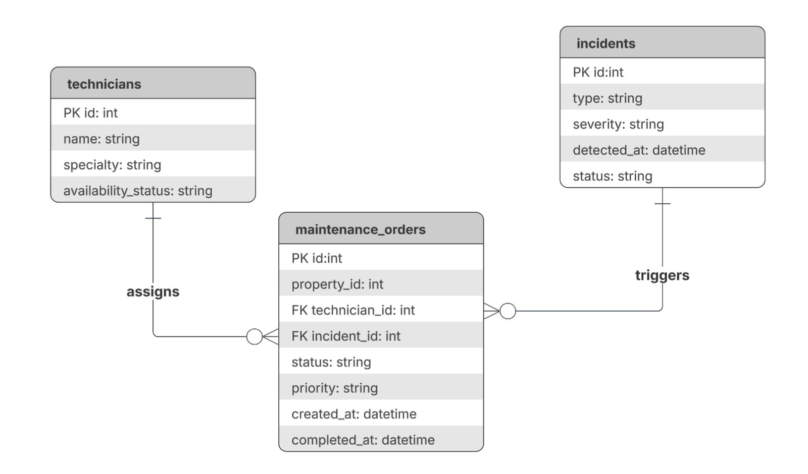

## 4.2.5. Bounded Context: Subscriptions & Payment Management

En este bounded context se gestiona la monetización SaaS de la plataforma Nexora, incluyendo el ciclo de vida de suscripciones corporativas, la facturación recurrente por uso y la integración con la pasarela de pagos externa Culqi.

### 4.2.5.1. Domain Layer

En la capa de dominio se definen las clases centrales que representan el núcleo del sistema de suscripciones y pagos, junto con las reglas de negocio del bounded context.

#### Entities

•⁠  ⁠*Subscription:* Representa la suscripción activa de una cuenta corporativa. Incluye atributos como ⁠ id ⁠, ⁠ accountId ⁠, ⁠ planId ⁠, ⁠ startDate ⁠, ⁠ renewalDate ⁠, ⁠ status ⁠ y ⁠ activeUnitCount ⁠, que almacenan el estado actual del contrato entre el cliente y la plataforma.
•⁠  ⁠*Invoice:* Representa una factura generada al cierre de un Billing Cycle. Incluye atributos como ⁠ id ⁠, ⁠ subscriptionId ⁠, ⁠ amount ⁠, ⁠ issuedDate ⁠, ⁠ dueDate ⁠ y ⁠ status ⁠, que registran el cobro correspondiente a un período de facturación.
•⁠  ⁠*BillingAccount:* Cuenta de facturación asociada a un Property Manager o Real Estate Company. Contiene atributos como ⁠ id ⁠, ⁠ ownerId ⁠, ⁠ ownerType ⁠, ⁠ culqiCustomerId ⁠ y ⁠ defaultPaymentMethodToken ⁠, que identifican al cliente y su método de pago registrado en Culqi.

#### Value Objects

•⁠  ⁠*SaaSPlan:* Define el tier de suscripción (Basic, Professional, Enterprise) junto con el precio unitario por Smart Unit activa y el intervalo de facturación.
•⁠  ⁠*BillingCycle:* Encapsula el período de facturación con su fecha de inicio y fin, y la cantidad de unidades activas registradas al cierre del período.
•⁠  ⁠*UsageQuota:* Representa la cantidad de Smart Units activas en un período determinado, consumida desde el Resource & Asset Management Bounded Context.
•⁠  ⁠*SubscriptionStatus:* Define el estado de la suscripción mediante una enumeración: ⁠ Active ⁠, ⁠ Overdue ⁠, ⁠ Suspended ⁠ y ⁠ Cancelled ⁠.
•⁠  ⁠*InvoiceStatus:* Define el estado de la factura mediante una enumeración: ⁠ Pending ⁠, ⁠ Paid ⁠, ⁠ Failed ⁠ y ⁠ Refunded ⁠.
•⁠  ⁠*Money:* Encapsula el monto y la moneda (⁠ PEN ⁠/⁠ USD ⁠) de cualquier valor monetario en el dominio.

#### Aggregates

•⁠  ⁠*SubscriptionAggregate:* Raíz de agregado principal. Encapsula ⁠ Subscription ⁠, ⁠ SaaSPlan ⁠, ⁠ BillingCycle ⁠ y la lista de ⁠ Invoice ⁠ asociadas. Controla las transiciones de estado, aplica las reglas de negocio de acceso y expone operaciones como ⁠ changePlan() ⁠, ⁠ updateUsage() ⁠, ⁠ restrict() ⁠ y ⁠ cancel() ⁠.
•⁠  ⁠*BillingAccountAggregate:* Encapsula ⁠ BillingAccount ⁠ y el token de método de pago. Gestiona la identidad del cliente en Culqi y expone operaciones como ⁠ updatePaymentToken() ⁠ y ⁠ updateCulqiId() ⁠.

#### Domain Events

•⁠  ⁠⁠ InvoiceGeneratedEvent ⁠: Disparado cuando se genera una nueva factura al cierre del ciclo de facturación.
•⁠  ⁠⁠ SubscriptionExpiredEvent ⁠: Disparado cuando una suscripción es suspendida por falta de pago.
•⁠  ⁠⁠ PlanChangedEvent ⁠: Disparado cuando el cliente cambia de tier de suscripción.
•⁠  ⁠⁠ PaymentFailedEvent ⁠: Disparado cuando un intento de cobro a través de Culqi no se procesa correctamente.
•⁠  ⁠⁠ AccessRestrictedEvent ⁠: Disparado cuando se restringe el acceso al Dashboard analítico por mora en el pago.

#### Repositories (Interfaces)

•⁠  ⁠*ISubscriptionRepository:* Define los métodos ⁠ findById() ⁠, ⁠ findByAccountId() ⁠, ⁠ save() ⁠ y ⁠ delete() ⁠ para gestionar la persistencia del ⁠ SubscriptionAggregate ⁠.
•⁠  ⁠*IInvoiceRepository:* Define los métodos ⁠ findById() ⁠, ⁠ findBySubscription() ⁠, ⁠ save() ⁠ y ⁠ listOverdue() ⁠ para gestionar la persistencia de ⁠ Invoice ⁠.
•⁠  ⁠*IBillingAccountRepository:* Define los métodos ⁠ findById() ⁠, ⁠ findByOwner() ⁠, ⁠ save() ⁠ y ⁠ delete() ⁠ para gestionar la persistencia del ⁠ BillingAccountAggregate ⁠.

---

### 4.2.5.2. Interface Layer

Esta capa expone las funcionalidades del bounded context a través de controladores que manejan las solicitudes HTTP provenientes de la Nexora Mobile App y la Nexora Web App, así como los callbacks externos de Culqi.

#### Controllers

•⁠  ⁠*SubscriptionController:* Maneja las solicitudes relacionadas con el ciclo de vida de suscripciones.
  - *Métodos:*
    - ⁠ createSubscription ⁠: Crea una nueva suscripción para una billing account.
    - ⁠ changePlan ⁠: Actualiza el tier de suscripción de una cuenta.
    - ⁠ cancelSubscription ⁠: Cancela una suscripción activa.
    - ⁠ getSubscriptionStatus ⁠: Consulta el estado actual de una suscripción.

•⁠  ⁠*BillingController:* Maneja las solicitudes relacionadas con facturas y ciclos de facturación.
  - *Métodos:*
    - ⁠ getCurrentInvoice ⁠: Obtiene la factura del período en curso.
    - ⁠ getInvoiceHistory ⁠: Lista el historial de facturas de una suscripción.
    - ⁠ triggerManualBilling ⁠: Permite a un administrador disparar manualmente el ciclo de facturación.

•⁠  ⁠*WebhookController:* Recibe y valida los callbacks asincrónicos enviados por Culqi tras el procesamiento de un cobro.
  - *Métodos:*
    - ⁠ handleCulqiWebhook ⁠: Parsea el payload del webhook, valida la firma de Culqi y delega el resultado al ⁠ PaymentResultHandler ⁠.

---

### 4.2.5.3. Application Layer

La capa de aplicación orquesta los flujos de negocio y coordina la interacción entre la capa de dominio y la infraestructura. Al tratarse de una arquitectura monolítica, la comunicación entre componentes se realiza mediante llamadas directas en proceso.

#### Services

•⁠  ⁠*SubscriptionAppService:* Orquesta las operaciones del ciclo de vida de suscripciones: creación, cambio de plan y cancelación. Coordina el ⁠ SubscriptionAggregate ⁠, el ⁠ BillingAccountAggregate ⁠ y el ⁠ SubscriptionRepository ⁠.
•⁠  ⁠*BillingEngineService:* Ejecuta el ciclo de facturación mensual. Consulta el ⁠ UsageQuota ⁠ actual a través del ⁠ UsageMetricsService ⁠, calcula el monto de la ⁠ Invoice ⁠ multiplicando las unidades activas por el precio unitario del ⁠ SaaSPlan ⁠, y coordina el cobro con el ⁠ CulqiPaymentAdapter ⁠.
•⁠  ⁠*UsageMetricsService:* Consulta la cantidad de Smart Units activas por cuenta directamente al bounded context Resource & Asset Management mediante llamadas HTTP REST, y actualiza el ⁠ UsageQuota ⁠ correspondiente en el ⁠ SubscriptionAggregate ⁠.
•⁠  ⁠*AccessControlService:* Evalúa el estado de pago de la suscripción y aplica la regla de negocio principal: restringe el acceso al Dashboard analítico en cuentas con mora, manteniendo activo el sistema de alertas críticas de seguridad. Notifica al bounded context Service Monitoring & Intelligence mediante llamada HTTP REST.

#### Event Handlers

•⁠  ⁠*PaymentResultHandler:* Procesa el resultado recibido del webhook de Culqi a través del ⁠ WebhookController ⁠. Actualiza el estado de la ⁠ Invoice ⁠ y de la ⁠ Subscription ⁠ en el ⁠ SubscriptionAggregate ⁠ y notifica al ⁠ AccessControlService ⁠ para que evalúe el estado de acceso.

---

### 4.2.5.4. Infrastructure Layer

En esta capa se implementan los repositorios y los adaptadores externos que integran el bounded context con sistemas de terceros.

#### Repositories (Implementaciones)

•⁠  ⁠*SubscriptionRepositoryImpl:* Implementa ⁠ ISubscriptionRepository ⁠ sobre PostgreSQL mediante Entity Framework Core. Gestiona la persistencia y consulta del ⁠ SubscriptionAggregate ⁠ y sus facturas asociadas en la base de datos compartida Nexora DB.
•⁠  ⁠*InvoiceRepositoryImpl:* Implementa ⁠ IInvoiceRepository ⁠ sobre PostgreSQL. Gestiona la persistencia de ⁠ Invoice ⁠ y expone consultas de facturas vencidas para el proceso de cobro.
•⁠  ⁠*BillingAccountRepositoryImpl:* Implementa ⁠ IBillingAccountRepository ⁠ sobre PostgreSQL. Gestiona la persistencia del ⁠ BillingAccountAggregate ⁠ y los tokens de pago en la Nexora DB.

#### Adapters

•⁠  ⁠*CulqiPaymentAdapter:* Implementa la integración con la pasarela de pagos Culqi actuando como Anti-Corruption Layer. Abstrae las operaciones de tokenización de tarjetas, cobro recurrente, reembolsos y el parseo de webhooks, aislando el dominio de los detalles del proveedor externo.
  - *Métodos:*
    - ⁠ tokenizeCard ⁠: Tokeniza los datos de la tarjeta del cliente a través de la API de Culqi.
    - ⁠ chargeRecurring ⁠: Ejecuta un cobro recurrente sobre el token almacenado en el ⁠ BillingAccount ⁠.
    - ⁠ refund ⁠: Procesa el reembolso de un cobro previamente procesado.
    - ⁠ parseWebhook ⁠: Valida la firma y parsea el payload de los callbacks enviados por Culqi.

---

### 4.2.5.5. Bounded Context Software Architecture Component Level Diagrams

-⁠  ⁠**Nexora Mobile App:** Aplicación móvil Flutter utilizada por Property Managers para gestionar suscripciones y consultar el historial de facturación.
-⁠  ⁠**Nexora Web App:** Aplicación web utilizada por Property Managers para gestionar suscripciones y consultar el historial de facturación desde un navegador.
- **Subscription Controller:** Gestiona las operaciones del ciclo de vida de suscripciones: creación, cambio de plan, cancelación y consulta de estado.
- **Billing Controller:** Gestiona la consulta de facturas y el disparo manual del ciclo de facturación para administradores.
- **Webhook Controller:** Recibe y valida los callbacks asincrónicos de Culqi, delegando el resultado al Payment Result Event Handler.
- **Subscription App Service:** Orquesta los comandos del ciclo de vida de suscripciones coordinando el dominio y la infraestructura.
- **Billing Engine Service:** Ejecuta el ciclo de facturación mensual calculando el monto de la Invoice a partir del UsageQuota y el SaaSPlan, y coordinando el cobro con el Culqi Payment Adapter.
- **Access Control Service:** Aplica la regla de negocio de restricción de acceso al Dashboard por mora, manteniendo activas las alertas críticas de seguridad.
- **Usage Metrics Event Handler:** Consume eventos del Resource BC y actualiza el UsageQuota por cuenta en el SubscriptionAggregate.
- **Payment Result Event Handler:** Procesa el resultado del webhook de Culqi y actualiza el estado de Invoice y Subscription.
- **Culqi Payment Adapter:** Anti-Corruption Layer que abstrae la comunicación con la API REST de Culqi.
- **Subscription Repository:** Gestiona la persistencia de los agregados de suscripción, factura y billing account sobre PostgreSQL.


---

### 4.2.5.6. Bounded Context Software Architecture Code Level Diagrams

#### 4.2.5.6.1. Bounded Context Domain Layer Class Diagrams

El diagrama de clases refleja las dos raíces de agregado del bounded context. `SubscriptionAggregate` es la raíz principal y encapsula la entidad `Subscription` junto con los value objects `SaaSPlan`, `BillingCycle`, `UsageQuota` y `SubscriptionStatus`, además de la lista de entidades `Invoice` mediante una relación de composición. `BillingAccountAggregate` encapsula la cuenta de facturación y su token de pago en Culqi.

- **SubscriptionAggregate:** Raíz de agregado principal. Controla el ciclo de vida completo de la suscripción y aplica todas las invariantes del dominio.
- **BillingAccountAggregate:** Gestiona la identidad financiera del cliente y su vinculación con Culqi.
- **Invoice:** Entidad que representa la factura generada por cada ciclo de facturación.
- **SaaSPlan, BillingCycle, UsageQuota, SubscriptionStatus, InvoiceStatus, Money:** Value objects inmutables que encapsulan conceptos del dominio sin identidad propia.
- **ISubscriptionRepository, IInvoiceRepository, IBillingAccountRepository:** Interfaces que abstraen la persistencia de los agregados hacia la capa de infraestructura.


#### 4.2.5.6.2. Bounded Context Database Design Diagram

El modelo relacional está compuesto por seis tablas. `billing_account` actúa como raíz del modelo financiero y se relaciona con `subscription` en una relación de uno a muchos. Cada `subscription` genera uno o más registros en `billing_cycle` por cada período de facturación, y uno o más registros en `invoice` a lo largo de su vida. Cada `billing_cycle` produce exactamente una `invoice` en una relación de uno a uno. Las `invoice` pueden tener uno o más registros en `payment_attempt`, que registran cada intento de cobro realizado a través de Culqi.

Las relaciones entre tablas son las siguientes:

- `billing_account` `1` ────► `N` `subscription`: Una billing account puede tener una o más subscriptions.
- `subscription` `1` ────► `N` `billing_cycle`: Una subscription genera uno o más billing cycles.
- `subscription` `1` ────► `N` `invoice`: Una subscription acumula una o más invoices.
- `billing_cycle` `1` ────► `1` `invoice`: Cada billing cycle produce exactamente una invoice.
- `invoice` `1` ────► `N` `payment_attempt`: Una invoice puede tener uno o más payment attempts.


# Capítulo V: Solution UI/UX Design
## 5.1. Style Guidelines
### 5.1.1. General Style Guidelines

En esta sección se establecen los lineamientos visuales y comunicacionales que guiarán el diseño de Nexora, asegurando coherencia en todos los puntos de contacto con el usuario. Estas decisiones están fundamentadas en la naturaleza tecnológica del producto, su enfoque en eficiencia operativa y su rol dentro del ecosistema inmobiliario inteligente.

El sistema de diseño toma como referencia principios de **Material Design** y **Human-Centered Design**, adaptados al contexto de plataformas IoT y dashboards de monitoreo en tiempo real, donde la claridad, jerarquía visual y respuesta rápida son esenciales.

<br>

---

#### **Branding**

El branding de Nexora está diseñado para reflejar una **marca tecnológica, confiable y orientada a la eficiencia**, alineada con su propuesta de valor basada en automatización, análisis de datos y conectividad inteligente.

Se construye sobre cuatro pilares fundamentales:

1. **Tecnología accesible:**
   Nexora traduce la complejidad del IoT en una experiencia simple, intuitiva y comprensible para usuarios no técnicos.

2. **Eficiencia operativa:**
   La identidad visual transmite orden, precisión y optimización, atributos clave para administradores de propiedades.

3. **Seguridad y confianza:**
   Se priorizan elementos visuales sólidos y estructurados que generen credibilidad en el manejo de datos y control de inmuebles.

4. **Innovación sostenible:**
   La marca comunica modernidad sin perder responsabilidad ambiental, alineándose con la eficiencia energética.

<br>

---

#### **Logo**


<br>

El logotipo de Nexora representa visualmente la **dirección, conectividad y flujo de datos** dentro de un ecosistema inteligente.

**Elementos clave:**

1. **Flecha ascendente:**
   Simboliza progreso, optimización y crecimiento, alineado con la mejora continua en la gestión inmobiliaria.

2. **Líneas internas paralelas:**
   Representan los flujos de datos y la comunicación entre dispositivos IoT, evocando conectividad y sincronización.

3. **Forma angular:**
   Refuerza una estética tecnológica, moderna y dinámica, asociada a sistemas digitales y precisión.

4. **Color naranja predominante:**
   Introduce energía e innovación, diferenciando la marca dentro de un sector tradicionalmente sobrio como el inmobiliario.

*El logo sintetiza la esencia de Nexora: transformar datos en decisiones inteligentes.*

<br>

---

#### **Favicon**

El favicon es una simplificación del logotipo, manteniendo la **flecha característica** como elemento principal.

Esto permite mantener reconocimiento de marca incluso en interfaces mínimas como pestañas del navegador o aplicaciones móviles.

<br>

---

#### **Tipografía**

La selección tipográfica de Nexora responde a la necesidad de equilibrar **expresividad visual y funcionalidad**, en coherencia con los principios de diseño centrados en el usuario y la naturaleza tecnológica de la plataforma.

Se adopta una combinación de dos tipografías: **Exo 2** para títulos e **Inter** para contenido y componentes de interfaz. Esta decisión se fundamenta en criterios de **jerarquía visual, legibilidad en entornos digitales y coherencia con el branding tecnológico** del sistema.

<br>

**Exo 2 — Títulos y encabezados**


Se emplea en títulos y encabezados debido a su carácter geométrico y contemporáneo, que refuerza la percepción de innovación, precisión y modernidad.

* Aporta personalidad y diferenciación visual.
* Mejora la identificación de secciones clave.
* Refuerza el carácter tecnológico de la plataforma.

<br>

**Inter — Texto y componentes UI**


Se utiliza como tipografía base para textos, labels y elementos funcionales de la interfaz, priorizando claridad y eficiencia en la lectura.

* Alta legibilidad en pantallas y tamaños pequeños.
* Ideal para dashboards, métricas y contenido continuo.
* Reduce la carga cognitiva del usuario.

<br>

---

**Síntesis de la decisión tipográfica**

La combinación de ambas tipografías permite:

* Establecer una **jerarquía visual clara** entre títulos y contenido.
* Garantizar **legibilidad y accesibilidad** en distintos dispositivos.
* Mantener una **experiencia consistente y eficiente**.
* Reforzar el **carácter tecnológico y profesional** de la marca.

<br>

---

#### **Colores**


La paleta de Nexora está diseñada para equilibrar **tecnología, confianza y dinamismo**, combinando tonos neutros con un color acento fuerte.

##### **Colores principales:**

1. **Naranja (#ff7300) – Color primario**

   * Representa innovación, energía y acción.
   * Se utiliza en botones principales, indicadores activos y elementos clave de interacción.

2. **Azul profundo (#173183) – Color secundario**

   * Transmite confianza, estabilidad y tecnología.
   * Ideal para dashboards, encabezados y elementos estructurales.

##### **Colores neutros:**

3. **Gris claro (#f5f7f2)**

   * Fondo principal, aporta limpieza visual.

4. **Gris oscuro (#2f2f2f)**

   * Texto principal, alto contraste y legibilidad.

---

##### **Principios de uso del color:**

* **Jerarquía visual clara:** El naranja se reserva para acciones clave (CTA).
* **Contraste funcional:** Garantiza accesibilidad (WCAG).
* **Consistencia:** Cada color cumple un rol definido dentro del sistema.
* **Feedback visual:**

  * Naranja → acción / activo
  * Azul → información / estructura
  * Gris → neutral / fondo

<br>

---

#### **Spacing (Espaciado)**

Se adopta un sistema de espaciado basado en una **escala de 8px**, estándar en diseño de interfaces modernas.

**Escala base:**

* 4px (micro espacio)
* 8px (base)
* 16px (espacio estándar)
* 24px (secciones)
* 32px – 48px (bloques grandes)

**Principios:**

* **Consistencia:** mantiene orden visual en dashboards complejos.
* **Respiración visual:** evita sobrecarga de información.
* **Escalabilidad:** facilita diseño responsive en distintos dispositivos.

<br>

---

#### **Tono de Comunicación**

El tono de Nexora responde a un equilibrio entre tecnología avanzada y facilidad de uso, considerando que sus usuarios incluyen tanto perfiles técnicos como no técnicos.

1. **Serio, pero accesible:**
   Se comunica profesionalismo sin caer en tecnicismos innecesarios.

2. **Formal, pero claro:**
   Lenguaje estructurado, directo y comprensible.

3. **Respetuoso y confiable:**
   Refuerza la seguridad en el manejo de datos e infraestructura.

4. **Sereno y orientado a soluciones:**
   Evita alarmismo; prioriza claridad y control ante incidencias.

5. **Preciso y funcional:**
   Cada mensaje tiene un propósito: informar, alertar o guiar acciones.

<br>

---

#### **Principios de Diseño Aplicados**

**Las decisiones de diseño de Nexora se fundamentan en principios consolidados del diseño centrado en el usuario (*Human-Centered Design*) y en estándares internacionales de usabilidad, como la norma ISO 9241, así como en las heurísticas de usabilidad propuestas por Jakob Nielsen.** Estos lineamientos permiten garantizar una experiencia eficiente, comprensible y consistente en entornos de alta demanda informativa, como los sistemas de monitoreo IoT.

- **Usabilidad primero:**
Siguiendo los principios de la ingeniería de usabilidad, el sistema prioriza la facilidad de aprendizaje (*learnability*) y la eficiencia de uso (*efficiency*). Las interfaces están diseñadas para ser intuitivas desde el primer contacto, utilizando patrones de interacción reconocibles y reduciendo la carga cognitiva del usuario. Esto resulta clave en contextos donde los usuarios no necesariamente poseen conocimientos técnicos avanzados.

- **Visibilidad del estado del sistema:**
En concordancia con una de las heurísticas principales de Nielsen, Nexora garantiza que el sistema mantenga informado al usuario en todo momento. Los estados de dispositivos, alertas y métricas se presentan en tiempo real mediante indicadores claros y actualizados, permitiendo una supervisión constante sin ambigüedad.

- **Feedback inmediato:**
Toda acción del usuario genera una respuesta perceptible por parte del sistema en un tiempo adecuado. Este principio refuerza la percepción de control y confiabilidad, elementos fundamentales en plataformas de gestión operativa. El feedback se implementa a través de cambios visuales, notificaciones y confirmaciones de acción.

- **Jerarquía visual y diseño de la información:**
La organización de la interfaz responde a principios de arquitectura de la información y percepción visual. Se priorizan los elementos críticos mediante el uso estratégico de color, tamaño, contraste y posición, facilitando el escaneo rápido de la información. Esto es especialmente relevante en dashboards donde se manejan múltiples fuentes de datos simultáneamente.

- **Minimalismo funcional:**
Inspirado en el principio de “estética y diseño minimalista” de Nielsen, se eliminan elementos innecesarios que no aportan valor a la tarea del usuario. Este enfoque reduce la sobrecarga cognitiva y mejora la claridad general de la interfaz, permitiendo que el usuario se concentre en la información y acciones relevantes.

- **Accesibilidad:**
El diseño considera criterios de accesibilidad basados en las pautas WCAG, asegurando niveles adecuados de contraste, legibilidad tipográfica y estructura visual. Esto permite que la plataforma sea utilizable por una mayor diversidad de usuarios, incluyendo aquellos con limitaciones visuales o en condiciones de uso adversas.

- **Consistencia y estándares:**
Se mantiene coherencia en todos los componentes y patrones de interacción, siguiendo convenciones ampliamente adoptadas en diseño de interfaces. La consistencia reduce la necesidad de reaprendizaje y minimiza errores, alineándose con el principio de “consistencia y estándares” de Nielsen.

- **Eficiencia en la interacción:**
El sistema optimiza los flujos de trabajo mediante la reducción de pasos innecesarios y la priorización de acciones frecuentes. Esto responde al principio de flexibilidad y eficiencia de uso, permitiendo que tanto usuarios novatos como expertos interactúen con el sistema de manera productiva.

### 5.1.2. Web, Mobile and IoT Style Guide

En esta sección se definen los lineamientos específicos de diseño e interacción para los distintos puntos de contacto del ecosistema **Nexora**, asegurando coherencia con los **General Style Guidelines** previamente establecidos y adaptando la experiencia a las particularidades de cada entorno: web, mobile e interfaces físicas IoT.

Estos lineamientos serán materializados y centralizados en un **Design System en Figma**, que funcionará como repositorio vivo de componentes, patrones y prototipos interactivos, facilitando la colaboración entre equipos de diseño y desarrollo.

---

#### **5.1.2.1. Web Style Guidelines (Aplicación Web - Arrendadores)**

La aplicación web está orientada principalmente a **administradores de propiedades (arrendadores)**, quienes requieren gestionar múltiples inmuebles, monitorear métricas y tomar decisiones operativas.

##### **Enfoque de diseño**

El diseño web prioriza:

* Alta densidad de información controlada
* Visualización estructurada tipo dashboard
* Eficiencia en tareas recurrentes
* Escalabilidad para múltiples propiedades

---

##### **Estructura de interfaz**

Se adopta un patrón de **Dashboard Layout**:

* **Sidebar lateral (izquierda):**

  * Navegación principal (Inicio, Propiedades, Dispositivos, Alertas, Reportes, Configuración, Suscripción, Ayuda)
  * Íconos + texto (colapsable)

<br>


<br>

* **Topbar superior:**

  * Búsqueda global
  * Notificaciones
  * Perfil de usuario

<br>


* **Main Content:**

  * Visualización dinámica según módulo seleccionado

<br>

---

##### **Componentes clave**

1. **Cards de métricas**

   * Uso de KPIs: consumo energético, estado de dispositivos, incidencias
   * Colores:

     * Azul → información
     * Naranja → acción/alerta leve
     * Rojo (derivado) → error crítico

2. **Tablas inteligentes**

   * Ordenamiento, filtros, búsqueda
   * Paginación optimizada
   * Acciones rápidas (editar, ver, eliminar)

3. **Gráficos y visualización**

   * Line charts → consumo en el tiempo
   * Bar charts → comparativas por unidad
   * Pie charts → distribución de dispositivos

4. **Estados visuales**

   * Online → indicador verde
   * Offline → gris
   * Error → rojo

<br>

---

##### **Interacciones**

* Hover states claros en botones y filas
* Feedback inmediato en acciones CRUD
* Confirmaciones para acciones críticas
* Uso de modales para edición rápida

<br>

---

##### **Responsive Design**

* Breakpoints:

  * Desktop ≥ 1280px
  * Tablet ≥ 768px
  
* Sidebar colapsable en tablet
* Priorización de métricas clave en pantallas pequeñas

<br>

---

##### **Principios aplicados**

* **Optimización cognitiva:** organización jerárquica
* **Scan rápido:** uso de patrones visuales repetitivos
* **Eficiencia operativa:** reducción de clics

---

#### **5.1.2.2. Mobile Style Guidelines (Aplicación Móvil - Arrendatarios)**

La aplicación móvil está orientada a **inquilinos (arrendatarios)**, cuyo objetivo principal es el **control de dispositivos IoT** de manera rápida, simple e intuitiva.

<br>

---

##### **Enfoque de diseño**

El diseño mobile prioriza:

* Simplicidad extrema
* Acciones rápidas (1–2 taps)
* **Interacción táctil intuitiva
* Contexto en tiempo real

---

##### **Estructura de navegación**

Se adopta un patrón de **Bottom Navigation**:

* Inicio
* Dispositivos
* Automatizaciones
* Notificaciones
* Perfil

<br>


<br>

---

##### **Pantallas clave**

1. **Home (Dashboard simplificado)**

   * Estado general del hogar
   * Accesos rápidos (luces, clima, seguridad)

2. **Control de dispositivos**

   * Cards interactivas:

     * Switch (on/off)
     * Slider (intensidad, temperatura)
     * Botones de acción

3. **Automatizaciones**

   * Creación de reglas:

     * “Si X → entonces Y”
   * Ejemplo:

     * Si no hay movimiento → apagar luces

4. **Alertas**

   * Notificaciones push
   * Historial de eventos

<br>

---

##### **Patrones de interacción**

* **Gestos táctiles:**

  * Swipe → navegación
  * Tap → acción
  * Long press → configuración avanzada

* **Feedback inmediato:**

  * Animaciones suaves (150–300ms)
  * Cambio de estado visual instantáneo

<br>

---

##### **Componentes clave**

* Toggles grandes (uso con pulgar)
* Botones con alto contraste (naranja)
* Cards con sombras suaves (elevación)

<br>

---

##### **Accesibilidad**

* Tamaño mínimo táctil: 48px
* Alto contraste
* Uso de iconografía clara

<br>

---

##### **Principios aplicados**

* Mobile-first
* Minimización de esfuerzo
* Control en tiempo real

<br>

---

#### **5.1.2.3. IoT Style Guidelines (Interfaz de Dispositivos Físicos)**

Esta sección define los lineamientos para la interacción con **dispositivos físicos IoT** dentro del ecosistema Nexora.

A diferencia de web y mobile, aquí se consideran **interfaces embebidas y comportamiento físico-digital**.

<br>

---

##### **Enfoque de diseño**

* Interacción mínima
* Feedback inmediato físico/visual
* Alta claridad de estado
* Bajo margen de error

<br>

---

##### **Tipos de interfaz IoT**

1. **Interfaces sin pantalla**

   * LEDs
   * Botones físicos
   * Indicadores sonoros

2. **Interfaces con pantalla**

   * Displays pequeños (LCD/OLED)
   * Paneles táctiles básicos

<br>

---

##### **Estándares de feedback**

**Colores LED:**

* Verde → operativo / conectado
* Naranja → proceso / transición
* Rojo → error / alerta
* Azul → sincronización

<br>


<br>

---

##### **Interacciones físicas**

* **Botón único**

  * Tap → acción primaria (encender/apagar)
  * Long press → reset o emparejamiento

* **Botones múltiples**

  * Separación clara por función
  * Etiquetado físico o iconográfico

<br>

---

##### **Sincronización con App**

* Cada acción física debe reflejarse en:

  * App móvil
  * Plataforma web

* Latencia máxima aceptable:

  * < 1 segundo (ideal)

<br>

---

##### **Estados del dispositivo**

* Conectado
* Desconectado
* En sincronización
* Error técnico
* Bajo nivel de batería

Todos deben ser visibles mediante:

* LED
* App móvil
* Web dashboard

<br>

---

##### **Principios de diseño IoT**

* Visibilidad del estado
* Redundancia de feedback (visual + digital)
* Robustez operativa
* Consistencia cross-platform

<br>

---

#### **5.1.2.4. Implementación en Figma (Design System Nexora)**

Para garantizar consistencia y escalabilidad, todos los lineamientos serán implementados en un **Design System centralizado en Figma**, que incluirá:

<br>

##### **Librerías compartidas**

* Componentes UI (botones, inputs, cards)
* Iconografía
* Tipografía (Exo 2, Inter)
* Colores y tokens de diseño

<br>

---

##### **Sistemas definidos**

1. **Web Design System**

   * Dashboards
   * Tablas
   * Gráficos

2. **Mobile Design System**

   * Navegación
   * Componentes táctiles
   * Microinteracciones

3. **IoT Interaction System**

   * Estados de dispositivos
   * Flujos de emparejamiento
   * Feedback visual

<br>

---

##### **Prototipos**

* Flujos completos:

  * Registro
  * Vinculación de dispositivos
  * Gestión de propiedades
  * Control IoT

<br>

---

##### **Beneficios**

* Consistencia visual total
* Reducción de errores en desarrollo
* Escalabilidad del producto
* Mejor comunicación entre equipos

## 5.2. Information Architecture

### 5.2.1 Organizations Systems

En esta sección se define cómo se organiza la información dentro del sistema Nexora, considerando tanto la estructura visual del contenido como los esquemas de categorización aplicados. Estas decisiones responden a la necesidad de gestionar grandes volúmenes de datos en tiempo real en un entorno IoT aplicado al sector inmobiliario, garantizando claridad, accesibilidad y eficiencia en la interacción para los dos segmentos principales: arrendadores y arrendatarios.

---

#### **Organización visual del contenido**

La organización visual en Nexora se basa en tres enfoques principales: jerárquico, secuencial y matricial. Cada uno se aplica según el tipo de interacción y la naturaleza de la información.

---

#### **a) Organización jerárquica (Visual Hierarchy)**

La organización jerárquica constituye la base estructural del sistema, especialmente en dashboards y vistas generales. La información se presenta en niveles de prioridad, destacando en primer lugar los elementos críticos, como alertas en tiempo real, estados de dispositivos IoT y métricas clave, seguidos de información secundaria como históricos, configuraciones o detalles adicionales.

Esta jerarquía se adapta según el tipo de usuario:

* **Arrendadores:** se prioriza una visión global del estado de múltiples propiedades, resaltando alertas críticas, indicadores de consumo y métricas comparativas.  
* **Arrendatarios:** se prioriza la información individual, como consumo de su unidad, notificaciones relevantes y estado de dispositivos específicos.

El uso de colores definidos en el sistema (por ejemplo, naranja para acciones clave o alertas) y la tipografía establecida refuerzan esta jerarquía, permitiendo una rápida identificación de la información relevante y reduciendo la carga cognitiva del usuario.

#### **b) Organización secuencial (Step-by-step)**

La organización secuencial se aplica en procesos que requieren una interacción guiada mediante pasos consecutivos. Este enfoque es clave para garantizar una experiencia clara y sin errores, especialmente en usuarios no técnicos.

En Nexora, se utiliza en flujos como:

* Registro y configuración inicial del sistema  
* Vinculación de dispositivos IoT  
* Configuración de alertas y notificaciones  
* Reporte y gestión de incidencias

Cada proceso se estructura en etapas definidas que conducen al usuario desde la entrada de datos hasta la confirmación de la acción, reforzando la percepción de control y siguiendo los principios de diseño centrado en el usuario.

#### **c) Organización matricial**

La organización matricial se emplea en contextos donde es necesario visualizar múltiples variables de forma simultánea y comparativa.

En Nexora, se aplica principalmente en:

* Reportes de consumo energético  
* Historial de eventos y alertas  
* Gestión de múltiples propiedades o dispositivos

La información se presenta en tablas o dashboards estructurados que permiten cruzar datos como fecha, tipo de incidencia, ubicación y estado del dispositivo.

Este tipo de organización tiene mayor relevancia para los **arrendadores**, quienes requieren analizar múltiples unidades de manera simultánea, mientras que en los **arrendatarios** su uso es más limitado, priorizando vistas simplificadas centradas en su propia unidad.

---

#### **Sistemas de categorización de contenido**

Complementando la organización visual, Nexora utiliza distintos esquemas de categorización que permiten agrupar la información de manera lógica e intuitiva.

---

#### **a) Categorización por tópicos**

Este es el esquema principal del sistema. La información se organiza en módulos funcionales que responden a las principales tareas del usuario, tales como:

* Monitoreo de consumo  
* Seguridad y alertas  
* Gestión de incidencias  
* Dispositivos IoT  
* Reportes y análisis

Esta estructura permite una navegación intuitiva, ya que los usuarios identifican rápidamente la funcionalidad que necesitan según su objetivo.

#### **b) Categorización por audiencia**

Dado que Nexora se orienta a dos segmentos principales, se implementa una categorización por audiencia que adapta la estructura y presentación del contenido según el rol del usuario:

* **Arrendadores:** acceden a una vista global de sus propiedades, con herramientas de monitoreo, análisis comparativo y supervisión de múltiples dispositivos.  
* **Arrendatarios:** acceden a información específica de su unidad, incluyendo consumo individual, alertas personalizadas y funcionalidades de reporte de incidencias.

Esta diferenciación permite personalizar la experiencia de usuario, evitando la sobrecarga de información y asegurando que cada perfil interactúe únicamente con contenido relevante.

#### **c) Categorización cronológica**

La organización cronológica se utiliza en elementos donde el factor tiempo es determinante, como:

* Historial de eventos  
* Registro de alertas  
* Reportes de consumo

La información se presenta desde los eventos más recientes hasta los más antiguos, permitiendo a los usuarios comprender la evolución del sistema y detectar patrones de comportamiento.

#### **d) Categorización alfabética**

La categorización alfabética se aplica en listados específicos, como propiedades o dispositivos, facilitando la búsqueda rápida cuando se manejan múltiples elementos dentro del sistema.


## 5.2.2 Labeling Systems

En esta sección se especifica el sistema de etiquetado de Nexora, diseñado bajo principios de simplicidad y eficiencia cognitiva. El equipo ha seleccionado etiquetas con el **mínimo número de palabras** para evitar la confusión y permitir una reacción inmediata ante datos críticos provenientes de sensores IoT.

### **Representación de Datos y Simplicidad**

Para garantizar que los usuarios (arrendadores e inquilinos) procesen la información sin ambigüedades, se utilizan etiquetas que actúan como "anclas mentales". Cada etiqueta representa un conjunto de información o una funcionalidad específica sin necesidad de sobrecargar la interfaz con descripciones extensas.

---

### **Etiquetas de Navegación y Sistemas**

Estas etiquetas permiten al usuario asociar secciones completas de la aplicación con un solo concepto.

| Etiqueta | Conjunto de Información Asociado |
| :--- | :--- |
| **Inicio** | Estado general de la vivienda o cartera de propiedades. |
| **Gas** | Niveles actuales, estado de la válvula y alertas de fuga. |
| **Aire** | Calidad ambiental, niveles de CO2 y humedad. |
| **Alertas** | Registro de eventos críticos, preventivos y fallas de conexión. |
| **Propiedades** | Ubicación, detalles del inmueble e información del contrato. |
| **Pagos** | Historial de facturación, estado de suscripción y métodos de pago. |
| **Ajustes** | Configuración de perfil, umbrales de sensores y seguridad. |

---

### **Etiquetas de Acción y Control**

Verbos directos que disparan asociaciones funcionales inmediatas.

| Etiqueta | Asociación de Funcionalidad |
| :--- | :--- |
| **Cerrar** | Interrupción inmediata del flujo (Válvula/Gas). |
| **Abrir** | Restablecimiento del flujo o acceso. |
| **Ventilar** | Activación de sistemas de extracción de aire. |
| **Exportar** | Generación y descarga de documentos (PDF/CSV). |
| **Vincular** | Proceso de emparejamiento de hardware IoT. |
| **Soporte** | Acceso a canales de ayuda, FAQ y contacto técnico. |

---

### **Etiquetas de Estado (Feedback Visual)**

Palabras únicas que sintetizan condiciones complejas de los sensores.

| Etiqueta | Condición del Sistema |
| :--- | :--- |
| **Normal** | Funcionamiento óptimo y valores bajo umbral. |
| **Falla** | Problema técnico o pérdida de señal. |
| **Fuga** | Detección de gas por encima del límite de seguridad. |
| **Crítico** | Situación de peligro que requiere acción inmediata. |
| **Offline** | Dispositivo desconectado de la red. |

---

### **Asociaciones Mentales y Reducción de Confusión**

Siguiendo el principio de asociación4, el sistema evita aglomerar datos. Por ejemplo:

*   **La etiqueta ‘Propiedad’**: No muestra todos los datos técnicos del sensor en la lista; al verla, el arrendador asocia que ahí encontrará la ubicación, quién es el inquilino y si hay alguna incidencia pendiente, manteniendo la interfaz limpia.
*   **La etiqueta ‘Gas’**: En lugar de usar "Nivel de saturación de Gas LP", se utiliza solo "Gas". El usuario asocia mentalmente que esta sección contiene tanto la medición actual como los controles de seguridad relacionados.
*   **La etiqueta ‘Soporte’**: Al igual que el ejemplo de 'Contacto', esta etiqueta asocia en la mente del usuario que encontrará asistencia técnica, números de emergencia y guías de uso sin que estos elementos ocupen espacio innecesario en el menú principal.

Esta arquitectura de etiquetas asegura que Nexora sea intuitivo para visitantes nuevos y eficiente para usuarios recurrentes que gestionan múltiples dispositivos en tiempo real.


### 5.2.3. SEO and Meta Tags

La estrategia de **Search Engine Optimization (SEO)** y el uso de **Meta Tags** en Nexora están diseñados para maximizar la visibilidad de la plataforma en motores de búsqueda, atrayendo tanto a propietarios y administradores de fincas como a inquilinos interesados en hogares inteligentes. Dado que Nexora opera en la intersección de la tecnología IoT y el sector inmobiliario (*PropTech*), la estrategia se enfoca en capturar búsquedas transaccionales e informativas relacionadas con la eficiencia operativa y la seguridad residencial.

#### **Estrategia de Palabras Clave (Keywords):**
Se han definido los valores específicos para las etiquetas de metadatos de palabras clave, asegurando que los motores de búsqueda identifiquen correctamente el núcleo de la solución:

```html
<meta name="keywords" content="Nexora, NexIot, IoT property management, smart building, proptech, monitoreo tiempo real, eficiencia energética, seguridad residencial, automatización edificios, control de servicios, gestión de alquileres inteligentes">
```

*   **Principales (Short-tail):** Gestión inmobiliaria IoT, Smart Home para alquileres, Eficiencia energética residencial, Seguridad IoT.
*   **Secundarias (Long-tail):** Monitoreo de fugas de gas en tiempo real, Ahorro de agua en edificios residenciales, Plataforma de gestión de activos inmobiliarios, Automatización de departamentos en alquiler.

#### **Implementación de Metadatos:**
Cada página de la Landing Page de Nexora incluye etiquetas específicas para mejorar el Click-Through Rate (CTR) y la relevancia en los resultados de búsqueda. Se incluye el autor organizacional en todas las páginas.

**Meta Tag de Autor:**
```html
<meta name="author" content="NexIot">
```

| Página | Título SEO (Max 60 caracteres) | Meta Descripción (Max 160 caracteres) |
| :--- | :--- | :--- |
| **Inicio (Home)** | Nexora | Gestión Inteligente y Segura de Propiedades IoT | Optimiza la gestión de tus alquileres con Nexora. Monitoreo en tiempo real, ahorro energético y seguridad avanzada para edificios inteligentes. |
| **Funcionalidades** | Funcionalidades de Nexora | Monitoreo y Automatización IoT | Descubre cómo Nexora previene fugas de gas, optimiza el consumo de servicios y automatiza la seguridad de tus propiedades de manera remota. |
| **Planes y Precios** | Planes Nexora | Inversión Inteligente para tu Inmueble | Encuentra el plan de suscripción SaaS que se adapte a tu portafolio inmobiliario. Desde unidades individuales hasta edificios completos. |
| **Sobre Nosotros** | Sobre Nexora | Innovación en PropTech e IoT | Conocé nuestra misión: cerrar la brecha digital en el sector inmobiliario de Latinoamérica mediante soluciones de conectividad inteligente. |

#### **SEO para WebApp:**
Para la aplicación web (Dashboard), la estrategia se centra en la accesibilidad de los usuarios registrados y la optimización de los estados de la aplicación:

*   **Indexación Controlada:** Se utiliza `noindex, nofollow` en secciones privadas del Dashboard para evitar la exposición de datos sensibles en buscadores, manteniendo indexada únicamente la página de Login y Registro.
*   **Canonical URLs:** Implementación de etiquetas canonical para evitar contenido duplicado entre diferentes estados de los filtros de monitoreo.
*   **PWA Ready:** Configuración de `manifest.json` para que la WebApp sea reconocible como una aplicación instalable, mejorando la retención de usuarios.

#### **App Store Optimization (ASO):**
Para las versiones móviles de Nexora, se han definido los siguientes elementos fundamentales para su posicionamiento en tiendas de aplicaciones (App Store y Play Store):

*   **App Title:** Nexora: Smart IoT Monitoring
*   **App Subtitle:** Gestión de Propiedades y Seguridad IoT.
*   **App Keywords:** IoT, Smart Home, Nexora, NexIot, PropTech, Monitoreo, Seguridad, Ahorro Energético, Edificios Inteligentes.
*   **App Description:** Nexora es la solución integral de IoT diseñada para modernizar la gestión inmobiliaria. Nuestra aplicación permite a propietarios y administradores monitorear consumos de agua y energía, detectar fugas de gas de forma temprana y gestionar la seguridad de sus inmuebles en tiempo real desde cualquier lugar. Transforma tu propiedad en un espacio inteligente y eficiente con Nexora.

#### **Optimización para Redes Sociales (Open Graph & Twitter Cards):**
Para garantizar que el contenido compartido en plataformas como LinkedIn, Twitter o WhatsApp sea visualmente atractivo y coherente, se implementan los siguientes protocolos:
*   **og:title:** Nexora - El futuro de la gestión inmobiliaria inteligente.
*   **og:description:** Protege tu inversión y ofrece una experiencia premium a tus inquilinos con nuestra plataforma IoT.
*   **og:image:** URL de una imagen representativa del dashboard de Nexora (1200x630px).
*   **twitter:card:** summary_large_image.

#### **SEO Técnico:**
*   **Sitemap XML:** Generación automática de un mapa del sitio para facilitar la indexación por parte de Googlebot.
*   **Robots.txt:** Configuración para permitir el rastreo de las páginas públicas y restringir el acceso a las áreas sensibles de la aplicación (Dashboard de Administrador).
*   **Semántica HTML5:** Uso riguroso de etiquetas jerárquicas (H1, H2, H3) y atributos `alt` en imágenes para mejorar la accesibilidad y el rastreo de contenido.


#### 5.2.4. Searching Systems

Nexora implementa sistemas de búsqueda diferenciados según el contexto de uso, el volumen de datos y el perfil del usuario en cada plataforma. La decisión de diseño central es no imponer una búsqueda global única, sino ofrecer mecanismos de localización de información adaptados a cada sección, reduciendo la carga cognitiva y el tiempo de localización para todos los segmentos de usuario.

##### Aplicación Móvil

En la aplicación móvil, la búsqueda se implementa de forma contextual y localizada dentro de las secciones que manejan volúmenes variables de elementos.

En la sección **Devices**, cuando el usuario navega hacia la creación de una automatización y llega al paso de selección de dispositivo (Pick a device), el sistema presenta un campo de búsqueda en la parte superior de la lista. Este campo filtra en tiempo real los dispositivos disponibles agrupados por categoría (Lights, Sensors, Actuators) a medida que el usuario escribe, sin necesidad de confirmar la búsqueda con un botón. Esta decisión es crítica para cuentas con múltiples Smart Units que pueden tener decenas de dispositivos registrados, donde el scroll extenso sería ineficiente y propenso a errores de selección.

En la sección **Alerts (Incidents Center)**, el sistema no implementa búsqueda libre por texto dado que el volumen de alertas se gestiona eficientemente mediante tres mecanismos combinados: los contadores de resumen en la parte superior (Critical, Warning, Solved), los tabs de filtrado por estado (All, Active, Solved) y los indicadores de severidad visual (CRITICAL, WARN, INFO) en cada card. Este conjunto permite localizar cualquier alerta relevante en dos interacciones o menos sin necesidad de un campo de búsqueda explícito.

En la sección **Reports**, la localización de datos históricos se realiza mediante el sistema de navegación temporal con pills (Day, Week, Month, Year) que actúa como un buscador acotado en el eje temporal. El usuario puede ubicar cualquier período de consumo en una sola interacción. El selector de categoría (Water / Electricity) añade una segunda dimensión de filtrado que, combinada con la granularidad temporal, cubre el espacio de consultas habitual de un tenant o property manager sin necesidad de formularios de búsqueda avanzada.

En la sección **Home (Dashboard)**, el unit selector en la parte superior de la pantalla funciona como un mecanismo de búsqueda de contexto para property managers que gestionan múltiples unidades. Al seleccionar una unidad diferente, toda la información del dashboard se actualiza para reflejar los datos de consumo, alertas y dispositivos de esa unidad específica. Para cuentas con muchas unidades, este selector implementa un campo de búsqueda por nombre o dirección dentro del propio dropdown.

---

##### Aplicación Web

La aplicación web de Nexora, orientada principalmente a property managers que gestionan portfolios de múltiples propiedades, requiere sistemas de búsqueda más robustos dado el mayor volumen de datos que estos usuarios manejan desde una pantalla de mayor tamaño.

En el módulo de **gestión de propiedades y unidades**, la web app implementa una barra de búsqueda global dentro de la sección que permite localizar propiedades por nombre, dirección o código de unidad. Los resultados se presentan en tiempo real con filtros laterales persistentes que permiten acotar por estado de la unidad (Active, Inactive), plan de suscripción y rango de consumo. Esta combinación de búsqueda por texto libre con filtros facetados es la más apropiada para portfolios de más de diez unidades donde el scroll no es una estrategia viable.

En el módulo de **reportes y analítica**, la web app ofrece un sistema de búsqueda temporal más granular que la versión móvil, permitiendo seleccionar rangos de fechas personalizados mediante un date range picker. Adicionalmente, el usuario puede buscar y comparar el consumo entre múltiples unidades simultáneamente seleccionándolas desde un selector múltiple, funcionalidad que no está disponible en mobile por restricciones de espacio en pantalla.

En el módulo de **historial de facturación**, la web app implementa búsqueda por número de factura, período de emisión y estado de pago (Paid, Pending, Failed, Refunded). Los resultados se presentan en una tabla paginada con ordenamiento por columna, lo que permite a los administradores de propiedader visualizar el historial financiero de sus cuentas sin necesidad de exportar datos.

En la **gestión de dispositivos e incidentes** desde la web, el sistema implementa búsqueda por nombre de dispositivo, tipo de sensor y ubicación (propiedad y habitación) con filtros combinables. Para el Incidents Center, la web añade un filtro por rango de fechas y por unidad específica que no está disponible en mobile, permitiendo a los property managers revisar el historial de incidentes de una propiedad en particular durante un período definido.

En todos los casos, los resultados de búsqueda vacíos muestran un estado explícito con un mensaje descriptivo y una sugerencia de acción alternativa, evitando pantallas en blanco que generen confusión al usuario.

---

### 5.2.5. Navigation Systems

El **Navigation System** define las acciones y técnicas que guiarán a los usuarios a través del ecosistema de Nexora (Landing Page y aplicaciones web/móvil), permitiéndoles cumplir sus metas e interactuar de forma satisfactoria con el producto. A continuación, se detalla de qué maneras los usuarios irán recorriendo el contenido en cada plataforma:

#### **Landing Page (Usuarios Potenciales):**
*   **Acciones y Técnicas:** Navegación por scroll vertical continuo y escaneo visual rápido. El usuario es guiado a través de un **Sticky Header** superior con enlaces de ancla que permiten saltar directamente a secciones de interés como Características, Planes o Acerca de Nosotros.
*   **Recorrido del Contenido:** Los visitantes navegan de manera exploratoria y lineal (de arriba hacia abajo) para entender la propuesta de valor. El recorrido culmina mediante la interacción con botones de acción (CTAs) estratégicamente ubicados que los redirigen hacia el registro o el contacto.

#### **Aplicación Web - Manager Dashboard (Administradores):**
*   **Acciones y Técnicas:** Navegación jerárquica y multifacética orientada a la gestión de datos densos. Se emplea un **Sidebar Lateral** permanente como menú principal para la transición fluida entre grandes módulos (Inventario, Dispositivos, Alertas).
*   **Recorrido del Contenido:** Los administradores exploran la información de lo general a lo específico (Drill-down). Utilizan **Breadcrumbs** (migas de pan) para orientarse y mantener el contexto dentro de la jerarquía de las páginas, y emplean elementos de paginación o pestañas (Tabs) para alternar entre diferentes conjuntos o vistas de datos, facilitando el control y análisis detallado de los sistemas IoT.

#### **Aplicación Móvil - Tenant App (Inquilinos/Usuarios Finales):**
*   **Acciones y Técnicas:** Navegación orientada a la inmediatez y la accesibilidad con una sola mano. Se guía al usuario mediante un patrón de **Bottom Navigation Bar** que mantiene siempre accesibles las funciones críticas (Inicio, Dispositivos, Notificaciones).
*   **Recorrido del Contenido:** El usuario interactúa mediante gestos táctiles directos (Swipes, Taps, Long-press) para controlar dispositivos y reaccionar a alertas. El recorrido fluye desde un dashboard principal resumido hacia pantallas de interacción específicas (modelo Hub-and-Spoke), donde las notificaciones push actúan como atajos inmediatos a la resolución de incidentes, asegurando una interacción rápida y altamente satisfactoria.


## 5.3.1. Wireframes

Esta sección presenta y explica los Wireframes del Landing Page, diseñados tanto para Desktop Web Browser como para Mobile Web Browser. Estas representaciones de baja/media fidelidad permiten definir la estructura, la disposición de los elementos y el flujo de navegación antes de la aplicación de estilos visuales finales.

### Aplicación de Criterios en el Diseño de Wireframes

Para garantizar una base sólida en la experiencia de usuario, se han aplicado los siguientes criterios fundamentales:

- **Principios y Elementos de Diseño:** Se ha establecido una jerarquía visual clara basada en el tamaño y la posición de los contenedores de información. Se utiliza el contraste de formas y el espaciado (espacio en blanco) para separar secciones y destacar los elementos de interacción principal (botones de llamado a la acción). El diseño sigue un equilibrio visual que facilita el escaneo rápido de la página.
- **Diseño Inclusivo:** Desde la etapa de wireframing, se ha planificado una estructura lógica que facilita la navegación mediante teclado y lectores de pantalla. Se han definido tamaños de botones y áreas de clic que cumplen con los estándares de accesibilidad para dispositivos móviles, asegurando que cualquier usuario, independientemente de sus capacidades, pueda navegar e interactuar con la plataforma de manera efectiva.
- **Arquitectura de Información:** La estructura del contenido se organiza de manera que la propuesta de valor sea lo primero que el usuario perciba (Hero Section). La navegación se ha simplificado para reducir la carga cognitiva, agrupando la información en categorías lógicas como "Arrendadores", "Arrendatarios" y "Preguntas Frecuentes", permitiendo un acceso directo a la información relevante según el perfil del visitante.

### Vistas de los Wireframes

A continuación, se presentan las estructuras diseñadas para las principales vistas del Landing Page:

#### Landing Page Principal (Home)
Representa la puerta de entrada a Nexora. En el wireframe se observa la distribución del Hero Section, los beneficios generales y los accesos rápidos a las secciones de los diferentes tipos de usuarios.


#### Producto para Arrendadores (Property Managers)
Esta vista se enfoca en las herramientas de gestión y beneficios para los propietarios. La estructura resalta los puntos de dolor que resuelve la plataforma mediante listas de beneficios y llamados a la acción para el registro.


#### Producto para Arrendatarios (Tenants)
Diseñado para facilitar la búsqueda y alquiler de propiedades. El wireframe muestra la disposición de los filtros de búsqueda y la presentación de los inmuebles destacados de forma clara y accesible.


#### Sobre Nosotros (About Us)
Estructura dedicada a presentar la misión, visión y el equipo detrás de Nexora, construyendo confianza con el usuario a través de una disposición limpia y narrativa.


#### Preguntas Frecuentes (FAQ)
Organizado mediante una estructura de acordeones que permite condensar gran cantidad de información sin saturar visualmente al usuario, facilitando la búsqueda de respuestas específicas.


#### Términos Legales
Una estructura simplificada que prioriza la legibilidad del texto legal, asegurando que la información importante sobre privacidad y términos de uso sea fácilmente consultable.


## 5.3.2. Mock-ups

Esta sección presenta y explica los Mock-ups del Landing Page, tanto en su versión para Desktop Web Browser como Mobile Web Browser. En la propuesta y la explicación se evidencia la aplicación de los principios, elementos de diseño, diseño inclusivo y arquitectura de información, así como el Design System establecido para los productos digitales.

### Aplicación de Criterios en el Diseño de los Mock-ups

Para la construcción de estas interfaces de alta fidelidad, se ha seguido un enfoque sistemático basado en los siguientes pilares:

- **Principios y Elementos de Diseño:** Se aplica una jerarquía visual clara utilizando el contraste entre fondos (claros y oscuros) y los colores primarios para los *Call to Action* (CTA). El balance asimétrico y el uso del espacio negativo (white space) guían el flujo de lectura del usuario, asegurando que la información clave y las funcionalidades principales destaquen sin generar saturación cognitiva.
- **Diseño Inclusivo:** La interfaz considera un contraste de color adecuado para garantizar la legibilidad en diferentes condiciones de iluminación y para usuarios con deficiencias visuales. Las tipografías seleccionadas del *Design System* ofrecen excelente lectura en diferentes tamaños de pantalla, y en la versión móvil se ha asegurado que los botones cuenten con un área táctil (hit target) lo suficientemente amplia.
- **Arquitectura de Información:** La navegación es intuitiva y el contenido se estructura de manera lógica. Se divide la propuesta de valor por segmentos de usuarios (Arrendadores y Arrendatarios) permitiendo encontrar la información de manera eficiente. La información fluye de lo general (Hero Section) a lo específico (Características, FAQ).
- **Design System:** Se evidencia un uso consistente de los tokens de diseño (tipografías, paleta de colores, sombras, bordes redondeados). Los componentes de la interfaz como botones, tarjetas (cards) de características, y barras de navegación mantienen una estética unificada en todas las vistas, fortaleciendo la identidad de marca del producto.

### Vistas del Landing Page

### Landing Page Principal (Desktop y Mobile)
La página principal consolida la propuesta de valor de la plataforma. La adaptación a Mobile reorganiza los bloques de contenido verticalmente para facilitar el escaneo (scrolling), mientras que en Desktop aprovecha el espacio horizontal para presentar la información en columnas o distribuciones más amplias.


### Producto para Arrendadores
Esta vista está optimizada para convencer a los propietarios de registrar sus inmuebles. Se emplea la arquitectura de la información para resaltar los beneficios clave, como la seguridad en la gestión, los ingresos garantizados y las herramientas administrativas. El diseño enfoca la atención en los CTAs de registro o contacto.


### Producto para Arrendatarios
Diseñada pensando en la experiencia del inquilino, esta sección destaca la facilidad de búsqueda de inmuebles, la transparencia en los procesos y la seguridad de la plataforma. Se utilizan componentes visuales accesibles y amigables (cards de inmuebles, iconos representativos) para generar confianza y guiar al usuario hacia la exploración de propiedades.


### Preguntas Frecuentes (FAQ)
La sección de FAQ utiliza un diseño limpio con componentes desplegables (accordion) que organizan la información de manera eficiente. Esto evita la sobrecarga visual, mejora la escaneabilidad del texto y permite al usuario, tanto en Desktop como en Mobile, acceder a las respuestas específicas que necesita con un mínimo esfuerzo.


## 5.4. Applications UX/UI Design

### 5.4.1. Application Wireframes
**Web Application Wireframes**

**Login**
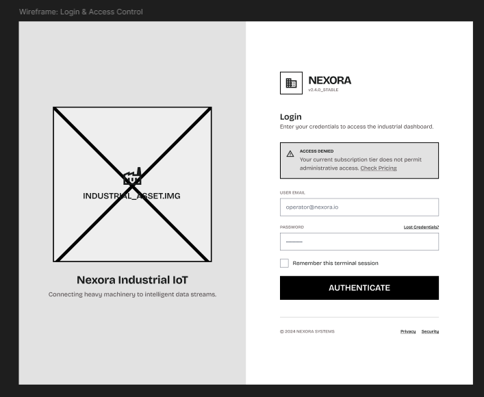

**Choose plan**
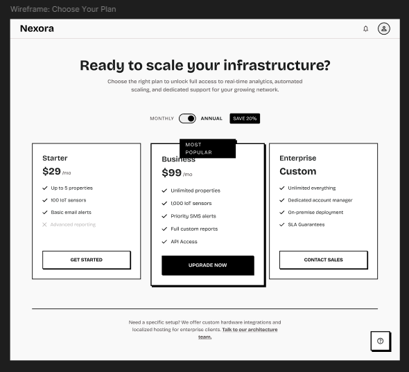

**Reports**
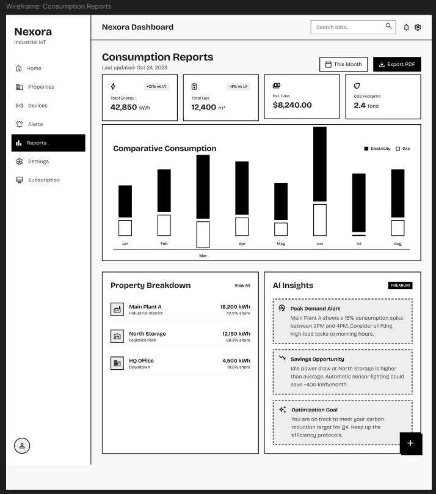

**Dashboard**
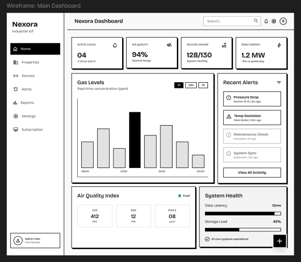

**Devices**
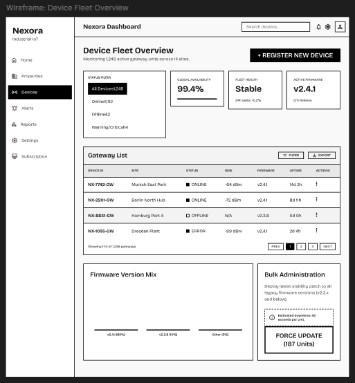

**Device Configuration**
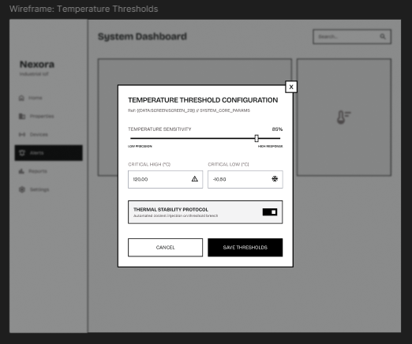

**Subscription**
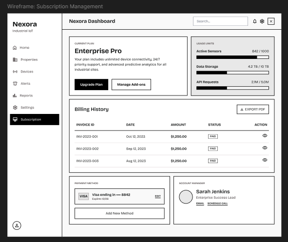

**Alerts**
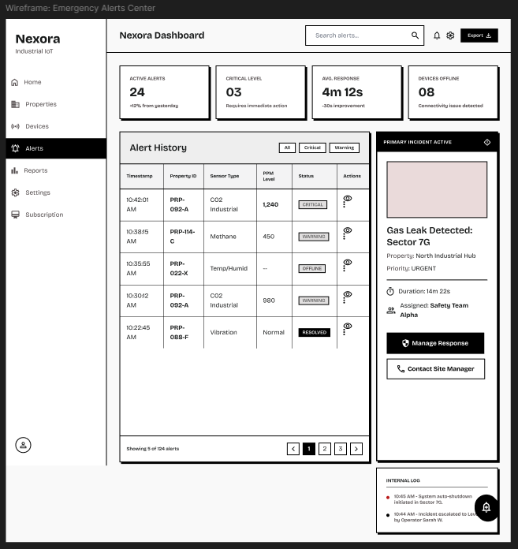

**Device Detail**
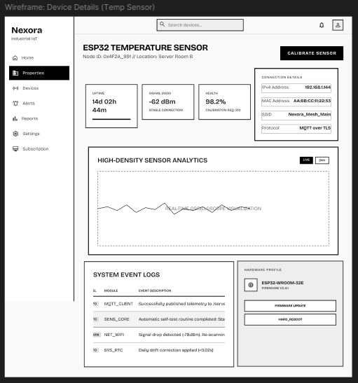

**New Property**
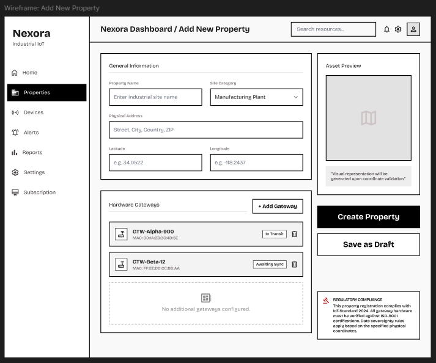

**Properties**
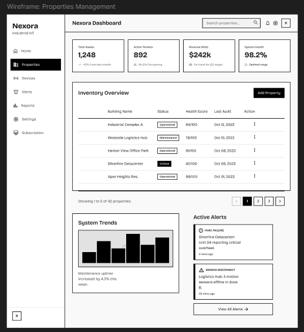

**Property Detail**
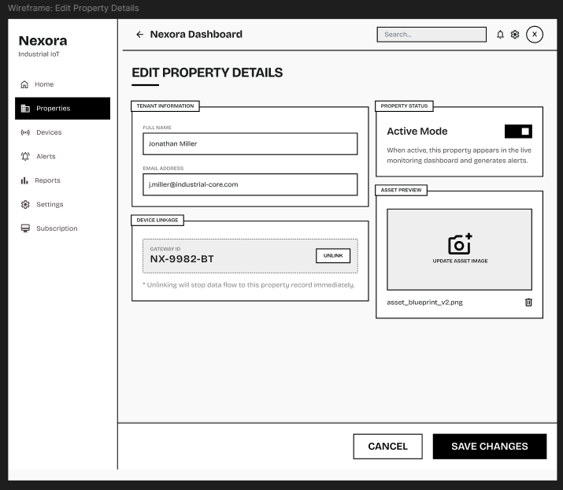

**Detail Alert**
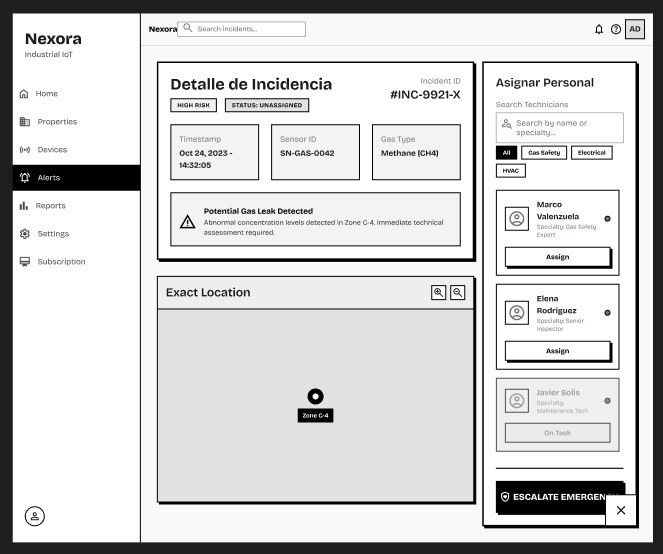

**Settings Notifications**
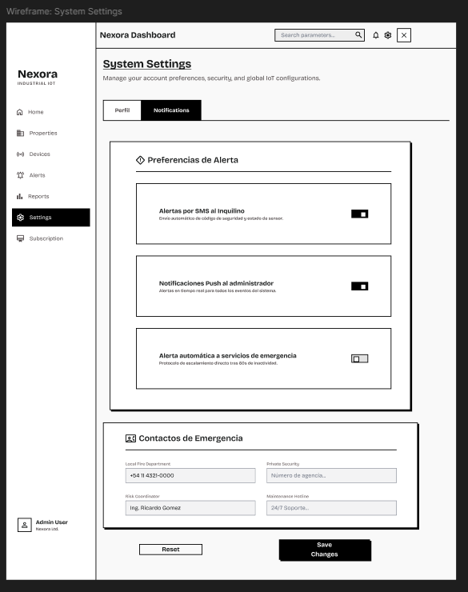

**Settings Profile**
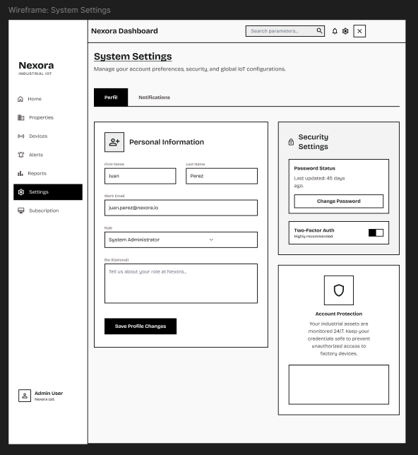

**Checkout**
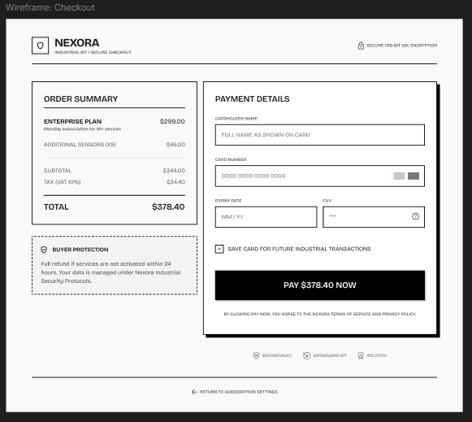


**Mobile Application Wireframes**

Los siguientes wireframes representan las pantallas principales de la aplicación móvil Nexora. El diseño aplica principios de jerarquía visual, consistencia de componentes y diseño inclusivo mediante etiquetas claras, contraste suficiente y áreas de toque generosas en todos los controles interactivos.

**Login**

La pantalla de login presenta el logotipo de Nexora en una zona hero de alto contraste, seguida de los campos de Email y Password con sus etiquetas visibles fuera del input. El botón primario Log in ocupa el ancho completo para maximizar el área de toque. Se ofrecen alternativas de autenticación mediante Apple y Google como opciones secundarias, y un enlace Register para nuevos usuarios. 
  


**Home (Dashboard)**

La pantalla principal muestra en la parte superior el saludo personalizado con el selector de unidad activa. Un banner de alerta activa aparece cuando hay incidentes en curso. La sección Real Time Consumption presenta tarjetas métricas para agua y electricidad con el valor del día y su variación porcentual. Un sparkline de las últimas 24 horas ofrece contexto de tendencia sin necesidad de navegar a Reports. La sección Quick Control expone los dispositivos de mayor uso en una grilla de dos columnas con toggles de control directo.


**Detalle de consumo**

La pantalla de consumo permite alternar entre agua y electricidad mediante tabs superiores, y seleccionar la granularidad temporal con pills (Day, Week, Month, Year). El KPI principal muestra el valor del período seleccionado en tipografía grande junto a la unidad y la variación respecto al período anterior. Un gráfico de línea ocupa el área central. La sección Detail by Area desglosa el consumo por habitación con barras horizontales comparativas.


**Incidents Center (Alerts)**

El centro de incidentes presenta tres contadores de resumen (Critical, Warning, Dismissed) en la parte superior, seguidos de tabs de filtrado (All, Active, Dismissed) con el total de registros. Cada card de alerta muestra el nivel de severidad (CRIT/WARN/INFO) mediante una etiqueta coloreada, el timestamp, una descripción breve y el estado actual (Active/Pend.). Las alertas críticas aparecen con un borde diferenciador.

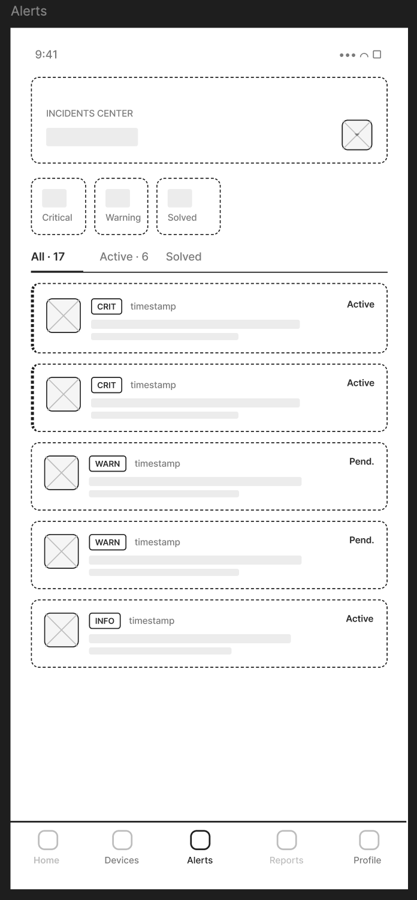


**Devices — Sensores**

La pantalla de Devices organiza los sensores por categoría (Gas Sensor, Air Quality, Humidity) con sus items listados por ubicación. Cada ítem muestra el icono del sensor, el nombre, la ubicación y el valor o estado actual. Los sensores con anomalías como Leak detected se destacan visualmente para captar atención inmediata. Los tabs superiores permiten filtrar por habitación.


**Subscription and Payments**

La pantalla de perfil de suscripción muestra el plan activo (PRO PLAN) con el número de smart units activas y los datos de facturación: fecha de próximo cargo y monto en PEN. La sección Future Invoice presenta el estado de la factura próxima con botones Pay Now y See Details. La lista de Active Smart Units detalla el costo mensual por unidad. La sección Payment Method muestra el método registrado con opción de cambiarlo.

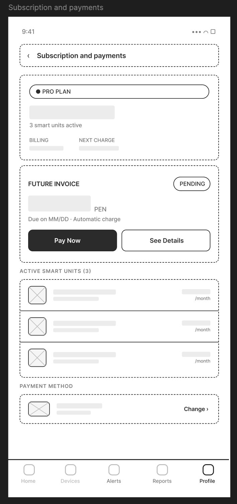


**Devices — Automatizaciones**

La sección de automatizaciones dentro de Devices presenta las reglas agrupadas en Active y Paused. Cada automatización muestra su nombre, las condiciones IF y THEN en chips compactos, y un toggle para activarla o pausarla sin entrar al detalle. El botón + New automation al final de la lista inicia el flujo de creación.

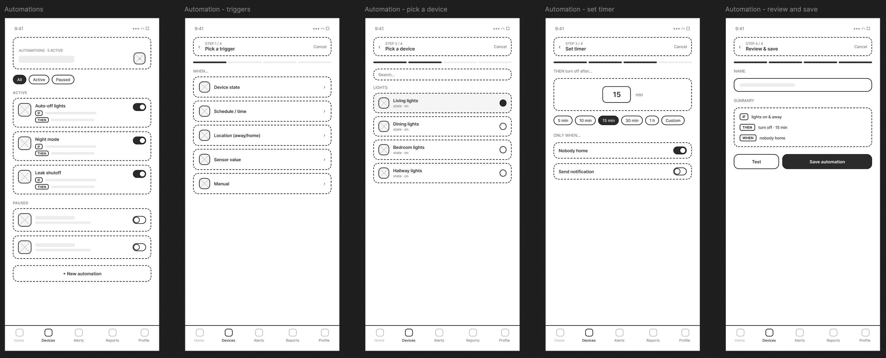

### 5.4.2. Application Wireflows Diagrams

**Wireflows Web App**

**Registration**


**Monitoring property**


**Add property**


**Alerts**


**Reports**


**Security Notifications**


**Subscription**


**Wireflows Mobile App**

**Reduce expenses**


**Security monitoring**


**Automation**


### 5.4.3. Application Mock-ups


#### Aplicación Web
Esta sección presenta y explica los Mock-ups de la aplicación web de Nexora. En la propuesta y la explicación se evidencia la aplicación de los principios de diseño, elementos visuales, diseño inclusivo y arquitectura de información definidos en el Design System del proyecto.

Los mock-ups han sido diseñados siguiendo un enfoque de minimalismo funcional y jerarquía visual, utilizando la paleta de colores corporativa (Naranja #ff7300 y Azul Profundo #173183) para guiar la atención del usuario hacia las acciones críticas y el estado del sistema.

#### **1. Autenticación y Acceso**

El proceso de acceso prioriza la seguridad y la simplicidad. Se utiliza un diseño limpio con un enfoque central en el formulario de login, garantizando que el usuario pueda ingresar a la plataforma sin distracciones.


<br>

#### **2. Dashboard Principal**

El dashboard es el núcleo de monitoreo en tiempo real. Aplica el principio de **visibilidad del estado del sistema**, presentando métricas clave de consumo energético, hídrico e incidencias activas mediante tarjetas informativas y gráficos dinámicos.


<br>

#### **3. Gestión de Propiedades**

Esta sección permite la administración jerárquica de inmuebles. Se utiliza una arquitectura de información clara para navegar entre diferentes edificios y unidades, facilitando la visualización de datos específicos por ubicación.


<br>

#### **4. Gestión de Dispositivos (Device Fleet)**

Permite el control y monitoreo individual de los dispositivos IoT desplegados. Se aplican principios de **feedback inmediato** para mostrar el estado de conexión y el nivel de batería de cada sensor.


<br>

#### **5. Sistema de Alertas e Incidencias**

Diseñado para una respuesta rápida ante anomalías. Las alertas utilizan códigos de color y tipografía clara para indicar la severidad, permitiendo al administrador tomar decisiones informadas de manera eficiente.


<br>

#### **6. Reportes y Análisis de Datos**

Sección dedicada al análisis histórico. Utiliza visualizaciones de datos avanzadas para identificar patrones de consumo y eficiencia, apoyando la toma de decisiones basada en datos.


<br>

#### **7. Gestión de Suscripciones y Facturación**

Interfaz para la administración de planes y pagos. Mantiene la transparencia en el consumo y los costos asociados al servicio, utilizando tablas estructuradas y resúmenes claros.


<br>

#### **8. Configuración y Perfil**

Permite personalizar la experiencia del usuario y ajustar los parámetros del sistema. Se mantiene la **consistencia** visual en los formularios y controles de selección.


#### Aplicación Móvil
Esta sección presenta y explica los Mock-ups de la aplicación móvil de Nexora. En la propuesta y la explicación se evidencia la aplicación de los principios de diseño, elementos visuales, diseño inclusivo y arquitectura de información definidos en el Design System del proyecto.

Los mock-ups han sido diseñados siguiendo un enfoque de minimalismo funcional y jerarquía visual, utilizando la paleta de colores corporativa (Naranja #ff7300 y Azul Profundo #173183) para guiar la atención del usuario hacia las acciones críticas y el estado del sistema.

#### **1. Autenticación y Acceso**

La pantalla de autenticación fue diseñada para ofrecer un acceso rápido, seguro y sencillo a la aplicación. Se emplea una interfaz minimalista con un formulario centralizado que reduce distracciones y facilita el ingreso del usuario. Además, se utiliza una jerarquía visual clara mediante colores contrastantes y botones destacados para mejorar la identificación de acciones principales.


<br>

#### **2. Dashboard Principall**

La pantalla principal centraliza la información más relevante del hogar inteligente, permitiendo al usuario visualizar rápidamente métricas de consumo, estado de dispositivos y accesos directos a funcionalidades clave. El diseño prioriza la rapidez de lectura mediante tarjetas organizadas y gráficos simplificados.


<br>

#### **3. Gestión de Dispositivos**

La pantalla de dispositivos permite al usuario controlar y monitorear los dispositivos inteligentes conectados al departamento. La interfaz prioriza la identificación rápida del estado de cada dispositivo mediante íconos, etiquetas y porcentajes de uso energético.


<br>

#### **4. Automatización Inteligente**

El flujo de automatización fue diseñado para simplificar la creación de tareas automáticas dentro del hogar inteligente. El proceso guía al usuario paso a paso mediante una estructura secuencial que reduce la complejidad de configuración.


<br>

#### **5. Centro de Incidentes**

La pantalla de incidentes permite visualizar alertas y eventos detectados dentro del hogar inteligente. Se prioriza la rápida identificación de incidentes críticos mediante etiquetas de color, categorías y niveles de prioridad.


<br>

#### **6. Monitoreo de Consumo**

Las pantallas de consumo permiten al usuario visualizar estadísticas energéticas y patrones de uso dentro del hogar. El diseño busca facilitar la comprensión de datos mediante gráficos simplificados y métricas destacadas.


<br>

#### **7. Perfil y Configuración de Cuenta**

La sección de perfil centraliza las configuraciones personales y preferencias del usuario dentro de la aplicación, permitiéndole administrar su información, seguridad, notificaciones, idioma, suscripciones y soporte desde un único punto de acceso. El diseño busca ofrecer una experiencia organizada y fácil de navegar, agrupando las opciones según su funcionalidad para reducir la complejidad y mejorar la accesibilidad.

Además, esta sección brinda al usuario un mayor control sobre la personalización y seguridad de su experiencia dentro del ecosistema IoT, facilitando la gestión de configuraciones importantes de manera rápida e intuitiva.


<br>

### 5.4.4. Application User Flow Diagrams

**Userflows Mobile App**

#### **1. Acceso a la Plataforma**

Este User Flow representa el proceso mediante el cual el inquilino accede a la aplicación móvil utilizando sus credenciales. El flujo prioriza una autenticación rápida, segura e intuitiva, permitiendo al usuario ingresar al ecosistema IoT del hogar inteligente de manera sencilla y eficiente.


#### **2. Gestión y Control de Dispositivos**

Este User Flow muestra cómo el usuario interactúa con los dispositivos inteligentes conectados al hogar. El flujo permite monitorear estados, activar funciones y administrar dispositivos desde una interfaz centralizada y fácil de usar.


#### **3. Monitoreo de Consumo Energético**

Este User Flow describe el proceso mediante el cual el usuario visualiza y analiza el consumo energético de su departamento. El flujo permite identificar patrones de gasto, acceder a métricas detalladas y recibir alertas preventivas para optimizar el uso de recursos y reducir costos mensuales.


#### **4. Configuración de Seguridad de la Cuenta**

Este User Flow representa la gestión de opciones de seguridad y privacidad dentro de la aplicación. El usuario puede modificar configuraciones de autenticación, permisos y preferencias de protección para mantener un entorno digital seguro.


#### **7. Administración de Perfil y Preferencias**

Este User Flow describe el proceso mediante el cual el usuario administra su información personal, preferencias de idioma, notificaciones, suscripciones y opciones de soporte. El flujo centraliza las configuraciones de cuenta para ofrecer una experiencia personalizada y accesible.


**Userflows Web App**

#### **1. Reducción del Tiempo de Supervisión Manual**

**User Persona:** Carlos Mendoza — Property Administrator

**User Goal:** Reducir el tiempo dedicado a tareas de supervisión manual en múltiples propiedades.

Este User Flow representa el proceso mediante el cual Carlos Mendoza supervisa múltiples propiedades desde un dashboard centralizado, permitiéndole monitorear dispositivos IoT, visualizar métricas operacionales y detectar incidencias de manera eficiente. El flujo prioriza la automatización del monitoreo y la visualización en tiempo real para optimizar la gestión operativa de los inmuebles.

El flujo esperado permite al administrador acceder al dashboard principal, revisar métricas generales, consultar el estado de dispositivos conectados y configurar umbrales de monitoreo. Asimismo, el User Flow incorpora rutas alternativas relacionadas con fallos de sincronización, dispositivos desconectados y errores de telemetría que pueden afectar el monitoreo de las propiedades.


---

#### **2. Reducción de Costos Operativos**

**User Persona:** Carlos Mendoza — Property Administrator

**User Goal:** Disminuir costos operativos mediante monitoreo inteligente y análisis de consumo.

Este User Flow describe el proceso mediante el cual Carlos Mendoza analiza reportes operacionales y métricas de consumo para identificar patrones de gasto excesivo y optimizar el uso de recursos dentro de las propiedades administradas. El flujo se centra en la visualización de reportes analíticos y recomendaciones inteligentes generadas por la plataforma.

La ruta principal contempla el acceso al módulo de reportes, la visualización de métricas históricas y el análisis de insights operacionales. Asimismo, se incluyen rutas alternativas relacionadas con datos incompletos, errores de generación de reportes y fallos de conexión con sensores IoT.


---

#### **3. Resolución Rápida de Incidencias**

**User Persona:** Carlos Mendoza — Property Administrator

**User Goal:** Resolver incidencias de manera más rápida y eficiente.

Este User Flow representa el proceso de gestión de alertas críticas e incidencias operacionales dentro de la plataforma Nexora. El flujo permite al administrador identificar alertas activas, inspeccionar información del incidente y coordinar acciones correctivas desde un centro de monitoreo centralizado.

El flujo esperado contempla la recepción de alertas, el acceso al Emergency Alerts Center y la revisión de detalles del incidente. Además, el User Flow incorpora rutas alternativas relacionadas con indisponibilidad de personal técnico, errores de sincronización y fallos en la obtención de datos de telemetría.


---

#### **4. Mantenimiento de la Satisfacción de los Inquilinos**

**User Persona:** Carlos Mendoza — Property Administrator

**User Goal:** Mantener satisfechos a los inquilinos mediante monitoreo preventivo de infraestructura.

Este User Flow describe cómo el administrador supervisa condiciones ambientales y operacionales de las propiedades para prevenir incidentes que afecten la experiencia de los inquilinos. El flujo busca garantizar una gestión preventiva y continua de la infraestructura inteligente.

La ruta principal permite visualizar métricas ambientales, revisar alertas activas y configurar parámetros de monitoreo preventivo. Asimismo, el flujo contempla rutas alternativas relacionadas con configuraciones inválidas, fallos de notificaciones y errores en la sincronización de dispositivos.


---

#### **5. Control Centralizado de Propiedades**

**User Persona:** Carlos Mendoza — Property Administrator

**User Goal:** Tener mayor control sobre las propiedades y la infraestructura conectada.

Este User Flow representa el proceso de registro y configuración de nuevas propiedades dentro del ecosistema Nexora. El flujo permite al administrador agregar propiedades, vincular gateways IoT y configurar parámetros iniciales de monitoreo desde una interfaz centralizada.

El flujo esperado incluye el registro exitoso de propiedades y la validación de conectividad de dispositivos inteligentes. Del mismo modo, se incorporan rutas alternativas relacionadas con campos incompletos, errores de detección de gateways y problemas de sincronización con la plataforma.


---

#### **6. Reducción de Gastos Mensuales**

**User Persona:** Valeria Torres — Tenant

**User Goal:** Reducir gastos mensuales relacionados con servicios y consumo energético.

Este User Flow describe el proceso mediante el cual Valeria Torres analiza métricas de consumo y configura alertas preventivas para optimizar el uso de recursos dentro de su departamento. El flujo permite acceder a reportes energéticos y recomendaciones inteligentes orientadas a reducir costos operacionales.

La ruta principal contempla la visualización de métricas de consumo, el análisis de tendencias históricas y la configuración de alertas automáticas. Asimismo, el flujo incorpora rutas alternativas relacionadas con ausencia de datos de consumo, errores de sincronización y fallos en la configuración de notificaciones.


---

#### **7. Monitoreo Remoto y Tranquilidad del Usuario**

**User Persona:** Valeria Torres — Tenant

**User Goal:** Tener mayor tranquilidad cuando se encuentra fuera de casa.

Este User Flow representa el proceso mediante el cual Valeria Torres monitorea remotamente el estado de su departamento utilizando el ecosistema IoT de Nexora. El flujo prioriza la supervisión en tiempo real y la recepción de alertas preventivas relacionadas con seguridad y condiciones ambientales.

La ruta esperada permite visualizar el estado actual de la propiedad y revisar alertas activas desde el dashboard principal. Además, el flujo contempla rutas alternativas relacionadas con fallos de notificación, pérdida de conexión y errores de sincronización entre sensores y la plataforma.


---

#### **8. Optimización de Tareas del Departamento**

**User Persona:** Valeria Torres — Tenant

**User Goal:** Ahorrar tiempo en tareas relacionadas con el monitoreo del departamento.

Este User Flow describe cómo la plataforma centraliza información operativa y automatiza tareas de monitoreo para reducir la necesidad de supervisión manual por parte de la usuaria. El flujo busca simplificar la gestión del entorno inteligente mediante una interfaz intuitiva y automatizada.

La ruta principal permite acceder rápidamente a métricas resumidas, alertas recientes y estados operacionales del departamento. Asimismo, se incluyen rutas alternativas relacionadas con errores de carga de información y retrasos en la actualización de datos.


---

#### **9. Monitoreo de Confort y Seguridad Ambiental**

**User Persona:** Valeria Torres — Tenant

**User Goal:** Vivir en un entorno más cómodo y seguro.

Este User Flow representa el monitoreo de condiciones ambientales y parámetros de seguridad dentro del departamento inteligente. El flujo permite visualizar métricas relacionadas con temperatura, estabilidad ambiental y estados de sensores conectados.

La ruta esperada incluye la revisión de indicadores ambientales y la configuración de parámetros de monitoreo. Además, el flujo incorpora rutas alternativas relacionadas con datos ambientales no disponibles, configuraciones inválidas y problemas de sincronización de sensores.


---

#### **10. Prevención de Cobros Inesperados**

**User Persona:** Valeria Torres — Tenant

**User Goal:** Evitar sorpresas en los recibos de servicios mediante alertas preventivas.

Este User Flow describe el proceso de configuración de alertas de consumo y monitoreo preventivo para evitar incrementos inesperados en los gastos mensuales. El flujo permite a la usuaria establecer umbrales personalizados y recibir notificaciones automáticas ante patrones anómalos de consumo.

La ruta principal contempla la configuración exitosa de alertas inteligentes y el monitoreo continuo de métricas de consumo. Asimismo, el flujo incorpora rutas alternativas relacionadas con límites inválidos, errores de configuración y fallos de sincronización de datos energéticos.


### 5.5. Applications Prototyping

En esta sección se presentan los prototipos de la aplicación web y móvil de Nexora.

#### Aplicación Web


Los siguientes enlaces dirigen a los prototipos de la aplicación web de Nexora:

-   [Prototipo Aplicación Web](https://1drv.ms/v/c/017052aac6508873/IQC-69-AqUHHTIM1SKXGK4Q6AWW6g2urkGHwJrDYTt8TVH8?e=JMwe54)

#### Aplicación Móvil


Los siguientes enlaces dirigen a los prototipos de la aplicación web de Nexora:

-   [Prototipo Aplicación Móvil](https://1drv.ms/v/c/a3bebbb4408387f0/IQA9Rq-XIzrFRapRqiL8KkYpAXPCNnsTF53T2YxYZl1ALCQ?e=ZpMBCK)


## 5.6 IoT Device Design

### Introducción

El diseño IoT de Nexora se basa en una red de dispositivos especializados distribuidos dentro de cada propiedad. Cada dispositivo incorpora un sensor principal orientado a monitorear una condición específica del entorno y transmitir información al backend monolítico de la plataforma para su procesamiento, almacenamiento y visualización en dashboards y aplicaciones móviles.

La propuesta utiliza componentes físicos de bajo costo y fácil integración con ESP32, permitiendo construir dispositivos compactos, mantenibles y coherentes con las funcionalidades mostradas en los prototipos del sistema, como Device Fleet Overview, Alerts, Device Health, Signal y Threshold Configuration.

A diferencia de un único dispositivo multipropósito, Nexora propone varios dispositivos independientes ubicados en distintas zonas de la propiedad según el tipo de monitoreo requerido. Esta decisión mejora la precisión de lectura, facilita mantenimiento y permite escalar el monitoreo por ambientes o riesgos específicos.

El flujo general de integración es el siguiente:

Dispositivo IoT → Backend monolítico → Base de datos → Dashboard web / Aplicación móvil


Los principales criterios considerados en el diseño son:

* Distribución de dispositivos según el tipo de monitoreo requerido.
* Integración directa con el backend monolítico.
* Diseño compacto y fácil de instalar.
* Indicadores físicos visibles y comprensibles.
* Bajo consumo energético.
* Mantenimiento modular por dispositivo.
* Escalabilidad mediante múltiples dispositivos registrados por propiedad.
* Coherencia con las interfaces diseñadas en Figma.

---

##  Diseño físico de los dispositivos

Nexora utiliza dispositivos IoT especializados construidos sobre ESP32 y sensores específicos según la condición a monitorear. Cada dispositivo mantiene una estructura física similar, variando únicamente el sensor principal y su ubicación dentro de la propiedad.

### Tipos de dispositivos IoT

| Tipo de dispositivo     | Sensor utilizado          | Ubicación recomendada                        | Función                                                               |
| :---------------------- | :------------------------ | :------------------------------------------- | :-------------------------------------------------------------------- |
| Gas Monitoring Device   | MQ2 Gas Sensor            | Cocina o zona cercana a instalaciones de gas | Detectar fugas de GLP, propano, metano y gases inflamables.           |
| Air Quality Device      | MQ-135 Air Quality Sensor | Sala, dormitorio o ambientes cerrados        | Monitorear calidad del aire y presencia de contaminantes ambientales. |
| Motion Detection Device | HC-SR501 PIR Sensor       | Entradas, pasillos o accesos                 | Detectar movimiento dentro de la propiedad.                           |
| Power Monitoring Device | ACS712 Current Sensor     | Zona eléctrica o tablero                     | Monitorear consumo o variaciones de corriente eléctrica.              |
| Light Monitoring Device | LDR Light Sensor          | Ventanas o ambientes internos                | Detectar niveles de iluminación ambiental.                            |

Todos los dispositivos utilizan ESP32 como microcontrolador principal y comparten una estructura física similar.

### Componentes físicos comunes

| Componente              | Función                                         | Consideración de diseño                                                       |
| :---------------------- | :---------------------------------------------- | :---------------------------------------------------------------------------- |
| ESP32 DevKit V1         | Controlar lectura y transmisión de datos        | Debe ubicarse dentro de la carcasa con acceso a alimentación y mantenimiento. |
| Sensor principal        | Capturar la variable específica del dispositivo | Debe instalarse según el entorno que monitorea.                               |
| LED de estado           | Representar estado operativo u Online           | Debe ser visible desde el exterior.                                           |
| LED de advertencia      | Representar condición Warning                   | Debe diferenciarse visualmente del estado normal.                             |
| LED crítico             | Representar condición Critical                  | Debe tener alta visibilidad.                                                  |
| Buzzer pasivo           | Emitir alertas locales                          | Especialmente útil para eventos críticos.                                     |
| Servomotor MG996R       | Ejecutar acción física automatizada             | Puede utilizarse para apertura/cierre o bloqueo mecánico.                     |
| Puerto de alimentación  | Suministrar energía al dispositivo              | Debe permanecer protegido.                                                    |
| Puerto de mantenimiento | Permitir programación o diagnóstico técnico     | Uso exclusivo para soporte técnico.                                           |

### Diagramas físicos en LucidChart


---

##  Diseño del circuito

Cada dispositivo IoT se basa en un ESP32 encargado de leer información desde el sensor principal, activar indicadores físicos y transmitir datos al backend monolítico de Nexora.

El diseño del circuito mantiene una estructura modular y reutilizable. La principal variación entre dispositivos corresponde al tipo de sensor conectado al ESP32.

### Componentes del circuito

| Elemento                  | Función                                    |
| :------------------------ | :----------------------------------------- |
| ESP32 DevKit V1           | Procesar lecturas y transmitir información |
| MQ2 Gas Sensor            | Detectar gases inflamables                 |
| MQ-135 Air Quality Sensor | Detectar contaminantes ambientales         |
| HC-SR501 PIR Sensor       | Detectar movimiento                        |
| ACS712 Current Sensor     | Medir corriente eléctrica                  |
| LDR Light Sensor          | Detectar iluminación ambiental             |
| LEDs de estado            | Representar estados operativos             |
| Buzzer pasivo             | Emitir alertas locales                     |
| Servomotor MG996R         | Ejecutar acciones mecánicas automatizadas  |
| Alimentación              | Suministrar energía estable                |

### Flujo operativo del circuito

1. El sensor principal captura una lectura del entorno.
2. El ESP32 interpreta la información recibida.
3. El dispositivo actualiza sus indicadores físicos.
4. El ESP32 transmite la lectura al backend monolítico.
5. El backend registra la información y evalúa umbrales.
6. La plataforma actualiza dashboards, alertas y estados de dispositivos.

### Diagramas de circuito en LucidChart


---

## Flujos de interacción

Los siguientes diagramas representan los principales flujos de interacción entre dispositivos IoT, backend y plataformas de usuario. Debido a que corresponden a Diagram-as-Code y flujos UML, se elaboran utilizando PlantUML según las restricciones tecnológicas definidas para el proyecto.

### Flujo general de monitoreo IoT


### Flujo de alerta crítica


### Flujo de actualización de estado del dispositivo


---

##  Relación con la arquitectura del sistema

Los dispositivos IoT de Nexora funcionan como fuentes distribuidas de monitoreo dentro de cada propiedad. Cada dispositivo captura una variable específica del entorno y transmite lecturas hacia el backend monolítico de la plataforma.

La información registrada es utilizada posteriormente para actualizar dashboards, estados de dispositivos, alertas críticas y métricas operativas presentes en la aplicación web y móvil.

| Etapa | Componente                    | Responsabilidad                                            |
| :---- | :---------------------------- | :--------------------------------------------------------- |
| 1     | Dispositivo IoT especializado | Capturar información específica del entorno.               |
| 2     | Backend monolítico            | Validar lecturas, procesar información y generar alertas.  |
| 3     | Base de datos                 | Almacenar lecturas, estados y eventos históricos.          |
| 4     | Dashboard web                 | Mostrar estado operativo y alertas de dispositivos.        |
| 5     | Aplicación móvil              | Notificar eventos relevantes y mostrar monitoreo resumido. |

Esta arquitectura permite administrar múltiples dispositivos independientes dentro de una misma propiedad, manteniendo coherencia con funcionalidades como Device Fleet Overview, Alerts, Device Health, Signal y Threshold Configuration presentes en los prototipos de Nexora.


# Capítulo VI: Product Implementation, Validation & Deployment
# 6.1. Software Configuration Management
### 6.1.1. Software Development Environment Configuration

En esta sección se define el ecosistema de herramientas que soporta el ciclo de vida completo del desarrollo de Nexora. La selección responde a criterios de colaboración distribuida, escalabilidad, integración continua y compatibilidad con arquitecturas modernas (web, mobile e IoT).

Las herramientas se organizan según su propósito dentro del proceso de desarrollo.

<br>

---

## 1. Project Management

La gestión del proyecto se enfoca en metodologías ágiles, permitiendo iteración continua, visibilidad del progreso y trazabilidad de decisiones.

### Herramienta: Jira (SaaS)

| Campo | Valor |
| ------------- | ------------------------------------------------------------------------------------------------------------------------------------------------------------------------------------------------------------------------------------------------------------------------------------------------------- |
| Categoría     | Project Management |
| Herramienta   | Jira |
| Logo          |  |
| Descripción   | Plataforma para la gestión ágil del proyecto Nexora. Permite administrar el product backlog, planificación de sprints, seguimiento de historias de usuario y control de incidencias. Se utiliza también para definir lineamientos técnicos como convenciones de ramas, arquitectura y flujo de trabajo. |
| Uso en Nexora | Gestión de backlog, sprint planning, seguimiento de desarrollo  |
| URL  | [https://www.atlassian.com/software/jira](https://www.atlassian.com/software/jira) |

---

### Herramienta: Trello (SaaS)

| Campo| Valor  |
| ------------- | ------------------------------------------------------------------------------------------------------------------------------------------------------------------------------------------------------ |
| Categoría     | Team Management    |
| Herramienta   | Trello  |
| Logo          |  |
| Descripción   | Herramienta visual para la gestión de tareas del equipo. Se utiliza para organizar actividades relacionadas con documentación, entregables académicos y seguimiento general del progreso del proyecto. |
| Uso en Nexora | Gestión de capítulos, tareas del equipo y organización interna |
| URL           | [https://trello.com](https://trello.com) |

---

<br>

## 2. Requirements Management

La gestión de requisitos se realiza de forma integrada con herramientas ágiles y documentación estructurada.

### Herramienta: Jira + Documentación estructurada

| Campo| Valor   |
| ------------- | -------------------------------------------------------------------------------------------------------------------------------------- |
| Categoría     | Requirements Management    |
| Herramienta   | Jira    |
| Logo          |  |
| Descripción   | Se emplea para definir y gestionar historias de usuario, criterios de aceptación y priorización de funcionalidades del sistema Nexora. |
| Uso en Nexora | Definición de user stories, épicas, criterios de aceptación |
| URL  | [https://www.atlassian.com/software/jira](https://www.atlassian.com/software/jira)|

---

<br>

## 3. Product UX/UI Design

El diseño UX/UI es crítico en Nexora debido a la interacción entre usuarios, dashboards y dispositivos IoT.

### Herramienta: Figma (SaaS)

| Campo| Valor  |
| ------------- | ------------------------------------------------------------------------------------------------------------------------------------------------------------------------------------------------------------------ |
| Categoría     | Product UX/UI Design|
| Herramienta   | Figma  |
| Logo          |  |
| Descripción   | Plataforma colaborativa para diseño de interfaces. Permite crear wireframes, prototipos interactivos y sistemas de diseño alineados con los Style Guidelines definidos. Facilita validación temprana con usuarios. |
| Uso en Nexora | Diseño de landing page, web app, mobile app e interfaces IoT |
| URL  | [https://www.figma.com](https://www.figma.com)     |

---

<br>

## 4. Software Development

El desarrollo de Nexora se divide en tres frentes: web, mobile e integración IoT.

---

### Herramienta: Visual Studio Code (Local)

| Campo| Valor  |
| ------------- | --------------------------------------------------------------------------------------------------- |
| Categoría     | Software Development (Landing Page) |
| Herramienta   | Visual Studio Code     |
| Logo          |  |
| Descripción   | Editor de código ligero y extensible. Utilizado para el desarrollo de la landing page del proyecto. |
| Tecnologías   | HTML, CSS, JavaScript  |
| Uso en Nexora | Desarrollo de landing page |
| URL           | [https://code.visualstudio.com](https://code.visualstudio.com)     |

---

### Herramienta: WebStorm

| Campo| Valor  |
| ------------- | ---------------------------------------------------------------------------------------------------------------------------------------------------------------- |
| Categoría     | Software Development (Web Application)|
| Herramienta   | WebStorm    |
| Logo          |  |
| Descripción   | IDE especializado en desarrollo web moderno. Proporciona herramientas avanzadas para trabajar con frameworks frontend y mejorar la productividad del desarrollo. |
| Tecnologías   | Vue.js, Tailwind CSS   |
| Uso en Nexora | Desarrollo de la aplicación web (dashboard de gestión) |
| URL  | [https://www.jetbrains.com/webstorm/](https://www.jetbrains.com/webstorm/) |

---

### Herramienta: Android Studio

| Campo| Valor  |
| ------------- | ------------------------------------------------------------------------------------------------------------------- |
| Categoría     | Software Development (Mobile) |
| Herramienta   | Android Studio   |
| Logo          |  |
| Descripción   | IDE oficial para desarrollo móvil. Permite construir, probar y depurar aplicaciones multiplataforma usando Flutter. |
| Tecnologías   | Flutter (Dart)   |
| Uso en Nexora | Desarrollo de la aplicación móvil para control IoT  |
| URL  | [https://developer.android.com/studio](https://developer.android.com/studio)|

---

<br>

## 5. Software Testing

Las pruebas aseguran la calidad del sistema en entornos distribuidos (web, mobile, IoT).

### Herramientas utilizadas:

| Campo| Valor|
| ------------- | -------------------------------------------------------------------------------------------------------------- |
| Categoría     | Software Testing|
| Herramienta   | Postman     |
| Logo          |  |
| Descripción   | Herramienta para pruebas de APIs REST. Permite validar endpoints del backend, autenticación y flujos de datos. |
| Uso en Nexora | Testing de APIs del sistema|
| URL  | [https://www.postman.com](https://www.postman.com)      |

---

| Campo| Valor  |
| ------------- | ---------------------------------------------------------------------------------------------- |
| Categoría     | Software Testing  |
| Herramienta   | Emuladores Android (Android Studio)     |
| Logo          |  |
| Descripción   | Permiten simular dispositivos móviles para pruebas de la app sin necesidad de hardware físico. |
| Uso en Nexora | Testing de aplicación móvil    |
| URL  | [https://developer.android.com/studio](https://developer.android.com/studio) |

---

<br>

## 6. Software Deployment

El despliegue considera la naturaleza distribuida del sistema (backend, frontend e IoT).

### Herramientas utilizadas:

| Campo| Valor      |
| ------------- | ----------------------------------------------------------------------------------------------------------------------------------------- |
| Categoría     | Software Deployment   |
| Herramienta   | GitHub     |
| Logo          |  |
| Descripción   | Plataforma para repositorios remotos que permite integración continua, control de versiones y despliegue automatizado mediante pipelines. |
| Uso en Nexora | Gestión de repositorios y despliegue   |
| URL  | [https://github.com](https://github.com) |

---

<br>

## 7. Version Control

El control de versiones es esencial para el trabajo colaborativo y la trazabilidad del código.

---

### Herramienta: Git (Local/CLI)

| Campo| Valor     |
| ------------- | --------------------------------------------------------------------------------------------------------------------------------------------------- |
| Categoría     | Version Control      |
| Herramienta   | Git |
| Logo          |  |
| Descripción   | Sistema distribuido de control de versiones que permite gestionar cambios en el código fuente, trabajar con ramas y realizar integraciones seguras. |
| Uso en Nexora | Control de versiones en todos los componentes del sistema   |
| URL  | [https://git-scm.com](https://git-scm.com)|

---

### Herramienta: GitHub (SaaS)

| Campo| Valor |
| ------------- | ------------------------------------------------------------------------------------------------------------------------- |
| Categoría     | Version Control |
| Herramienta   | GitHub|
| Logo          |  |
| Descripción   | Plataforma colaborativa basada en Git que permite gestionar repositorios, revisar código y mantener historial de cambios. |
| Uso en Nexora | Repositorio central del proyecto  |
| URL  | [https://github.com](https://github.com)     |

---

<br>

## 8. Software Documentation

La documentación es clave para mantener coherencia técnica y facilitar la colaboración.

### *Herramientas utilizadas:

| Campo| Valor  |
| ------------- | ------------------------------------------------------------------------------------------------------------------------ |
| Categoría     | Software Documentation |
| Herramienta   | Markdown + GitHub |
| Logo          |  |
| Descripción   | Documentación técnica versionada dentro del repositorio del proyecto, permitiendo trazabilidad y actualización continua. |
| Uso en Nexora | Documentación de arquitectura, APIs y decisiones técnicas |
| URL  | [https://www.markdownguide.org/](https://www.markdownguide.org/) |

## 6.1.2. Source Code Management

La gestión del código fuente en Nexora se establece como un pilar clave para garantizar colaboración eficiente, trazabilidad de cambios y control de calidad en todos los componentes del sistema (web, mobile e IoT).

Se adopta GitHub como plataforma central y Git como sistema de control de versiones, implementando el modelo GitFlow junto con estándares como Semantic Versioning y Conventional Commits.

---

<br>

### 1. Repositorios en GitHub

La arquitectura del proyecto Nexora se organiza en múltiples repositorios, cada uno enfocado en un producto específico. Esta separación permite mantener independencia de despliegue, escalabilidad y control granular del desarrollo.

| **Repositorio** | **Descripción** | **URL** |
| -------------------------------- | ---------------------------------------------------------------------------------------------------------------------------------------------------------------------------------------- | ------------------------------------------------------------------------------------------------------------------------ |
| **Landing Page** | Contiene el desarrollo de la página de presentación del producto Nexora. Incluye diseño responsivo, contenido informativo y recursos visuales orientados a conversión. | [https://github.com/upc-202610-1ASI0572-6779-NexIot/nexora.website](https://github.com/upc-202610-1ASI0572-6779-NexIot/nexora.website) |
| **Frontend Web Application** | Repositorio de la aplicación web (dashboard) utilizada por administradores de propiedades. Incluye interfaces de gestión, monitoreo y control del sistema IoT. | [https://github.com/upc-202610-1ASI0572-6779-NexIot/nexora.webapp](https://github.com/upc-202610-1ASI0572-6779-NexIot/nexora.webapp) |
| **Web Services (Backend API)** | Contiene los servicios backend responsables de la lógica de negocio, gestión de usuarios, propiedades, reservas y otros datos no relacionados directamente con IoT. Incluye APIs RESTful y pruebas. | [https://github.com/upc-202610-1ASI0572-6779-NexIot/nexora.webservice](https://github.com/upc-202610-1ASI0572-6779-NexIot/nexora.webservice) |
| **Mobile Application (Flutter)** | Repositorio de la aplicación móvil multiplataforma utilizada por inquilinos para controlar dispositivos IoT. | [https://github.com/upc-202610-1ASI0572-6779-NexIot/nexora.mobileapp](https://github.com/upc-202610-1ASI0572-6779-NexIot/nexora.mobileapp) |
| **IoT Integration Layer** | Contiene componentes relacionados con la integración con dispositivos IoT, adaptadores de comunicación y simulaciones de dispositivos. | [https://github.com/upc-202610-1ASI0572-6779-NexIot/nexora.embeddedapp](https://github.com/upc-202610-1ASI0572-6779-NexIot/nexora.embeddedapp) |
| **Edge Service (Backend API)** | Servicio encargado de recibir, procesar y enrutar los datos provenientes de dispositivos IoT. Gestiona la comunicación en tiempo real, telemetría y eventos de sensores. | [https://github.com/upc-202610-1ASI0572-6779-NexIot/nexora.edgeservice](https://github.com/upc-202610-1ASI0572-6779-NexIot/nexora.edgeservice) |
| **Project Documentation** | Repositorio que centraliza la documentación del proyecto: Lean UX, arquitectura, diseño, validaciones y entregables. | [https://github.com/upc-202610-1ASI0572-6779-NexIot/nexora.report](https://github.com/upc-202610-1ASI0572-6779-NexIot/nexora.report) |

<br>

> **Nota:** En el repositorio de *Web Services* se incluyen explícitamente:
>
> * Pruebas unitarias
> * Pruebas de integración
> * Pruebas de aceptación (cuando aplique)

---

<br>

### 2. Workflow de Control de Versiones (GitFlow)

Para estructurar el desarrollo y permitir trabajo paralelo sin afectar estabilidad, se implementa el modelo GitFlow, basado en el artículo “A successful Git branching model”.

---

#### Estructura de ramas

| **Rama**      | **Descripción** |
| ------------- | -------------------------------------------------------------------------- |
| **master**      | Rama principal que contiene versiones estables listas para producción.     |
| **develop**   | Rama de integración donde se consolidan las funcionalidades en desarrollo. |
| **feature/*** | Ramas para nuevas funcionalidades, creadas desde `develop`.                |
| **release/*** | Ramas para preparación de nuevas versiones antes de producción.            |
| **hotfix/***  | Ramas para correcciones críticas en producción.                            |

---

#### Flujo de trabajo

1. Nuevas funcionalidades se desarrollan en ramas `feature/*`
2. Se integran a `develop` mediante `merge --no-ff`
3. Para una versión, se crea una rama `release/*`
4. Se realizan pruebas finales y ajustes
5. Se fusiona en `develop` y `master`
6. En caso de errores críticos en producción → `hotfix/*`

---

<br>

### 3. Convenciones de nombres de ramas

Para mantener consistencia y trazabilidad, se definen convenciones estrictas:

#### Feature Branches

| Formato                          | Ejemplo                                        |
| -------------------------------- | ---------------------------------------------- |
| `feature/<modulo>-<descripcion>` | `feature/auth-login`, `feature/device-pairing` |

---

#### Release Branches

| Formato          | Ejemplo          |
| ---------------- | ---------------- |
| `release/vX.Y.Z` | `release/v1.0.0` |

---

#### Hotfix Branches

| Formato                | Ejemplo                                         |
| ---------------------- | ----------------------------------------------- |
| `hotfix/<descripcion>` | `hotfix/login-error`, `hotfix/token-expiration` |

#### Ejemplo a seguir

Se adjunta algunas ramas definidas por el equipo de Nexora para un desarrollo correcto. <br>
_(Nota: Las convenciones se han establecido en Jira)_


---

<br>

### 4. Versionado Semántico (Semantic Versioning 2.0.0)

Nexora adopta Semantic Versioning para gestionar versiones de software:

Formato:

```
MAJOR.MINOR.PATCH
```

| **Componente** | **Descripción**                                |
| -------------- | ---------------------------------------------- |
| **MAJOR**      | Cambios incompatibles con versiones anteriores |
| **MINOR**      | Nuevas funcionalidades compatibles             |
| **PATCH**      | Correcciones de errores                        |

---

#### Ejemplos aplicados a Nexora

* `v1.0.0` → Primera versión estable del sistema
* `v1.1.0` → Nueva funcionalidad (ej. monitoreo avanzado IoT)
* `v1.1.1` → Corrección de errores menores

---

<br>

### 5. Convenciones de Commits (Conventional Commits)

Para asegurar claridad en el historial del proyecto, se adopta el estándar Conventional Commits.

---

#### Estructura del commit

```
<tipo>(<scope>): <descripcion>
```

---

#### Tipos de commits

| **Tipo**     | **Descripción**     | **Ejemplo**                                             |
| ------------ | ------------------- | ------------------------------------------------------- |
| **feat**     | Nueva funcionalidad | `feat(auth): implementar login con JWT`                 |
| **fix**      | Corrección de error | `fix(api): corregir error en endpoint de dispositivos`  |
| **docs**     | Documentación       | `docs: actualizar arquitectura del sistema`             |
| **style**    | Cambios visuales    | `style(ui): ajustar espaciado en dashboard`             |
| **refactor** | Mejora de código    | `refactor(service): optimizar lógica de inventario`     |
| **test**     | Pruebas             | `test(api): agregar pruebas de integración para assets` |
| **chore**    | Tareas menores      | `chore: actualizar dependencias`                        |

## Source Code Style Guide & Coding Conventions


En este proyecto, se adoptan estándares y convenciones claras para la nomenclatura y la estructura del código, asegurando consistencia y mantenibilidad en todas las capas de la solución. El idioma oficial para nombrar clases, métodos, variables, archivos y directorios es el inglés, al igual que los comentarios en el código. Nos guiamos por convenciones de la industria, como las “.NET C# Coding Conventions”, “Vue Style Guide”, “Dart Style Guide” y los principios del Diseño Orientado al Dominio (DDD) para estructurar nuestros componentes.

### Stack Tecnológico

| Área | Tecnologías | Propósito |
| :--- | :--- | :--- |
| **Backend / API RESTful** | C#, ASP.NET Core, Entity Framework | Servicios principales de la plataforma, orientados a dominio y escalabilidad. |
| **Edge Service** | Python, Flask | Procesamiento perimetral, conexión con dispositivos IoT o tareas ligeras. |
| **Base de Datos** | PostgreSQL | Almacenamiento persistente y relacional. |
| **Aplicación Web (Frontend)** | Vue.js, CSS, JavaScript | Portal principal e interfaces de gestión, usando división vertical (Vertical Slicing) por *features*. |
| **Aplicación Móvil** | Flutter, Dart | Aplicación multiplataforma para interacción de los usuarios finales. |
| **Landing Page** | HTML5, CSS3, JavaScript | Página estática de presentación para marketing y captación, optimizada para SEO. |

### Arquitectura Backend Orientada a DDD (ASP.NET Core)

El backend, así como las aplicaciones móviles y web, adopta los principios de Diseño Orientado a Dominio (DDD). A continuación se muestra la estructura base en ASP.NET Core:

| Capa / Paquete | Propósito |
| :--- | :--- |
| `domain` | Entidades del negocio (Aggregates), Value Objects, interfaces de repositorios y servicios de dominio. No tiene dependencias externas (framework agnóstico). |
| `application` | Casos de uso de la aplicación, orquestación de llamadas entre el dominio y la infraestructura. No contiene lógica de negocio central. |
| `infrastructure` | Implementaciones concretas (acceso a base de datos PostgreSQL, clientes externos, configuración, seguridad). |
| `presentation` (o `interface`) | Controladores REST, endpoints, DTOs y manejo de excepciones web. |

### Convenciones de Nomenclatura (C# ASP.NET Core)

| Tipo | Convención | Ejemplo |
| :--- | :--- | :--- |
| **Controladores** | PascalCase con sufijo `Controller` | `DeviceController` |
| **Servicios / Casos de Uso**| PascalCase con sufijo `Service` o `UseCase` | `RegisterDeviceUseCase` |
| **Entidades de Dominio** | PascalCase | `Device`, `Sensor`, `User` |
| **Interfaces (Repositorios, etc)**| PascalCase con prefijo `I` | `ISensorRepository` |
| **DTOs** | PascalCase con sufijo `Request` / `Response` o `Dto` | `CreateDeviceRequest` |
| **Métodos y Propiedades** | PascalCase descriptivo | `FindDeviceById()`, `IsActive` |

### Ejemplos de Código

A continuación se muestra un ejemplo de cómo se estructura un caso de uso y una entidad en el dominio, aplicable a nuestro proyecto:

```csharp
// Capa: Domain (Entidad)
namespace Nexora.Iot.Domain.Model
{
    public class Sensor
    {
        public string SensorId { get; private set; }
        public bool IsActive { get; private set; }

        public Sensor(string sensorId, bool isActive)
        {
            SensorId = sensorId;
            IsActive = isActive;
        }

        // Lógica de negocio intrínseca a la entidad
        public void Activate()
        {
            IsActive = true;
        }
    }
}
```

```csharp
// Capa: Application (Caso de Uso)
using System;
using Nexora.Iot.Domain.Model;
using Nexora.Iot.Domain.Repository;

namespace Nexora.Iot.Application.Service
{
    public class ActivateSensorUseCase
    {
        private readonly ISensorRepository _sensorRepository;

        // Inyección de dependencias mediante constructor
        public ActivateSensorUseCase(ISensorRepository sensorRepository)
        {
            _sensorRepository = sensorRepository;
        }

        public void Execute(string sensorId)
        {
            Sensor sensor = _sensorRepository.FindById(sensorId) 
                ?? throw new Exception("Sensor not found");
            
            sensor.Activate();
            _sensorRepository.Save(sensor);
        }
    }
}
```

### Atributos ASP.NET Core y Convenciones C#

| Atributo / Aspecto | Propósito / Convención |
| :--- | :--- |
| `[ApiController]` | Define los controladores que exponen endpoints REST en la capa de `presentation`. |
| `builder.Services...` | Registro de componentes de `application` y repositorios en el contenedor IoC. |
| `DbContext` | Clase base de Entity Framework Core para la persistencia en la capa `infrastructure`. |
| `[Table]` / Fluent API | Define las configuraciones de tablas específicas para la base de datos (infrastructure). |
| `SaveChanges()` | Se utiliza para confirmar transacciones (Unit of Work) al finalizar el caso de uso. |
| **Inyección de Dependencias** | Uso obligatorio de inyección por constructor. Nombres de variables privadas con prefijo `_` (ej. `_repository`). |
| **Manejo de Excepciones** | Centralizar usando Middleware global de manejo de excepciones. |
| **Logging** | Utilizar `ILogger<T>` integrado en ASP.NET Core. |

### Estructura de Proyecto Móvil (Flutter / Dart)

Para el desarrollo móvil con Flutter, se establece el patrón **BLoC** (Business Logic Component) como estándar para el manejo del estado, combinándolo con los principios Clean Architecture / DDD, análogos al backend.

| Capa / Carpeta | Propósito |
| :--- | :--- |
| `presentation/` | Componentes de UI (Screens, Widgets) manejados de forma reactiva, organizados por *features*. |
| `application/` o `blocs/` | Gestión del estado (BLoCs, Cubits o Providers) y orquestación de eventos de la UI. |
| `domain/` | Casos de uso, entidades puras y definición de fallos o errores. |
| `infrastructure/` | Implementación de repositorios, modelos (con sus métodos de serialización `fromJson`/`toJson`) y orígenes de datos (APIs REST). |
| `core/` o `shared/` | Utilidades globales, configuración de temas, enrutamiento e inyección de dependencias. |

### Convenciones de Nomenclatura (Flutter / Dart)

| Tipo | Convención | Ejemplo |
| :--- | :--- | :--- |
| **Archivos y Directorios** | snake_case | `device_list_screen.dart`, `sensor_model.dart` |
| **Clases / Widgets / BLoCs**| PascalCase | `DeviceListScreen`, `SensorBloc` |
| **Variables y Métodos** | camelCase | `loadSensors()`, `isActive` |
| **Constantes** | lowerCamelCase (convención oficial de Dart) | `defaultTimeoutLimit` |
| **Modelos (Infraestructura)**| PascalCase con sufijo `Model` o `Dto` | `DeviceModel`, `SensorDto` |

### Ejemplos de Código (Aplicación Móvil - Flutter)

A continuación se muestra un ejemplo de cómo se estructura la lógica de estado usando **BLoC** y la interfaz de usuario en la aplicación móvil, siguiendo las convenciones establecidas:

```dart
// Capa: Application (Gestión de Estado - BLoC)
// Archivo: sensor_bloc.dart
import 'package:flutter_bloc/flutter_bloc.dart';
import 'package:nexora_app/domain/models/sensor.dart';
import 'package:nexora_app/domain/repositories/sensor_repository.dart';

// Definición de Eventos
abstract class SensorEvent {}
class LoadSensorsEvent extends SensorEvent {}

// Definición de Estados
abstract class SensorState {}
class SensorInitial extends SensorState {}
class SensorLoading extends SensorState {}
class SensorLoaded extends SensorState {
  final List<Sensor> sensors;
  SensorLoaded(this.sensors);
}
class SensorError extends SensorState {
  final String message;
  SensorError(this.message);
}

// BLoC
class SensorBloc extends Bloc<SensorEvent, SensorState> {
  final SensorRepository repository;

  SensorBloc(this.repository) : super(SensorInitial()) {
    on<LoadSensorsEvent>((event, emit) async {
      emit(SensorLoading());
      try {
        final sensors = await repository.getSensors();
        emit(SensorLoaded(sensors));
      } catch (e) {
        emit(SensorError("Error al cargar los sensores"));
      }
    });
  }
}
```

```dart
// Capa: Presentation (UI - Widget)
// Archivo: sensor_list_screen.dart
import 'package:flutter/material.dart';
import 'package:flutter_bloc/flutter_bloc.dart';
import 'package:nexora_app/application/blocs/sensor_bloc.dart';

class SensorListScreen extends StatelessWidget {
  const SensorListScreen({Key? key}) : super(key: key);

  @override
  Widget build(BuildContext context) {
    return Scaffold(
      appBar: AppBar(title: const Text('Sensores Nexora')),
      body: BlocBuilder<SensorBloc, SensorState>(
        builder: (context, state) {
          if (state is SensorLoading) {
            return const Center(child: CircularProgressIndicator());
          } else if (state is SensorLoaded) {
            return ListView.builder(
              itemCount: state.sensors.length,
              itemBuilder: (context, index) {
                final sensor = state.sensors[index];
                return ListTile(
                  title: Text(sensor.id),
                  trailing: Icon(
                    sensor.isActive ? Icons.check_circle : Icons.error,
                    color: sensor.isActive ? Colors.green : Colors.red,
                  ),
                );
              },
            );
          } else if (state is SensorError) {
            return Center(child: Text(state.message));
          }
          return const Center(child: Text('No hay sensores registrados.'));
        },
      ),
    );
  }
}
```

### Estructura de Proyecto Web (Vue.js)

Para el desarrollo del frontend de la aplicación web con Vue.js, utilizaremos el patrón de **Vertical Slicing** (división por *features*). Esto mantiene unidos los componentes, vistas y lógicas (estado, servicios) relacionadas a una misma funcionalidad, facilitando su escalabilidad y reduciendo el acoplamiento global.

| Capa / Carpeta | Propósito |
| :--- | :--- |
| `src/features/` | Contiene los distintos módulos del negocio (ej. `devices/`, `users/`). Cada *feature* agrupa sus propios `components`, `views`, `api` (servicios) y `store` (estado). |
| `src/core/` o `src/shared/` | Componentes genéricos (botones, modales), utilidades globales, configuración de clientes HTTP y directivas o *composables* reutilizables. |
| `src/layouts/` | Estructuras base de la interfaz (menú de navegación lateral/superior, contenedor principal). |
| `src/router/` | Configuración central del enrutador de Vue, importando las rutas expuestas por cada *feature*. |

#### Convenciones de Nomenclatura (Vue.js)

| Tipo | Convención | Ejemplo |
| :--- | :--- | :--- |
| **Componentes (.vue)** | PascalCase (obligatorio múltiples palabras) | `DeviceList.vue`, `SensorCard.vue` |
| **Vistas (.vue)** | PascalCase con sufijo `View` | `DeviceDashboardView.vue` |
| **Archivos JS/CSS** | camelCase / kebab-case | `sensorService.js`, `main-styles.css` |
| **Clases CSS** | Metodología BEM | `.sensor-card__title--active` |
| **Variables/Métodos** | camelCase | `fetchDevices()`, `isLoading` |

#### Ejemplo de Código (Aplicación Web - Vue)

A continuación, un ejemplo de un componente de Vue (usando Composition API y `<script setup>`) ubicado dentro de un feature específico (`src/features/sensors/`):

```vue
<!-- Archivo: src/features/sensors/components/SensorStatus.vue -->
<template>
  <div class="sensor-status">
    <h3 class="sensor-status__title">Sensor: {{ sensorId }}</h3>
    <p 
      class="sensor-status__state" 
      :class="{ 'sensor-status__state--active': isActive }"
    >
      Estado: {{ isActive ? 'Activo' : 'Inactivo' }}
    </p>
    <button @click="toggleStatus" class="sensor-status__btn">
      Alternar Estado
    </button>
  </div>
</template>

<script setup>
import { ref } from 'vue';

// Definición de Props
const props = defineProps({
  sensorId: {
    type: String,
    required: true
  },
  initialStatus: {
    type: Boolean,
    default: false
  }
});

// Estado reactivo local
const isActive = ref(props.initialStatus);

// Método (camelCase)
const toggleStatus = () => {
  isActive.value = !isActive.value;
  // TODO: Orquestar llamada al 'sensorService' o emitir evento
};
</script>

<style scoped>
/* Uso de BEM para estilos locales */
.sensor-status {
  border: 1px solid #ccc;
  padding: 16px;
  border-radius: 8px;
}
.sensor-status__title {
  margin: 0 0 8px;
}
.sensor-status__state--active {
  color: green;
  font-weight: bold;
}
.sensor-status__btn {
  margin-top: 10px;
  cursor: pointer;
}
</style>
```


### Convenciones para Landing Page

La Landing Page se enfoca en captación, presentación y posicionamiento, utilizando tecnologías web estándar sin frameworks pesados, asegurando velocidad y accesibilidad.

#### Estructuración HTML

| Elemento | Convención |
| :--- | :--- |
| **Etiquetas Semánticas** | Usar `<header>`, `<main>`, `<nav>`, `<footer>`, `<section>` |
| **Atributos ARIA** | Implementar `role`, `aria-label`, `aria-expanded` |
| **Encabezados** | Jerarquía adecuada H1-H6 |
| **Formularios** | Etiquetas `label` asociadas a inputs |

#### Convenciones CSS

| Aspecto | Convención |
| :--- | :--- |
| **Metodología** | BEM (Block Element Modifier) |
| **Variables CSS** | Definir en `:root` |
| **Responsive Design** | Mobile-first approach |
| **Organización** | Modular por componentes |

#### Convenciones JavaScript

| Aspecto | Convención |
| :--- | :--- |
| **Variables** | `const` para valores fijos, `let` para variables |
| **Funciones** | Nombres descriptivos en `camelCase` |
| **Event Listeners** | Usar *event delegation* cuando sea posible |
| **Módulos** | Organizar funcionalidad en módulos |
| **Comentarios** | JSDoc para funciones principales |

### Formato del Código General

Para asegurar que todo el equipo mantenga la misma consistencia visual y estructura al escribir código, adoptamos los siguientes formatos básicos por tecnología:

| Lenguaje | Sangría | Límite Línea | Comillas | Puntos y Coma |
| :--- | :--- | :--- | :--- | :--- |
| **C#** | 4 espacios | 120 caracteres | Doble (`" "`) | Obligatorio |
| **Python** | 4 espacios | 80/100 caracteres| Simple o Doble | No usar |
| **Dart/Flutter**| 2 espacios | 80 caracteres | Simple (`' '`) | Obligatorio |
| **HTML/CSS/JS** | 2 espacios | 80 caracteres | HTML: Doble, JS: Simple | JS: Obligatorio |

*(Nota: Hemos adaptado esta tabla del estándar inicial para ajustarse a nuestro stack, incluyendo Python para el Edge Service en lugar de Kotlin).*

### Estructura General y Estándares Transversales

A nivel de repositorio y arquitectura de carpetas global, la separación es clara según la responsabilidad:

#### Estructura General del Proyecto

| Directorio | Contenido |
| :--- | :--- |
| `backend/` | API ASP.NET Core (C#) |
| `edge-service/` | API Flask (Python) |
| `mobile-flutter/` | Aplicación multiplataforma (Flutter) |
| `landing-page/` | Landing page estática (HTML/CSS/JS) |
| `docs/` | Documentación del proyecto |

#### Nomenclatura de Archivos

| Tecnología | Convención | Ejemplo |
| :--- | :--- | :--- |
| **C#** | PascalCase | `DeviceController.cs` |
| **Python** | snake_case | `sensor_processing.py` |
| **Dart/Flutter**| snake_case | `device_screen.dart` |
| **HTML/CSS/JS** | kebab-case | `main-styles.css`, `navigation.js` |

#### Accesibilidad y SEO

| Área | Requisitos |
| :--- | :--- |
| **Accesibilidad** | Contraste 4.5:1, ARIA labels, navegación por teclado, soporte para lectores de pantalla |
| **SEO** | Meta tags descriptivos, estructura semántica HTML5, Open Graph tags |
| **Performance** | Optimización de imágenes (WebP), lazy loading, minificación de recursos |
| **Mobile** | Diseño responsive, touch-friendly (mínimo 44x44px para botones) |
| **Internacionalización**| Soporte para múltiples idiomas (es, en) |


## 6.1.4. Deployment Configuration

En esta sección, el equipo especifica la configuración del despliegue de la solución, incluyendo los pasos necesarios para que, a partir de los repositorios de código fuente, se pueda lograr el despliegue o publicación satisfactorio de cada uno de los productos digitales en la solución (Landing Page, Web Services, Web Applications, Mobile Applications, Embedded Applications u otros productos incluidos).

### Deployment Diagram

A continuación se presenta el Deployment Diagram siguiendo el modelo C4, que ilustra cómo se distribuyen los componentes de la solución Nexora en los distintos proveedores de infraestructura.


### Detalles de Configuración por Producto Digital

#### 1. Landing Page
*   **Plataforma:** GitHub Pages.
*   **Configuración:** Se utiliza GitHub Actions para automatizar el despliegue. Cada vez que se realiza un *push* a la rama `main`, un workflow compila los activos estáticos y los publica en el entorno de producción de GitHub Pages.

#### 2. Web Application (Frontend)
*   **Plataforma:** Vercel.
*   **Configuración:** Vercel está conectado directamente al repositorio de GitHub. El despliegue es automático (CI/CD nativo de Vercel) para cada cambio en la rama principal, gestionando de forma eficiente el escalado y la entrega de contenido (CDN).

#### 3. Mobile Application
*   **Plataforma:** Firebase App Distribution.
*   **Configuración:** Para el desarrollo y pruebas con Flutter, se utiliza Firebase App Distribution. Esto permite distribuir versiones *beta* de la aplicación a los miembros del equipo y testers de forma rápida, integrándose con procesos de CI/CD para generar los binarios (.apk / .ipa).

#### 4. Backend (App & Mobile Web)
*   **Plataforma:** Microsoft Azure.
*   **Configuración:** Los servicios web del backend se despliegan en Azure (utilizando App Services o Container Instances). Se configura un pipeline de despliegue que asegura que la lógica de negocio y las APIs estén disponibles y escalen según la demanda de las aplicaciones web y móviles.

#### 5. Edge Service
*   **Plataforma:** Microsoft Azure.
*   **Configuración:** Al igual que el backend, el Edge Service se aloja en Azure. Este componente es crítico para la comunicación con los dispositivos IoT, por lo que se despliega con configuraciones de alta disponibilidad para garantizar la recepción constante de telemetría.


## 6.2. Landing Page, Services & Applications Implementation
### 6.2.1. Sprint 1
#### 6.2.1.1. Sprint Planning 1

## Introducción

El Sprint Planning 1 corresponde al inicio formal del proceso de desarrollo del producto digital de Nexora dentro del marco Scrum adoptado por el equipo. Durante esta reunión se definieron los objetivos estratégicos y funcionales del Sprint, considerando el Product Backlog priorizado, los requerimientos de negocio, la propuesta de valor de la startup NextIoT y los lineamientos definidos para el desarrollo incremental de la solución.

El enfoque principal de este Sprint se centra en la implementación de la primera versión funcional del ecosistema digital de Nexora, específicamente el desarrollo inicial de la Landing Page corporativa y la primera versión del Frontend Web Application. Estas implementaciones buscan establecer la presencia digital inicial del producto, validar la propuesta de valor frente a usuarios potenciales y habilitar las funcionalidades fundamentales de interacción para los diferentes segmentos objetivo.

Asimismo, durante el Sprint Planning se establecieron las User Stories comprometidas, el Sprint Goal, la capacidad de trabajo del equipo expresada mediante Story Points y los acuerdos colaborativos necesarios para asegurar una ejecución alineada con los objetivos del proyecto.

---

## Sprint Planning Meeting Summary

| Sprint # | Sprint 1 |
| --- | --- |
| Sprint Planning Background | Inicio del desarrollo incremental del ecosistema digital de Nexora orientado a la implementación de la primera versión de la Landing Page y del Frontend Web Application. |
| Date | 2026-05-14 |
| Time | 02:10 PM |
| Location | Reunión virtual desarrollada mediante Google Meet y coordinación colaborativa mediante Discord y GitHub Projects. |
| Prepared By | Jhosep Alarcón |
| Attendees (to planning meeting) | Jhosep Alarcón / Equipo Frontend / Equipo UX/UI / Equipo Backend / Product Owner |
| Sprint 0 Review Summary | Debido a que este Sprint representa el inicio del proyecto, no se cuenta con resultados funcionales previos. Durante la fase inicial se realizaron actividades de definición de User Stories, priorización del Product Backlog y diseño preliminar de la solución. |
| Sprint 0 Retrospective Summary | El equipo identificó como fortaleza la alineación inicial respecto a la visión del producto y como oportunidad de mejora la necesidad de fortalecer la estimación temprana de User Stories y la organización documental del proyecto. |

---

## Sprint Goal & User Stories

### Sprint 1 Goal

“Our focus is on delivering the first functional version of the Nexora digital ecosystem through the implementation of the Landing Page and the initial Frontend Web Application features.

We believe it delivers visibility of the Nexora value proposition, initial interaction capabilities, and early product validation opportunities to potential customers and stakeholders.

This will be confirmed when users can access the Landing Page, navigate core informational sections, understand the main value proposition, and interact with the first functional modules of the Frontend Web Application without critical usability or accessibility issues.”

---

### Sprint 1 Velocity

| Sprint Velocity | 260 Story Points |
| --- | --- |


---

### Sum of Story Points

| Sum of Story Points | 258 Story Points |
| --- | --- |


---

## User Stories Included in Sprint 1

| User Story ID | Title | Story Points |
| --- | --- | --- |
| US01 | Acceso rápido a información | 3 |
| US02 | Experiencia intuitiva de navegación | 5 |
| US03 | Adaptabilidad multidispositivo | 5 |
| US04 | Solicitud de demostración | 3 |
| US05 | Comprensión de propuesta de valor | 3 |
| US06 | Consulta de alianzas y referencias | 2 |
| US07 | Acceso a conversión comercial | 3 |
| US08 | Información de plataforma para arrendadores | 5 |
| US09 | Comprensión de beneficios operativos y solución inmobiliaria | 5 |
| US10 | Consulta de funcionalidades de administración | 3 |
| US11 | Monitoreo IoT en tiempo real | 8 |
| US12 | Información de aplicación para arrendatarios | 3 |
| US13 | Comprensión de beneficios y automatización inteligente | 3 |
| US14 | Acceso a páginas especializadas de producto | 3 |
| US15 | Comparación de planes de suscripción | 5 |
| US16 | Inicio de contratación del servicio | 5 |
| US17 | Consulta de testimonios de clientes | 2 |
| US18 | Consulta de preguntas frecuentes y registro de consultas | 3 |
| US19 | Acceso a información de contacto y soporte | 2 |
| US20 | Acceso a redes y canales oficiales | 2 |
| US21 | Acceso a información institucional | 2 |
| US22 | Consulta de términos y condiciones | 2 |
| US23 | Consulta de información corporativa | 2 |
| US24 | Comprensión de propuesta de valor institucional | 2 |
| US25 | Consulta de integrantes del equipo | 2 |
| US26 | Autenticación de usuarios | 8 |
| US27 | Validación de acceso y bloqueo de cuenta | 5 |
| US28 | Restricción de acceso por estado de suscripción | 3 |
| US29 | Recuperación de credenciales de acceso | 5 |
| US30 | Visualización de KPIs globales del sistema | 8 |
| US31 | Monitoreo de niveles de gas y calidad del aire | 8 |
| US32 | Monitoreo del estado de salud del sistema | 5 |
| US33 | Visualización y acceso al panel de alertas recientes | 5 |
| US34 | Visualización del inventario de propiedades con métricas de salud | 8 |
| US35 | Registro de nueva propiedad con vinculación de gateway IoT | 8 |
| US36 | Edición de información de propiedad y gestión de arrendatario | 5 |
| US37 | Gestión de vinculación de dispositivos en propiedad | 5 |
| US38 | Visualización del estado global de la flota de dispositivos | 8 |
| US39 | Registro de nuevo activo IoT | 5 |
| US40 | Gestión de firmware de dispositivos IoT | 5 |
| US41 | Reinicio remoto de dispositivo con fallo de comunicación | 3 |
| US42 | Visualización de telemetría en vivo de dispositivo | 8 |
| US43 | Consulta de logs de eventos del sistema y perfil de hardware | 5 |
| US44 | Calibración y mantenimiento remoto de dispositivo | 5 |
| US45 | Visualización del centro de alertas de emergencia con eventos en tiempo real | 8 |
| US46 | Gestión de respuesta a incidencia crítica activa | 8 |
| US47 | Exportación de reporte de incidencias | 3 |
| US48 | Investigación de alerta individual desde el centro de emergencias | 5 |
| US49 | Visualización del detalle completo de una incidencia crítica | 8 |
| US50 | Asignación de técnico especializado para atención de incidencia | 5 |
| US51 | Activación del protocolo de apagado de emergencia | 3 |
| US52 | Visualización de métricas de consumo del período actual | 5 |
| US53 | Análisis comparativo de consumo por período y tipo de recurso | 5 |
| US54 | Consulta del desglose de consumo por propiedad | 3 |
| US55 | Consulta de recomendaciones de inteligencia artificial | 5 |
| US56 | Exportación del reporte de consumo | 3 |
| US57 | Gestión del perfil personal y ubicación de operaciones | 3 |
| US58 | Gestión de seguridad de la cuenta: contraseña y 2FA | 5 |
| US59 | Gestión de alertas de acceso crítico detectado | 3 |
| US60 | Gestión del equipo operativo | 5 |
| US61 | Configuración de preferencias de notificación | 5 |
| US62 | Configuración de contactos de emergencia | 3 |
| US63 | Configuración de umbrales de temperatura por sensor | 8 |
| US64 | Visualización y actualización del método de pago desde el perfil | 3 |
| US65 | Visualización del plan activo y límites de uso | 3 |
| US66 | Consulta del historial de facturación y descarga de comprobantes | 3 |
| US67 | Gestión del método de pago registrado | 3 |
| US68 | Coordinación con el account manager dedicado | 2 |
| US69 | Cambio o actualización del plan de suscripción | 3 |
| US70 | Selección de plan y modalidad de facturación | 5 |
| US71 | Proceso de pago seguro para activación de suscripción | 8 |

#### 6.2.1.2. Aspect Leaders and Collaborators

Durante el Sprint 1, el equipo definió los principales aspectos funcionales asociados con la implementación de la primera versión de la Landing Page y la primera versión de la Aplicación Web. Estos aspectos representan las secciones funcionales, módulos, vistas y características incluidas dentro del alcance del Sprint y directamente relacionadas con las Historias de Usuario seleccionadas y las tareas previstas del Sprint. 

El propósito de esta sección es establecer una Matriz de Liderazgo y Colaboración (LACX) que identifique las responsabilidades de liderazgo y los roles de colaboración asignados a cada miembro del equipo para cada aspecto considerado durante la ejecución del Sprint. Esta distribución permite al equipo mejorar la coordinación interna, el flujo de comunicación, la propiedad de las tareas y la responsabilidad en el desarrollo a lo largo del ciclo de vida del Sprint. 

Para este Sprint, los aspectos identificados se agruparon en dos áreas principales del producto:

- Aspectos de implementación de la página de aterrizaje, centrados en contenido de marketing, presentación del producto, participación del cliente y secciones informativas.
- Aspectos de implementación de la aplicación web, centrados en características operativas, gestión de propiedades, monitoreo, gestión de suscripciones, administración de dispositivos y módulos de configuración.

Cada aspecto incluye un líder designado responsable de coordinar las actividades de implementación y uno o más colaboradores que apoyan las actividades de desarrollo asociadas con ese aspecto. La organización de líderes y colaboradores está alineada con las tareas esperadas del Sprint y las responsabilidades de implementación posteriores.

### 6.2.1.2.1. Landing Page Leadership-and-Collaboration Matrix (LACX)

| Team Member (Last Name, First Name) | GitHub Username | Hero Section | Partnerships Section | Product Overview Section | Benefits Overview Section | Testimonials Section | Call To Action Section | Frequently Asked Questions | About Us Section | Mobile Application Product Page | Web Application Product Page |
|---|---|---|---|---|---|---|---|---|---|---|---|
| Argomedo Camacho, Jhosep Jamil | [@JhosepAC](https://github.com/JhosepAC) | C | C | C | C | C | C | C | C | C | L |
| Ramirez Tello, Sebastian | [@SRT0808](https://github.com/SRT0808) | C | C | C | C | C | C | C | L | C | C |
| Linares Arroyo, Jorge Alexandro | [@jlinares30](https://github.com/jlinares30) | C | C | C | C | C | C | L | C | C | C |
| O'Higgins Rosales, Andrea Namie | [@AndreaOhiggins](https://github.com/AndreaOhiggins) | L | L | L | C | C | C | C | C | C | C |
| Peña Riofrio, Maria Fernanda | [@mariafep](https://github.com/mariafep) | C | C | C | L | C | C | C | C | C | C |
| Castañeda Llanos, Kevin Alexander | [@KevCast1604](https://github.com/KevCast1604) | C | C | C | C | C | C | C | C | L | C |
| Muñoz Vilcapoma, Mauricio | [@MauricioMVilcapoma](https://github.com/MauricioMVilcapoma) | C | C | C | C | L | L | C | C | C | C |

<br>

### 6.2.1.2.2. Web Application Leadership-and-Collaboration Matrix (LACX)

| Team Member (Last Name, First Name) | GitHub Username | Emergency Alerts Center | Incident Details | System Settings | Notification Settings | Choose Your Plan | Checkout | Device Details | Temperature Threshold Settings | Subscription Management | Device Fleet Overview | Login & Access Control | Properties Management | Consumption Reports | Control Dashboard | Add New Property | Edit Property Details |
|---|---|---|---|---|---|---|---|---|---|---|---|---|---|---|---|---|---|
| Argomedo Camacho, Jhosep Jamil | [@JhosepAC](https://github.com/JhosepAC) | C | C | C | C | C | C | C | C | C | C | L | L | L | C | C | C |
| Ramirez Tello, Sebastian | [@SRT0808](https://github.com/SRT0808) | C | C | C | C | C | C | C | C | C | C | C | C | C | L | L | L |
| Linares Arroyo, Jorge Alexandro | [@jlinares30](https://github.com/jlinares30) | L | L | C | C | C | C | C | C | C | C | C | C | C | C | C | C |
| O'Higgins Rosales, Andrea Namie | [@AndreaOhiggins](https://github.com/AndreaOhiggins) | C | C | L | L | C | C | C | C | C | C | C | C | C | C | C | C |
| Peña Riofrio, Maria Fernanda | [@mariafep](https://github.com/mariafep) | C | C | C | C | L | L | C | C | C | C | C | C | C | C | C | C |
| Castañeda Llanos, Kevin Alexander | [@KevCast1604](https://github.com/KevCast1604) | C | C | C | C | C | C | C | C | L | L | C | C | C | C | C | C |
| Muñoz Vilcapoma, Mauricio | [@MauricioMVilcapoma](https://github.com/MauricioMVilcapoma) | C | C | C | C | C | C | L | L | C | C | C | C | C | C | C | C |

#### 6.2.1.3. Sprint Backlog 1

El Sprint Backlog 1 reúne el conjunto de User Stories y tareas técnicas definidas para la implementación de la primera versión del Landing Page y de la primera versión funcional de la Web Application. Durante este Sprint, el equipo se enfocó en el desarrollo de funcionalidades orientadas a la presentación de la propuesta de valor del producto, gestión de propiedades, administración de dispositivos, suscripciones, configuración del sistema y monitoreo de alertas e incidencias.

Asimismo, el Sprint Backlog permitió organizar el trabajo colaborativo del equipo mediante la descomposición de cada User Story en tareas específicas, facilitando el seguimiento del avance, la asignación de responsabilidades y el control del estado de desarrollo dentro del Sprint Board.

**Sprint Board URL:**
`https://trello.com/`

> **Nota:** En esta sección debe agregarse el screenshot del Sprint Board correspondiente al Sprint 1.

---

## Sprint

**Sprint 1**

| User Story |                                | Work-Item / Task |                                             |                                                                |                        |                   |            |
| ---------- | ------------------------------ | ---------------- | ------------------------------------------- | -------------------------------------------------------------- | ---------------------- | ----------------- | ---------- |
| **Id**     | **Title**                      | **Id**           | **Title**                                   | **Description**                                                | **Estimation (Hours)** | **Assigned To**   | **Status** |
| US-01      | Hero Section                   | T-01             | Diseñar estructura Hero                     | Implementación visual de la sección principal del landing page | 4                      | Andrea O'Higgins  | Done       |
| US-01      | Hero Section                   | T-02             | Implementar responsive Hero                 | Adaptación responsive para desktop y mobile                    | 3                      | Andrea O'Higgins  | Done       |
| US-01      | Hero Section                   | T-03             | Integrar CTA principal                      | Configuración de botones y navegación principal                | 2                      | Andrea O'Higgins  | Done       |
| US-02      | Partnerships Section           | T-04             | Diseñar sección alianzas                    | Creación visual de partners estratégicos                       | 3                      | Andrea O'Higgins  | Done       |
| US-02      | Partnerships Section           | T-05             | Integrar logos de partners                  | Configuración de assets y estilos                              | 2                      | Andrea O'Higgins  | Done       |
| US-03      | Product Summary Section        | T-06             | Implementar resumen de productos            | Desarrollo de cards informativas de productos                  | 4                      | Andrea O'Higgins  | Done       |
| US-03      | Product Summary Section        | T-07             | Configurar navegación de productos          | Integración de enlaces hacia páginas detalladas                | 2                      | Andrea O'Higgins  | Done       |
| US-04      | Benefits Overview Section      | T-08             | Diseñar beneficios principales              | Implementación de beneficios destacados                        | 4                      | Maria Peña        | Done       |
| US-04      | Benefits Overview Section      | T-09             | Agregar iconografía y estilos               | Integración visual de componentes UI                           | 2                      | Maria Peña        | Done       |
| US-05      | Testimonials Section           | T-10             | Implementar testimonios                     | Desarrollo de sección de testimonios de usuarios               | 3                      | Mauricio Muñoz    | Done       |
| US-05      | Testimonials Section           | T-11             | Configurar slider de testimonios            | Integración de navegación dinámica                             | 3                      | Mauricio Muñoz    | Done       |
| US-06      | CTA Section                    | T-12             | Implementar Call To Action                  | Desarrollo de sección CTA final                                | 3                      | Mauricio Muñoz    | Done       |
| US-06      | CTA Section                    | T-13             | Integrar botones de acción                  | Navegación hacia suscripción y contacto                        | 2                      | Mauricio Muñoz    | Done       |
| US-07      | FAQ Section                    | T-14             | Implementar preguntas frecuentes            | Desarrollo de acordeones FAQ                                   | 4                      | Jorge Linares     | Done       |
| US-07      | FAQ Section                    | T-15             | Configurar interacción FAQ                  | Implementación dinámica expand/collapse                        | 2                      | Jorge Linares     | Done       |
| US-08      | About Us Section               | T-16             | Diseñar sección About Us                    | Implementación de información institucional                    | 4                      | Sebastian Ramirez | Done       |
| US-08      | About Us Section               | T-17             | Integrar contenido multimedia               | Inserción de imágenes y estilos visuales                       | 2                      | Sebastian Ramirez | Done       |
| US-09      | Mobile App Product Page        | T-18             | Diseñar página mobile app                   | Implementación estructura principal                            | 5                      | Kevin Castañeda   | Done       |
| US-09      | Mobile App Product Page        | T-19             | Implementar secciones informativas          | Integración de funcionalidades y beneficios                    | 4                      | Kevin Castañeda   | Done       |
| US-09      | Mobile App Product Page        | T-20             | Configurar navegación interna               | Integración de navegación entre secciones                      | 2                      | Kevin Castañeda   | Done       |
| US-10      | Web App Product Page           | T-21             | Diseñar página web application              | Desarrollo visual principal                                    | 5                      | Jhosep Argomedo   | Done       |
| US-10      | Web App Product Page           | T-22             | Implementar características funcionales     | Integración de descripción funcional                           | 4                      | Jhosep Argomedo   | Done       |
| US-10      | Web App Product Page           | T-23             | Configurar enlaces y navegación             | Navegación entre vistas del landing                            | 2                      | Jhosep Argomedo   | Done       |
| US-11      | Login & Access Control         | T-24             | Implementar login                           | Desarrollo de autenticación inicial                            | 5                      | Jhosep Argomedo   | Done       |
| US-11      | Login & Access Control         | T-25             | Configurar validaciones                     | Validación de formularios y accesos                            | 3                      | Jhosep Argomedo   | Done       |
| US-11      | Login & Access Control         | T-26             | Implementar control de sesiones             | Gestión de autenticación persistente                           | 3                      | Jhosep Argomedo   | Done       |
| US-12      | Properties Management          | T-27             | Implementar listado de propiedades          | Desarrollo de tabla principal                                  | 4                      | Jhosep Argomedo   | Done       |
| US-12      | Properties Management          | T-28             | Implementar registro de propiedades         | Creación de formulario CRUD                                    | 4                      | Jhosep Argomedo   | Done       |
| US-12      | Properties Management          | T-29             | Configurar edición de propiedades           | Actualización de información registrada                        | 3                      | Jhosep Argomedo   | Done       |
| US-13      | Consumption Reports            | T-30             | Implementar reportes de consumo             | Desarrollo de reportes visuales                                | 5                      | Jhosep Argomedo   | Done       |
| US-13      | Consumption Reports            | T-31             | Integrar gráficos estadísticos              | Visualización de métricas                                      | 4                      | Jhosep Argomedo   | Done       |
| US-14      | Control Dashboard              | T-32             | Implementar dashboard principal             | Desarrollo de vista resumen                                    | 5                      | Sebastian Ramirez | Done       |
| US-14      | Control Dashboard              | T-33             | Integrar indicadores KPI                    | Visualización de métricas principales                          | 4                      | Sebastian Ramirez | Done       |
| US-15      | Add New Property               | T-34             | Implementar formulario nueva propiedad      | Registro de nuevas propiedades                                 | 4                      | Sebastian Ramirez | Done       |
| US-15      | Add New Property               | T-35             | Configurar validaciones de registro         | Validación de datos ingresados                                 | 2                      | Sebastian Ramirez | Done       |
| US-16      | Edit Property Details          | T-36             | Implementar edición de propiedades          | Actualización de información                                   | 4                      | Sebastian Ramirez | Done       |
| US-16      | Edit Property Details          | T-37             | Configurar persistencia de cambios          | Guardado de información modificada                             | 2                      | Sebastian Ramirez | Done       |
| US-17      | Emergency Alerts Center        | T-38             | Implementar centro de alertas               | Desarrollo de módulo de alertas                                | 5                      | Jorge Linares     | Done       |
| US-17      | Emergency Alerts Center        | T-39             | Integrar estados de alerta                  | Gestión de prioridades y estados                               | 3                      | Jorge Linares     | Done       |
| US-18      | Incident Detail                | T-40             | Implementar detalle de incidencia           | Desarrollo de vista detallada                                  | 4                      | Jorge Linares     | Done       |
| US-18      | Incident Detail                | T-41             | Integrar historial de incidencias           | Visualización de eventos registrados                           | 3                      | Jorge Linares     | Done       |
| US-19      | System Settings                | T-42             | Implementar configuración del sistema       | Desarrollo de panel administrativo                             | 5                      | Andrea O'Higgins  | Done       |
| US-19      | System Settings                | T-43             | Configurar preferencias generales           | Gestión de parámetros del sistema                              | 3                      | Andrea O'Higgins  | Done       |
| US-20      | Notification Settings          | T-44             | Implementar configuración de notificaciones | Gestión de alertas y avisos                                    | 4                      | Andrea O'Higgins  | Done       |
| US-20      | Notification Settings          | T-45             | Integrar preferencias de usuario            | Configuración personalizada                                    | 3                      | Andrea O'Higgins  | Done       |
| US-21      | Choose Your Plan               | T-46             | Implementar selección de planes             | Desarrollo de catálogo de suscripciones                        | 4                      | Maria Peña        | Done       |
| US-21      | Choose Your Plan               | T-47             | Configurar comparación de planes            | Visualización de características                               | 3                      | Maria Peña        | Done       |
| US-22      | Checkout                       | T-48             | Implementar checkout                        | Desarrollo de flujo de pago                                    | 5                      | Maria Peña        | Done       |
| US-22      | Checkout                       | T-49             | Configurar confirmación de pago             | Visualización de resumen de compra                             | 3                      | Maria Peña        | Done       |
| US-22      | Checkout                       | T-50             | Integrar detalles de suscripción            | Gestión de información del plan                                | 2                      | Maria Peña        | Done       |
| US-23      | Device Details                 | T-51             | Implementar detalles del dispositivo        | Desarrollo de vista técnica                                    | 4                      | Mauricio Muñoz    | Done       |
| US-23      | Device Details                 | T-52             | Integrar métricas del dispositivo           | Visualización de información IoT                               | 3                      | Mauricio Muñoz    | Done       |
| US-24      | Temperature Threshold Settings | T-53             | Implementar configuración de umbrales       | Desarrollo de límites de temperatura                           | 4                      | Mauricio Muñoz    | Done       |
| US-24      | Temperature Threshold Settings | T-54             | Configurar alertas automáticas              | Integración de eventos críticos                                | 3                      | Mauricio Muñoz    | Done       |
| US-25      | Subscription Management        | T-55             | Implementar gestión de suscripciones        | Desarrollo CRUD de suscripciones                               | 5                      | Kevin Castañeda   | Done       |
| US-25      | Subscription Management        | T-56             | Integrar renovación de planes               | Gestión de renovación automática                               | 3                      | Kevin Castañeda   | Done       |
| US-26      | Device Fleet Overview          | T-57             | Implementar overview de dispositivos        | Visualización general de flota                                 | 5                      | Kevin Castañeda   | Done       |
| US-26      | Device Fleet Overview          | T-58             | Configurar filtros y búsqueda               | Gestión avanzada de dispositivos                               | 3                      | Kevin Castañeda   | Done       |
| US-27      | Frontend Architecture          | T-59             | Configurar arquitectura frontend            | Estructuración inicial del proyecto                            | 5                      | Todo el equipo    | Done       |
| US-28      | Routing System                 | T-60             | Configurar sistema de rutas                 | Implementación de navegación SPA                               | 4                      | Todo el equipo    | Done       |
| US-29      | UI Components                  | T-61             | Implementar librería de componentes         | Desarrollo de componentes reutilizables                        | 5                      | Todo el equipo    | Done       |
| US-30      | Responsive Design              | T-62             | Adaptar diseño responsive                   | Compatibilidad multidispositivo                                | 4                      | Todo el equipo    | Done       |
| US-31      | API Integration                | T-63             | Integrar servicios API                      | Comunicación frontend-backend                                  | 5                      | Todo el equipo    | Done       |
| US-32      | State Management               | T-64             | Configurar manejo de estados                | Gestión global de información                                  | 4                      | Todo el equipo    | Done       |
| US-33      | Authentication Flow            | T-65             | Integrar flujo de autenticación             | Validación de usuarios y sesiones                              | 4                      | Todo el equipo    | Done       |
| US-34      | Error Handling                 | T-66             | Implementar manejo de errores               | Gestión de errores visuales                                    | 3                      | Todo el equipo    | Done       |
| US-35      | Loading States                 | T-67             | Implementar estados de carga                | Feedback visual de procesos                                    | 3                      | Todo el equipo    | Done       |
| US-36      | Deployment Configuration       | T-68             | Configurar despliegue frontend              | Preparación de entorno productivo                              | 5                      | Todo el equipo    | Done       |
| US-37      | Code Review                    | T-69             | Realizar revisión de código                 | Validación de estándares de desarrollo                         | 4                      | Todo el equipo    | Done       |
| US-38      | Testing Frontend               | T-70             | Ejecutar pruebas funcionales                | Validación de funcionalidades implementadas                    | 5                      | Todo el equipo    | Done       |
| US-39      | Documentation                  | T-71             | Documentar funcionalidades del Sprint       | Elaboración de documentación técnica y funcional               | 5                      | Todo el equipo    | Done       |
| US-40 | Firmware Management | T-72 | Implementar gestión de firmware | Desarrollo de administración de versiones firmware | 5 | Kevin Castañeda | Done |
| US-40 | Firmware Management | T-73 | Configurar actualización OTA | Integración de actualización remota de dispositivos | 4 | Kevin Castañeda | Done |
| US-41 | Device Monitoring | T-74 | Implementar monitoreo en tiempo real | Visualización continua del estado de dispositivos | 5 | Mauricio Muñoz | Done |
| US-41 | Device Monitoring | T-75 | Configurar métricas de monitoreo | Integración de indicadores operativos | 3 | Mauricio Muñoz | Done |
| US-42 | Sensor Data Visualization | T-76 | Implementar visualización de sensores | Desarrollo de panel de datos IoT | 5 | Mauricio Muñoz | Done |
| US-42 | Sensor Data Visualization | T-77 | Integrar gráficos de sensores | Visualización histórica y en tiempo real | 4 | Mauricio Muñoz | Done |
| US-43 | Device Connectivity Status | T-78 | Implementar estado de conectividad | Gestión de estado online/offline | 4 | Mauricio Muñoz | Done |
| US-43 | Device Connectivity Status | T-79 | Configurar alertas de desconexión | Notificación de fallos de conexión | 3 | Mauricio Muñoz | Done |
| US-44 | Device Maintenance Logs | T-80 | Implementar historial de mantenimiento | Registro de eventos técnicos | 4 | Mauricio Muñoz | Done |
| US-44 | Device Maintenance Logs | T-81 | Configurar bitácora de mantenimiento | Visualización cronológica de incidencias | 3 | Mauricio Muñoz | Done |
| US-45 | Emergency Notification System | T-82 | Implementar sistema de notificaciones | Desarrollo de alertas críticas | 5 | Jorge Linares | Done |
| US-45 | Emergency Notification System | T-83 | Configurar prioridades de emergencia | Clasificación de alertas | 3 | Jorge Linares | Done |
| US-46 | Emergency Response Tracking | T-84 | Implementar seguimiento de incidentes | Gestión del ciclo de respuesta | 5 | Jorge Linares | Done |
| US-46 | Emergency Response Tracking | T-85 | Integrar estados de atención | Visualización de progreso de incidentes | 3 | Jorge Linares | Done |
| US-47 | Incident Evidence Management | T-86 | Implementar gestión de evidencias | Carga y visualización de archivos | 4 | Jorge Linares | Done |
| US-47 | Incident Evidence Management | T-87 | Configurar almacenamiento multimedia | Gestión de imágenes y documentos | 3 | Jorge Linares | Done |
| US-48 | Incident History | T-88 | Implementar historial de incidentes | Registro histórico de eventos | 4 | Jorge Linares | Done |
| US-48 | Incident History | T-89 | Configurar filtros históricos | Búsqueda avanzada de incidencias | 3 | Jorge Linares | Done |
| US-49 | Alert Analytics | T-90 | Implementar analítica de alertas | Visualización estadística de eventos | 5 | Jorge Linares | Done |
| US-49 | Alert Analytics | T-91 | Configurar métricas de incidencias | Indicadores de comportamiento | 3 | Jorge Linares | Done |
| US-50 | Alert Notification Channels | T-92 | Implementar canales de notificación | Integración email y push notifications | 4 | Andrea O'Higgins | Done |
| US-50 | Alert Notification Channels | T-93 | Configurar preferencias de envío | Gestión personalizada de canales | 3 | Andrea O'Higgins | Done |
| US-51 | Incident Escalation Flow | T-94 | Implementar flujo de escalamiento | Gestión automática de prioridades | 5 | Jorge Linares | Done |
| US-51 | Incident Escalation Flow | T-95 | Configurar reglas de escalamiento | Automatización de procesos críticos | 3 | Jorge Linares | Done |
| US-52 | Consumption Analytics | T-96 | Implementar analítica de consumo | Desarrollo de métricas avanzadas | 5 | Jhosep Argomedo | Done |
| US-52 | Consumption Analytics | T-97 | Integrar gráficos comparativos | Visualización estadística | 4 | Jhosep Argomedo | Done |
| US-53 | Historical Consumption Reports | T-98 | Implementar reportes históricos | Generación de reportes por periodos | 4 | Jhosep Argomedo | Done |
| US-53 | Historical Consumption Reports | T-99 | Configurar exportación de reportes | Exportación PDF y Excel | 3 | Jhosep Argomedo | Done |
| US-54 | Consumption Forecasting | T-100 | Implementar proyección de consumo | Desarrollo de predicciones | 5 | Jhosep Argomedo | Done |
| US-54 | Consumption Forecasting | T-101 | Configurar tendencias estadísticas | Análisis predictivo de datos | 4 | Jhosep Argomedo | Done |
| US-55 | Device Consumption Comparison | T-102 | Implementar comparación de dispositivos | Visualización comparativa | 4 | Jhosep Argomedo | Done |
| US-55 | Device Consumption Comparison | T-103 | Configurar filtros de comparación | Gestión dinámica de métricas | 3 | Jhosep Argomedo | Done |
| US-56 | Smart Recommendations | T-104 | Implementar recomendaciones inteligentes | Generación de sugerencias automáticas | 5 | Jhosep Argomedo | Done |
| US-56 | Smart Recommendations | T-105 | Configurar reglas de optimización | Ajuste de recomendaciones | 3 | Jhosep Argomedo | Done |
| US-57 | Monthly Consumption Summary | T-106 | Implementar resumen mensual | Generación de consolidado mensual | 4 | Jhosep Argomedo | Done |
| US-57 | Monthly Consumption Summary | T-107 | Configurar visualización resumida | Dashboard de indicadores | 3 | Jhosep Argomedo | Done |
| US-58 | Real-Time Consumption Monitoring | T-108 | Implementar monitoreo en tiempo real | Actualización continua de métricas | 5 | Jhosep Argomedo | Done |
| US-58 | Real-Time Consumption Monitoring | T-109 | Configurar sincronización dinámica | Actualización automática de datos | 3 | Jhosep Argomedo | Done |
| US-59 | User Preferences | T-110 | Implementar preferencias de usuario | Configuración personalizada | 4 | Andrea O'Higgins | Done |
| US-59 | User Preferences | T-111 | Configurar almacenamiento de preferencias | Persistencia de configuraciones | 3 | Andrea O'Higgins | Done |
| US-60 | Security Settings | T-112 | Implementar configuración de seguridad | Gestión de accesos y permisos | 5 | Andrea O'Higgins | Done |
| US-60 | Security Settings | T-113 | Configurar autenticación avanzada | Integración de seguridad adicional | 4 | Andrea O'Higgins | Done |
| US-61 | Notification Preferences | T-114 | Implementar preferencias de notificación | Gestión personalizada de avisos | 4 | Andrea O'Higgins | Done |
| US-61 | Notification Preferences | T-115 | Configurar reglas de notificación | Automatización de preferencias | 3 | Andrea O'Higgins | Done |
| US-62 | Multi-Device Synchronization | T-116 | Implementar sincronización multidispositivo | Compartición de datos entre dispositivos | 5 | Kevin Castañeda | Done |
| US-62 | Multi-Device Synchronization | T-117 | Configurar sincronización automática | Actualización en tiempo real | 4 | Kevin Castañeda | Done |
| US-63 | System Activity Logs | T-118 | Implementar logs de actividad | Registro de acciones del sistema | 4 | Sebastian Ramirez | Done |
| US-63 | System Activity Logs | T-119 | Configurar auditoría de eventos | Seguimiento de actividad | 3 | Sebastian Ramirez | Done |
| US-64 | User Access History | T-120 | Implementar historial de accesos | Registro de sesiones y accesos | 4 | Sebastian Ramirez | Done |
| US-64 | User Access History | T-121 | Configurar monitoreo de accesos | Supervisión de actividad de usuarios | 3 | Sebastian Ramirez | Done |
| US-65 | Subscription Billing | T-122 | Implementar facturación de suscripciones | Gestión de cobros recurrentes | 5 | Maria Peña | Done |
| US-65 | Subscription Billing | T-123 | Configurar generación de comprobantes | Emisión de facturas y recibos | 4 | Maria Peña | Done |
| US-66 | Payment History | T-124 | Implementar historial de pagos | Visualización de transacciones | 4 | Maria Peña | Done |
| US-66 | Payment History | T-125 | Configurar filtros de pagos | Búsqueda de operaciones | 3 | Maria Peña | Done |
| US-67 | Subscription Renewal | T-126 | Implementar renovación automática | Gestión de continuidad de planes | 4 | Kevin Castañeda | Done |
| US-67 | Subscription Renewal | T-127 | Configurar recordatorios de renovación | Notificaciones automáticas | 3 | Kevin Castañeda | Done |
| US-68 | Plan Upgrade Management | T-128 | Implementar actualización de planes | Gestión de upgrades de suscripción | 5 | Kevin Castañeda | Done |
| US-68 | Plan Upgrade Management | T-129 | Configurar migración entre planes | Actualización de beneficios y pagos | 4 | Kevin Castañeda | Done |
| US-69 | Optimización de Navegación | T-137 | Optimizar tiempos de navegación | Mejora de transición entre vistas y carga de módulos | 3 | Todo el equipo | Done |
| US-69 | Optimización de Navegación | T-138 | Configurar lazy loading | Implementación de carga diferida de componentes | 3 | Todo el equipo | Done |
| US-70 | Seguridad Frontend | T-139 | Implementar validaciones de seguridad | Protección de formularios y entradas de usuario | 4 | Todo el equipo | Done |
| US-70 | Seguridad Frontend | T-140 | Configurar manejo seguro de sesiones | Protección de tokens y autenticación | 4 | Todo el equipo | Done |
| US-71 | Preparación Release Sprint 1 | T-141 | Consolidar versión release | Integración final de funcionalidades del Sprint | 5 | Todo el equipo | Done |
| US-71 | Preparación Release Sprint 1 | T-142 | Validar versión candidata | Ejecución de pruebas finales de aceptación | 4 | Todo el equipo | Done |
| US-71 | Preparación Release Sprint 1 | T-143 | Preparar entrega y despliegue | Configuración de build y publicación del Sprint | 4 | Todo el equipo | Done |


#### 6.2.1.4. Development Evidence for Sprint Review

En esta sección se explican y presentan los avances en implementación con relación a los productos de la solución según el alcance del Sprint: Landing Page, Web Applications, Web Services y otros. 

| Repository | Branch | Commit Id | Commit Message | Commit Message Body | Commited on (Date) |
| :--- | :--- | :--- | :--- | :--- | :--- |
| nexora.website | main | 3c12cfc | feat: initial project setup | - | 12/05/2026 |
| nexora.website | feature/tenant-product-view  | 354ef2e | feat: add tenant product mobile | - | 12/05/2026 |
| nexora.website | feature/tenant-product-view | 70e00d4 | feat: add tenant-product-pricing | - | 12/05/2026 |
| nexora.website | feature/about-us | 3bbbf99 | feat: add assets and directory structure for about section | - | 13/05/2026 |
| nexora.website | feature/about-us | 25a2665 | feat: implement modular html components for about section | - | 13/05/2026 |
| nexora.website | feature/hero | 5f28ab8 | feat: add home hero section | - | 13/05/2026 |
| nexora.website | feature/landlords | eb52530 | feat: add home landlords section | - | 13/05/2026 |
| nexora.website | feature/tenants | 1adf423 | feat: implement 1adf423 | - | 13/05/2026 |
| nexora.website | feature/faq | 939980b | feat: add FAQ section with contact form | - | 13/05/2026 |
| nexora.website | feature/how-it-works | eb7400c | Merge branch 'develop' into feature/how-it-works | - | 13/05/2026 |
| nexora.website | feature/testimonials-section | a6e1696 | feat: add testimonials section | - | 14/05/2026 |
| nexora.website | feature/landlord-product-view | ebab2f0 | feat: add terms and conditions page | - | 14/05/2026 |


#### 6.2.1.5. Testing Suite Evidence for Sprint Review
No aplica para este Sprint.

#### 6.2.1.6. Execution Evidence for Sprint Review

Durante el Sprint 1, el equipo de Nexora logró consolidar la base funcional completa tanto del Landing Page como de la Web Application. Los logros principales incluyen:

*   **Landing Page**: Implementación completa de la página de inicio, secciones informativas de productos (Mobile y Web), testimonios y centro de ayuda (FAQ).
*   **Autenticación y Seguridad**: Despliegue del módulo de inicio de sesión y gestión de sesiones de usuario.
*   **Gestión de Propiedades**: Implementación del sistema de administración de propiedades, permitiendo el registro, edición y visualización de unidades habitacionales.
*   **Monitorización y Dashboards**: Desarrollo del panel principal de control con KPIs en tiempo real y visualización general de la flota de dispositivos IoT.
*   **Alertas e Incidentes**: Configuración del centro de notificaciones de emergencia y seguimiento detallado de incidencias críticas.
*   **Reportes de Consumo**: Integración de gráficos estadísticos para el análisis de consumo energético y hídrico, incluyendo analíticas avanzadas.
*   **Suscripciones y Facturación**: Implementación del catálogo de planes, flujo de checkout y gestión de historial de pagos.

A continuación, se presentan las evidencias de la ejecución y el funcionamiento de la plataforma:

##### Pantallas de la Aplicación

| Vista | Descripción | Captura de Pantalla |
| :--- | :--- | :--- |
| **Login** | Interfaz de acceso seguro para usuarios administradores y residentes. |  |
| **Dashboard Principal** | Panel de control centralizado con indicadores clave (KPIs) y estado del sistema. |  |
| **Gestión de Dispositivos** | Vista detallada de la flota de dispositivos instalados y su estado de conexión. |  |
| **Administración de Propiedades** | Módulo para la gestión y organización de las propiedades registradas en Nexora. |  |
| **Suscripciones** | Visualización de datos de suscripción. |  |
| **Centro de Alertas** | Interfaz de gestión de emergencias y notificaciones en tiempo real. |  |
| **Configuración** | Interfaz de configuración de la aplicación. |  |

##### Video de Demostración

En el siguiente enlace se puede visualizar el recorrido funcional de la aplicación, ilustrando la navegación fluida entre módulos y la visualización de datos en tiempo real:

**Enlace al Video:** [Video de Ejecución - Sprint 1](https://1drv.ms/v/c/ec31a436d835fad6/IQB6Wk_CLkreRb0JIaixSE6tASLNX9u8MeauqWRv3ikCOAU?e=CI7eXW)


#### 6.2.1.7. Services Documentation Evidence for Sprint Review
No aplica para este Sprint, ya que no se desarrolló backend para esta etapa del proyecto.

#### 6.2.1.8. Software Deployment Evidence for Sprint Review

Durante el Sprint 1, el equipo realizó las actividades necesarias para el despliegue de la primera versión funcional del Landing Page y del Frontend de la Web Application. El proceso de despliegue incluyó la configuración de repositorios, creación y configuración de servicios en la nube, integración con plataformas de hosting, automatización de despliegues y validación de los entornos de producción.

Para el despliegue del Landing Page se utilizó GitHub Pages como plataforma de hosting, permitiendo publicar el sitio web estático directamente desde el repositorio del proyecto. Asimismo, se configuró el flujo de despliegue automático mediante la integración con la rama principal del repositorio.

Por otro lado, para el despliegue del Frontend de la aplicación web se utilizó Vercel como plataforma cloud de despliegue. El proceso incluyó la importación del repositorio desde GitHub, configuración del proyecto, validación de compilación y activación de despliegues automáticos para cada actualización realizada en el repositorio.

Las actividades desarrolladas durante este Sprint permitieron garantizar la disponibilidad inicial de ambos productos digitales y establecer la base del pipeline de despliegue continuo para futuras iteraciones del proyecto.

---

<br>

# Despliegue del Landing Page – GitHub Pages

## Configuración del Repositorio en GitHub

Como parte del proceso de despliegue, el equipo configuró el repositorio del Landing Page en GitHub para permitir la publicación del sitio mediante GitHub Pages.

### Actividades realizadas

* Creación y configuración del repositorio del Landing Page.
* Validación de archivos compilados para producción.
* Configuración de la rama principal para publicación.
* Verificación de permisos y visibilidad del repositorio.

<br>


---

## Configuración de GitHub Pages

El despliegue del Landing Page fue realizado utilizando la funcionalidad GitHub Pages desde la configuración del repositorio.

### Actividades realizadas

* Acceso a la sección **Pages** dentro de la configuración del repositorio.
* Selección de la rama de despliegue.
* Configuración del directorio raíz para publicación.
* Activación de despliegue automático tras cada actualización del repositorio.

<br>


### Resultado del despliegue

El Landing Page fue publicado correctamente y quedó accesible mediante la URL pública generada por GitHub Pages.


**URL Landing Page:** https://upc-202610-1asi0572-6779-nexiot.github.io/nexora.website/ 

---

<br>

# Despliegue del Frontend Web – Vercel

## Configuración del Proyecto en Vercel

Para el despliegue del Frontend de la aplicación web, el equipo configuró el proyecto en la plataforma Vercel.

### Actividades realizadas

* Creación del workspace del proyecto en Vercel.
* Importación del repositorio frontend desde GitHub.
* Configuración automática del framework utilizado.
* Validación de comandos de build y directorio de salida.

<br>


---

## Configuración de Integración Continua

El frontend fue integrado con GitHub para permitir despliegues automáticos cada vez que se registren cambios en el repositorio.

### Actividades realizadas

* Conexión entre GitHub y Vercel.
* Configuración de despliegues automáticos.
* Validación del despliegue desde la rama principal.
* Verificación de logs y estado de compilación.

<br>


### Resultado del despliegue

La aplicación frontend fue desplegada exitosamente y quedó disponible mediante la URL de producción generada por Vercel.


**URL de la aplicación web:** [https://nexora-webapp-xi.vercel.app/login](https://nexora-webapp-xi.vercel.app)

---


#### 6.2.1.9. Team Collaboration Insights during Sprint

Durante el desarrollo del Sprint 1, el equipo de Nexora adoptó una metodología de trabajo colaborativa basada en el flujo de trabajo **GitFlow**. Esta estrategia permitió un desarrollo paralelo y organizado de los distintos productos digitales, incluyendo el Landing Page, la Web Application y los Web Services (Backend).

La gestión del código se centralizó en repositorios de GitHub, donde se aplicaron políticas de *Pull Requests* y revisiones de código cruzadas para asegurar la calidad del software y una integración continua sin conflictos mayores.

##### Analíticos de Colaboración y Commits en GitHub

A continuación, se presentan los analíticos de colaboración recopilados de los repositorios de GitHub, que evidencian la actividad y contribución de cada miembro del equipo durante el Sprint 1:

###### 1. Actividad de Contribuciones (Contributors)


###### 2. Frecuencia de Commits y Trabajo Diario


###### 3. Flujo de Red y Ramas (Network Graph)


##### Interpretación de los Analíticos

A partir de la información visualizada en los analíticos de GitHub, el equipo presenta la siguiente interpretación:

1.  **Distribución de Trabajo**: Los gráficos de contribuyentes (*Contributors*) muestran una participación activa y equitativa de todos los miembros. Cada integrante ha contribuido con commits significativos tanto en el desarrollo de la lógica del negocio (Backend) como en la implementación de las interfaces de usuario (Frontend).
2.  **Frecuencia de Actividad**: El historial de commits refleja un flujo de trabajo constante. Se observan picos de actividad que coinciden con las sesiones de integración grupal y el cierre de las User Stories del Sprint Backlog.
3.  **Colaboración Técnica**: La red de commits y ramas evidencia que el equipo trabajó de forma sincronizada. El uso de ramas independientes por funcionalidad permitió que cada desarrollador avanzara sin bloquear a los demás, integrando las mejoras a la rama principal de manera segura una vez validadas.
4.  **Participación Multidisciplinaria**: Siguiendo los requerimientos del curso, se puede verificar que todos los miembros tuvieron participación directa en la implementación técnica. Esto no solo se limitó a la codificación, sino también al despliegue y la configuración de los entornos de desarrollo.

En conclusión, los analíticos de GitHub validan que el proceso de implementación del Sprint 1 fue un esfuerzo conjunto y coordinado, cumpliendo con los estándares de calidad y colaboración exigidos para el proyecto Nexora.

# Conclusiones

A partir del desarrollo del Sprint 1 y la consolidación de la arquitectura del proyecto Nexora, el equipo presenta las siguientes conclusiones:

1.  **Impacto de la Integración IoT en la Experiencia de Usuario**: La implementación de dispositivos inteligentes (ESP32) integrados con interfaces web y móviles permite una gestión proactiva de la seguridad y el consumo. Esto no solo optimiza la operación de las propiedades, sino que proporciona a los residentes una herramienta de control en tiempo real que aumenta significativamente su percepción de seguridad y bienestar.
2.  **Escalabilidad mediante Diseño Orientado al Dominio (DDD)**: La adopción de arquitecturas estratégicas y tácticas basadas en DDD ha permitido separar claramente las responsabilidades del sistema. Esta modularidad garantiza que el proyecto pueda crecer con nuevas funcionalidades (como integraciones con terceros o analítica avanzada) sin comprometer la estabilidad del núcleo del negocio.
3.  **Efectividad de la Metodología Ágil y Trabajo Colaborativo**: El uso de Scrum y el flujo de trabajo GitFlow durante el Sprint 1 fue fundamental para alcanzar un Producto Mínimo Viable (MVP) funcional en un corto periodo de tiempo. La clara definición de roles y la integración continua permitieron resolver dependencias técnicas de forma eficiente, asegurando una entrega de alta calidad.


# Referencias Bibliográficas

*   As-is Scenario Map. (n.d.). IBM Enterprise Design Thinking. [https://www.ibm.com/design/thinking/page/toolkit/activity/as-is-scenario-map](https://www.ibm.com/design/thinking/page/toolkit/activity/as-is-scenario-map)
*   Budiu, R. (2017, 11 de junio). *Front-End Style-Guides: Definition, Requirements, Component Checklist*. Nielsen Norman Group. [https://www.nngroup.com/articles/front-end-style-guides/](https://www.nngroup.com/articles/front-end-style-guides/)
*   CareerFoundry. (2022, 21 de junio). *What are User Flows in User Experience (UX) Design?*. [https://careerfoundry.com/en/blog/ux-design/what-are-user-flows/](https://careerfoundry.com/en/blog/ux-design/what-are-user-flows/)
*   Cohn, M. (n.d.). *User Stories Articles*. Mountain Goat Software. [https://www.mountaingoatsoftware.com/blog/tag/user-stories](https://www.mountaingoatsoftware.com/blog/tag/user-stories)
*   Cone, M. (n.d.). *The Markdown Guide*. [https://www.markdownguide.org/](https://www.markdownguide.org/)
*   Dittrich, J. (n.d.). *A Beginner’s Guide to finding User Needs*. [https://jdittrich.github.io/userNeedResearchBook/](https://jdittrich.github.io/userNeedResearchBook/)
*   Empathy Map. (n.d.). IBM Enterprise Design Thinking. [https://www.ibm.com/design/thinking/page/toolkit/activity/empathy-map](https://www.ibm.com/design/thinking/page/toolkit/activity/empathy-map)
*   Fanguy, W. (2019, 23 de junio). *Design Systems 101*. Nielsen Norman Group. [https://www.nngroup.com/articles/design-systems-101/](https://www.nngroup.com/articles/design-systems-101/)
*   Figma. (n.d.). *Figma Learn*. [https://help.figma.com/hc/en-us/categories/23557013073047-Courses-tutorialsprojects](https://help.figma.com/hc/en-us/categories/23557013073047-Courses-tutorialsprojects)
*   Fowler, M. (2006, 18 de julio). *UbiquitousLanguage*. Martinfowler.com. [https://martinfowler.com/bliki/UbiquitousLanguage.html](https://martinfowler.com/bliki/UbiquitousLanguage.html)
*   Gibbons, S. (2018, 14 de enero). *Empathy Mapping: The First Step in Design Thinking*. Nielsen Norman Group. [https://www.nngroup.com/articles/empathy-mapping/](https://www.nngroup.com/articles/empathy-mapping/)
*   Gothelf, J., & Seiden, J. (2013). *Lean UX: Sampler*. Scribd. [https://www.scribd.com/document/655516553/Leanux-Sampler](https://www.scribd.com/document/655516553/Leanux-Sampler)
*   Mendel, J. (2018, 10 de septiembre). *Seriously, what’s your (startup’s) problem?*. Medium. [https://medium.com/@jakemendel/seriously-whats-your-startup-s-problemb3a884c54ab4](https://medium.com/@jakemendel/seriously-whats-your-startup-s-problemb3a884c54ab4)
*   Modern Requirements. (2022, 2 de noviembre). *Using a Requirements Traceability Matrix to improve project quality*. [https://www.modernrequirements.com/blogs/using-a-requirements-traceabilitymatrix-to-improve-project-quality/](https://www.modernrequirements.com/blogs/using-a-requirements-traceabilitymatrix-to-improve-project-quality/)
*   Open Practice Library. (n.d.). *Ubiquitous Language*. [https://openpracticelibrary.com/practice/ubiquitous-language/](https://openpracticelibrary.com/practice/ubiquitous-language/)
*   Otiscole. (n.d.). *Customer Portfolio – What’s Cookin’*. [http://otiscole.com](http://otiscole.com)
*   Progressa Lean. (n.d.). *5W+2H - Técnica de análisis de problemas*. [https://www.progressalean.com/5w2h-tecnica-de-analisis-de-problemas/](https://www.progressalean.com/5w2h-tecnica-de-analisis-de-problemas/)
*   Search Engine Land. (2024). *SEO and meta descriptions: Everything you need to know*. [https://searchengineland.com/seo-meta-descriptions-everything-to-know-447910](https://searchengineland.com/seo-meta-descriptions-everything-to-know-447910)
*   Structurizr. (n.d.). *Embedding diagrams*. [https://docs.structurizr.com/cloud/embed](https://docs.structurizr.com/cloud/embed)
*   Tamim, N. (n.d.). *How to use PlantUML with Markdown* [Gist]. GitHub. [https://gist.github.com/noamtamim/f11982b28602bd7e604c233fbe9d910f](https://gist.github.com/noamtamim/f11982b28602bd7e604c233fbe9d910f)
*   To-be Scenario Map. (n.d.). IBM Enterprise Design Thinking. [https://www.ibm.com/design/thinking/page/toolkit/activity/to-be-scenario-map](https://www.ibm.com/design/thinking/page/toolkit/activity/to-be-scenario-map)
*   UX for the Masses. (n.d.). *A step-by-step guide to scenario mapping*. [http://www.uxforthemasses.com/scenario-mapping/](http://www.uxforthemasses.com/scenario-mapping/)
*   UXPressia. (n.d.). *How to build a customer empathy map (example + template)*. [https://uxpressia.com/blog/empathy-map-free-template](https://uxpressia.com/blog/empathy-map-free-template)
*   UXPressia. (n.d.). *How to create an impact map in 7 easy steps*. [https://uxpressia.com/blog/build-impact-map-4-easy-steps](https://uxpressia.com/blog/build-impact-map-4-easy-steps)
*   UXPressia. (n.d.). *User vs. Buyer Persona: Differences and free template*. [https://uxpressia.com/blog/user-persona-vs-buyer-persona-difference](https://uxpressia.com/blog/user-persona-vs-buyer-persona-difference)


# Anexos

En esta sección se consolidan los recursos digitales y evidencias complementarias del proyecto Nexora:

### 1. Repositorios de Código Fuente
*   **Organización en GitHub:** [NexIot Organization](https://github.com/upc-202610-1ASI0572-6779-NexIot)
*   **Reporte del Proyecto:** [nexora.report](https://github.com/upc-202610-1ASI0572-6779-NexIot/nexora.report)
*   **Web Application Frontend:** [nexora.webapp](https://github.com/upc-202610-1ASI0572-6779-NexIot/nexora.webapp)
*   **Landing Page:** [nexora.website](https://github.com/upc-202610-1ASI0572-6779-NexIot/nexora.website)

### 2. Gestión del Proyecto
*   **Tablero de Scrum (Sprint 1):** [Enlace al Tablero de Trello/Jira](https://trello.com/b/example)

### 3. Evidencias Multimedia
*   **Video de Ejecución y Demostración:** [Video Demo Sprint 1](https://1drv.ms/v/c/ec31a436d835fad6/IQB6Wk_CLkreRb0JIaixSE6tASLNX9u8MeauqWRv3ikCOAU?e=CI7eXW)

### 4. Despliegues en Producción
*   **Web Application en Producción:** [https://nexora-webapp-xi.vercel.app/](https://nexora-webapp-xi.vercel.app/)
*   **Landing Page en Producción:** [https://upc-202610-1asi0572-6779-nexiot.github.io/nexora.website/](https://upc-202610-1asi0572-6779-nexiot.github.io/nexora.website/)


